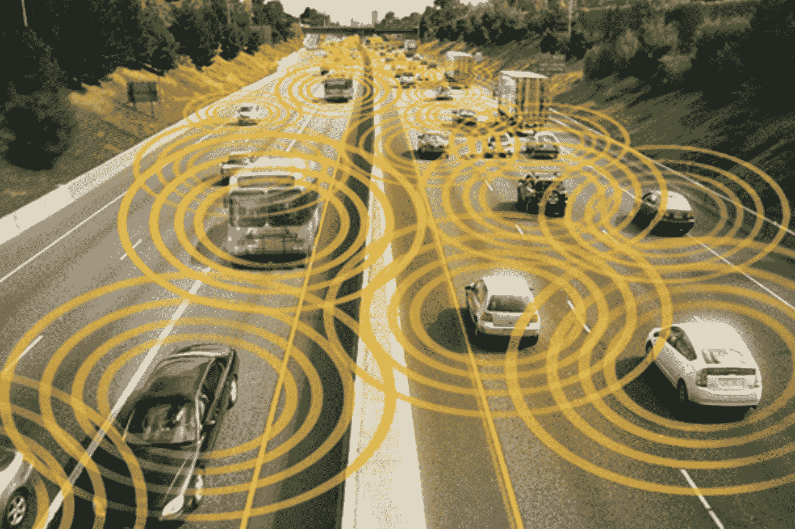
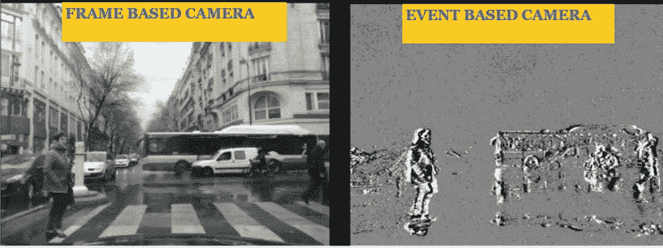
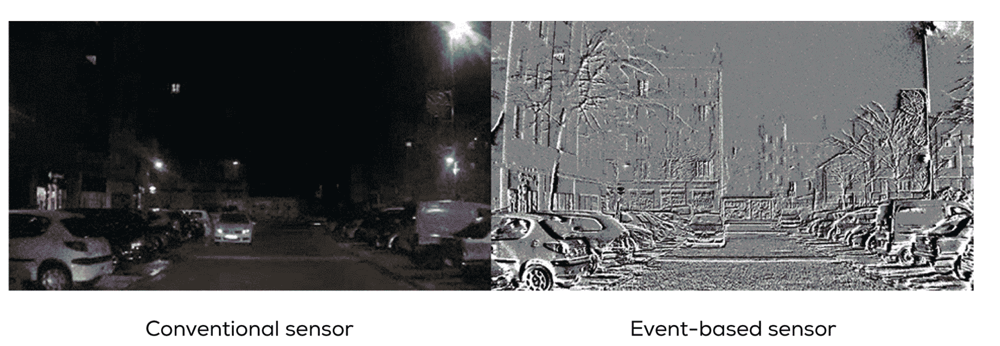
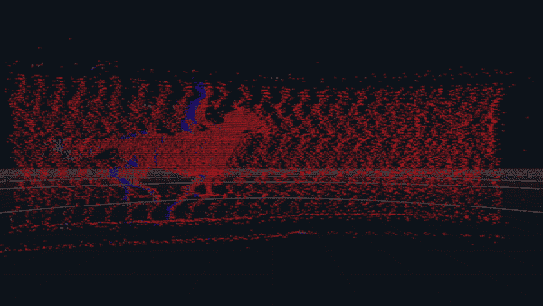
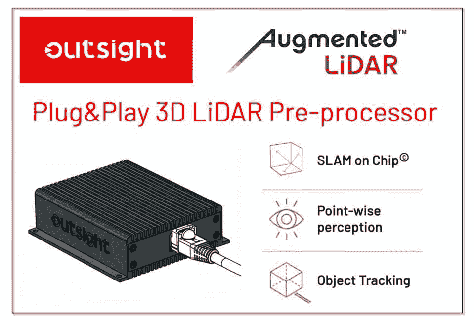
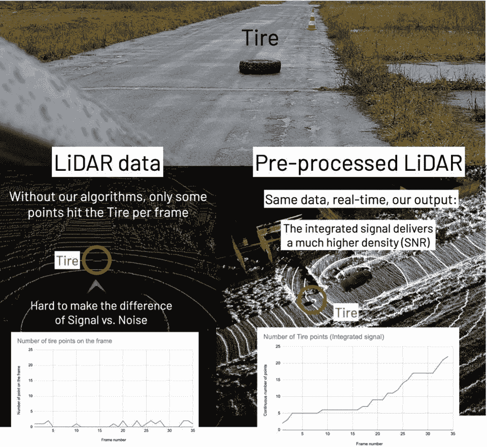

# 精益传感——自动驾驶汽车的关键使能器

> 原文：<https://medium.com/nerd-for-tech/lean-sensing-a-critical-enabler-for-autonomous-vehicles-60ead138584b?source=collection_archive---------15----------------------->

由[萨比尔·兰瓦拉](https://www.forbes.com/sites/sabbirrangwala/)

尽管存在新冠肺炎限制，自动驾驶汽车(AVs)仍在快速发展。过去几个月经历了重大的企业事件。其中包括亚马逊对 Zoox 的收购，大众对 Argo 的投资，Yandex [计划剥离其与优步的 AV](https://techcrunch-com.cdn.ampproject.org/c/s/techcrunch.com/2020/09/04/yandex-spins-out-self-driving-car-unit-from-its-uber-jv-invests-150m-into-newco/amp/) 合资公司，以及 LiDAR unicorns (LUnicorns)威力登和 Luminar 宣布计划以数十亿美元的估值上市(超过 Zoox！).

在部署方面，疫情为总部位于[的中国 AV 公司提供了一个积极部署叫车服务](https://www.forbes.com/sites/enriquedans/2020/08/19/beijing-makes-self-driving-vehicles-apriority/#3b4733e06a0e)的机会，而卡车运输自动化正在美国取得重大进展( [Waymo](https://cdllife.com/2020/two-of-the-countrys-biggest-freight-hubs-are-now-prime-testing-grounds-for-autonomous-truck-technology/) 、[戴姆勒](https://www.prnewswire.com/news-releases/daimler-trucks-and-torc-robotics-celebrate-one-year-of-successful-collaboration--adding-testing-center-in-new-mexico-301123612.html)、 [Ike](https://cdllife.com/2020/three-major-trucking-companies-subscribe-to-self-driving-truck-service/) 、TuSimple、Aurora)。[埃隆·马斯克再次宣布](https://www.reuters.com/article/us-tesla-autonomous/tesla-very-close-to-level-5-autonomous-driving-technology-musk-says-idUSKBN24A0HE)到 2020 年底，特斯拉将拥有第 5 级自动驾驶汽车的基本功能(汽车中不需要人类)。最重要的是，通用汽车正在重组其引以为豪的 Corvette 工程团队，以支持电动汽车和 AVs。焦点主要集中在电动汽车上，但是[文章提到计划](https://cleantechnica.com/2020/08/30/gm-gets-serious-about-electric-cars-and-autonomous-driving-with-help-from-corvette-engineers/)将通用 Cruise 的 AV 平台(Origin)升级到类似 Corvette 的操控和舒适水平。

***谁说 AVs 注定成为无聊的公用事业？***

需要基于人工智能(AI)的系统来取代人类驾驶员。这些系统的持续创新和测试推动了对更丰富的传感器数据的需求，要么通过每个 AV 使用许多传感器，要么通过更高的传感器能力——范围、精度、速度、FoV(视野)的可见性、分辨率和数据速率。矛盾的是，传感器的日益复杂增加了部署的障碍——更高的传感器和计算成本、更高的功耗和散热问题、可靠性和耐用性问题、更长的决策时间(延迟)以及可能更多的混乱和错误。它还增加了对数据传输带宽、内存和计算能力的要求(所有这些都提高了功率、热量和 [$$$s](https://www.youtube.com/watch?v=-0kcet4aPpQ) )。

可以追求多个方向来减少传感器堆栈，并专注于驾驶环境中重要的事情 ***【倾斜感测】*** 。本文的其余部分涵盖了实现这一点的四种方法:基于学习的传感器设计、基于事件的传感、感兴趣区域(ROI)扫描和语义传感。

***1。通过基于人工智能的学习优化传感器设计***

在开发阶段使用复杂和精密的传感器“仪器”和计算结构是很好的，因为人工智能会开发和训练自己(学习)来取代人类驾驶员。成功的机器学习应该能够识别在部署阶段重要的特征。对 DNN(深度神经网络)中神经元行为的分析可以揭示传感器数据中重要的方面与多余的方面(类似于 DNN 神经元处理 2d 视觉信息)。这反过来有助于精简传感器和计算部署规格。

AV 玩家(如 Waymo、优步、Aurora、Cruise、Argo、Yandex)选择控制和拥有激光雷达传感器技术，以确保与 AI 软件栈更紧密的耦合。这种耦合还有助于理解哪些激光雷达性能特性对于部署至关重要。使用多种传感器模态有助于识别在不同驾驶情况下至关重要的单个传感器特性，消除重复和冗余信息，并降低不必要的传感器复杂性。特斯拉的反激光雷达立场和埃隆·马斯克的“激光雷达是一根拐杖”的评论是一个极端的例子——基于部署在实地的超过 50 万辆汽车的雷达和相机数据的数据和机器学习可能已经让特斯拉相信，在 AVs 中不需要激光雷达。

人类驾驶员通过不同的方式感知大量的信息——视觉、听觉、嗅觉、触觉等。一个没有经验的驾驶员吸收所有这些数据，最初假设所有这些数据都是相关的。通过实践和培训，专业驾驶员可以过滤掉不相关的信息，专注于相关的信息，无论是时间还是空间。这使他们能够在短期内(对道路上的突然障碍进行制动或在车辆发生故障时安全驶离交通)和长期内(改变车道以避开行驶较慢的车辆)做出快速反应。试图模拟人类智能的机器应该能够遵循类似的模型——最初获取大量传感器数据，并在此基础上进行训练，但一旦训练达到一定水平，就会变得更具辨别能力。学习应该允许计算机选择、感知和操作 ***相关*** 数据，以确保及时有效地做出决策。

实现最佳的精简或薄传感器堆栈设计是人工智能和机器学习的功能。假设这样做了，传感器系统需要决定收集什么数据(基于事件、基于 ROI)以及如何处理这些数据(语义感测)。

**2。*基于事件的感应***

基于事件的传感已经存在于军事领域，其中一个传感器(比如雷达)可以用于检测即将到来的威胁，并提示另一个传感器(相机或激光雷达)在该区域投入更多的注意力和更多的资源(例如，识别它是朋友还是敌人)。然而，其他技术仅依靠单个传感器本身来识别事件。

[预言者](https://www.prophesee.ai/) ***【预测并看到动作在哪里】*** 是一家法国公司，专门开发基于事件的摄像机。他们的目标是模仿人类或神经形态视觉，其中视网膜中的受体对动态信息做出反应，大脑专注于处理场景中的变化(特别是像驾驶这样的动态任务)。

基本思想是使用相机和像素架构来检测超过阈值(事件)的光强度变化，并仅将该数据提供给计算堆栈进行进一步处理。相对于高分辨率框架摄像机，基于事件的摄像机只记录和传输 10–30%经历强度变化的像素的数据。优势是显著的——更低的数据带宽、决策延迟、存储和功耗。

在下面的场景中，汽车和摄像机是静止的，由标准框架高清摄像机收集的图像提供了一个不错的视觉效果，但大多数数据与即时驾驶任务无关(例如建筑物)。人类司机很容易过滤掉建筑物和树木等静止的物体，并专注于移动的行人和汽车，以决定驾驶行为。先知的基于事件的相机模拟这一点，并捕捉强度变化(事件)的像素位置。

基于帧和事件的摄像机、静止汽车和摄像机的比较

当汽车移动时，对应于具有相对运动的表面的像素被激活。对应于大面积强度均匀区域(如天空或静止建筑物的大表面)的某些像素不会经历强度变化，并且不会被激活。

基于事件的传感器需要在像素电路方面进行重大创新。像素以更高的速度异步工作，因为它们不需要像传统的基于帧的相机那样整合光子。实现这一点的互联技术正在与索尼公司合作。[他们最近宣布了](https://www.prophesee.ai/2020/02/19/prophesee-sony-stacked-event-based-vision-sensor/)一个联合开发堆叠式基于事件的视觉传感器的项目，该传感器具有业界领先的像素尺寸(< 5 微米)和动态范围(124 dB)。

我与“预言”的首席执行官卢卡·维雷讨论了基于事件的摄像机以及基于事件的激光雷达的挑战和可能性。

***斯蒂芬尼.怀特:一个快速的基于帧的摄像机不能做你所做的吗？差分连续帧和定位事件，但同时也有整个场景的强度等级信息？***

***LV:*** 不可以，帧差法需要 FPGA 或 SoC 资源，而先知者的摄像头原生传递事件。通常情况下，只有 10–30%的带框摄像机收集的数据与驾驶控制相关。使用这种摄像机会产生不必要的数据过载、成本和复杂性，而我们基于事件的摄像机只能识别和传输有用的信息。最后，要达到亚毫秒级的时间精度，需要基于帧的摄像机以 1 Khz 的帧速率运行(由于需要曝光时间，这很困难)。基于事件的相机实现了这一点和高动态范围性能，因为像素根据场景中的照明条件异步调整曝光时间。

***SR:在很多情况下，静止的物体也是相关的——比如一个行人或者停在汽车旁边的汽车。基于事件的摄像机会隐藏这些信息吗？***

***吕:*** 基于事件的摄像机检测动态信息。只要摄像机或摄像机前面的物体没有相对移动，就没有事件，这是一种安全的情况。如果发生相对运动，它会转化为强度变化，并记录为一个事件。

SR:你的相机能在光线不足的情况下工作吗？

***吕:*** 对，动车见上图。由于没有曝光时间，只有当光强变化到一定量(灵敏度阈值)时，每个像素才会积累光子并触发新的事件。正因为如此，基于事件的相机在亚勒克斯光照条件下表现良好。权衡是应用程序所需的读出信息所需的时间。

斯蒂芬尼.怀特:你在研究基于事件的激光雷达吗——在寻找像素强度和深度信息的变化方面？

***LV:*** 我们正在与激光雷达合作伙伴一起支持融合事件和激光雷达信息的计划。“预言”的摄像机识别事件，激光雷达从 ROI 获取 3D 信息。

SR:基于事件的摄像机制作起来很贵吗？

***LV:*** 我们的摄像机所使用的传感器都是使用常规工艺制造的，并且依赖于标准的通信接口。传感器和相机系统的成本与传统相机相当。

**3。R *感兴趣区域(ROI)扫描***

[Aeye(加州激光雷达](https://www.aeye.ai/)公司)推广 iDAR(智能探测和测距)，这是一种 1550 纳米波长的激光雷达，使用飞行时间(ToF)技术来提取场景中的深度和强度信息。根据 Aeye 的网站，IDAR 是 ***“世界上第一个固态、领先的自动驾驶汽车人工感知系统，利用生物仿生，从不错过任何东西，理解所有物体并非生来平等，并实时做所有事情”。***

Aeye 相信“显著性”的概念，并认为 AV 中感知系统的目标是检测惊喜并做出反应(如果不惊讶，那就太无聊了！)IDAR 被设计为灵活的——通过明智地选择场景中发送和接收光子的位置(而不是将它们均匀地喷洒在整个 FoV 上)。这些决定由来自激光雷达本身或其他传感器(如高分辨率相机)的信息和智能(iDAR 中的“我”)来指导。目标是在可能返回显著激光回波的区域注入光子(惊喜！).像《预言》一样，场景中的动态区域更令人感兴趣，可能会创造更多惊喜。

将激光雷达快速指向感兴趣区域的机制是通过智能和快速、高谐振频率的 2D 微机电反射镜系统(MEMs)的组合来实现的。这种方法的优点是提高 ROI 的性能(精度、延迟、分辨率、范围、速度),并降低系统复杂性、成本和功耗。下图显示了 AEye 的软件可定义激光雷达可以创建的扫描模式的示例。它展示了对 MEMs 和激光器的精确控制，以及在特定 ROI 中动态生成高分辨率拍摄模式的能力，确保高效部署激光雷达和计算资源。

Aeye 激光雷达产生的扫描模式显示 ROI 扫描

AEYE

艾伦·斯坦哈特是 Aeye 的首席科学家。我们讨论了 IDAR、MEMs 以及信息相关性或显著性的驱动原则。

史蒂夫:IDAR 必须和它的软件一起捆绑销售吗？

***AS:*** 我们根据客户偏好销售捆绑或非捆绑系统。激光雷达可以独立提示自己，也可以由相机提示(如果相机的帧速率足够快，可以跟上)。许多交通状况受益于相机提示激光雷达(例如，在晚上接近汽车前灯)。

我们系统的软件就像大多数其他激光雷达一样——用于传感器控制的固件和嵌入式软件。我们向客户提供 SDK(软件开发工具包)来试验激光雷达扫描模式的自适应控制。我们还提供了一个扫描模式库，可供客户在不同的驾驶环境中使用(上图是这种扫描模式的一个例子)。

SR:如果激光雷达由基于事件的摄像机来提示，你的系统会工作得更好吗？

***AS:*** 这取决于客户——有些人想要基于事件的摄像机，有些人不想要。事件摄像机的延迟更低，尽管我们基本上可以让常规摄像机像基于事件的摄像机一样工作(例如，通过查看道路地平线并在软件中提取事件，然后我们可以使用这些事件来提示激光雷达)。

SR:你如何处理快速的惊喜？您需要确定激光雷达的焦点、位置、发射激光、分析回波——所有这些在毫秒时间内可能实现吗？

***AS*** :我们的激光雷达根据扫描线实时调整。我们可以在 40 微秒内确定一个物体是否存在。在此基础上，我们更新传感器控制并修改激光照射时间，以在 ROI 中生成所需的分辨率。

***SR:MEMs 扫描仪怎么能反应那么快？***

***AS:*** 我们使用一个 2 镜 MEMs 系统，扫描 2 个正交轴。其中一个 MEMs 工作在谐振模式(无主动位置控制)，另一个 MEMs 位置可以通过步进扫描主动控制。跨越 120 HFoV 的全帧扫描可以在 40 微秒内完成。这是可能的，因为我们的系统能够有效地使用小型 MEMs(直径 1 毫米)，这是 Aeye 秘方的重要组成部分。

***SR:但是 MEMs 不会因为尺寸小而产生振动问题，影响系统灵敏度吗？***

***AS:*** 小型 MEMs 具有显著的优势——高谐振频率(1 Khz，使系统不受较低频率道路振动的影响)、更高的扫描速度和角度范围，以及 MEMs 挠性结构的高可靠性(就疲劳而言)。典型地，小 MEMs 转化为较低的系统光学效率。Aeye 通过其专利的双静态光学系统设计避免了这一点，该设计提供了 1 公里能见度的信噪比。

***4。语义感知***

基于事件和 ROI 感测似乎是使传感器“变薄”并使其适用于 AV 部署的合理方向。然而，也有相反的观点。Outsight(总部位于法国的激光雷达和 3D 传感软件公司)总裁劳尔·布拉沃(Raul Bravo)表示，依赖于在事件区实时动态创建更高的分辨率是有问题的——因为如果你知道事件在哪里，你应该已经在行动了，如果你必须搜索事件，然后审问它，那么你无论如何都来不及采取行动。

Outsight 的实时软件与其他商业 ToF 激光雷达配合使用，在边缘智能地处理过去和当前的数据原始点云，以生成对场景的语义理解。Outsight 的软件不是提供原始的点云数据，而是提供分类的点数据。

片上激光雷达预处理引擎

观察力

Outsight 方法背后的基本前提是，简单地说，人类大脑以两种基本方式处理风险/反应。第一个要求立即反应——它是直觉的和本能的(系统 1)。这一功能由大脑中被称为**杏仁核(或爬行动物大脑)**的部分执行。它不推理，行动迅速而冲动。另一方面，**大脑皮层**采取更符合逻辑和深思熟虑的方法来理解和决定一个动作。它需要尽可能多的数据(系统 2)。

Outsight 通过提供一个人工杏仁核来解决系统 1 的问题(对驾驶环境中的短期惊喜做出快速反应)，并利用这一点来促进长期的类似大脑皮层的功能。支持短期决策的语义信息的基础是 SLAM(同步定位和绘图)片上方法，该方法使用过去和现在的原始点云数据来创建相关的和可操作的点云和对象检测。SLAM 信息包括汽车环境中的相对物体位置和速度。

我和劳尔对 Outsight 方法的讨论总结如下。

史蒂夫:你能举例说明系统 1 是如何运作的吗？

***RB:*** 系统 1 根据过去和当前的信息实时处理数据，仅提供有意义的点，以实现更高效的点范围分类和障碍检测。去除 90%的与动态对象检测无关的激光雷达原始数据点(路面、植被、天空、静态环境的点)可让您仅向对象识别图层提供相关信息(例如，用于对象追踪的移动或可移动对象或用于车道保持的道路标记)。这改进了识别和控制过程(稳健、快速、较低的带宽要求)。

***SR:不清楚系统 1 和系统 2 是如何相互作用的，能澄清一下吗？***

***RB:*** 系统 1 是确定性的，并且在没有任何类型的机器学习的情况下工作。它与系统 2(即“新大脑皮层”或神经网络，专注于物体识别等长期功能)并行运行。Outsight 的软件保证了关键底层处理的管理(有没有对象？)，而机器学习(系统 2)的更高抽象层侧重于推理(这个对象是狗还是猫？).

斯蒂芬尼.怀特:这能与任何激光雷达——ToF、FMCW 等一起工作吗？？

***RB:*** 是的，我们的系统可以处理任何 3D 传感器输出，包括激光雷达。

斯蒂芬尼.怀特:但是激光雷达的波长肯定很重要吗？或者是闪光灯还是扫描激光雷达？

***RB:*** 我们的软件与波长无关。它可以改善某些波长相关的效果。例如，某些波长对雨滴不太稳定，可能会混淆。Outsight 的软件将这些过滤掉，因为它们不是相关的对象。在扫描方面，该软件校正扫描激光雷达固有的运动失真效应。

Outsight 的软件能否使分辨率和范围规格较低的激光雷达具有更好的系统性能？

***RB:*** 由于处理软件整合了来自过去事件和数据的信息，较低分辨率的激光雷达确实可以比传统方法更好地利用。例如，在下图中，原始激光雷达从道路上的低反射率障碍物(如轮胎)创建的回波非常少(每帧少于 5 点，有时为零点)。随着时间的推移对数据进行积分，这个数字会显著增加，从而提供更高的 SNR(信噪比)。

来自激光雷达回波的更高信噪比——外部道路上的黑色轮胎障碍物

**预测:**随着 AVs 接近现实，实际部署限制(成本、尺寸、热量、耐用性、决策速度、硬件和软件可靠性)将迫使传感器和感知提供商关注现场部署所需的东西，而不是在实验室或开发环境中可实现的东西。多余的要求和规格将继续被淘汰，从而导致“瘦”感测。在许多方面，这是一个循环游戏——AV 提供商推动传感器变得更精简和可部署，传感器提供商推动 AVs 成为现实。

[*萨比尔·朗瓦拉*](https://www.linkedin.com/in/sabbir-rangwala-73aa843/) *，是 auto M8(Fountech Ventures 投资组合公司)的顾问委员会成员。在过去，他一直领导普林斯顿光波的汽车激光雷达业务，直到 2017 年。目前，该公司是耐心咨询公司的创始人，提供 AVs、感知和激光雷达方面的专业知识。耐心点！*

[Fountech Ventures——你的深度科技人工智能创业之家](https://www.fountech.ventures/)

 [## Fountech Ventures -深度科技人工智能初创公司的风险建设者| LinkedIn

### Fountech Ventures -深度技术人工智能初创公司的风险建设者| LinkedIn 上有 278 名追随者。我们爱房子，迅速…

www.linkedin.com](https://www.linkedin.com/company/fountech-ventures) 

[富泰克风险投资(@Ventures_FT) /推特](https://twitter.com/Ventures_FT)