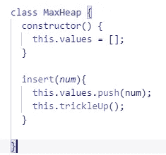
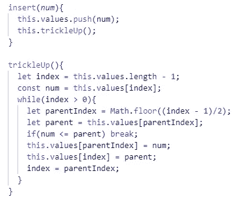
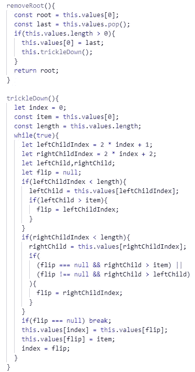

# 学习二进制堆

> 原文：<https://medium.com/nerd-for-tech/learning-binary-heaps-a0edda8b4fd5?source=collection_archive---------14----------------------->

直到本周，我熟悉的唯一一堆垃圾是纽约街道的中流砥柱。令人欣慰的是，这一周对数据结构的学习告诉我，并不是所有的堆都是热垃圾。在本文中，我将回顾到目前为止我所学到的关于二进制堆的知识，以及如何构造它们并与之交互。本文中的许多图片来自我的 [repl](https://replit.com/@liamH47/Binary-Heaps#index.js) ，在那里我构建了一个 Max 二进制堆，并编写了一些类方法来使它起作用。我也有一些笔记，将涵盖这篇文章的大部分内容。我希望这两篇文章能对任何有兴趣了解二进制堆工作原理的人有所帮助。

堆是树的一种类型。它们很像二分搜索法树，但是有自己独特的逻辑、规则和用例。如果你不熟悉二分搜索法树(BST)，请查看我关于 [BSTs](/nerd-for-tech/learning-binary-search-trees-138c68b447a2) 和[树遍历](/nerd-for-tech/learning-tree-traversal-29e11a6c421d)的文章。就像在 BST 中一样，二进制堆中的每个节点最多有两个子节点(因此它们共享名称中的二进制文件)。

然而，围绕节点顺序的规则是非常不同的。二进制堆有两种主要类型，最大二进制堆(Max Heap)和最小二进制堆(Min Heap)。在最大堆中，每个节点的子节点的值必须低于其父节点的值。这意味着根节点将总是拥有堆中最高的值。在 Min 堆中，情况正好相反。根节点总是具有最低的值，并且每个子节点的值必须大于其父节点的值。除了我刚刚概述的规则之外，二进制堆和 BST 之间的另一个区别是，节点值没有固有的从左到右的升序。根据一个节点是最大堆还是最小堆，除了它也小于或大于其父节点之外，您无法推断出该节点的兄弟节点的值。

在二进制堆和 BST 之间最重要的是，左边的子节点总是在右边的子节点之前被分配，并且每个节点必须有两个子节点，然后才能将另一个级别添加到堆中。这与 BSTs 截然不同，在 BSTs 中，理论上可以只在左侧或右侧添加节点，使它看起来更像一个链表。这种差异对于您将在下面的代码截图中看到的许多逻辑来说是必不可少的。由于这种差异，我们能够使用数组来构造堆，因为通过一点数学计算，我们可以根据子节点的索引计算出父节点的索引。给定索引“x”，我们可以调用(x — 1)/2 的 Math.floor。如果 x 是左边的孩子，它会被 2 整除。如果 x 是对的子，那就是浮点数，比如 2.5，然后我们可以向下舍入。

下面是我在 replit 上构建的 Max Heap 的一些截图。这个堆能够添加一个新的节点或删除根，并重新组织堆。它只需要很少的设置，因为堆本身只需要一个节点值数组就可以工作。

我希望这是有益和有趣的！下一次，我将讨论优先级队列，它也使用堆。