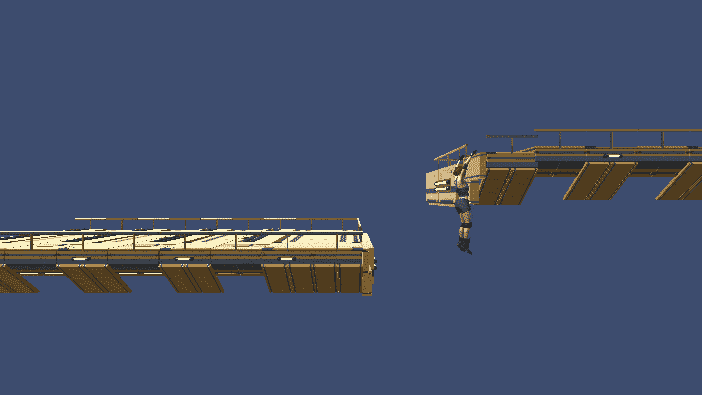
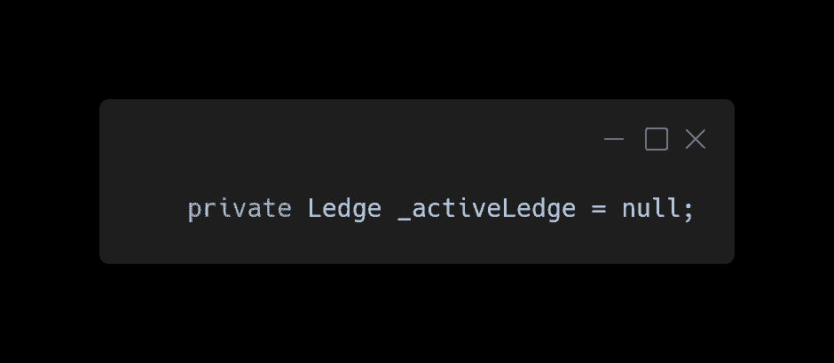
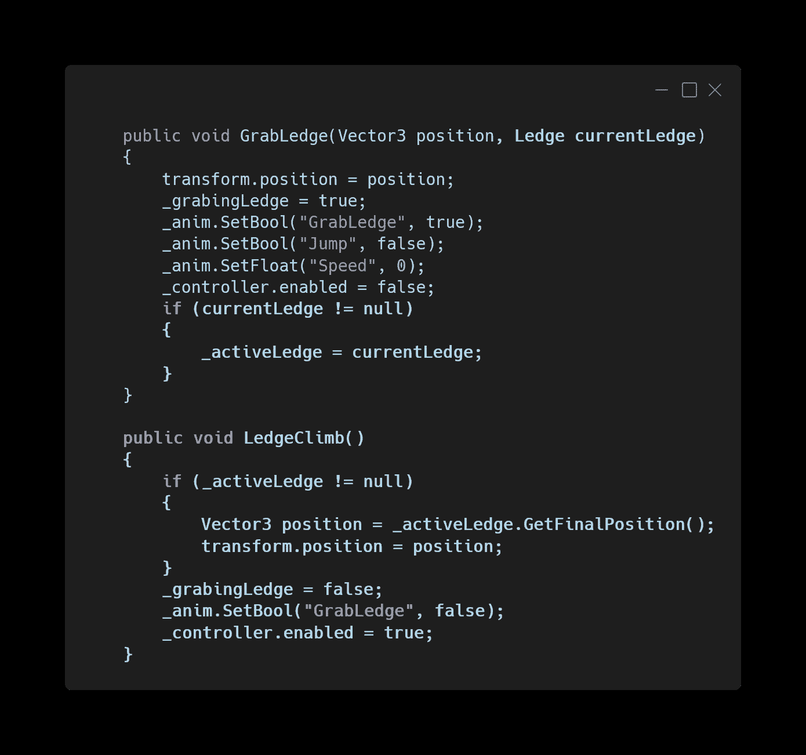
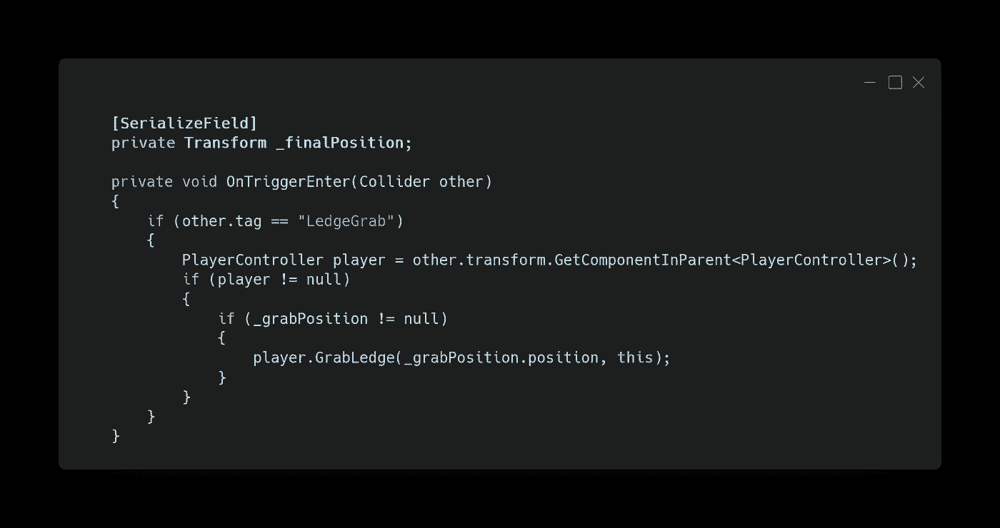
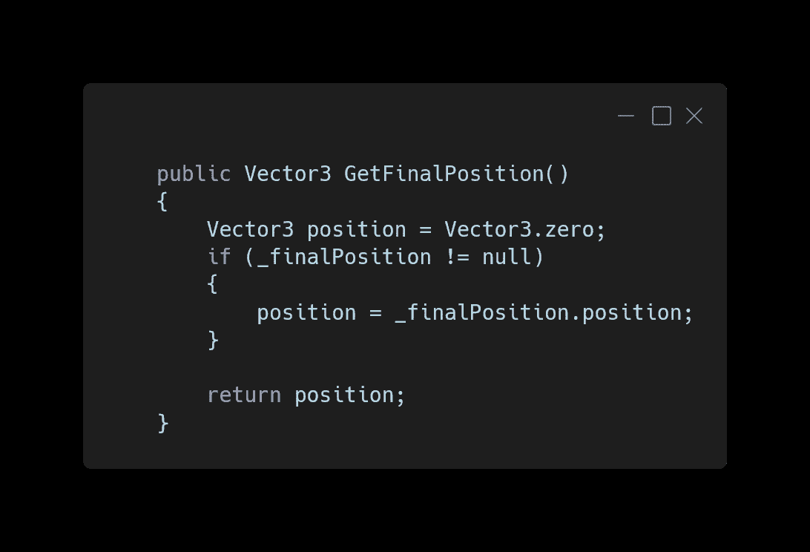
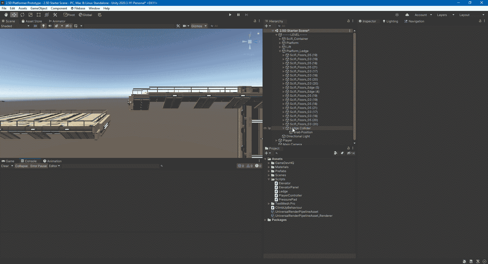
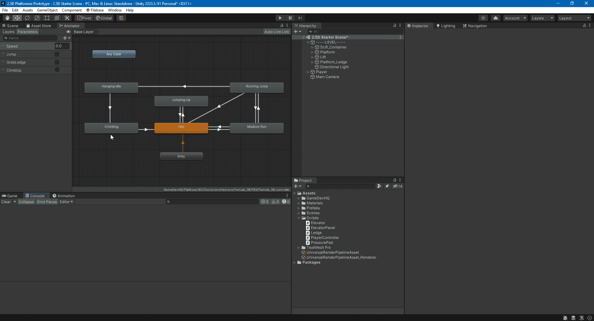
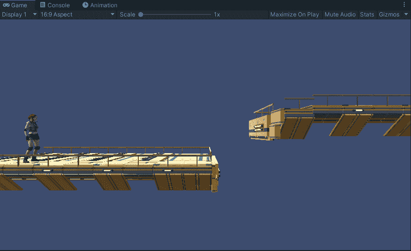

# 攀爬平台——在 Unity 中使用状态机行为

> 原文：<https://medium.com/nerd-for-tech/ledge-climb-using-state-machine-behaviours-in-unity-d73b4d43a610?source=collection_archive---------7----------------------->

在这篇文章中，我们将使用一个状态机行为脚本来知道在从上一篇文章的[中抓取壁架后，何时将玩家移动到平台顶部。](https://kwpowers.medium.com/ledge-grabbing-in-unity-e1edee3a924)

在玩家脚本中，我们将需要一个我们正在抓取的当前壁架的参考。

接下来，我们更改 GrabLedge 方法以获取一个壁架并设置参考。然后，我们添加一个方法，当攀爬动画完成时将调用该方法。我们将玩家的位置从活动壁架更改为最终位置，将 grabingLedge 设置为 false，将 GrabLedge Animator 参数设置为 false，并启用角色控制器。

在 Ledge 脚本中，我们创建了一个变量来保存玩家最终位置的转换，并传入这个脚本。

我们还需要为玩家添加一个方法来调用它，该方法将返回最终位置。

现在，我们可以创建最终位置空游戏对象，将它放在平台的顶部，并将其连接到壁架脚本。

为了创建一个状态机行为，我们进入 Animator 窗口，选择我们想要创建行为的状态，点击 Add Behaviour 按钮，创建一个新的脚本。

在新创建的状态机行为中，您将看到许多注释掉的方法覆盖在 Animator 状态机进程的不同事件上被调用。我们唯一需要启用的是 OnStateExit，当到下一个状态的转换完成时，但在为下一个状态调用 OnStateEnter 之前，会调用它。

在这个方法中，我们从父播放器获取 PlayerController 脚本，调用 LedgeClimb 方法来移动播放器，并启用移动。

如果我们进入游戏模式，抓住壁架，按下“E”键，玩家将爬上壁架，被移动到平台顶部，并能够再次移动。

