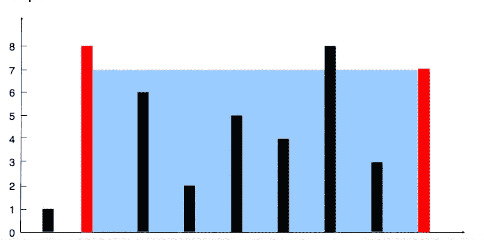

# 盛水最多的 LeetCode 容器

> 原文：<https://medium.com/nerd-for-tech/leetcode-container-with-most-water-ae97eafd016b?source=collection_archive---------21----------------------->

# 问题陈述

给定 **N** 个非负整数 **a1，a2，…，an** ，其中每个代表坐标 **(i，ai)** 上的一个点。**画 N 条**垂直线，使得线 **i** 的两个端点在 **(i，ai)** 和 **(i，0)** 。找出两条线，它们和 x 轴一起形成一个容器，这样容器中的水最多。

问题陈述摘自:[https://leetcode.com/problems/container-with-most-water](https://leetcode.com/problems/container-with-most-water)

**例 1:**



```
Input: height = [1, 8, 6, 2, 5, 4, 8, 3, 7]
Output: 49
```

**例 2:**

```
Input: height = [1, 1] 
Output: 1
```

例 3:

```
Input: height = [4, 3, 2, 1, 4] 
Output: 16
```

**例 4:**

```
Input: height = [1, 2, 1] 
Output: 2
```

**约束:**

```
- N == height.length 
- 2 <= N <= 10^5 
- 0 <= height[i] <= 10^4
```

# 说明

## 强力

一种强力方法是考虑每一对可能的线的面积，并找出其中的最大值。

该方法的 C++代码片段如下所示:

```
public class Solution {
    public int maxArea(int[] height) {
        int ans = 0;

        for (int i = 0; i < height.length; i++)
            for (int j = i + 1; j < height.length; j++)
                ans = Math.max(ans, Math.min(height[i], height[j]) * (j - i));

        return ans;
    }
}
```

这种方法的时间复杂度是 O(N ) ，因为我们运行两个嵌套的 for 循环并考虑数组的每个子集。

## 双指针

通过使用两个指针可以降低时间复杂度。我们知道线越远，获得的面积就越大。但是线之间形成的区域将受到较短线的高度的限制。

**算法**

```
- set left and right pointer to 0 and last index of array height
- set ans = 0\. Variable ans holds the max area of our solution

// Iterate array from both ends and
- Loop while left < right
  - get the area between to indices
    - area = min(height[left], height[right])*(right - left)
  - get the maximum of ans and area and update ans
    - ans = max(ans, area)
  - increment left or right based on which of the index value is minimum.
    - if height[left] < height[right]
      - increment left++
    - else
      - increment right++

- return ans
```

**C++解决方案**

```
class Solution {
public:
    int maxArea(vector<int>& height) {
        int left = 0;
        int right = height.size() - 1;

        int ans = 0;

        while(left < right){
            ans = max(ans, min(height[left], height[right])*(right-left));

            if(height[left] < height[right]){
                left += 1;
            } else {
                right -= 1;
            }
        }

        return ans;
    }
};
```

**Golang 解决方案**

```
func maxArea(height []int) int {
    left, right := 0, len(height) - 1
    area := 0

    for left < right {
        area = max(area, min(height[left], height[right])*(right - left))

        if height[left] < height[right] {
            left++
        } else {
            right--
        }
    }

    return int(area)
}

func max(a, b int) int{
    if a > b {
        return a
    }
    return b
}

func min(a, b int) int{
    if a < b {
        return a
    }
    return b
}
```

**JavaScript 解决方案**

```
var maxArea = function(height) {
    if (height.length < 2){
        return 0;
    }

    let left = 0;
    let right = height.length - 1;
    let ans = 0;

    while (left < right) {
        ans = Math.max(ans, Math.min(height[left], height[right]) * (right - left) );

        if (height[left] < height[right]){
            left += 1;
        } else {
            right -= 1;
        }
    }

    return ans;
};
```

让我们试运行一下我们的算法，看看解决方案是如何工作的。

```
height = [1, 8, 6, 2, 5, 4, 8, 3, 7]
left = 0
right = height.size() - 1
      = 9
ans = 0

Step 1: left < right
        0 < 8
        true

        ans = max(ans, min(height[left], height[right])*(right-left));
            = max(0, min(1, 7)*(8-0))
            = max(0, 1*8)
            = max(0, 8)
            = 8

        height[left] < height[right]
        1 < 7
        true
        left++ = 1

Step 2: left < right
        1 < 8
        true

        ans = max(ans, min(height[left], height[right])*(right-left));
            = max(8, min(8, 7)*(8-1))
            = max(8, 7*7)
            = max(8, 49)
            = 49

        height[left] < height[right]
        8 < 7
        false
        right-- = 7

Step 3: left < right
        1 < 7
        true

        ans = max(ans, min(height[left], height[right])*(right-left));
            = max(49, min(8, 3)*(7-1))
            = max(49, 3*6)
            = max(49, 18)
            = 49

        height[left] < height[right]
        8 < 3
        false
        right-- = 6

Step 4: left < right
        1 < 6
        true

        ans = max(ans, min(height[left], height[right])*(right-left));
            = max(49, min(8, 8)*(6-1))
            = max(49, 8*5)
            = max(49, 40)
            = 49

        height[left] < height[right]
        8 < 8
        false
        right-- = 5

Step 5: left < right
        1 < 5
        true

        ans = max(ans, min(height[left], height[right])*(right-left));
            = max(49, min(8, 4)*(5-1))
            = max(49, 4*4)
            = max(49, 16)
            = 49

        height[left] < height[right]
        8 < 4
        false
        right-- = 4

Step 6: left < right
        1 < 4
        true

        ans = max(ans, min(height[left], height[right])*(right-left));
            = max(49, min(8, 5)*(4-1))
            = max(49, 5*3)
            = max(49, 15)
            = 49

        height[left] < height[right]
        8 < 5
        false
        right-- = 3

Step 7: left < right
        1 < 3
        true

        ans = max(ans, min(height[left], height[right])*(right-left));
            = max(49, min(8, 2)*(3-1))
            = max(49, 2*2)
            = max(49, 4)
            = 49

        height[left] < height[right]
        8 < 2
        false
        right-- = 2

Step 8: left < right
        1 < 2
        true

        ans = max(ans, min(height[left], height[right])*(right-left));
            = max(49, min(8, 6)*(2-1))
            = max(49, 6*1)
            = max(49, 6)
            = 49

        height[left] < height[right]
        8 < 6
        false
        right-- = 1

Step 9: left < right
        1 < 1
        false

return ans as 49
```

*原载于*[*https://alkeshghorpade . me*](https://alkeshghorpade.me/post/leetcode-container-with-most-water)*。*