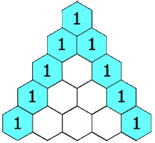

# 李特码——帕斯卡三角形

> 原文：<https://medium.com/nerd-for-tech/leetcode-pascals-triangle-75d41f2fd973?source=collection_archive---------6----------------------->

# 问题陈述

给定一个整数 **numRows** ，返回**帕斯卡三角形**的前 numRows。

在**帕斯卡三角形**中，每个数字都是它正上方的两个数字之和，如图所示:

问题陈述摘自:[https://leetcode.com/problems/pascals-triangle](https://leetcode.com/problems/pascals-triangle)



**例 1:**

```
Input: numRows = 5
Output: [ [1], [1, 1], [1, 2, 1], [1, 3, 3, 1], [1, 4, 6, 4, 1] ]
```

**例 2:**

```
Input: numRows = 1
Output: [[1]]
```

**约束:**

```
- 1 <= numRows <= 30
```

# 说明

## 强力方法

一个简单的方法是运行两个循环，计算内循环中二项式系数的值。

例如，第一行有 **1** ，第二行有 **1 1** ，第三行有 **1 2 1** ，..诸如此类。一行中的每一项都是二项式系数的值。行号 line 中第 I 个条目的值是 C(line，I)。可以使用以下公式计算该值。

```
C(line, i) = line! / ( (line-i)! * i! )
```

上述逻辑的一小段 C++代码是:

```
void printPascal(int n)
{
    for (int line = 0; line < n; line++){
        for (int i = 0; i <= line; i++)
            cout <<" "<< binomialCoefficient(line, i);
        cout <<"\n";
    }
}

int binomialCoefficient(int n, int k)
{
    int result = 1;

    if (k > n - k)
        k = n - k;

    for (int i = 0; i < k; ++i){
        result *= (n - i);
        result /= (i + 1);
    }

    return result;
}
```

因为我们为每次迭代生成一个系数，所以上述问题的时间复杂度是 O(N ) 。

## 优化的解决方案(O(N)时间和 O(N)额外空间)

如果我们看一看帕斯卡三角形，我们可以看到每个条目都是它上面两个值的和。所以我们创建了一个 2D 数组来存储之前生成的值。

上述逻辑的一小段 C++代码是:

```
for (int line = 0; line < n; line++) {
    for (int i = 0; i <= line; i++) {
        if (line == i || i == 0)
            arr[line][i] = 1;
        else
            arr[line][i] = arr[line - 1][i - 1] + arr[line - 1][i];
        cout << arr[line][i] << " ";
    }
    cout << "\n";
}
```

## 优化的解决方案(O(N)时间和 O(1)额外空间)

这种方法基于暴力方法。具有条目的*的二项式系数可以表示为 **C(line，i)** 并且所有行都以值 1 开始。这里的思路是用 **C(line，i — 1)** 计算 **C(line，i)** 。可以使用以下公式在 O(1)时间内计算。*

```
C(line, i)     = line! / ( (line - i)! * i! )
C(line, i - 1) = line! / ( (line - i + 1)! * (i - 1)! )

So using the above approach we  can change the formula as below:
C(line, i)     = C(line, i - 1) * (line - i + 1) / i

C(line, i) can be calculated from C(line, i - 1) in O(1) time.
```

让我们检查算法:

```
- initialize vector<vector<int>> result

- loop for line = 1; line <= n; line++
  - initialize vector<int> temp
  - set C = 1

  - loop for i = 1; i <= line; i++
    - temp.push_back(C)
    - C = C * (line - i) / i

  - result.push_back(temp)

- return result
```

**C++解决方案**

```
class Solution {
public:
    vector<vector<int>> generate(int numRows) {
        vector<vector<int>> result;

        for (int line = 1; line <= numRows; line++){
            vector<int> temp;
            int C = 1;

            for (int i = 1; i <= line; i++){
                temp.push_back(C);
                C = C * (line - i) / i;
            }

            result.push_back(temp);
        }

        return result;
    }
};
```

**Golang 解决方案**

```
func generate(numRows int) [][]int {
    var result [][]int

    for line := 1; line <= numRows; line++ {
        var temp []int
        C := 1

        for i := 1; i <= line; i++ {
            temp = append(temp, C);
            C = C * (line - i) / i;
        }

        result = append(result, temp)
    }

    return result
}
```

**Javascript 解决方案**

```
var generate = function(numRows) {
    var result = [];

    for(let line = 1; line <= numRows; line++){
        var temp = [];
        let C = 1;

        for(let i = 1; i <= line; i++){
            temp.push(C);
            C = C * (line - i) / i;
        }

        result.push(temp);
    }

    return result;
};
```

让我们试运行一下我们的算法，看看解决方案是如何工作的。

```
Input: numRows = 3

Step 1: initialize vector<vector<int>> result

Step 2: loop for line = 1; line <= numRows
        1 <= 3
        true

        initialize vector<int> temp

        C = 1

        loop for i = 1; i <= line
        1 <= 1
        true

        temp.push_back(C);
        temp = [1]

        C = C * (line - i) / i;
        C = 1 * (1  - 1) / 1
        C = 0

        i++
        i = 2

        loop for i <= line
        2 <= 1
        false

        result.push_back(temp)

        result = [[1]]

        line++
        line = 2

Step 3: loop for line <= numRows
        2 <= 3
        true

        initialize vector<int> temp

        C = 1

        loop for i = 1; i <= line
        1 <= 2
        true

        temp.push_back(C);
        temp = [1]

        C = C * (line - i) / i
        C = 1 * (2  - 1) / 1
        C = 1 * 1 / 1

        i++
        i = 2

        loop for i <= line
        2 <= 2
        true

        loop for i <= line
        2 <= 2
        true

        temp.push_back(C);
        temp = [1, 1]

        C = C * (line - i) / i
        C = 1 * (2  - 2) / 1
        C = 1 * 0 / 1
        C = 0

        i++
        i = 3

        loop for i <= line
        3 <= 2
        false

        result.push_back(temp)

        result = [[1], [1, 1]]

        line++
        line = 3

Step 4: loop for line <= numRows
        3 <= 3
        true

        initialize vector<int> temp

        C = 1

        loop for i = 1; i <= line
        1 <= 3
        true

        temp.push_back(C);
        temp = [1]

        C = C * (line - i) / i
        C = 1 * (3 - 1) / 1
        C = 1 * 2 / 1
        C = 2

        i++
        i = 2

        loop for i <= line
        2 <= 3
        true

        temp.push_back(C);
        temp = [1, 2]

        C = C * (line - i) / i
        C = 2 * (3 - 2) / 2
        C = 2 * 1 / 2
        C = 1

        i++
        i = 3

        loop for i <= line
        3 <= 3
        true

        temp.push_back(C);
        temp = [1, 2, 1]

        C = C * (line - i) / i
        C = 1 * (3 - 3) / 3
        C = 1 * 0 / 3
        C = 0

        i++
        i = 4

        loop for i <= line
        4 <= 3
        false

        result.push_back(temp)
        result = [[1], [1, 1], [1, 2, 1]]

        line++
        line = 4

Step 5: loop for line <= numRows
        4 <= 3
        false

Step 6: return result

So the result is [[1], [1, 1], [1, 2, 1]].
```

*原载于*[*https://alkeshghorpade . me*](https://alkeshghorpade.me/post/leetcode-pascals-triangle)*。*