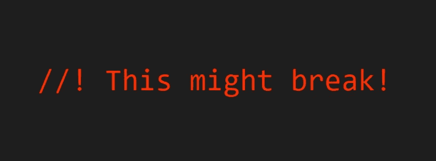
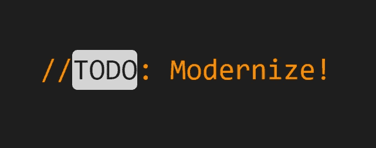
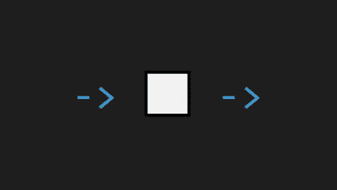

# 遗留软件系列—第 3 部分—遗留软件的现代化

> 原文：<https://medium.com/nerd-for-tech/legacy-software-series-part-3-modernizing-legacy-software-99ceb86ae550?source=collection_archive---------2----------------------->

在这篇文章中，我将讨论更新遗留系统的风险和不更新的风险。此外，我还写了在对遗留系统进行现代化时经常使用的方法。

# 传统系统现代化的风险

现代化是有风险的事情。

遗留系统很少有完整的文档说明整个系统及其所有功能和用例。在大多数情况下，文档严重过时或完全丢失。在不同的开发人员和管理人员下进行多年的维护会导致文档质量下降。如果没有指定遗留系统的最新文档，就很难创建一个与以前的系统功能相同的新系统。公司经常将他们的遗留软件与他们的业务流程结合起来。改变遗留软件会给依赖它的业务流程带来不可预知的后果，从长远来看，这会给公司带来巨大的损失。用新系统替换旧系统是有风险的，因为新系统可能比预期的更昂贵，而且按时交付可能会有问题(Sommerville，2016)。

# 继续使用遗留系统的风险

无论哪种方式都有风险。

有时遗留系统与新软件不兼容，它不能与互联网或任何其他现代数据传输协议接口。了解旧语言的开发人员可能太少，或者根本不了解。因此，维护需要从专门的公司购买，价格昂贵(Dogru 等人，2011)。

在某些情况下，文档已经过时或者完全丢失。甚至可能是没有源代码。在这种情况下，开发人员需要规划出软件的功能，并尝试创建一个具有类似功能的新系统(Dogru 等人，2011)。

有时遗留系统的源代码可能会随着时间的推移而退化。它可能是来自不同时间的程序的集合，以可疑的逻辑一起工作。此外，代码本来可以以更优化的方式编写，这是新开发人员所不理解的。对于较老的低级编程语言来说是这样的(Dogru 等人，2011)。

遗留系统也可能有来自不同时期的许多不同数据文件，这些文件包含可能过时或损坏的重复数据。在最坏的情况下，数据库甚至可能互不兼容。在某种程度上，维护遗留系统的成本将超过用新系统替换它们的成本(Dogru 等人，2011 年)。

# 更新遗留系统的策略

处理遗留系统有三种流行的策略:废弃遗留系统、继续维护系统或更换整个系统(Malinova，2010)。因为公司花在遗留系统上的钱是有限的，所以他们在选择做什么的时候需要小心。

当公司发现遗留系统不再创造任何价值，并且不再是任何业务流程的关键部分时，可以选择废弃系统。在这种情况下，最好的解决方案就是摆脱遗留系统。

当系统仍然稳定时，可以继续维护遗留系统，并且维护是有成本效益的。当系统稍微降级时，改进遗留系统是可能的，但是它仍然可以被维护。可能通过增加新的接口使系统更容易维护。

最后，当系统不再有硬件支持，维护费用太贵，而新系统的成本又不太高时，应尝试更换所有遗留系统(Seacord 等人，2003 年)。

# 现代化

现代化。

当公司评估其遗留系统的状态以决定如何处理时，从技术角度和业务角度评估遗留系统是很重要的(Warren，1998)。技术视角意味着对遗留系统的质量进行评估。业务视角用于确定公司的业务需求是否要求新软件以最佳方式运行。通过结合这两种观点，公司可以决定是否应该投资遗留系统。

如果一个遗留系统质量差，商业价值低，那么这个系统应该被移除。质量低但商业价值高的遗留系统不应该被移除，但由于质量低，其维护费用昂贵，因此应该用现代化的系统替换。高质量、低商业价值的系统不会创造太多价值，但维护起来成本也不高。因此，这些系统可以继续运行。高质量和高商业价值的遗留系统是最好的选择。它们的维护成本并不高，而且正在为公司创造价值。这些系统应在正常维护的情况下保持运行(Sommerville，2016)。

系统现代化是一种类似于维护的软件改造行为。然而，现代化在某种意义上是不同的，它是一个比维护更广泛的过程，因为现代化通常包括重组、功能变化和新的软件属性。如果遗留系统仍有商业价值，可以对其进行现代化改造以降低维护成本。

有两种类型的现代化策略可以使用:白盒现代化和黑盒现代化。它们之间的关键区别是完成现代化过程所需的遗留系统的知识量。白盒现代化需要大量关于遗留系统内部的技术信息。与此相反，黑盒现代化只需要关于遗留系统外部接口的信息。有时这些方法是不够的，遗留系统是如此过时，以至于对其进行现代化改造是不划算的。因此，它应该被取代(科梅拉-多达等人，2000 年)。

## 白盒现代化

白盒现代化。

为了进行白盒现代化，有必要对遗留系统进行逆向工程，以构建系统、其关系和组件的更高级表示(Chikofsky 等人，1990)。在白盒现代化中，程序理解经常被用来对遗留系统进行逆向工程。本质上，程序理解是检查和研究遗留系统、对系统域建模、使用逆向工程工具研究代码库以及开发有助于理解系统的抽象模型的行为(科梅拉-多达等人，2000)。对系统进行逆向工程是一项耗时且昂贵的工作。如果系统很大很复杂，文档也过时了，那就更难了。

一旦对遗留系统有了足够的理解，代码和系统的重组就将开始。重构是在保持功能的同时，转换代码以提高性能、可维护性和其他质量属性(Chikofsky 等人，1990)。

## 暗箱现代化

暗箱现代化。

黑盒现代化并不试图揭示遗留系统的内部运作。因为，只需要检查系统的输入和输出。与白盒现代化相比，这使得现代化过程更容易(科梅拉-多达等人，2000)。黑盒现代化围绕遗留系统构建新的接口，而不是试图重组它。

## 更换

替换。

当一个系统严重过时，以至于对其进行现代化改造不具成本效益时，更换遗留系统是最佳的行动方案。当替换遗留系统时，需要从头开始构建一个新系统来取代它。建立一个新的系统需要大量的资源和知识。由于大多数开发人员从事维护工作，他们可能不知道如何设计新系统。另一个风险是，遗留系统中嵌入的一些业务知识丢失了。此外，新系统的效果可能不如旧系统(科梅拉-多达等人，2000 年)。

感谢您的阅读！在下面留下评论！❤

# 链接

[**我的 Youtube**](https://www.youtube.com/channel/UCjCeTp2PUd3cqXhEHsx9NHw?view_as=subscriber)

[**我的网站**](http://ktcoding.fi)

## 来源

奇科夫斯基和克罗斯 ll，J. (1990 年)。逆向工程和设计恢复:分类学。IEEE 软件。检索自[https://IEEE explore-IEEE-org . ez proxy . cc . lut . fi/stamp/stamp . JSP？tp= & arnumber=43044](https://ieeexplore-ieee-org.ezproxy.cc.lut.fi/stamp/stamp.jsp?tp=&arnumber=43044)

s .科梅拉-多达、k .瓦尔瑙、r .西科德和 j .罗伯特(2000 年)。遗留系统现代化方法综述。卡内基梅隆大学。检索自[https://www . research gate . net/publication/235126722 _ A _ Survey _ of _ Legacy _ System _ Modernization _ approach](https://www.researchgate.net/publication/235126722_A_Survey_of_Legacy_System_Modernization_Approaches)

Dogru，a .，& Bicer，V. (2011 年)现代软件工程概念和实践:高级方法。检索自[https://books.google.fi/books?id=mor9t6v-AAYC&pg = PA98&dq =软件+现代化&HL = en&sa = X&ved = 2 ahukewjhlm 6 oibrtahwnaxaihqmudhuq 6 aewaxoecaiqag # v = snippet&q = legacy&f = false](https://books.google.fi/books?id=mor9t6v-AAYC&pg=PA98&dq=software+modernization&hl=en&sa=X&ved=2ahUKEwjHlM6oibrtAhWNAxAIHQmUDhUQ6AEwAXoECAIQAg#v=snippet&q=legacy&f=false)

马利诺娃(2010 年)。遗留软件现代化的方法和技术。检索自[https://www . research gate . net/profile/Anna _ malin ova/publication/267181092 _ approach _ and _ techniques _ for _ legacy _ software _ modernization/links/5739 e7c 508 AE 298602 e 36682 . pdf](https://www.researchgate.net/profile/Anna_Malinova/publication/267181092_Approaches_and_techniques_for_legacy_software_modernization/links/5739e7c508ae298602e36682.pdf)

Seacord，r .，Plakosh，d .，和 Lewis，G. (2003 年)。传统系统的现代化:软件技术、工程过程和商业实践。艾迪森-韦斯利专业版。检索自[https://www . research gate . net/publication/234822137 _ moderning _ Legacy _ Systems _ Software _ Technologies _ Engineering _ Process _ and _ Business _ Practices](https://www.researchgate.net/publication/234822137_Modernizing_Legacy_Systems_Software_Technologies_Engineering_Process_and_Business_Practices)

萨莫维尔岛(2016 年)。软件工程第十版。皮尔森教育。

沃伦，I. (1998 年)。遗留系统的复兴。英国伦敦:施普林格。检索自[https://www . research gate . net/publication/265287408 _ The _ Renaissance _ of _ Legacy _ Systems](https://www.researchgate.net/publication/265287408_The_Renaissance_of_Legacy_Systems)