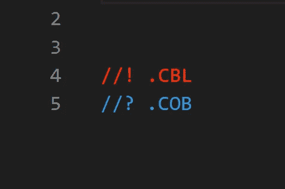

# 遗留软件系列—第 1 部分—什么是遗留软件？

> 原文：<https://medium.com/nerd-for-tech/legacy-software-series-part-x-what-is-legacy-software-ed9ab7a1d497?source=collection_archive---------2----------------------->

在这个系列文章中，我将探索遗留软件。软件生命周期、软件老化、软件老化的原因和现代化方法。这些文章基于我的硕士论文，该论文讨论了遗留软件现代化背景下的微服务架构。随意点这里 看完整篇硕士论文 [**。这些文章简短易读。本系列不讨论微服务。**](https://lutpub.lut.fi/bitstream/handle/10024/162301/Master%27s%20thesis%20-%20Kristian%20Tuusj%c3%a4rvi.pdf?sequence=1&isAllowed=y)

这是第一篇文章，描述了什么是遗留软件以及现存的不同代的遗留软件。

COBOL 扩展:)

# 遗留软件的定义

定义什么是遗留软件。

在 20 世纪 60 年代，公司的数字化开始并持续至今。旧的软件系统是使用当时可用的语言、硬件和支持软件制作的，对这些的支持通常早已不复存在。由于商业模式和用户要求的变化，以及技术的进步，这些系统中的大多数都必须发展(刘等，1998)。这些旧软件系统对业务至关重要，并且寿命很长。它们通常被称为遗留软件系统(Dayini-Fard 等人，1999)。

该词典将遗留系统定义为“以某种方式过时，但仍在使用的系统”(YourDictionary，2020)。有许多迹象可以表明一个系统是一个遗留系统(Pressman，2015)。例如:

1.  **过时的硬件。**
2.  缺少或缺少文件。
3.  **缺少源代码。**
4.  **不存在的版本控制。**
5.  **原来的开发者已经抛弃了公司。**

遗留系统可以分为系统硬件、支持软件、应用软件、应用数据、业务流程和业务规则。替换这个复杂系统的一部分可能会产生无法预料的后果。开发该系统所用的硬件可能已经过时且价格昂贵。维护硬件需要特殊技能，而且它与系统中使用的其他硬件不兼容。支持软件(如操作系统)和硬件使用的驱动程序以及用于开发系统的开发环境都已过时，并且包含安全漏洞。应用软件是向客户提供业务服务的主要应用程序。它通常由许多不同团队在不同时间创建的许多应用程序组成。旧的遗留系统通常积累了大量的数据。由于在多年的维护过程中对应用程序进行了更改，数据可能会部分损坏或不一致。业务流程通常是围绕遗留系统构建的，遗留系统可以支持和约束它们的性能。商业规则定义了公司如何开展业务(Sommerville，2016)。例如，银行可以在应用程序中嵌入发放贷款的规则。有时，公司会丢失业务规则的文档，它们存在的唯一地方就是应用程序。

# 遗留代码的数量

无尽的遗留代码。

很难估计有多少遗留软件仍在使用。从估计值中可以得出一些结论，2000 年仍有 2000 亿行 COBOL 在使用中(Kizior 等人，2000 年)。根据 Computerworld (2012)的调查，60%的被调查公司使用 COBOL。COBOL 是 60-90 年代使用的老软件语言，特别是在金融行业。仍然有许多用 COBOL 构建的软件系统，如果它们继续工作，就没有必要替换它们。然而，由于对旧系统的支持正在减少，风险也在增加。COBOL 不再是一种主流语言，也没有新的开发者愿意学习它。在接下来的几十年里，旧的 COBOL 系统将需要被现代版本所取代(Kizior 等人，2000)。COBOL 只是遗留软件系统的众多例子之一。

# 遗留系统的类型

根据 Langer (2016)，“遗留系统是运行中的现有应用系统”。这意味着在一个组织中可能会有几代遗留系统。遗留系统的世代紧跟编程语言的世代。这些编程语言一代有五代(Langer，2016)。

**1。第一代**

机器代码使用机器和编程语言之间的二进制符号来执行操作。不太可能再遇到使用第一代编程语言的遗留系统了。

**2。第二代**

汇编语言。这些语言将高级语言翻译成硬件可以理解的机器代码。一些大型计算机仍在汇编代码上运行。

**3。第三代**

更高级的符号语言，如:COBOL、FORTRAN 和 BASIC。这些语言使用英语关键字，并且通常是专门化的。例如，FORTRAN 专门用于数学和科学工作，而 COBOL 是为商业应用程序设计的。

**4。第四代**

即使是使用英语关键字的高级语言，也更关注程序的输出，而不是语句需要如何编写。正因为如此，这些语言对于不太懂技术的人来说更容易学习。第四代编程语言的例子有 Visual Basic、C++和 Delphi。这些语言具有数据库查询、代码生成和图形屏幕生成等功能。

**5。第五代**

这些被称为基于规则的代码生成，这意味着人工智能软件。这些软件使用基于知识的编程，开发者不告诉程序如何解决问题，而是程序自己学习。

在大多数情况下，遗留系统由第三代或第四代编程语言制成(Langer，2016)。现代化和替换不同代的遗留系统涉及不同的工具和实践。

感谢您的阅读！在下面留下评论！❤

# 链接

[**下一篇**](https://ktuusj.medium.com/legacy-software-series-part-2-software-life-cycles-and-software-aging-ae3cfdbe2cc5)

[**我的推特**](https://twitter.com/vikke94)

[**我的 Youtube**](https://www.youtube.com/channel/UCjCeTp2PUd3cqXhEHsx9NHw?view_as=subscriber)

[**我的网站**](http://ktcoding.fi)

## 来源

达伊尼-法尔德(1999 年)。遗留软件系统:问题、进展和挑战。IBM。检索自[www . cas . IBM . com/Toronto/publications/TR-74.165/k/legacy . html](http://www.cas.ibm.com/toronto/publications/TR-74.165/k/legacy.html)

Kizior，R. J .，Carr，d .，& Halpern，P. (2000 年)。COBOL 有前途吗？检索自[https://web . archive . org/web/20160817115437/http://proc . isecon . org/2000/126/isecon . 2000 . kizior . pdf](https://web.archive.org/web/20160817115437/http://proc.isecon.org/2000/126/ISECON.2000.Kizior.pdf)

Langer，A. (2016)。软件开发设计和管理生命周期指南，第二版。斯普林格。DOI:DOI 10.1007/978–1–4471–6799–0

刘刚(1998)。第一届 SEBPC 遗留系统研讨会报告。从[www.dur.ac.uk/CSM/SABA/legacy-wksp1/report.html](http://www.dur.ac.uk/CSM/SABA/legacy-wksp1/report.html)取回

普雷斯曼，R. (2015)。软件工程:实践者的方法。纽约州纽约市:麦格劳希尔教育公司。检索自[http://ce . Sharif . edu/courses/98-99/2/ce 474-2/resources/root/Roger % 20S。% 20 新闻人 _ % 20 布鲁斯%20R。%20 最大值%20-% 20 软件% 20 工程 _ % 20A %从业者% E2 % 80 % 99s %方法-麦格劳-希尔% 20 教育%20(2014)。pdf](http://ce.sharif.edu/courses/98-99/2/ce474-2/resources/root/Roger%20S.%20Pressman_%20Bruce%20R.%20Maxin%20-%20Software%20Engineering_%20A%20Practitioner%E2%80%99s%20Approach-McGraw-Hill%20Education%20(2014).pdf)

萨莫维尔岛(2016 年)。软件工程第十版。皮尔森教育。

你的字典。(2020).传统软件。从 https://www.yourdictionary.com/legacy-software[取回](https://www.yourdictionary.com/legacy-software)