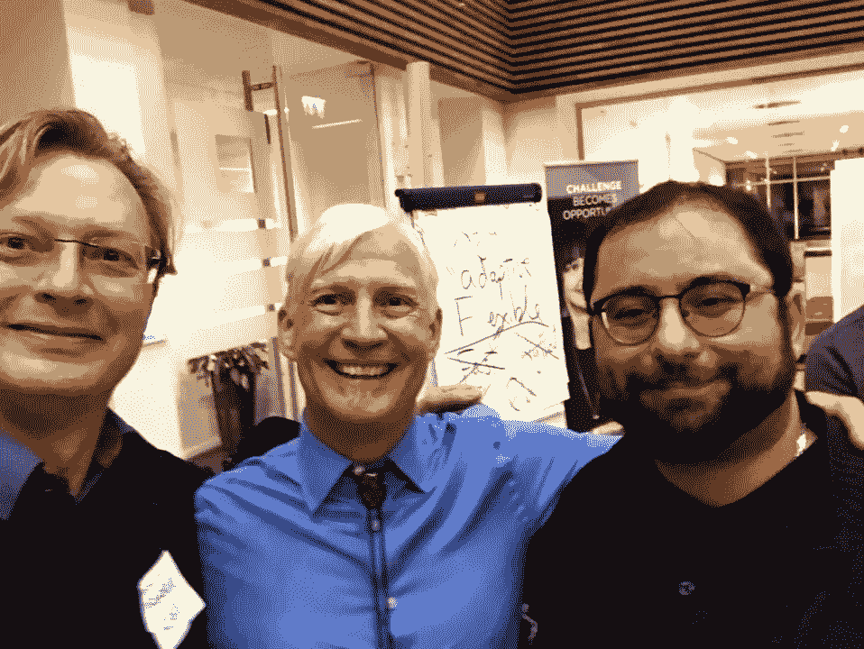
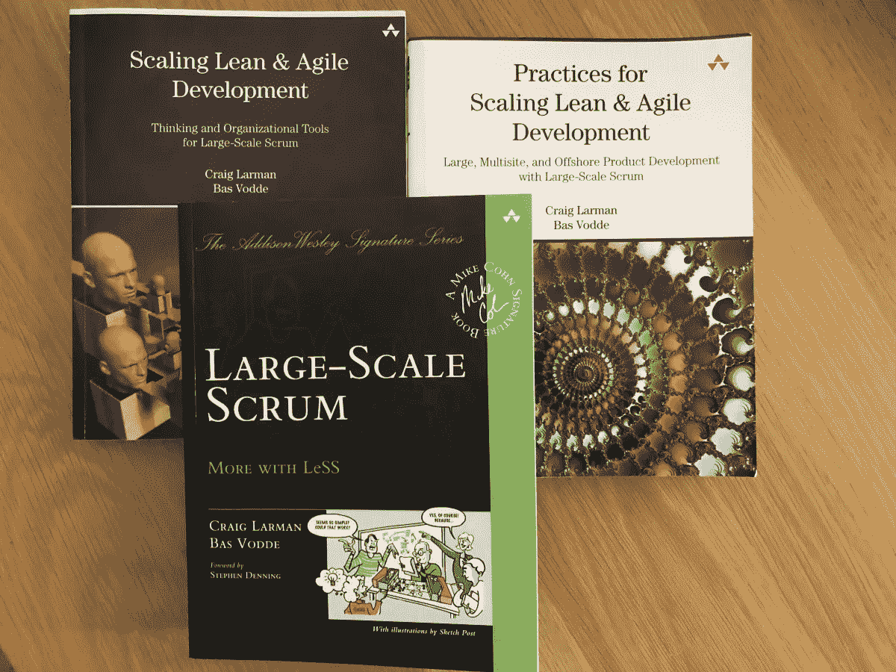
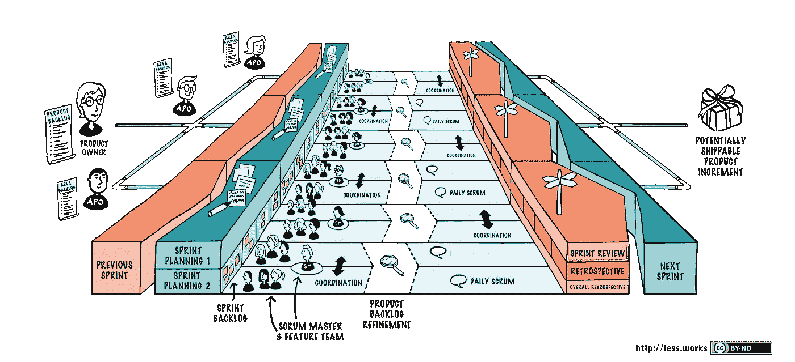
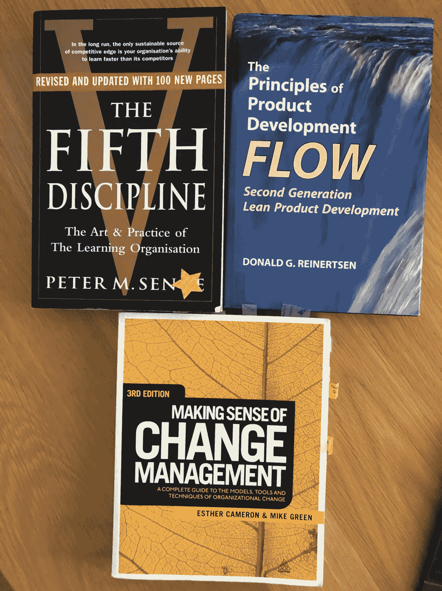

# 少走弯路:从领导者的角度——概述，第 1 部分

> 原文：<https://medium.com/nerd-for-tech/less-from-the-trenches-from-a-leaders-perspective-part-1-27a27915dad5?source=collection_archive---------3----------------------->

## LeSS 的快速概述

我去听克雷格·拉曼的演讲

当扩展 Scrum 或敏捷时，可以使用几种框架，比如 SAFe、Nexus 或 LeSS。即使这些框架已经存在了一段时间，也很难找到来自现实世界的故事。从战壕里。除了 SAFe 之外的任何其他框架。在几篇文章中，我希望描述一下我使用较少的实际经验。我的角色是领导者，因此，我的观点是领导者的观点。

我不是专家。然而，我有更少的实际经验。我也有 12 年在大中型组织中扩展敏捷框架的经验。我使用了更少的、安全的、自我成长的放大技术。

我犯了错误。我学会了。我能理解 LeSS and SAFe 试图传达的信息。我想分享一些现实生活中的例子，这些例子都是我们在开始少用时犯的错误和学到的教训。由于 SAFe 已经普及，很多人都知道 SAFe，所以我尝试比较这些框架来突出不同之处。

第一部分针对的是那些听说过较少但希望快速了解一下的人。下一部分将深入战壕。如果您了解 LeSS 的基本原理，或者希望直接进入现实生活中的问题，您可以直接跳到第二部分。

# 哪里来的更少

如果你以前没有听说过 LeSS 或者觉得很难理解 LeSS，这是可以理解的。LeSS 从一开始就是一个建议的集合。描述在有很多团队的情况下什么有效或者无效的建议。这些想法被写在下面的两本书里。

创始人 Craig Larman 和 Bas Vodde 想从一开始就明确指出一点:“少就是 Scrum。”很少的添加或更改被添加到 LeSS。与安全相比。外管局增加了产品管理、业务负责人、系统架构师等新角色。外管局还增加了许多新术语。你一点也没有。你从最小的开始。

> 如果你想简化，你可以说 LeSS 从最小开始，建议你只在有意义的时候才添加。

外管局采取了相反的方式。我想起来也不相信外管局建议你删除什么。他们只是添加了更多…

# 哲学

Craig 和 Bas 的意思是，对于另一个组织来说，什么可行，什么不可行可能是不同的。克雷格和巴斯不愿意尝试把 LeSS 变成一个通用的“为所有人工作”的框架。

> 这个想法是让你发现什么可行，什么不可行。

信息是，“这对我们不起作用，但是你为什么不试试看它对你是否有效。”

就 Shu-Ha-Ri 而言，你可以说 LeSS 适合处于敏捷理解的 Ha 或 Ri 阶段的组织。SAFe 有详细的流程和操作指南，更适合初学者。或者用考克伯恩的话来说，少要 2/3 级，安全要 1/2 级。原因是，在更少，你需要创新和改变规则。你在“哈”阶段做的事情。在 SAFe 中，您可以获得完整的说明，即“Shu”阶段。

然而，对于整体的大画面有很大的需求。因此他们写了第三本书，“大规模 Scrum”，解释了框架的基础。在书中，还描述了如何组织。

# 组织

LeSS 中的组织很简单，如下图所示。

你有团队一起工作，从共同的待办事项中挑选项目，互相交流。你有冲刺计划、细化和回顾。与 Scrum 中存在的差别很小。同样，这是因为 Scrum 越来越少。

> 唯一增加的仪式是一个整体回顾。这个仪式发生在团队回顾之后。

这里只有一个新角色，那就是区域产品负责人。当产品负责人拥有的团队数量超出其处理能力时，将添加此角色。当这种情况发生时，您将团队分成一个区域，每个区域有一个产品负责人。区域产品负责人帮助产品负责人，并负责从待办事项中筛选出一定数量的项目。请注意，您仍然有一个待办事项。

LeSS 实际上描述了另一个新角色:产品组负责人(HPG)，全面负责。

# 原则

LeSS 描述了对你的组织有帮助的原则。LeSS 拥有精益思想、排队论、系统思维、持续改进、整体产品关注等原则。这与外管局的十项原则基本相同。每个原则都是巨大的。每一个原则都有大量的书籍论述。有许多书。对于感兴趣的人来说，下面是一些著名的书籍。

# 特色团队

LeSS 非常强调特性团队的使用。如果你不理解特性团队的概念，听听克雷格·拉尔曼的这个[演讲](https://www.youtube.com/watch?v=HmdGvq_8rVQ)。所有不是特性团队的事情都被“**撤销**，直到它变得敏捷。这意味着我们允许组织的这些部分保持现状。

同样，与外管局相比，这意味着我们可以一步一步地逐步改造组织，而不是搞一场大爆炸。当然，在 SAFe 中，你可以从一个敏捷发布系列开始，但这仍然意味着在那个系列中添加所有 SAFe 附带的过程。In LeSS，有不敏捷的剩菜是可以的。未完成的剩菜。

# 卓越的技术

技术优势是 LeSS 中描述的另一个领域。LeSS 认识到，要实现功能团队的想法或进行持续集成，需要一些工程实践。架构需要改变以类似于组织设置——康威的[法则](https://en.wikipedia.org/wiki/Conway%27s_law)规则。

# 管理

LeSS 认识到领导者和管理者的必要性。经理的角色是消除组织层面的障碍，着眼全局以避免次优，并进行教导和指导。那就是专注于能力改进——非常简单的说法。

# 少与安全。

从一个简单的角度来看，你可以说 SAFe 从引入新角色、仪式和非常详细的流程的完整画面开始，LeSS 从扩大规模所需的最低要求开始。

我的印象是，SAFe 允许你改变 SAFe 以适应你的组织的文化、需求等。，随着你变得更聪明。然而，如果你开始按书来实现它，它会有所帮助。

相反，Less 建议你从极简主义开始，根据对你的组织有用或无用的东西来添加你需要的东西。如果你想了解更少的好网站，可在[少。作品](https://less.works/)。

# 实施较少

由于没有确切和严格的实施规则，因此更难理解。相反，你需要理解精益和敏捷原则，并应用它们。我相信更多的组织会因此而选择安全。

在保险箱里，你会得到一个涵盖所有内容的模型，并且以一种非常好的方式包装。对我来说，它在许多方面类似于 Rational 统一过程。你可以选择如果你有一个小项目(本质安全)或一个大项目(投资组合安全)。甚至一些商业案例的模板也与 RUP 的相同。

> 为了介绍得更少，你需要深入理解敏捷原则并进行实验。没有结束最终状态。

我认为这可能会让许多组织感到害怕。典型的管理层的反应是，“所以你说你希望改变组织，你说它会更好，但你不能描述它会是什么样子，或者我们会改变什么。对我来说听起来太冒险了。”

## 总结

*   LeSS 是 Scrum
*   您添加了精益、系统思维、优秀工程实践和其他有用的成熟实践的元素。
*   您可以添加总体回顾，如果需要，还可以添加区域产品负责人。
*   你不需要制造大爆炸。您可以撤消组织中的元素。
*   你从小事做起，随着你的发展，你会知道什么对你的组织最有效。

我是克雷格·拉曼的超级粉丝。他的演讲非常精彩，我看过几场现场直播和 YouTube 上的演讲。如果你想扩大规模，理解敏捷原则，我真的推荐听他的。

在接下来的几篇文章中，我将描述我们在实践中遇到的挑战和学到的教训。它如何改变组织的结构、技术优势和管理？

我会在其他文章写完后添加链接。

[第二部分——我们如何组织自己](https://fredrik-carleson.medium.com/less-from-the-trenches-from-a-leaders-perspective-get-organized-part-2-88945e0a9b53)

感谢阅读。如果你喜欢这篇文章，如果你在评论中加上一个笑脸或类似的东西，我会很受鼓舞:)

*最初发表于*[T5【https://www.linkedin.com】](https://www.linkedin.com/pulse/less-from-trenches-leaders-perspective-part-1-fredrik-carleson/)*。*