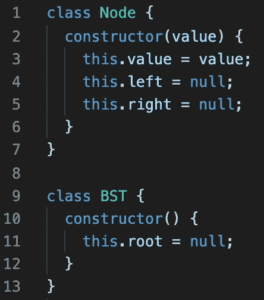
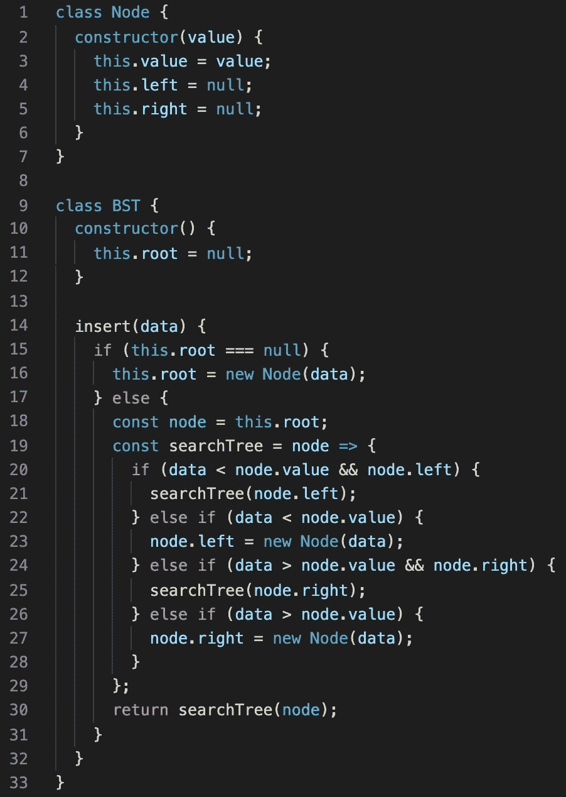
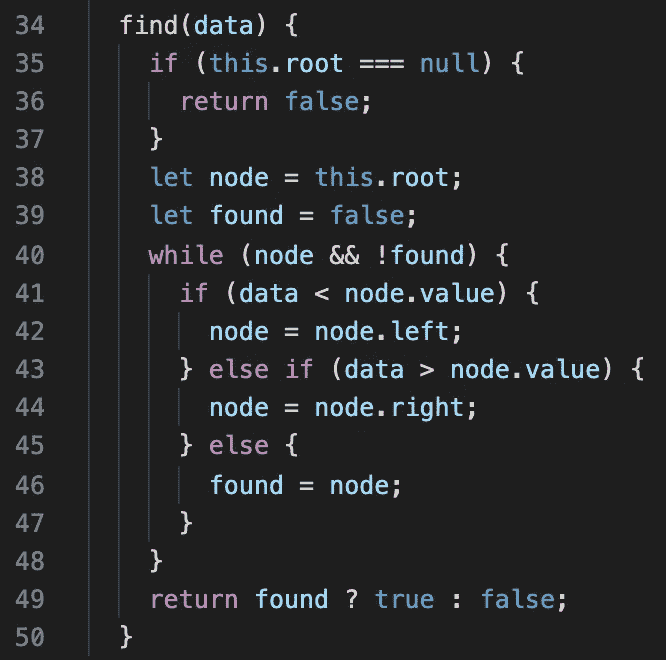

# 让我们用 JavaScript 构建一个二叉查找树

> 原文：<https://medium.com/nerd-for-tech/lets-build-a-binary-search-tree-with-javascript-22667531eeb?source=collection_archive---------1----------------------->

在[https://visualgo.net/en/bst](https://visualgo.net/en/bst)建造你自己的

## 什么是二叉查找树？

BST 是基于节点的有序树形数据结构，其中每个节点最多可以有两个子节点。这些子节点被称为左节点和右节点。左边的节点总是比它的父节点小*，右边的节点总是比它的父节点*大*。顶部节点被称为根节点。因此记住这一点，如果左边根节点的任何后代大于根节点*或*如果右边根节点的任何后代小于根节点，二叉树将是无效的。*

节点只能有 0、1 或 2 个子节点。没有任何子节点的节点称为叶节点或终端节点。

当值被插入到 BST 中时，检查根节点以查看插入的值是大于还是小于根值。如果小于该值，则该值向下发送到左侧，如果大于该值，则发送到右侧。如果一个节点已经存在，则再次运行相同的比较，以确定该值是否应该向下发送到现有节点的左侧或右侧。如果还没有发送值的节点，则创建一个新节点(叶节点，终端节点)。

## 二分搜索法树的种类

**完整** **二叉查找树:**在这个 BST 中，每个节点将有 0 或 2 个子节点:

完整的二叉查找树

**完全二叉查找树:**除了最后一层(或底层)的节点，树上的所有节点都具有最大数量的子节点:

一个完整的二叉查找树

**完美的二叉查找树:**一棵完美的 BST 树既是**完整的**又是**完整的**。除了底层节点外，所有节点都已满，它们都是树叶:

完美的二叉查找树

## 让我们建立一个 BST

现在我们已经对 BST 树有了很好的理解，让我们使用 JavaScript 从头开始构建一个 BST 树！我们将使用类创建节点和树:

我们用一个值实例化一个新节点。该节点有值的指针，左和右。新的 BST 实例将有一个值为 null 的根。让我们向 BST 类添加一个方法，该方法将允许我们向树中插入一个值:

咻！好吧，我们慢慢来。我们的 insert()方法使用递归来*搜索*二叉查找树，寻找应该追加新数据的位置。insert 方法中检查的第一件事是我们的 BST 根是否仍然为空。如果为 null，则表示这是第一次调用 insert 将数据插入到树中。因此，一个新节点将把数据作为它的值，并作为树的根节点插入。下次调用 insert 时，它将使第一个“if”语句失败，并转到该方法的 else 部分。这里我们将树的根设置为常量“node”。然后我们创建一个方法来搜索树，看看数据应该放在哪里。然后调用新创建的 searchTree 方法，将节点常量作为参数。searchTree 方法首先检查我们的数据是否小于当前节点的值，以及当前节点的左侧是否有值。如果两者都为真，我们使用递归并再次调用函数，这次将左边的节点作为参数。如果为假，我们向下移动到下一个条件。如果数据小于当前节点的值(我们知道 node.left 不存在，因为前面的条件不为真)，我们可以用我们的数据将 node.left 实例化为一个新节点。但是，如果我们的数据大于 node.value，那么前两个条件将失败，我们将转到最后两个条件。除了检查带有插入数据的新节点应该附加到树的右半部分的什么地方之外，它们做的事情与前两个相同。

## 搜索值

二叉搜索树的排序方式通常可以将我们的搜索时间减少一半，因为我们只需要搜索树的一半。它们可用于存储任何可使用小于的*或大于*的*进行比较的数据。在最好的情况下，BST 的实现具有很大的时间复杂度 O(log(n))。在最坏的情况下，它具有线性的 O(n)时间复杂度，这仍然是非常好的。*

要搜索树中是否存在特定的值，让我们在 BST 类中创建另一个名为 find()的方法，该方法将返回一个布尔值，指示是否找到了数据:

find()做的第一件事是检查以确保有一个根值。如果有，我们将“node”设置为根，将“found”设置为 false。然后使用一个 while 循环，该循环仅在“node”为真而“found”为假时运行，我们使用条件来检查树中我们正在寻找的数据。从根开始，我们将它与数据进行比较，看我们是否应该遍历树的左侧或右侧。以后我们不能再往前走了，发现会被设定为节点。如果该节点存在，则将“found”设置为该节点并变为 true，从而导致循环停止。如果节点不存在，“node”将变为 false，循环将停止。然后，我们使用三元语句返回 found 是真还是假。

## 结论

这是对二分搜索法树世界的简单介绍。你可以用它们做很多更复杂的事情，下面是一些帮助你继续做下去的链接:

 [## 面向初学者的 JavaScript 树形数据结构

### 树形数据结构有许多用途，最好对它们的工作原理有一个基本的了解。树木是基础…

adrianmejia.com](https://adrianmejia.com/data-structures-for-beginners-trees-binary-search-tree-tutorial/)  [## 二叉查找树极客书店

### 极客的计算机科学门户。它包含写得很好，很好的思想和很好的解释计算机科学和…

www.geeksforgeeks.org](https://www.geeksforgeeks.org/binary-search-tree-data-structure/)  [## VisuAlgo -二叉查找树，AVL 树

### 二叉查找树(BST)是一棵二叉树，其中每个顶点最多只有 2 个满足 BST 性质的子树…

visualgo.net](https://visualgo.net/en/bst)  [## 编码面试训练营算法，数据结构课程

### 数据结构？他们来了。算法？已覆盖。许多问题都有很好的解释？没错。如果你是…

www.udemy.com](https://www.udemy.com/course/coding-interview-bootcamp-algorithms-and-data-structure) 

一如既往的感谢阅读！欢迎在 LinkedIn 上与我联系！