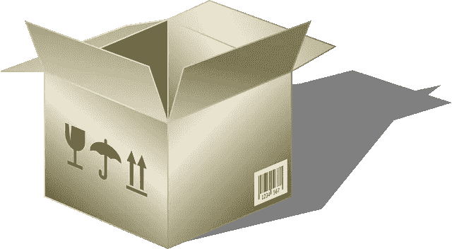

# 让我们了解一下 Ruby 变量

> 原文：<https://medium.com/nerd-for-tech/lets-learn-about-ruby-variables-8110f0a725d4?source=collection_archive---------21----------------------->

在我的前一篇文章中，我讨论了我是如何开始重新接触 Ruby 编程语言的，并将开始定期撰写相关文章。除了讨论*使用*和*打印*来显示数据，我还提供了 Ruby 数据类型的概要，并讨论了这些都是 Ruby 中的[对象](https://en.wikipedia.org/wiki/Object_(computer_science))。在这篇文章中，我们将看看 Ruby 编程的另外两个关键特性:变量和赋值操作符。

请帮我保存我的数据。



图片由 [OpenClipart-Vectors](https://pixabay.com/users/openclipart-vectors-30363/?utm_source=link-attribution&amp;utm_medium=referral&amp;utm_campaign=image&amp;utm_content=161578) 从 [Pixabay](https://pixabay.com/?utm_source=link-attribution&amp;utm_medium=referral&amp;utm_campaign=image&amp;utm_content=161578)

Ruby 和其他编程语言一样，使用了*变量*。变量有什么用？您会发现编程教程通常将变量描述为保存数据的容器。在本帖中，我们将讨论*局部*变量。这里有几个例子:

```
hello = “Hello World!”
my_name = “Joe Schmoe”
langs = [“Ruby”, “Perl”, “Java”]
student_scores = { “J. Smith” => 95, “M. Reade” => 87, “C. Jones” => 100, “T. Avery” => 79 }
num1 = 45
num2 = 37
sum = num1 + num2
```

如果我们在变量上使用 *puts* 命令会发生什么？

```
puts hello
puts my_name
puts langs
puts student_scores
puts num1
puts num2
puts sum
```

我们的控制台吐出…

```
Hello World!
Joe Schmoe
Ruby
Perl
Java
{ “J. Smith” => 95, “M. Reade” => 87, “C. Jones” => 100, “T. Avery” => 79 }
45
37
82
```

所以写*放* *我的名字*基本上就是说，“嘿，打开标有*我的名字*的盒子，给我们看看里面是什么。”

从上面的例子中我们能收集到什么关于变量的信息？首先，注意变量名只包含小写字母、数字和/或下划线(_)。此外，它们只以字母开头(尽管它们也可以以下划线开头)，并且它们持有不同的数据类型。变量甚至可以保存其他变量和/或表达式，正如我们看到的名为 *sum* 的变量。

说到变量名……请注意，我们的每个示例变量名都给出了变量包含内容的一些指示。是的，只要遵循正确的命名约定，您可以随意命名变量。但是，这是最佳实践(提示，提示！)来创建反映其用途的变量名。否则，您或任何必须使用代码的人可能会弄不清某个特定变量的用途。

因为 Ruby 是一种动态类型语言，所以您不必声明变量所包含的数据类型。但是，请记住，在处理变量时，数据类型确实很重要。我们名为 *sum* 的变量将会正常工作，因为 *num1* 和 *num2* 都保存数字。如果我们这样重新计算*和*会怎么样:

```
sum = num1 + hello
```

你认为如果我们接着尝试 *puts sum* 会有什么结果？

我们得到一条错误消息，说“String 不能被强制转换成 Integer (TypeError)”。因此，试图用一个数字和一个字符串进行数学运算是行不通的。稍后我会深入探讨所谓的类型转换，但是请注意，与 JavaScript 相比，Ruby 不允许将一种数据类型隐式强制转换为另一种数据类型。

既然如此，我们将从这段代码中得到什么结果呢:

```
num1 = 45
num2 = “37”
sum = num1 + num2
puts sum
```

再次，我们的控制台骂我们:“String 不能强制成 Integer (TypeError)。”为什么会这样呢？Ruby 告诉我们，“对不起，但是我不能添加一个数字和一个字符串。”问题是，虽然变量 *num1* 仍然保存一个整数，但是 *num2* 却不保存。回想一下我们关于基本数据类型的课程。用引号将某物括起来，使之成为一个字符串。让我们取当前由变量 *langs* 保存的数组，并将该数组放在引号中。

```
langs = “[“Ruby”, “Perl”, “Java”]”
puts langs
```

以前， *puts langs* 已经导致数组中的每个元素显示在单独的行上。但是这一次， *langs* 保存的是一个字符串——即文本——而不是一个数组，导致 *["Ruby "、" Perl "、" Java "]【T21]显示在控制台上。同样，如果我们在 *student_scores* 中使用散列，并用引号将其括起来，那么它现在将是一个字符串。*

```
student_scores = “{ “J. Smith” => 95, “M. Reade” => 87, “C. Jones” => 100, “T. Avery” => 79 }”
puts student_scores
```

运行 *puts student_scores* 仍将显示我们在 *student_scores* 仍保存散列时看到的相同散列。然而，你现在看到的实际上是一个字符串。尝试使用*。类*上的方法*学生 _ 分数*。

```
student_scores = “{ “J. Smith” => 95, “M. Reade” => 87, “C. Jones” => 100, “T. Avery” => 79 }”
puts student_scores.class
```

*。class* 方法，正如你可能猜到的，告诉我们一个项目属于哪个类。我们的控制台会显示*字符串*。现在让我们去掉那些讨厌的引号。

```
student_scores = { “J. Smith” => 95, “M. Reade” => 87, “C. Jones” => 100, “T. Avery” => 79 }
puts student_scores.class
```

这次我们将在控制台上看到*散列*。

有一些方法可以执行显式类型强制，但是我们将在另一个时间讨论这些方法。

**作业人员上岗**

你已经在上面的例子中看到，我们所有的变量都通过“=”赋值。它看起来像一个等号，但是在 Ruby 中它被称为简单赋值操作符。例如， *hello = "Hello World！"*只是告诉我们程序的一种方式，“把字符串‘Hello World！’在名为*的变量中你好*。Ruby 还有其他赋值操作符，我们将在后面学习。请记住，Ruby 中的“=”不是等号。

我的下一篇 Ruby 博文将继续讨论 Ruby 变量和赋值操作符。现在做一个小小的回顾…

**快速问答**

1.  Ruby 有多少种数据类型？
2.  命名这些数据类型。
3.  是非判断:Ruby 拥有原始数据类型。
4.  是非判断:Ruby 区分整数和浮点数。
5.  Ruby 中唯一“假”的值是什么？
6.  是非判断:Ruby 是一种纯面向对象的语言。
7.  *puts* 命令和 *print* 命令有什么区别？
8.  是非判断:数组中的元素必须是相同的数据类型。