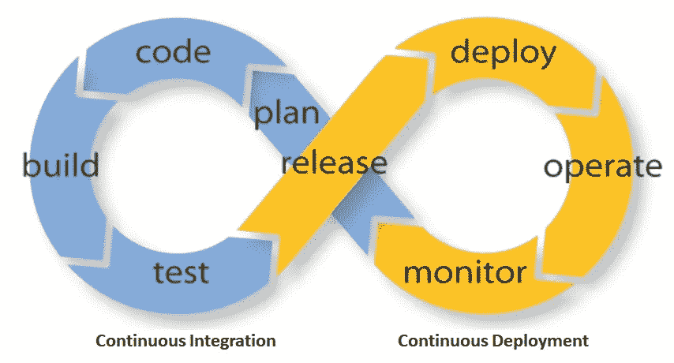
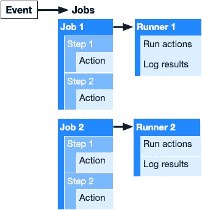

# 让我们谈谈自动化

> 原文：<https://medium.com/nerd-for-tech/lets-talk-automation-64a29b9f9d70?source=collection_archive---------12----------------------->

## 设置与 GitHub 动作的持续集成—第 1 部分

## 什么是 CI/CD？

持续集成和持续交付，或 CI/CD，是指每次代码成功合并到源代码控制中的一个或多个特定分支时，或基于某些条件，如从 GitHub(或其他源代码控制提供者中的等效程序)启动发布，自动构建项目并将其部署到交付渠道(如 itch.io、android store 或 iOS store)的过程。这个过程通常在基于团队的软件工程工作中实现，并且可以帮助验证从几个开发人员合并到单个源中的代码是稳定的，并且可以发布给用户。这个过程可以，而且经常，包括自动运行代码单元测试，以及产生代码的构建和发布。从逻辑上讲，在一个高层次上，我们可以将过程分成两个部分，由持续集成和持续交付组成。在本文中，我们将看一看第一部分，持续集成，并将持续交付留到以后的文章中。

持续集成和交付(图片归功于 automated–360.com)

## 做出 CI 选择

有许多系统和软件包有助于实现持续集成。Jenkins、TravisCI、CircleCI 和 GitHub 操作是许多可用选项中的几个，根据团队的工作流、所选择的源代码控制提供者和现有的基础设施，这些选项各有利弊。出于我们的目的，我们正在构建 Unity 项目，将它们存储在 GitHub 中，而不是托管或利用其他基础设施工具，如 Team City 或 Azure DevOps。该计划还包括将我们的项目部署到多个托管服务中，包括 itch.io 和 GitHub 页面。当查看我们的项目参数时，GitHub Actions 脱颖而出，成为一个强有力的竞争者，因为它已经与我们的源代码控制提供者集成在一起，并允许我们在社区成员提供的一些操作的帮助下实现我们的其他目标。

## Github 操作

GitHub Actions 是 GitHub 的事件驱动平台，提供运行单元测试等功能的能力，并提供项目的自动构建以响应事件，如将代码签入特定分支。我们工作的切入点是一个工作流文件。**工作流**包含**作业**，作业包含**步骤**，这些步骤是要在虚拟化环境中运行的动作列表，为我们提供功能。

来自 GitHub 文档的工作流结构[https://docs . GitHub . com/en/actions/learn-GitHub-actions/introduction-to-GitHub-actions](https://docs.github.com/en/actions/learn-github-actions/introduction-to-github-actions)

## GitHub 秘密

作为一个最佳实践，我们不希望在 GitHub repo 中将访问令牌或用户名和密码与我们的代码一起存储，因为这将使它们对其他人可用，并使我们暴露于潜在的恶意操作。GitHub 为我们提供了将这些信息存储为他们所谓的秘密的能力。我们将存储 Unity 许可证的访问信息，并在部署时存储 itch.io 等网站的访问凭证。

## 实施 CI 工作流程的步骤概述

我们的 CI 实施将有许多步骤，因此在这里列出它们是一个好主意。

1.  创建工作流文件夹和文件
2.  获取 Unity 的个人许可文件(用于 GitHub runners 上的虚拟化 Unity 实例)
3.  将 Unity 许可证存储为 GitHub 机密
4.  创建一个 GitHub 访问令牌，用于调用 GitHub 提供的动作来上传和下载构建过程中生成的文件
5.  将 GitHub 令牌存储为机密
6.  配置我们的工作流程

我们的最后一步进一步细分如下:

1.  从我们的回购中获取我们的代码
2.  运行缓存步骤以优化未来运行
3.  在配置为运行 Unity 的 GitHub runner 上构建我们的项目
4.  上传该构建步骤的结果，以便它们可用于后续的连续交付步骤，并供我们下载。

如果我们有单元测试要运行，我们现在没有，我们将在构建步骤之前运行这些测试，以确保我们只在它们通过的情况下进行构建。

## 下次吧！

在本文中，我们已经介绍了许多关于 CI/CD 的知识，以及我们计划如何实现它。下一次，我们将回顾 CI 渠道中集成部分的实际实施。如果你喜欢这篇文章，或者想在我的旅程中与我同行，请在[gamedevchris.medium.com](#https://gamedevchris.medium.com)关注我。