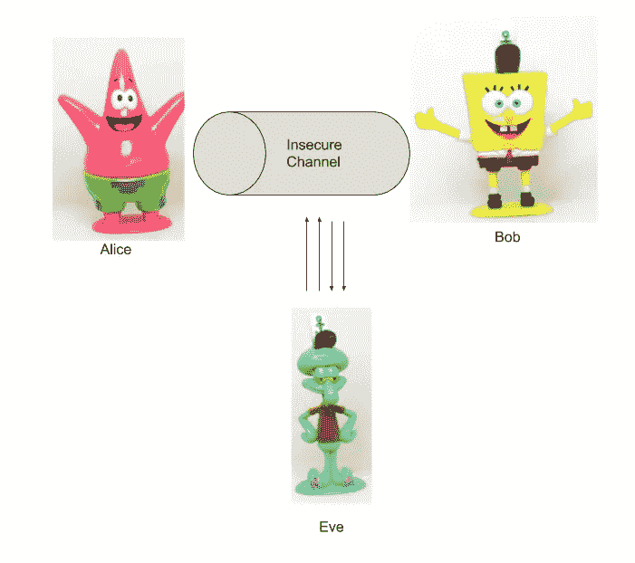

# 让我们来理解密码学

> 原文：<https://medium.com/nerd-for-tech/lets-understand-cryptography-6584309a30af?source=collection_archive---------6----------------------->

从老式信函到快速聊天应用，通信已经成为一个更广泛的领域。数据安全是通信领域中另一个独立的子领域。通信系统需要得到充分保护，以避免犯罪和侵犯隐私的活动。文献综述观察了如何在密码学领域进行研究，以满足网络和应用安全的安全要求。这篇综述比较了与密码学相关的早期和现代研究以及已经完成的影响。通过回顾学术和非学术著作，我们的目标是证明继续研究密码学在保护数据安全和隐私方面的重要性。

# 首先要做的事

用于系统的密码术的第一个用途是使两个人 Alice 和 Bob 能够通过不安全的信道以防止攻击者 Eve 能够理解对话的方式保持他们的通信安全。今天的密码术比它的早期版本复杂得多。然而，所有复杂的方法都是建立在基础之上的。今天的密码学，尽管仍有深远的军事意义，但已经扩展了领域。这些系统的新方法旨在提供经济有效的方法来保护大量使用加密技术的电子数据。密码学提供了保护数据隐私的方法。

## 让我们了解一下沟通模式

通信模型用于演示通信中的安全性。爱丽丝是发送数据的信息传递者；鲍勃是这个数据的接收者。在这个场景中，我们假设用于发送数据的通信信道是一个不安全的信道。

通信模型

## 早期密码学

密码学是只要第一次书写发生在通信过程中。密码学的迷人历史可以追溯到 4000 年前。第一个已知的证据，被认为是卡恩的《密码破译者》【T2。II '，1967) ，追溯了从埃及人(4000 年前)最初的有限使用到二十世纪的密码学。密码学在第一次和第二次世界大战中有了更显著的进步 [(Callahan，2014)](https://paperpile.com/c/XpYo7i/2J5M) 。尽管它给出了关于密码学最初用途的提示，但要准确指出密码学的起源并不容易。然而，

*   刻在贵族 Khnumhotep 二世墓主墓室墙壁上的铭文，铭文的日期大约是公元前 1900 年
*   《阿萨斯特拉》是一部关于治国之道的经典著作，被认为是考底利耶的作品，写于公元前 321 年到公元前 300 年之间。这项工作让人想起通过秘密写作与他们的间谍进行的间谍通信 [(Gebbie，2009)](https://paperpile.com/c/XpYo7i/Lixl) 。
*   主动密码分析的第一个记录来自七世纪的阿拉伯人

后来，研究转移到使用简单的单字母替代密码从公元前 500 年到 600 年。这包括按照某种秘密规则，用不同字母表的其他字母替换信息中的字母。这个规则是从乱码信息中恢复原始信息的关键 [(Gebbie，2009)](https://paperpile.com/c/XpYo7i/Lixl) 。

它是开展密码学研究和现代密码学的转折点。到 1980 年，由美国国家标准协会(ANSI)采用的 DES 算法已经投入商业使用。继这一里程碑之后的又一个里程碑是提出了发展公钥密码学(PKC)的新概念，这一概念今天仍在经历研究发展 [(Levy，2001)](https://paperpile.com/c/XpYo7i/oeVX) 。

# 简单明文加密(简单密码)

如引言部分所述，简单的加密算法是在 4000 年前发明的。这些密码基于单一明文中字符的替换和换位。虽然，在现代加密算法中执行的操作通常有点类似，但是它们影响单个比特和字节。因此，我们可以同意现代加密方案比早期系统更安全。替换密码是根据字母表用另一个预定义的组替换每个明文字母组。对于解密，用户应该使用反向替换。有几种替代密码:凯撒密码，单表密码等。

Vigenère Tableaux 也是另一种简单的明文密码。易于理解和实现。它通过使用一系列交织的凯撒密码来加密字母文本。它采用了一种多字母替换形式(Bruen 2011) [(Bruen 和 Forcinito，2011)](https://paperpile.com/c/XpYo7i/Afgk) 。

与基本替代密码相比，多字母替代密码在密码方面更加安全。它显示了一个相当平坦的分布，没有给密码分析者任何信息。在单字母密码中，它们的频率分布反映了基本字母的分布，因此很容易被破解。多字母替换比单字母替换更安全。它使用替换，但是由于密钥长度的原因仍然不安全

# 对称密钥密码系统

密码系统有两种形式:对称和非对称。对称密码系统涉及使用称为秘密密钥的单个密钥来加密和解密数据或消息。另一方面，非对称密码系统使用一个密钥(公钥)来加密消息或数据，使用第二个密钥(私钥)来解密这些消息或数据(藤崎琴音 2011 年)[(藤崎琴音和冈本，2013 年)](https://paperpile.com/c/XpYo7i/1vZg)。

在对称密码系统中，相互通信的双方只使用一个密钥进行加密和解密。使用对称加密进行通信的实体必须交换密钥。与非对称密码系统的主要区别是这里使用的密钥应该保密。对称密钥算法有 AES，DES，TRIPLE DES，RC4，BLOWFISH(Diaa Salama 2008)[(Elminaam，Abdul Kader and Hadhoud，2009)](https://paperpile.com/c/XpYo7i/PTNs) 。

对称加密允许双方在封闭的环境中进行有效的通信。与非对称算法相比，对称算法的运算速度非常快，因为计算是相对简单的操作。因此，基于对称密钥的算法在相对便宜的硬件中执行得更好。128 位的密钥大小足以实现足够的安全特性。一般在安全性上没有区别。安全性基本上是基于算法的强度和密钥的大小。对称和非对称都有不同种类的算法。为了设计更好的安全解决方案，应该考虑好的算法方法和密钥大小的有效性。

## 分组密码和流密码

对称加密算法有两种:*分组密码*和*流密码* **。**

分组密码在明文和密文中都表现为分组。用户必须使用特定的密钥来设置数据块加密的比特长度。例如，DES 和 Rijndael 算法分别使用 64 位和 128 位的块大小。安全级别主要取决于数据和密钥大小。分组密码的例子有 DES、DESL、AES。

在流密码中，数据以流的形式加密。明文的单个字符同时加密。计算所需的内存比分组密码少。然而，流密码的主要缺点是它在第一次使用时漫长的初始化阶段。通信协议不识别流密码。流密码具有简单的结构和快速的硬件(deb deep Mukhopadhyay 2007)[(Kohda 和 Tsuneda，1995)](https://paperpile.com/c/XpYo7i/n1YV) 。它们用于明文大小未知的应用中。流密码的例子有 RC4、E0 和 AES。

## 不同种类的对称密钥密码系统:DES、AES 和 Blowfish

作为竞赛的结果，DES 是 IBM 开发的，作为对以前系统 [(Davis，1978)](https://paperpile.com/c/XpYo7i/YJbA) 的调整。DES 广泛用于 PIN 号码、银行交易等的加密。DES 是块密码的一个例子，它一次对 64 位的块进行操作，输入密钥为 64 位。输入密钥中的每第 8 位是一个奇偶校验位，这意味着，实际上，密钥大小被有效地减少到 56 位(Abomhara 等人，2010a) [(Mohamed Abomhara *等人*，2010)](https://paperpile.com/c/XpYo7i/BrKl) 。

3DES(又名三重 DES)是基于 DES 算法开发的，以解决 DES 中的明显缺陷。3DES 通过用三个不同的密钥依次应用该算法三次，简单地扩展了 DES 的密钥大小

1997 年出现的高级加密标准(AES)是 DES 的替代品。Rijndael 密码系统在 NIST 竞赛后被用作 AES[(Naji，Zaidan and Zaidan，2009)](https://paperpile.com/c/XpYo7i/mNKu) 。AES 密码系统对 128 位块进行操作，这些块排列成具有 8 位条目的 4x4 矩阵。可变块长度和密钥长度可根据最新配置使用，如 128、192 或 256 位 [(Taqa、Zaidan 和 Zaidan，2009)](https://paperpile.com/c/XpYo7i/HHUq) 。

Blowfish 是一种对称密钥分组密码，密钥长度从 32 位到 448 位不等，分组大小为 64 位。它在 Feistel 网络之上执行。Bruce Schneier 设计了 blowfish 作为现有加密算法的快速、免费的替代方案。然而，它存在弱密钥问题；没有已知的成功攻击 [(KumarVerma 和 Singh，2012)](https://paperpile.com/c/XpYo7i/RNIQ) 。

作为比较，在默认情况下，DES 和 Blowfish 具有相同的 64 位块大小，而 AES 具有 128 位块大小。与 DES 不同，AES 和 Blowfish 等非对称算法的密钥大小是可变的。DES、3DES 和 Blowfish 是 Feistel 网络算法的结构。AES 处理替换和排列。DES 易受暴力攻击，AES 易受旁路攻击。Blowfish 是一种商业使用的算法，然而，还没有识别出攻击 [(Patil *等人*，2016)](https://paperpile.com/c/XpYo7i/JtUm) 。

# 非对称密钥密码系统

非对称密钥加密，被称为公钥加密(PKC)，是由迪菲和赫尔曼[(迪菲和赫尔曼，1976)](https://paperpile.com/c/XpYo7i/hEcT) 提出的。其思想是使用两个密钥进行加密/解密:一个私钥和一个公钥。通过执行模运算对明文进行加密，并将密文和公钥以及其他公共参数提供给接收方进行解密 [(M. Abomhara *et al.* ，2010)](https://paperpile.com/c/XpYo7i/RZzs) 。

## 迪菲-赫尔曼密钥交换

最简单的公钥算法是 Diffie-Hellman 密钥交换 [(Diffie 和 Hellman，1976)](https://paperpile.com/c/XpYo7i/hEcT) 。该协议允许两个用户使用基于离散对数的公钥方案建立一个密钥。只有当双方同意建立真实性时，协议才是安全的。DH 仅用于密钥交换，不用于认证或数字签名[(李，2010)](https://paperpile.com/c/XpYo7i/4ZFt) 。

## 目录系统代理(Directory System Agent)

还为存储的数据和程序生成数字签名，以便可以在以后的任何时间验证数据和程序的完整性。Erfaneh Noroozi 提出了一种使用 DSA 发送低大小和低容量数据的方法。“哈希函数”用于这种方法，它生成动态的更小的比特，取决于数据的每个字节 [(Noroozi，Daud 和 Sabouhi，2013)](https://paperpile.com/c/XpYo7i/ozSH) 。生成签名现在涉及几种加密算法，如 RSA、Elgamal。

## 埃尔加马尔

Elgamal 是一个处理离散对数问题的加密模型[(黄和曹，2012)](https://paperpile.com/c/XpYo7i/iEKX) 。主要思想是，对于给定的数，在实际的时间范围内不能找到离散对数，而幂的逆运算可以有效地计算。数字签名过程与 Elgamal 中的加密和解密稍有不同。

## 南非共和国(Republic of South Africa)

最常用的公钥加密实现是 RSA。罗纳德·里维斯特，阿迪·萨莫尔和伦纳德·阿德曼在麻省理工学院开发了它[(里维斯特，沙米尔和阿德曼，1978)](https://paperpile.com/c/XpYo7i/LNwC) 。如今，RSA 用于数百种软件产品，可用于密钥交换、数字签名或小数据块的加密。RSA 可以与可变块大小和密钥大小一起使用。使用模运算导出密钥对、公钥和私钥。这里用的质数很大。这里用户使用两个值，p，q。这些 p，q 值是 RSA 公钥加密中使用的值。p 和 q 是质数。用 RSA 签名与用 RSA 加密是一样的。

## 密码学中的椭圆曲线

椭圆曲线算法不是加密算法，但它是一种用于构建不同类型的加密(ECC)方案的模拟算法。椭圆曲线算术涉及使用在有限域上定义的椭圆曲线方程。这里椭圆曲线算术处理的中心概念是 ECDLP 即椭圆曲线离散对数问题[(米勒，无日期；Koblitz，1987)](https://paperpile.com/c/XpYo7i/gyjo+ZTOK) 。

# 结论

与密码系统相关的应用程序提供了可靠的安全性。然而，加密方案的整体安全性的扩展取决于所使用的参数(即，块大小、密钥大小)。用户有责任保护密钥的秘密。诸如 Caesar 和 Vigenère 密码之类的明文简单密码提供的安全性较低。当今的应用程序，如 Pretty Good Privacy (PGP ),吸收了密码学的力量来提供隐私和数据保护。即使加密是基于数学复杂性和时间复杂性，也能为用户提供他们所要求的强大安全性。

# **一些有用的文献**

[*Abomhara，m .等人(2010)“使用对称密钥保护多媒体数据的适用性:概述”，《应用科学杂志》，第 1656–1661 页。doi:*](http://paperpile.com/b/XpYo7i/BrKl)[10.3923/jas . 2010 . 1656 . 1661](http://dx.doi.org/10.3923/jas.2010.1656.1661)[*。*](http://paperpile.com/b/XpYo7i/BrKl)

[*Abomhara，m .等人(2010)“视频压缩技术:概述”，《应用科学杂志》，第 1834–1840 页。doi:*](http://paperpile.com/b/XpYo7i/RZzs)[*10.3923/jas . 2010 . 1834 . 1840*](http://dx.doi.org/10.3923/jas.2010.1834.1840)[*。*](http://paperpile.com/b/XpYo7i/RZzs)

Bruen，A. A .和 Forcinito，M. A. (2011)密码学、信息论和纠错:21 世纪手册。约翰威利&的儿子们。

[*卡拉汉，K. M. (2014)《盟军密码学家对二战的影响:对日本和德国密码机的密码分析》。可在:*](http://paperpile.com/b/XpYo7i/2J5M)[*https://pdf . semantic scholar . org/c7cf/0c 41932d 61457 DD 943 DC 4 dffca 2 c 8 bb 92e 95 . pdf*](https://pdfs.semanticscholar.org/c7cf/0c41932d61457dd943dc4dffca2c8bb92e95.pdf)[*(访问时间:2020 年 1 月 4 日)。*](http://paperpile.com/b/XpYo7i/2J5M)

[*Davis，R. (1978)《透视数据加密标准》，IEEE 通信学会杂志，第 5–9 页。doi:*](http://paperpile.com/b/XpYo7i/YJbA)[*10.1109/mcom . 1978.1089771*](http://dx.doi.org/10.1109/mcom.1978.1089771)[*。*](http://paperpile.com/b/XpYo7i/YJbA)

[*Diffie，w .和 Hellman，M. (1976)“密码学的新方向”，IEEE 信息论汇刊，第 644–654 页。doi:*](http://paperpile.com/b/XpYo7i/hEcT)[*10.1109/tit . 1976.1055638*](http://dx.doi.org/10.1109/tit.1976.1055638)[*。*](http://paperpile.com/b/XpYo7i/hEcT)

[*Elminaam，D. S. A .，Abdul Kader，H. M .和 Hadhoud，M. M. (2009)“无线设备功耗上对称加密算法的性能评估”，《国际计算机理论与工程杂志》，第 343–351 页。doi:*](http://paperpile.com/b/XpYo7i/PTNs)[*10.7763/ij cte . 2009 . v 1.54*](http://dx.doi.org/10.7763/ijcte.2009.v1.54)[*。*](http://paperpile.com/b/XpYo7i/PTNs)

[*藤崎琴音，e .和冈本，T. (2013)“非对称和对称加密方案的安全集成”，《密码学杂志》，第 80–101 页。doi:*](http://paperpile.com/b/XpYo7i/1vZg)[10.1007/s 00145–011–9114–1](http://dx.doi.org/10.1007/s00145-011-9114-1)[*。*](http://paperpile.com/b/XpYo7i/1vZg)

Gebbie，S. (2009)密码学数学综述。可在:[*http://hdl.handle.net/10539/6608*](http://hdl.handle.net/10539/6608)[*(访问时间:2020 年 1 月 4 日)。*](http://paperpile.com/b/XpYo7i/Lixl)

[*【黄，k .】和左宗智(2012)“一种基于 ElGamal 加密的可交换加密方案”，2012 信息安全与智能控制国际会议。doi:*](http://paperpile.com/b/XpYo7i/iEKX)[*10.1109/ISIC . 2012.6449730*](http://dx.doi.org/10.1109/isic.2012.6449730)[*。*](http://paperpile.com/b/XpYo7i/iEKX)

对合交换子及其在代数密码学中的应用。(II)(1967 年)《数学杂志》，第 1-24 页。doi:[10.1515/crll . 1967 . 227 . 1](http://dx.doi.org/10.1515/crll.1967.227.1)[*。*](http://paperpile.com/b/XpYo7i/TRJa)

[*Koblitz，N. (1987)“椭圆曲线密码系统”，计算数学，第 203–203 页。doi:*](http://paperpile.com/b/XpYo7i/gyjo)[*10.1090/s 0025–5718–1987–0866109–5*](http://dx.doi.org/10.1090/s0025-5718-1987-0866109-5)[*。*](http://paperpile.com/b/XpYo7i/gyjo)

[*Kohda，t .和 Tsuneda，A. (1995)“用于流密码加密的混沌比特序列及其相关函数”，用于通信的混沌电路。doi:*](http://paperpile.com/b/XpYo7i/n1YV)[*10.1117/12.227907*](http://dx.doi.org/10.1117/12.227907)[*。*](http://paperpile.com/b/XpYo7i/n1YV)

[*KumarVerma，h .和 Singh，r . k .(2012)“RC5、Blowfish 和 DES 分组密码算法的性能分析”，《国际计算机应用杂志》，第 8–14 页。doi:*](http://paperpile.com/b/XpYo7i/RNIQ)[*10.5120/5774–6004*](http://dx.doi.org/10.5120/5774-6004)[*。*](http://paperpile.com/b/XpYo7i/RNIQ)

Levy，S. (2001)《加密:代码反叛者如何击败政府——在数字时代保护隐私》。企鹅。

[*李，n .(2010)“Diffie-Hellman 密钥交换协议的研究”，2010 年第二届计算机工程与技术国际会议。doi:*](http://paperpile.com/b/XpYo7i/4ZFt)[*10.1109/iccet . 2010.5485276*](http://dx.doi.org/10.1109/iccet.2010.5485276)[*。*](http://paperpile.com/b/XpYo7i/4ZFt)

[*Miller，V. S .(无日期)“椭圆曲线在密码学中的应用”，计算机科学讲义，第 417–426 页。doi:*](http://paperpile.com/b/XpYo7i/ZTOK)[*10.1007/3–540–39799-x _ 31*](http://dx.doi.org/10.1007/3-540-39799-x_31)

*[*Naji，A. W .，Zaidan，A. A .和 Zaidan，B. B. (2009)“可执行文件内未使用区域二中隐藏数据的挑战”，《计算机科学杂志》，第 890–897 页。doi:*](http://paperpile.com/b/XpYo7i/mNKu)[*10.3844/jcssp . 2009 . 890 . 897*](http://dx.doi.org/10.3844/jcssp.2009.890.897)[*。*](http://paperpile.com/b/XpYo7i/mNKu)*

*[*Noroozi，e . Daud，S. B. M .和 Sabouhi，a .(2013)‘针对更小尺寸数字签名的带宽缩减新算法’，2013 年国际信息学和创意多媒体会议。doi:*](http://paperpile.com/b/XpYo7i/ozSH)[*10.1109/icicm . 2013.47*](http://dx.doi.org/10.1109/icicm.2013.47)[*。*](http://paperpile.com/b/XpYo7i/ozSH)*

*[*Patil，p .等(2016)《密码算法综合评估:DES、3DES、AES、RSA 和 Blowfish》，Procedia Computer Science，第 617–624 页。doi:*](http://paperpile.com/b/XpYo7i/JtUm)[*10.1016/j . procs . 2016 . 02 . 108*](http://dx.doi.org/10.1016/j.procs.2016.02.108)[*。*](http://paperpile.com/b/XpYo7i/JtUm)*

*[*Rivest，R. L .，Shamir，A .和 Adleman，L. (1978)“获取数字签名和公钥密码系统的方法”。doi:*](http://paperpile.com/b/XpYo7i/LNwC)[10.21236/ada 606588](http://dx.doi.org/10.21236/ada606588)[*。*](http://paperpile.com/b/XpYo7i/LNwC)*

*[*Taqa，a .，Zaidan，A. A .和 Zaidan，B. B. (2009)“使用 AES 加密算法在 MPEG 中隐藏高安全性数据的新框架”，《国际计算机和电气工程杂志》，第 566–571 页。doi:*](http://paperpile.com/b/XpYo7i/HHUq)[*10.7763/ijcee . 2009 . v 1.87*](http://dx.doi.org/10.7763/ijcee.2009.v1.87)[*。*](http://paperpile.com/b/XpYo7i/HHUq)*