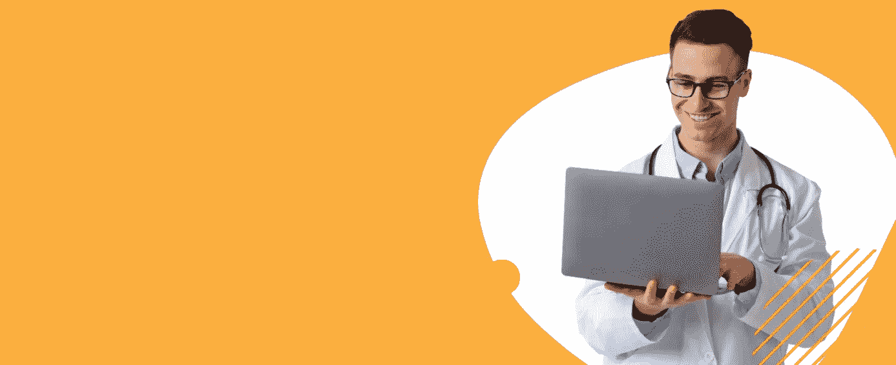
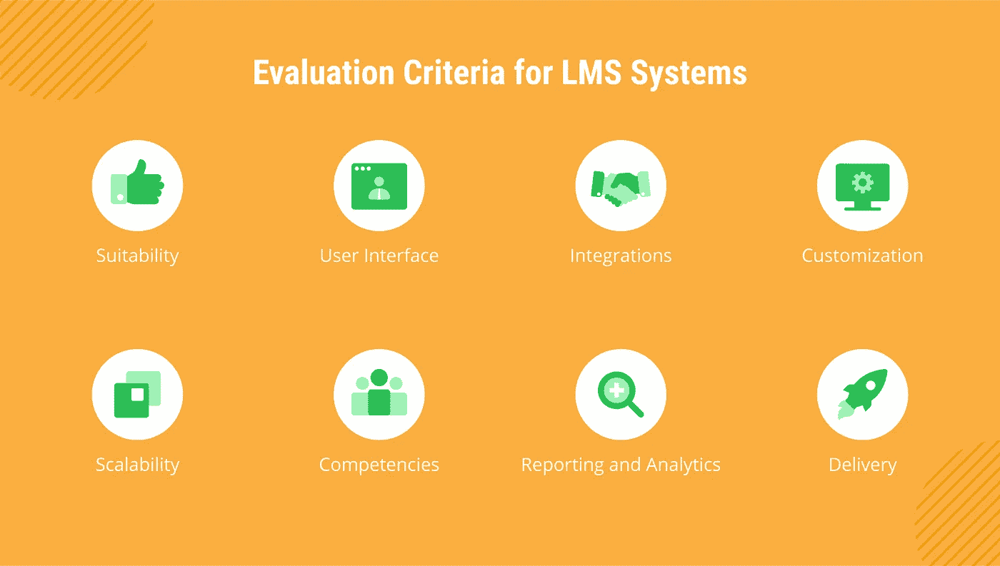
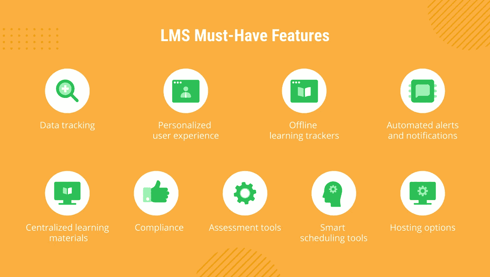

# 利用 LMS 进行医疗保健:如何取得成功？

> 原文：<https://medium.com/nerd-for-tech/leveraging-lms-to-healthcare-how-to-achieve-success-4aceaa6303ff?source=collection_archive---------5----------------------->

继续教育、定期培训和技能发展对医疗保健专业人员来说至关重要。为了提供尽可能好的服务，跟上最新和最有效的治疗方法，医疗保健组织利用各种培训方法，其中最有效的方法之一是学习管理系统。

医疗保健中的 LMS 在许多方面为公司提供了便利，简化了医院员工和医疗专业人员，帮助学习者随时随地学习，使他们能够快速响应新的培训趋势和需求，并提供了许多工具来帮助专业人员评估他们自己的有效性。

在过去的几十年里，医疗保健学习在护士、医生、顾问和医疗保健工作者如何使用技术来保持他们的认证和保持其领域最佳实践方面取得了巨大进步。

但这并不是医疗保健学习中唯一的创新。它也是弥合学做差距的课程的发布，根据特定人的教育需求个性化学习的能力，以及提高课程材料保留率的方法。

在本文中，我们将关注医疗保健中最成功的 LMS 用例，以了解它如何改变行业并为未来做好准备。

# LMS 系统评估标准

有无数的 LMS 可用，每一个都有不同的特性来满足不同的需求。但是如何选择合适的学习管理系统呢？这里有一些可以用来评估 LMS 的常用指标。

**适合性标准**

任何 LMS 都必须易于使用，这样所有学习者才能有效地使用电子学习。这与拥有许多学习者的大型组织(如医疗保健组织)尤其相关，因为培训每个学习者使用 LMS 会影响作为培训方法的电子学习的效率。

**用户界面**

LMS 易于使用的一个重要因素是用户界面(UI)。UI 首先决定了 LMS 的外观，其次决定了用户如何与 LMS 交互。

**整合**

LMS 与医疗保健组织中已经使用的其他系统集成的能力非常重要。例如，这些可以是患者和医疗数据库。因此，支持集成的技术，比如 API，是我们密切关注的对象。

**定制**

在 LMS 上建模的操作工作流以及其他系统的集成必须是可定制的，以便数据可以无缝地移动。

**可扩展性**

轻松扩展的能力是必要的。因为医疗保健组织可能非常大，所以合适的 LMS 将能够在不损害培训效率或其他功能的情况下根据学习者的数量进行扩展。

**能力**

学习者证明能力的能力和 LMS 提供智能评估的能力是至关重要的。这可以应用于面对面的培训活动或提供的在线学习机会。

**报告和分析**

LMS 向组织提供培训和能力问题的实时审计和警报的能力是一项关键要求。下一代 LMS 需要积极主动，并基于使用预测分析评估来自其他系统的数据集，突出潜在的合规性问题或即将到来的技能短缺。

**交货**

另一个显而易见的要求是能够从任何设备(无论是平板电脑还是移动设备)交付所有格式的学习材料。

# LMS 应该具备哪些特性？

除了能够与其他系统集成并提供高度直观和美观的设计、灵活的报告和分析工具以及移动可访问性之外，LMS 还具有其他重要特性。

**数据跟踪**

数据跟踪允许用户跟踪他们的学习进度，并深入了解他们的绩效指标。

**个性化用户体验**

根据学习者的历史为其提供内容的 LMS 吸引了更多的注意力，并带来了更好的学习效果。

**离线学习跟踪器**

这可以通过创建电子记录以及编辑和个性化评估清单的能力来实现，评估清单适合需要评估的特定能力或技能。

**自动警报和通知**

无论是发送给学习者的通知他们即将到来的截止日期的自动消息，还是发送给培训师的通知他们完成率的自动消息，自动提醒都可以确保参与该过程的每个人都能及时提供反馈。

**集中学习资料**

LMS 还必须能够在一个集中的位置存储不同类型的资料，包括文本文档、视频文件、幻灯片和演示文稿。

**符合性**

对于医疗保健公司来说，遵守政府法规并确保其员工在适当的时间接受培训和适当的评估非常重要。

**评估工具**

谈到评估，LMS 可以提供考试引擎、模拟或分支场景等工具。此外，为培训师提供即时反馈的能力也很重要。

**智能调度工具**

为了使学习过程灵活并适应学员的工作时间表，确保您的系统可以为培训课程提供多个日期和时间是很重要的。

**托管选项**

在医疗保健领域，数据安全性更为重要。因此，使用数据安全协议来保护公司的敏感信息至关重要。

# 医疗保健中的学习管理系统

考虑到所有这些因素，让我们看看目前市场上最适合医疗保健专业人员的 LMS。因此，以下是您可以考虑作为合理解决方案示例的前 3 个系统。

**正在学习**

[iSpring Learn](https://www.ispringsolutions.com/) 是一个易于使用的基于云的 LMS，它承诺你可以在注册后立即开始培训你的员工。用户欣赏 iSpring Learn 的简单界面。学习者很容易理解如何登录，完成一门课程或一次测试，并在没有特殊培训的情况下看到结果。此外，人力资源经理、培训协调员甚至没有 IT 技能的医生也可以管理该平台。iSpring Learn 带有一个内置编辑器，可以在 LMS 中创建带有插图、引用、视频和测验的文章。同样，不需要任何技术技能。此外，LMS 还集成了一个强大的创作工具包——iSpring Suite，它允许构建基于 PowerPoint 的交互式课程、测验和对话模拟。

**多西博**

[Docebo](https://www.docebo.com/) 是一款灵活的可定制 LMS，拥有众多选项。它允许你在一个虚拟的协作环境中组织正式的和非正式的培训，并将其与技能管理相结合。

Docebo 与其竞争对手的区别在于模块化系统。LMS 包括四个模块:学习、蔻驰和分享、扩展企业和执行。

*   Learn 是通过电子课程和其他培训材料进行正式学习的模块。
*   蔻驰与分享是一个非正式学习的模块。它让学习者提出问题，并从主题专家那里获得答案。
*   扩展企业是用于培训外部用户的模块。
*   Perform 是一个技能管理模块。它可以让你发现技能差距，并分配课程来弥补这些差距。

**EthosCE**

[EthosCE](https://www.ethosce.com/) 是一个全功能的托管学习管理系统，旨在自动提供护理、药学和其他医疗保健相关专业的继续教育。该系统允许您创建不同的学分类型(CE、CME、CNE 等),并将其应用于一门课程或各种学科的完整课程。

医疗机构的一大优势是与 ACCME 网络服务的集成，包括 ABA、ABIM、ABP 和 MOC 2 项目。存储在第三方系统中的所有外部学分可以与在医疗 LMS 中获得的学分合并。通过这种方式，用户可以使 EthosCE 成为一个单一的信用存储库。所有数据都自动报告给董事会和其他外部系统，包括 ACCME PARS、CE Broker、CPE Monitor 等。

# 底线

LMS 提供了广泛的功能，自动化了某些任务，并提供了一系列的好处，成为医疗保健公司的一个强有力的工具。然而，这种系统提供的大量机会有时会令人困惑，尤其是在开发阶段。因此，除了创建一个清晰的需要做什么的画面，公司还应该非常注意选择供应商。

在 Emerline，我们通常从与[咨询服务](https://emerline.com/services/qa-services/qa-consulting)合作开始，这包括对您的业务进行深入分析，以确定其关键目标、观点和预期结果。在分析的基础上，我们的专家将为您提供一个全面的解决方案，帮助您取得业务成功。在与您就所有细节达成一致后，我们将组建一个专家团队，帮助您实现这一切。

我们利用最新的工具和技术，在预定的预算内按时交付，并采取一切必要措施确保富有成效的合作。因此，如果你计划建立一个 LMS，请随时[联系我们](https://emerline.com/contact-us)进行免费咨询。

*最初发表于*[*https://emerline.com。*](https://emerline.com/)