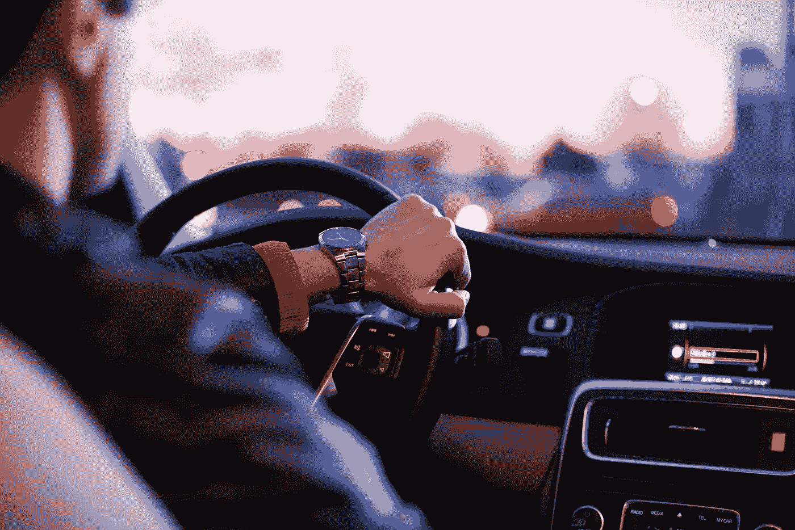

# 汽车上的激光雷达，自动驾驶的下一步？

> 原文：<https://medium.com/nerd-for-tech/lidar-on-the-car-the-next-step-in-autonomous-driving-50e651c92e52?source=collection_archive---------0----------------------->

从 2021 年到 2030 年，自动驾驶进入了高速发展的黄金十年。

公开信息显示，到 2030 年，市场上将有 20%-25%的车辆具备高级驾驶辅助功能，类似于特斯拉的 NOA。

意味着每年将有 400-500 万辆的标准空间，市场潜力超乎想象。

## **掌握数据融合才能掌握未来**

**“在整个自动驾驶的黄金十年里，我们可以把汽车智能化的发展看成一个指数函数，先是平稳前行，然后突飞猛进，一飞冲天。**因此，前五年可以视为行业的关键转折点。无论是 OEM 厂商、激光雷达厂商，还是其他 R & D 厂商，都必须抓住这个成长期。

伴随这一轮反弹的，还有行业内对高层次数据融合的刚性需求，并且在不断增加。其中，利用激光雷达作为传感器，融合其他感知数据的路线，已经在 Robo -taxi、低速物流等 L4 场景中得到大规模验证和部署。然而，将高水平的自动驾驶应用到乘用车上仍有许多挑战。

**“目前行业内基于激光点云本身的目标感知和目标决策相关的算法还不够多，模型的精度和训练水平也不是很高。”李对说道。**

**其次，激光雷达还要与其他传感器、高精度地图、惯性导航进行相应的融合计算。**

对整个汽车行业来说是一个新的课题和命题。在技术的产品化方面，整个行业还有非常大的技术差距需要弥合。

为配合主机厂攻克乘用车量产难题，某科技公司此前进行了一系列基于激光点云的融合感知能力的实践，开发了多项点云算法。形成了量产的融合感知解决方案，实现多通道视觉的融合感知，包括环境感知、态势感知、行为预测。

## **融合感知是无人驾驶的关键步骤，也是目前研究最多的课题。**

该公司将使用融合感知算法融合视觉、点云、毫米波的原始数据进行计算，然后进行 3D 跟踪，输出更准确、更完整的感知结果。同时，借助高精地图和路端全局样本，可以准确预测交通参与者的行为轨迹。

“然而，多传感器融合面临的最大技术难点是实现时间和空间的同步。”一位工程师介绍。

很多实践经验表明，无论是针对开放、半开放，还是封闭道路，无论是商用车还是乘用车，如果你想横向开放不同的场景，对全栈融合解决方案提供商的要求是非常高的，相当于满足每个业务场景的定制需求。

## 自动驾驶的产业化焦点

自动驾驶的主流算法模型主要基于有监督的深度学习。它是一种算法模型，推导出已知变量和因变量之间的函数关系。需要大量的结构化标记数据来训练和调整模型。

在此基础上，要想让自动驾驶汽车变得更加“智能”，形成可在不同垂直落地场景下复制的自动驾驶应用商业模式闭环，模型需要有海量、高质量的真实道路数据支撑。

## 2D-三维融合数据；

例如，为了开发自动驾驶汽车的多模型机器学习算法，一些制造商需要融合两个不同维度的不同数据集。这个操作很重要，但是手动执行很有挑战性。

AI 公司甚至希望数据公司能够更好的了解算法技术和需求场景，参与算法的研发，给出数据采集的优化建议。创造竞争优势也成为数据服务提供商关注的焦点。

## 常见的数据标注类型包括:

*   2D 包围盒
*   [车道标线](https://tinyurl.com/u7u4me)
*   [视频跟踪标注](http://tinyurl.com/wmu4yfhh)
*   点标注
*   [语义分割](https://tinyurl.com/48w576p7)
*   三维物体识别
*   3D 分割
*   传感器融合:传感器融合长方体/传感器融合分割/传感器融合长方体跟踪

# 结束

将你的数据标注任务外包给 [ByteBridge](https://tinyurl.com/2x2ha5xs) ，你可以更便宜更快的获得高质量的 ML 训练数据集！

*   无需信用卡的免费试用:您可以快速获得样品结果，检查输出，并直接向我们的项目经理反馈。
*   100%人工验证
*   透明和标准定价:[有明确的定价](https://www.bytebridge.io/#/?module=price)(包括人工成本)

为什么不试一试？

来源:https://baijiahao.baidu.com/s？id = 1720922581248065696 & wfr =蜘蛛&for=pc