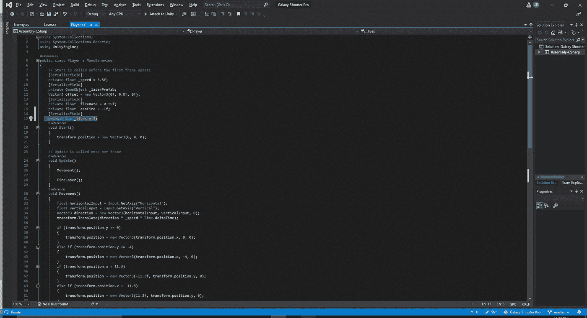
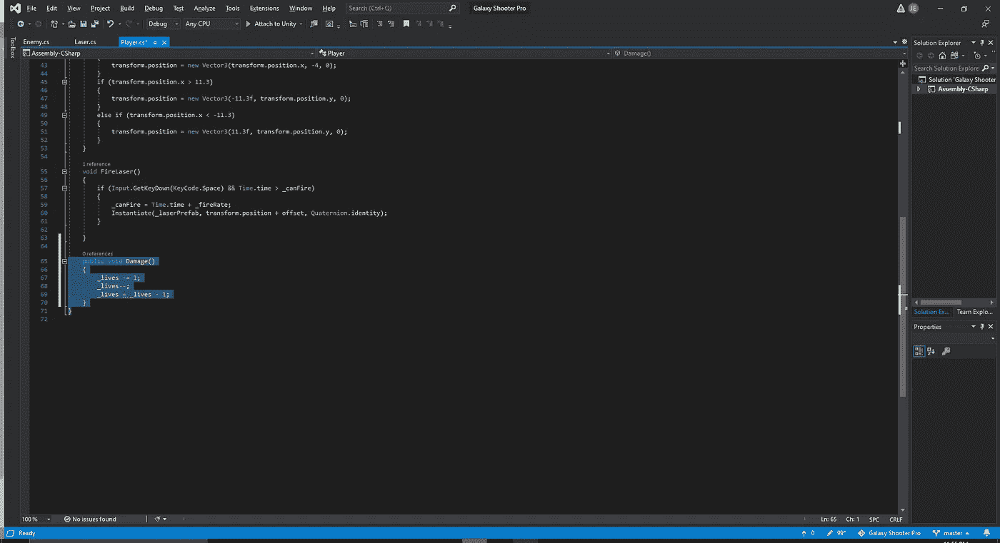
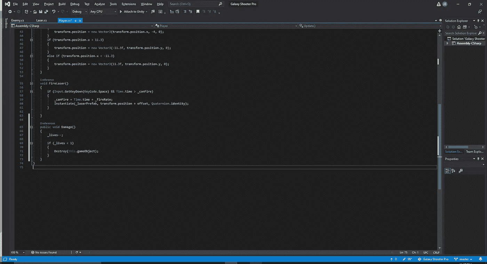
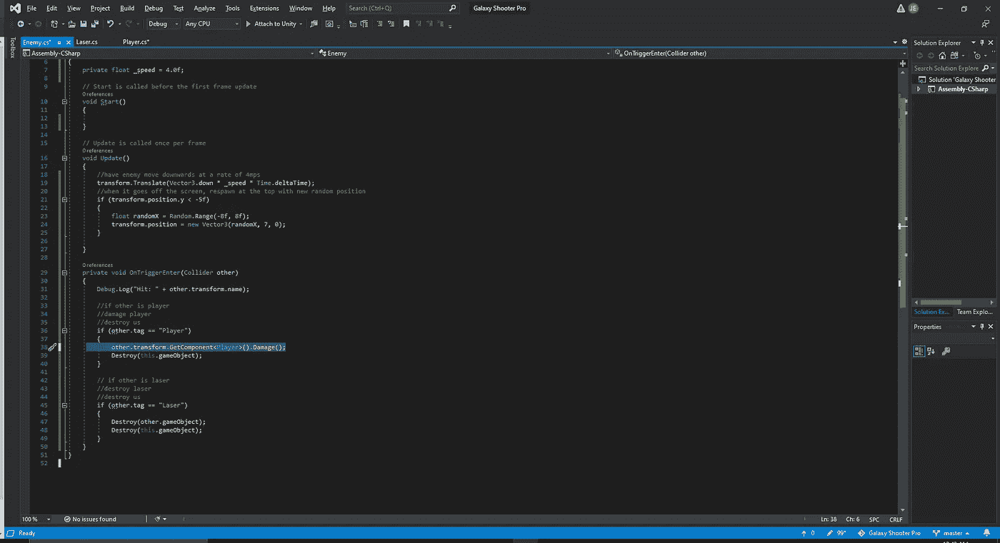
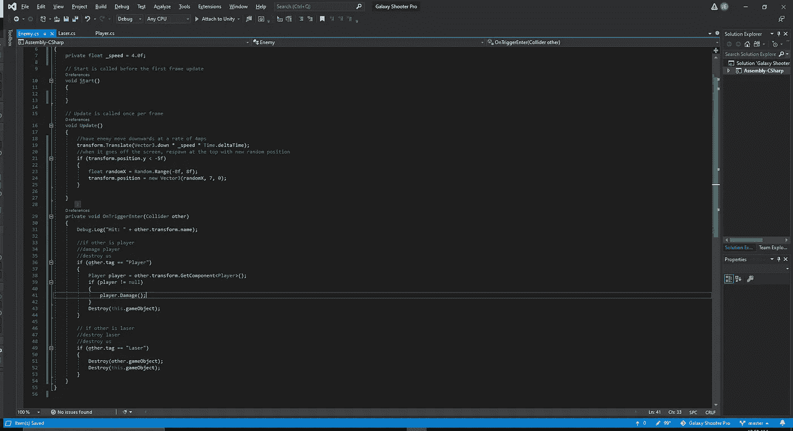
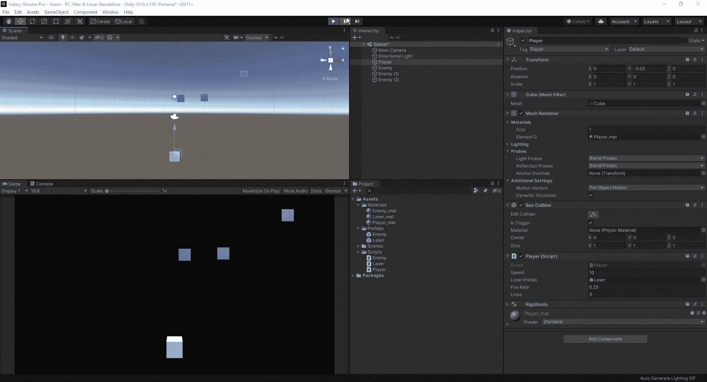
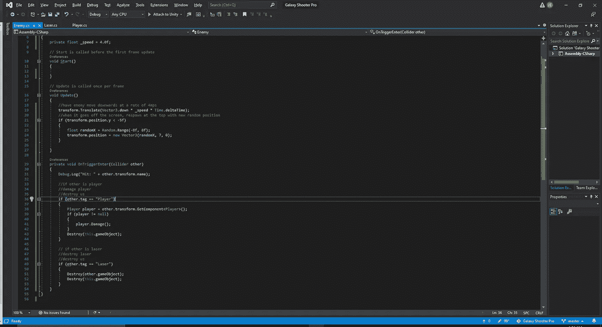
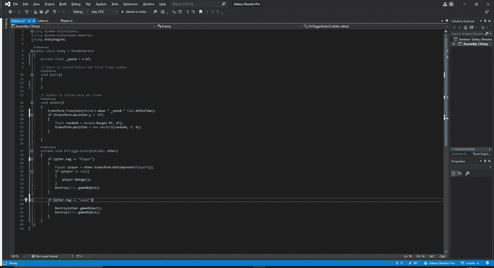

# 生命、死亡和获取组件

> 原文：<https://medium.com/nerd-for-tech/life-death-and-get-components-2749079140a7?source=collection_archive---------21----------------------->

现在，对于任何街机风格的游戏，我们需要的一个关键特征就是生命机制。否则，如果我们回到我们最喜欢的街机游戏，我们就不需要这些硬币了。我们要做的第一件事是查看我们的玩家脚本，并创建一个生活组件。

生活成分

一旦我们有了自己的私人生活，我们现在必须建立一个系统，这样当我们受到一些伤害时，我们就会失去一条生命。

正如我们在上面看到的，我们有几种不同的方法可以用来告诉 Unity 减去一条生命，最后，无论你选择哪一个都是非常好的。现在，我们将想写一些代码，让 Unity 知道一旦我们的生命达到 0，我们就被毁灭了。

现在来看一个稍微复杂一点的例子，脚本通信。对于一些较新的用途来说，这是一个稍微复杂一点的方法，以便让他们理解。

在这一行代码中，我们所做的是告诉 Unity 我们想从玩家脚本中获取组件，我们希望获取的组件是新制作的伤害组件。现在，当我们受到伤害时，我们会失去一条生命。然而，用这种方法写代码，有更大的机会发生一些错误。假设剧本没有上演，会发生什么:

脚本错误

如您所见，我们在控制台中得到一个 NullReference 错误。这是因为我们的单位没有设定玩家脚本，当敌人通过我们时，它根本不认识这个玩家。
如果我们像这样打出来:

零检验

这种方法将防止任何错误的发生，这将不会在游戏的用户端引起太多的问题。现在，如果我们把我们的脚本放回我们的玩家身上，再制造几个敌人，我们可以看到当我们被敌人击中 3 次时会发生什么:

玩家死亡

正如我们所看到的，我们现在有我们的生命系统按预期工作，当我们受到敌人 3 次攻击时，我们就会在游戏中死亡。

## 清除

现在，我们终于完成了游戏中的敌人部分，我们现在可以检查所有的注释，我们不需要它们，并确保一切看起来干净。

清理前

正如我们从上面看到的，我们有一些东西可以在脚本中清理。我们有一些不必要的注释，我们还有 debug.log，我们不再需要它了。

后期清理

现在我们已经完成了敌人脚本的构建，并且稍微清理了一下，我们可以开始为我们的敌人设计一个种子系统，这样我们就有源源不断的敌人可以射击了。