# 限制速度和界限

> 原文：<https://medium.com/nerd-for-tech/limit-speed-and-boundaries-5756cd579a8e?source=collection_archive---------17----------------------->

上次我们停下来，在快速看一下变量如何工作之前，我们设法让我们的玩家对象在屏幕上移动。然而，它会以极快的速度向右移动，或者向左移动，如果我们让它向左走的话。为了补救对象的速度，我们可以简单地输入“time.deltaTime”:

2 种不同的速度设置

至于“time.deltaTime”，它所做的是将速度的转换率从 60fps 变为 1fps。在 unity 中，移动 1 帧相当于每秒移动 1 米。它允许我们使用实时，因为它是从上一帧到当前帧的时间(以秒为单位)。

值之间的速度差

现在，假设我们想在 Unity 编辑器中调整速度，但不必在脚本中每次都改变它。我们所要做的就是将我们从变量练习中学到的东西应用到这里。

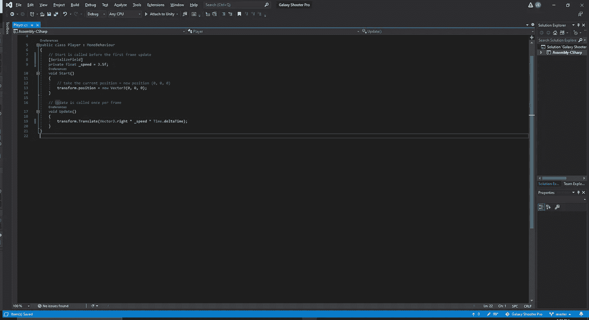

我们将它应用为私有浮点型，至于最佳实践，除非您需要将变量应用为公共变量，否则最好将变量应用为私有变量。然而，如果我们只是将它保持为私有，我们将无法在编辑器中进行调整。因此，我们将[SerializeField]放在它上面，让它显示在我们的编辑器中。

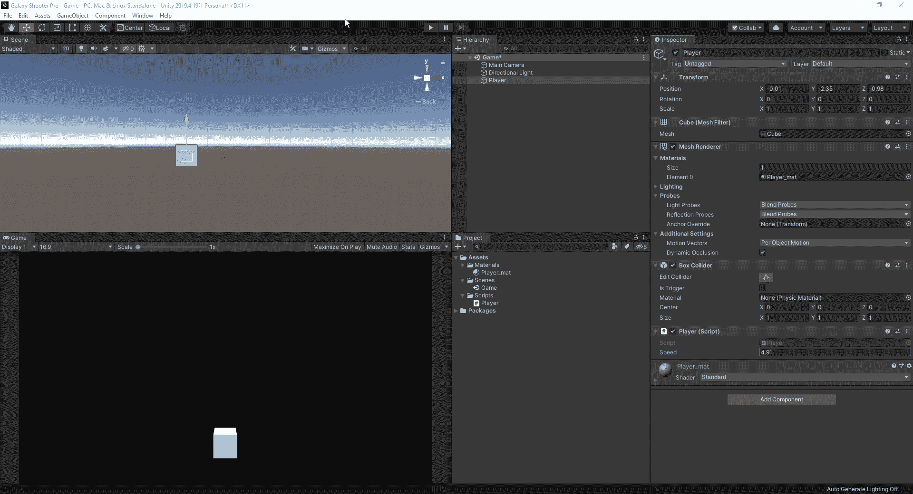

正如我们所看到的，在游戏进行的时候也可以调整我们的速度值，也可以变成负值向左移动。

## 应用用户控件

现在我们有了一个如何调整播放器速度的想法，让我们对它进行一些控制，以便我们可以在想要移动它的时候移动它。首先，我们可以进入 Unity 编辑器，看看已经设置了哪些不同的输入命令，或者如果我们想要一些不同的东西，可以对它们进行调整。

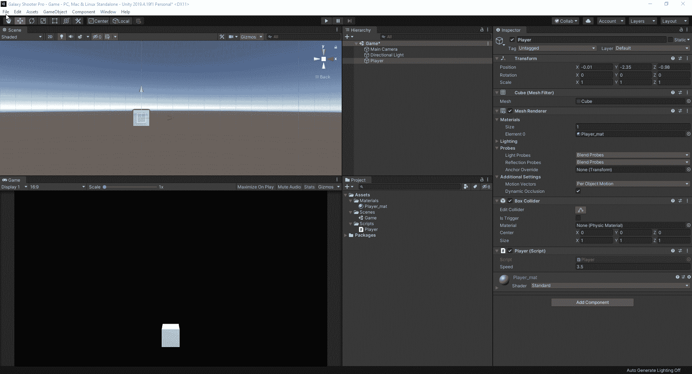

正如我们所见，默认设置是我们在任何游戏中使用的典型动作。从这里，我们可以进入我们的播放器脚本，并编写代码来设置它，以便播放器只在我们告诉它时移动。

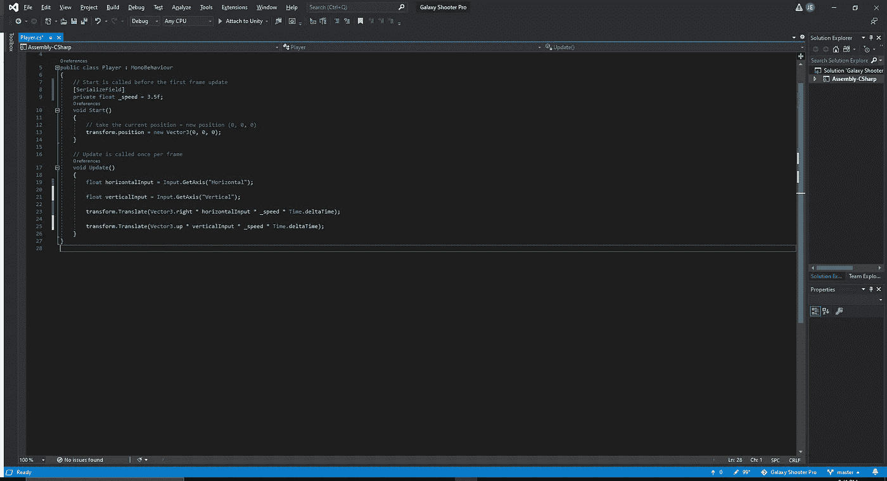

正如我们所看到的，我们在 Void Update 部分创建了一个浮动，用于水平和垂直移动。从这里，我们只需将它添加到我们的 right 代码行中，然后创建一个 up 代码行，现在我们可以按照我们认为合适的方式来控制我们的播放器。

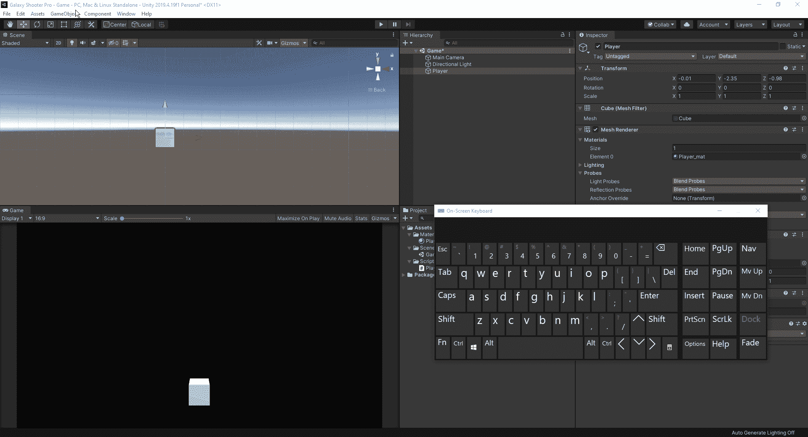

## 设定边界

现在，让我们来看看如何设置一些边界，这样当我们玩的时候，我们就可以一直在我们的摄像机视野内看到玩家。为了创建边界，我们首先需要搜索需要限制对象的位置。

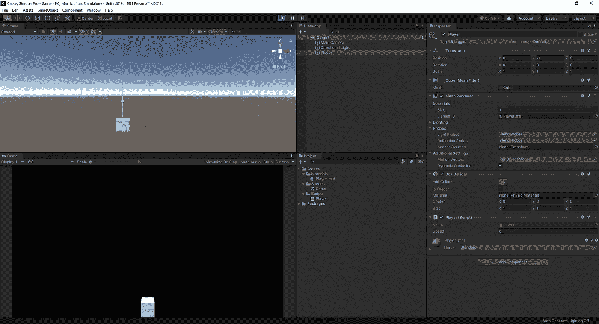

正如我们所看到的，如果 y 轴基数设置为-4，对象仍然完全在屏幕上，所以我们将它设置为我们的下限。

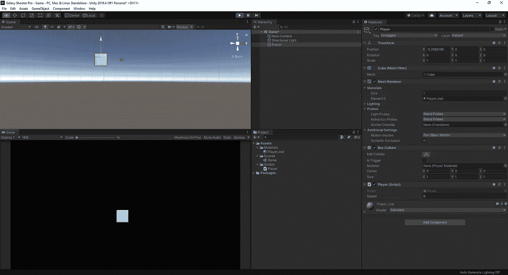

我们将 y 的上限设置为 0，因为我们不想让我们的球员在比赛场上移动太远。

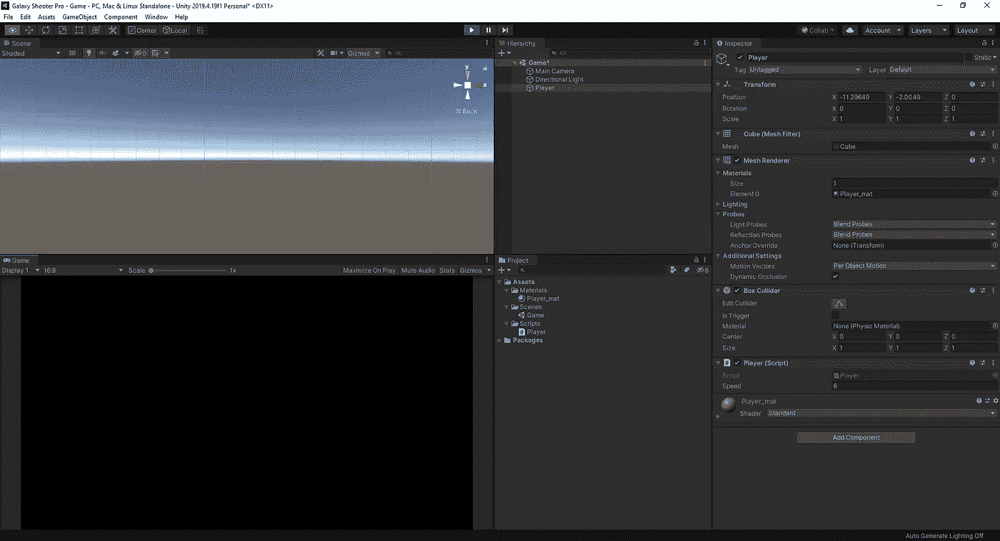

至于我们的 x 位置，我们将设置限制为 11.3 和-11.3，但是通过这些，我们可以设置一个循环效果，这样当我们通过这些限制时，我们将让我们的玩家出现在屏幕的另一侧。至于我们应该使用什么类型的变量代码，我们必须弄清楚我们的对象发生了什么。我们试图让我们的对象不能超越某些点，所以我们应该使用的最好的语句类型是 if()语句。这些将允许我们告诉 Unity，如果我们的对象到达某个点，那么我们希望特定的事情发生。

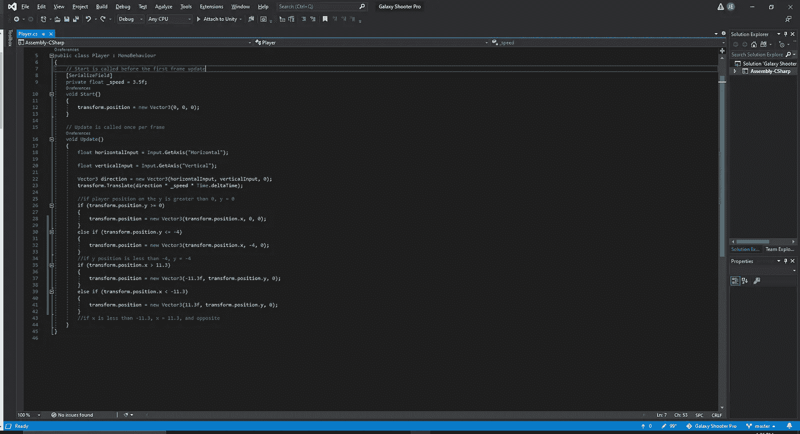

现在有了这些代码行，我们现在可以在我们的游戏中测试它，看看会发生什么。

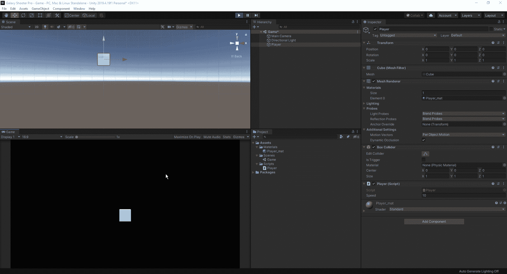

正如我们所见，y 的值不会低于-4，也不会高于 0。同样，当我们达到-11.3 或 11.3 的时候，我们就被切换到了游戏场的另一边。

## 清除

现在我们已经完成了脚本中的玩家运动部分，是时候稍微清理一下我们的脚本了，这样在将来，如果运动中出现任何问题，或者如果我们想做一些小的调整，我们可以参考它来简化我们的生活。

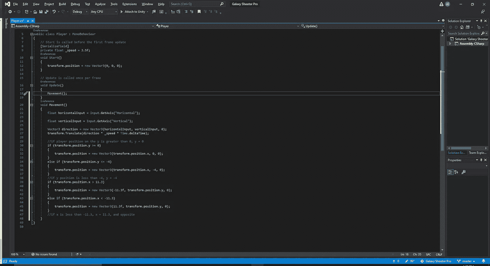

从上面我们可以看到，我们创建了一个新的空函数，并将其命名为 movement。然后，我们刚刚创建的所有东西都放入了那个 void，在我们的 void 更新中，我们现在要做的就是引用 Movement()方法。现在，我们可以在将来为我们的玩家做任何我们想做的事情，或者保持代码完整，这样如果出现错误，搜索特定的类别比搜索所有的代码行更容易。现在，我们留下的任何注释，如果我们知道每件事的意思，我们可以清除，因为它占用了我们代码的空间。现在，情况还不算太糟，但是如果我们有数百行甚至数千行的代码嵌入到某个东西中，所有多余的注释，主要只是用来作为我们任务的参考，会占用很多不必要的空间。

现在我们已经设置好了边界和玩家的移动，接下来我们将得到一些乐趣，弄清楚如何在适当的位置设置一些射击机制，而不是让我们的游戏充满无限的物体。