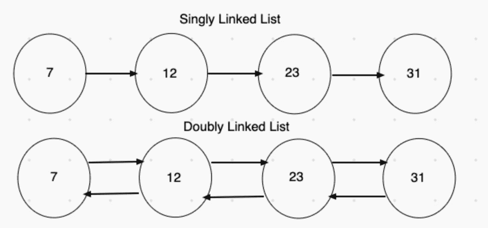
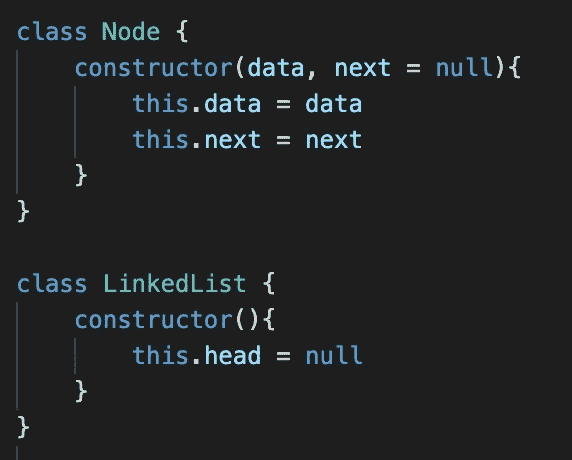
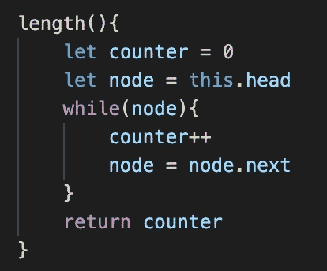
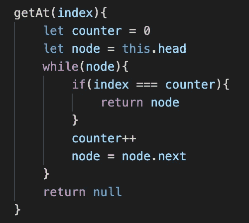
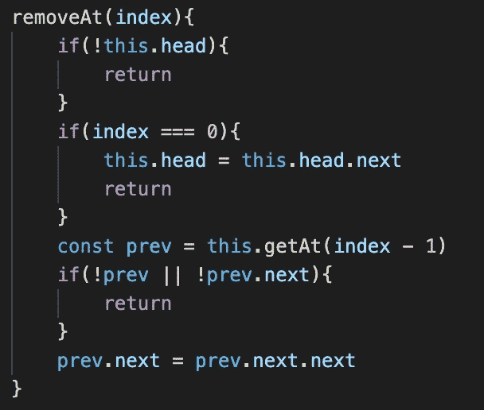

# 链接列表

> 原文：<https://medium.com/nerd-for-tech/linked-lists-72369461d53d?source=collection_archive---------20----------------------->

在编程中，有几种不同的数据结构，每种都有自己的优点和缺点。其中一种数据结构叫做链表，在链表中，有单向链表和双向链表。顾名思义，两者的区别在于单链表在两个单向的节点之间有一个链接。而双向链表在节点之间有两个链接，一个链接指向下一个节点，另一个链接指向前一个节点。下面是这两者之间的区别:

链表可以在任何编程语言中创建和使用。我将举例说明如何用 JavaScript 创建一个单链表。我们将创建一个链表类，我们可以向该类添加方法来处理我们的列表。但是首先，我们需要创建一个节点类来创建我们将在链表中使用的节点。创建的节点将用数据和下一个属性初始化。节点内的数据值，下一个节点是箭头指向的节点(如上图所示)。如果我们要创建一个双向链表，我们还需要一个 previous 属性。

在创建了节点类之后，我们可以创建链表类，它可以简单地用一个设置为 null 的头值来创建，并且不带任何参数。我们还可以选择将尾值设置为 null，将长度设置为零，或者在类中创建方法，调用这些方法来获取这些值。这里只是节点类和链表类，没有 JavaScript 中的任何方法。

现在这不是很有用，因为链表可以被创建，但是它是空的，没有方法向链表添加任何东西。我们可以添加一个方法，将一个节点插入到列表的开头。这个方法将数据作为参数，将头设置为新创建的节点，数据和前一个头作为下一个参数。在代码中，这将是:

现在我们可以使用这个方法向我们的列表中添加数据。我们还可以创建一个方法来找出关于列表的信息，比如列表的长度。为此，我们将创建一个从 0 开始的计数器变量，将 head 节点设置为一个可以更改的变量。然后在节点存在时使用 while 循环，在节点变量不为空时遍历链表，递增计数器并在节点为空时返回它。下面是编码出来的方法

与上面的代码非常相似，我们可以创建一个方法来查找特定索引处的节点。我们将使用相同的方法，并添加一个条件 if 语句来检查作为参数输入的索引是否等于我们的计数，以及何时返回该节点。

除了从列表中添加和获取信息，我们还需要能够从列表中删除节点。像第一个方法一样，我们可以使用 removeStart 从列表的开头移除，甚至使用 removeEnd 从列表的结尾移除。但是，我将在这里展示一个 removeAt 方法，它既能完成这两个任务，又能删除两者之间的任何索引。为此，我们检查了空列表或添加到列表开头(在索引 0 处)的边界情况。如果列表是空的，就没有要删除的东西，所以只需从这个方法中返回。如果我们从开始(索引为 0)移除，则将头部设置为头部之后的下一个节点。现在，在这些边缘情况(还有一个)之后，我们需要将我们要移除的节点的前一个节点存储在一个变量中，这样我们就可以将它的下一个节点设置为下一个节点(被移除的节点之后的节点)。我们可以使用之前的方法 getAt 来帮助我们获取之前的节点。最后一种情况是，如果输入的索引超出了列表的长度，我们可以从方法中返回，因为我们不能删除不存在的东西。和前面一样，这是这个方法的代码。

可以添加更多的方法来做不同的事情，这些只是一些有用的方法来帮助建立一个链表。

通过 Udemy 课程 [JavaScript 算法和数据结构大师班](https://www.udemy.com/course/js-algorithms-and-data-structures-masterclass/) & [掌握编码面试:数据结构+算法](https://www.udemy.com/course/master-the-coding-interview-data-structures-algorithms/)帮助我理解和使用链表。