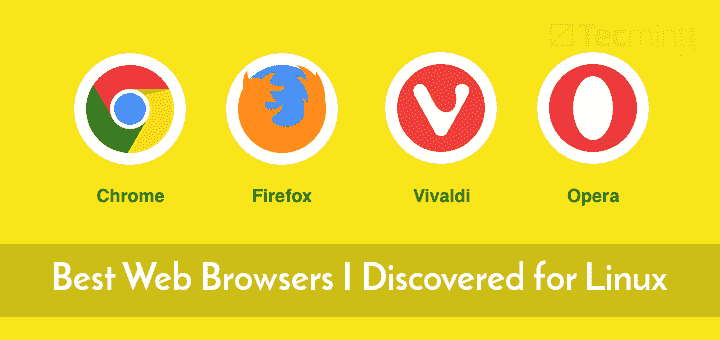
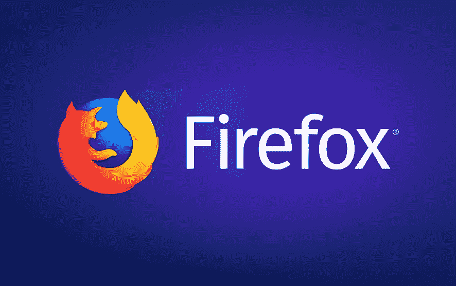
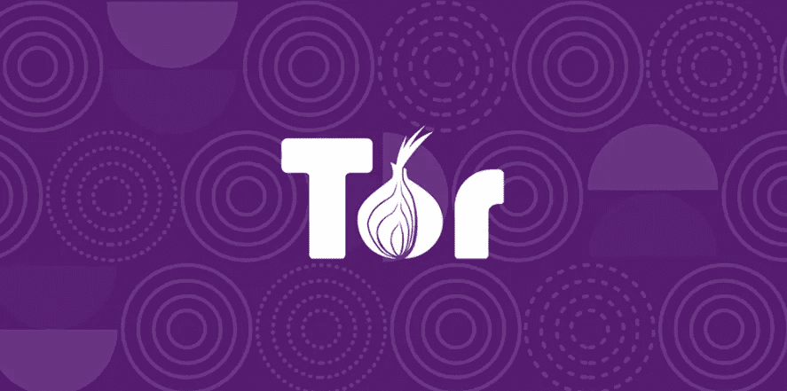
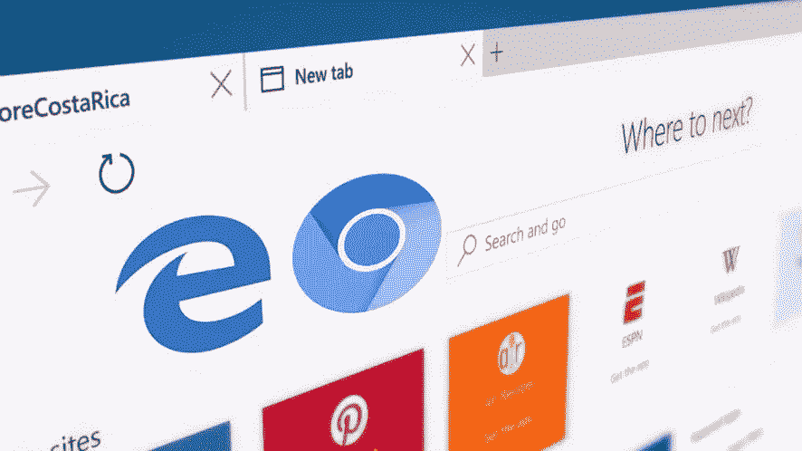
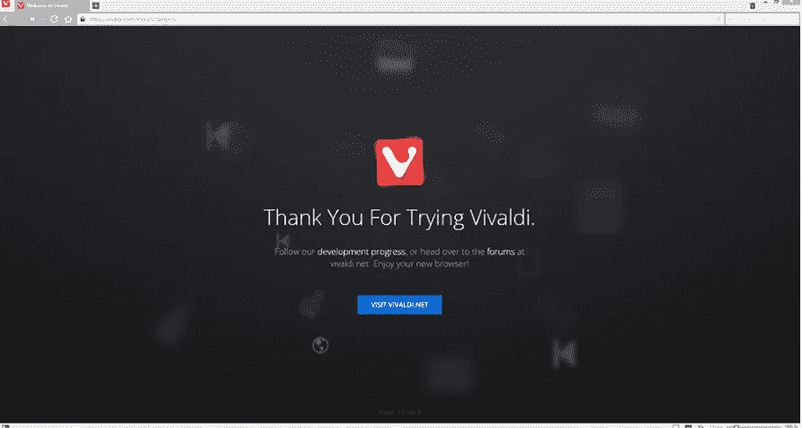
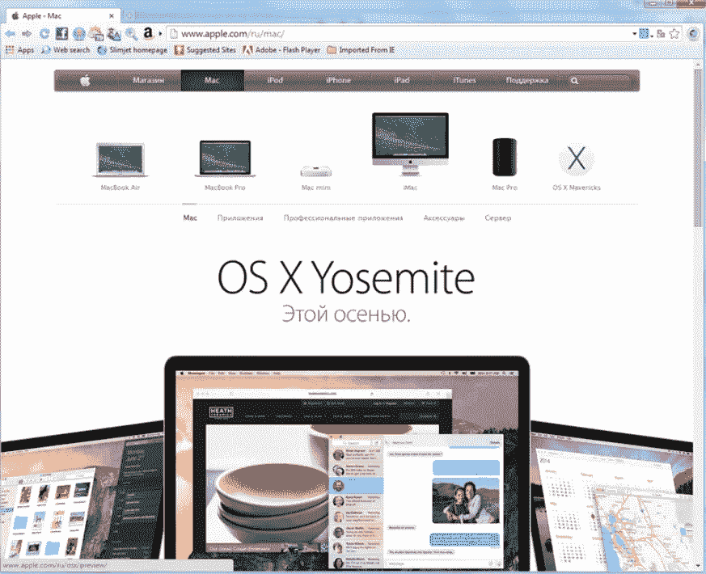
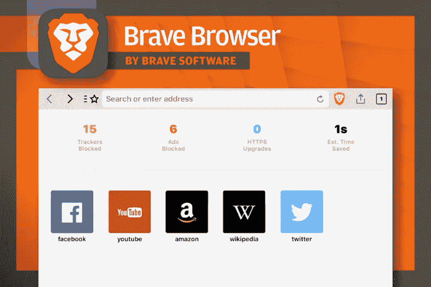
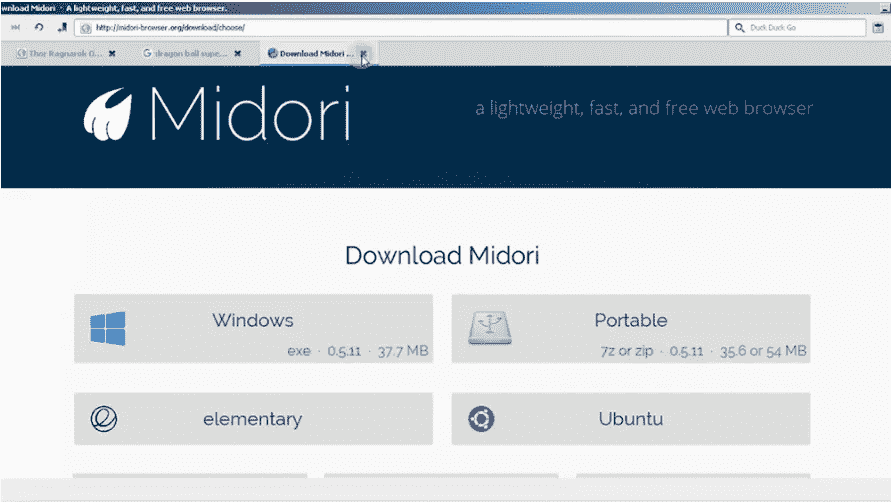
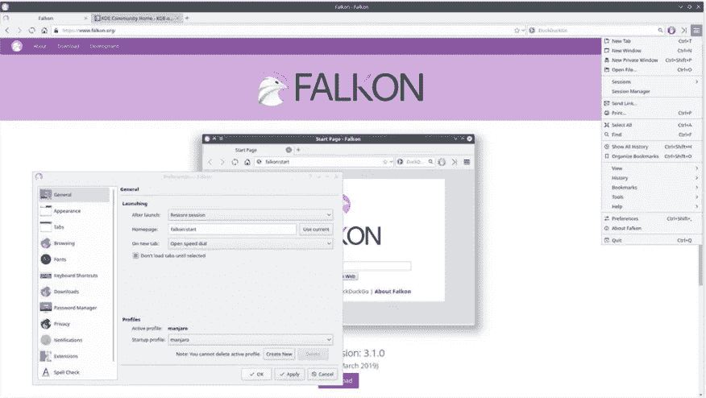
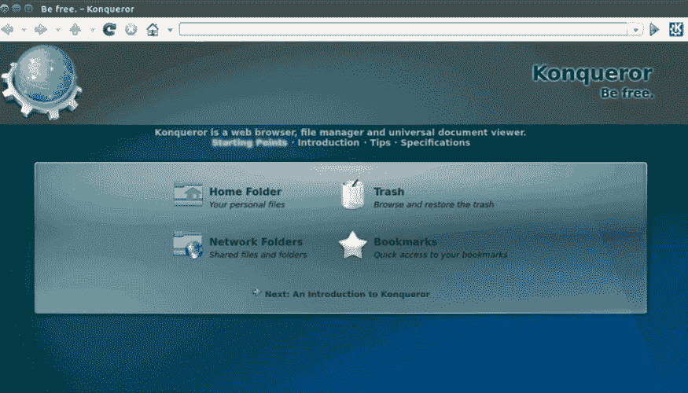

# Linux 浏览器:你应该尝试的 12 大浏览器|

> 原文：<https://medium.com/nerd-for-tech/linux-browsers-top-12-browsers-you-should-try-2731e2bef9a6?source=collection_archive---------22----------------------->

在 Linux 中，浏览器是联网的必要工具，今天你可以找到大量适用于不同操作系统的软件。尽管通常建立在相同的基础上，所有的网络浏览器都有功能和界面，允许它们执行其他任务。例如，一些人建议用户在访问互联网资源时保持匿名，并保护个人数据。

对于 Linux 系统，由于其特性，浏览器可以是控制台和图形。两者都是通过官方网站或其他可靠来源的安装文件安装的。

考虑一下 2020 年 Linux 上最好的图形界面浏览器。它们提供了一个网上冲浪的界面，让你在网上最舒适的旅行。那些对替代方案感兴趣的人正在等待选择在某些情况下使用的最佳控制台浏览器，例如，当不可能使用 X 服务器时。

如果在互联网出现之初，网站的内容是文本，图形元素和图片使用最少，那么控制台浏览器就足够了。现代 web 浏览器的技术时代已经成为支持视频、音频、图像和 flash 内容的标准。顶部包括 Ubuntu、Mint、Debian 和其他 Linux 系统最流行的浏览器。

Linux 操作系统的最佳浏览器，包括在许多默认发行版中，方便、安全、可靠。像 Linux 一样，Fairfox 也是开源的，为用户提供了充分的机会来定制他们自己的需求，并允许他们在网络上维护隐私。适合所有 Linux 家族。

**特性:**

Opera 适合在 Linux 环境下工作，是一个方便快捷的浏览器，具有众多的特性和大量的设置。该浏览器提供隐私，并允许您通过内置的 VPN 选项访问被阻止的资源。

**特色:**

*   安全冲浪；
*   VPN 功能
*   Turbo 模式，在网速较慢时加快页面加载速度；
*   广告阻断
*   方便、可定制的界面
*   支持扩展
*   同步数据以从任何设备访问数据
*   内置货币转换器
*   在其他窗口之上的窗口中显示视频
*   省电模式。

适用于所有 Linux 家族的最快的浏览器，具有简单和用户友好的界面，允许您快速加载页面并提供多种选项。由于适度的系统要求，谷歌浏览器适合安装在资源有限的电脑上。

**功能:**

最好的保持网络匿名的浏览器，提供隐私，隐藏电脑的位置和 IP 地址，让你访问任何互联网资源，不留痕迹。Thor 是一款基于 Mozilla Firefox 的开源浏览器。它阻止你通过使用分布在世界各地的服务器来跟踪用户的行为，而这些服务器的连接是不断变化的。传输的数据是加密的，在到达接收方之前要经过几个服务器，这使得追踪它们的路径变得不可能。

**特性:**

WebKit 引擎上的一个优秀的浏览器，具有开源和完整的功能。该浏览器提供安全的网上冲浪，并允许您查看不同的内容，无需刹车和悬停，速度快，可靠性高。Chromium 还有一个方便的界面，易于设置，并且可以与任何 Linux 修改一起工作。

**特色:**

另一个基于 Chromium 的浏览器，快速，方便，完全可定制，具有丰富的功能和直观的设计。歌剧创作者的维瓦尔第评论家没有重复哥哥，有他的风格和特点。该计划的中心部分是最灵活的界面和行为设置，这使您可以适应 Vivaldi 的要求。

**功能:**

*   方便、可定制的界面
*   支持主题
*   轨道保护
*   内置广告拦截
*   嵌入式笔记管理器
*   提示命令，鼠标手势管理，热键设置。

基于 Blink 引擎的快速且功能强大的 Linux 浏览器会自动阻止所有广告，无需任何插件或设置。网络浏览器安全稳定，提供多层保护。这是一个重新设计的开源 Chromium，它不会像 Chrome 一样向谷歌发送用户数据，并配备了先进的技术，可以防止数据跟踪和分析用户行为。

**功能:**

*   快速下载
*   防范网络钓鱼和恶意软件
*   自动广告拦截
*   加速下载管理器
*   在线视频上传者
*   自动填充 web 表单；
*   改善照片
*   鼠标手势支持
*   与社交网络的整合
*   支持插件和扩展。

Chromium 引擎上的安全浏览器允许您通过内置工具阻止广告和脚本，并确保用户隐私。该浏览器与 Linux Mint、Ubuntu 和其他 Linux 系统兼容。

**功能:**

一个基于 WebKit 的快速简单的 Linux 浏览器，在一些默认发行版中使用。该应用程序的界面很简单，美岛莉支持一套标准的选项，标签，添加标签的能力，保存和恢复会话，下载管理器和其他功能。由于其重量轻，可以安装，包括在弱设备上。

**功能:**

*   快速启动和加载页面
*   定制用户界面
*   广告阻断
*   文件下载管理器
*   在页面上查找文本并检查错误的功能；
*   鼠标手势控制
*   智能书签
*   通过可下载附件扩展功能，支持 Netscape 扩展。

一个优秀、简单、易用的开源浏览器，基于引擎 ztWebEngine 构建，以前称为 zupzilla。该软件具有相当不错的功能，相当于现代的网络浏览器。选项包括标签，书签，下载管理器，私人模式和其他功能，提供舒适的网络。

**特性:**

*   一个简单的界面，能够使用你的设计主题；
*   内置广告拦截器
*   私人模式
*   拼写检查工具
*   支持用户配置文件
*   设置浏览器标识
*   会话管理器
*   有用的扩展。

一个免费的网络浏览器和文件管理器，KDE 图形环境的一个重要组成部分，提供其他程序来查看不同的内容。该应用可在官方 Ubuntu 存储库中获得，可通过 Ubuntu 应用中心或终端安装。

**特色:**

*   浏览器和文件管理器的共生；
*   在 KHTML 和 WebKit 之间切换的能力
*   文件管理器被赋予了诸如复制、插入和其他标准特性的选项，并支持更多令人兴奋的特性，例如远程文件系统管理；
*   通过安装附加组件来扩展功能。

# Linux 控制台浏览器

有些专栏作家没有图形界面，但在某些情况下非常有用。今天可能需要控制台 web 浏览器，尽管它只显示文本内容而不显示图形，并且具有搜索或下载必要文件的基本功能。系统管理员经常使用这些工具来查看站点，因为服务器计算机通常不在 X 服务器上。

流行的文本浏览器示例:

大多数浏览器基于 Lynx 控制台浏览器，不支持 JavaScript、框架和表格。 *lynx* 团队运行终端，前提是它安装在电脑上，光标用于导航和分配给特定功能的几个基本功能。更好的链接版本有 JavaScript 和框架支持。w3m 程序类似于 Lynx，但在页面导航方式上有所不同，它是为 HTML 冲浪开发的。

控制台浏览器是相关的，因为在操作系统中缺少图形外壳，这对于许多类 UNIX 系统来说是典型的。