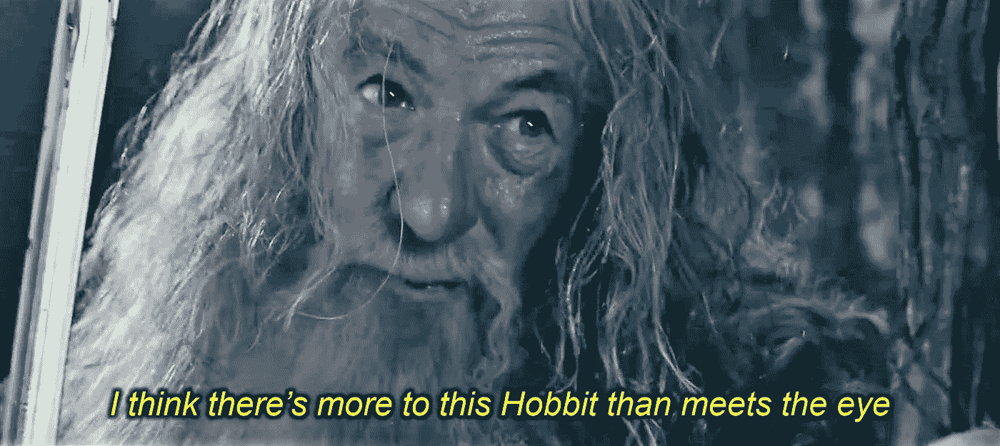

# Linux/UNIX 链接及其类型

> 原文：<https://medium.com/nerd-for-tech/linux-unix-links-and-its-types-ad7a67f16531?source=collection_archive---------9----------------------->

# Linux 中的链接是什么？

Linux 中的链接是指向文件或目录的指针。

# 在 linux 中我们什么时候使用链接？

还有很多例子，我们将在本文中进一步讨论，但目前的一些用途是创建一个方便的路径，到一个深埋在文件层次结构中的目录；链接的其他用途包括:

*   链接库
*   确保文件在固定的位置(不必移动原件)
*   在多个位置保存单个文件的“副本”

# 等等，它们和“捷径”一样吗？🧐

在某种程度上，是的…但是就像甘道夫说的



让我解释一下。比方说，你有一个外置驱动器，连接到你的 Windows 机器上。在那个驱动器上有一个叫做家庭作业的文件夹😛。如果您在桌面上创建目录的快捷方式，当您单击打开快捷方式时，您的文件管理器将打开您的外部驱动器上的音乐目录。

现在，假设您将该驱动程序连接到一台 Linux 机器上。该驱动器被安装为说，*/数据*，并且在该驱动器上是文件夹作业。您在您的主目录中创建了一个指向该位置的链接——这样您就有了一个从*~/作业*指向*/数据/作业*的链接。如果你在你的主目录中打开快捷方式，它会在*~/作业*中打开文件管理器，而不是*/数据/作业*。您在*~/作业*中所做的任何更改都会自动反映到/数据/作业中。这就是最大的不同。

# 链接的类型


在 Linux 中，有两种不同类型的链接:

*   硬链接
*   符号链接

# 硬链接

只能链接到文件(而不是目录)

无法引用不同磁盘或卷上的文件，并且它们引用与原始源相同的信息节点。

即使原始文件被删除，硬链接也将继续保持可用。

创建硬链接的命令是:

```
$ ln  [original filename] [link name]
```

# 符号链接或符号链接

可以链接到目录

引用不同磁盘或卷上的文件/文件夹

如果原始位置被删除，将作为断开(不可用)的链接存在

引用抽象文件名和目录(相对于物理位置)，并被赋予它们自己唯一的 inode。

*   创建软链接的命令是:

```
$ ln  -s [original filename] [link name]
```

硬链接创建和符号链接创建的主要区别在于您使用了 *-s* 选项。

**什么是 inode 你问**，一个 **inode** 是一个数据结构，在 Linux 中存储了一个文件的各种信息，比如访问模式(读、写、执行权限)、所有权、文件类型、文件大小、组、链接数量等。每个 inode 由一个整数标识。创建文件时，会为文件分配一个信息节点

值得注意的一件有趣的事情是不同类型的链接是如何对待 inodes 的。硬链接的索引节点是相同的，而符号链接的索引节点是不同的。这可以通过移除符号链接的原始位置来进一步说明。当你这样做的时候，软链接消失了(尽管损坏的引用链接文件仍然存在)。为什么？符号链接指向的引用 inode 不再存在。

与硬链接不同，如果您删除原始文件或目录，符号链接将会保留，但是现在它将被视为断开的链接，并且将不可用。请记住，有了硬链接，你可以删除原来的链接将会保留，仍然是可用的。

# 这就是这篇文章的全部内容，如果你读到这里的话…

