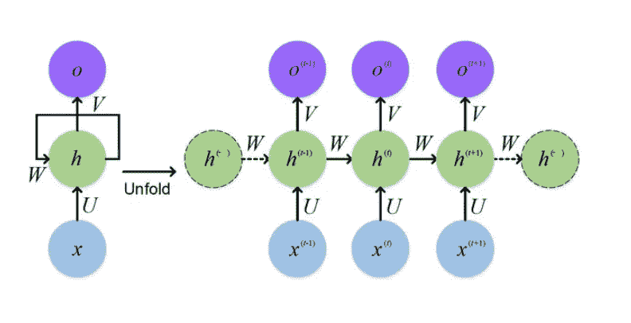
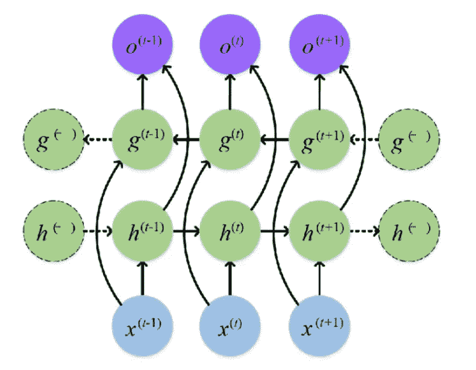

# “递归神经网络评论报告”的文献研究

> 原文：<https://medium.com/nerd-for-tech/literature-study-on-critical-report-on-recurrent-neural-network-6cafb6a8446e?source=collection_archive---------1----------------------->

这里介绍的文献摘自加州大学圣地亚哥分校的 Zachary C. Lipton 撰写的“对用于序列学习的递归神经网络的评论”。本文的目的是给出关于递归神经网络的精确信息，包括 RNN 的详细结构及其在顺序学习中的应用，并提及自从该模型首次引入以来在该领域发生的重大变化。并讨论了与 RNN 相比隐马尔可夫模型的缺点。首先，已经开发了 RNNs 来处理具有可变长度输入数据流的时态数据。不仅如此，它们还包含一个存储单元，用于在处理输出之前，通过一个隐藏层来记住之前输入的内容。递归神经网络可用于四种不同的应用。它们处理每个输入数据的输出，处理多个输入以生成单个输出，处理单个输入以生成数据序列，最后处理多个输入以生成数据流。其次，RNN 的隐藏层可以存储超过 2N 个不同的状态，这取决于馈送到每个节点的数据类型，这有助于有效地存储状态的所有可能结果，这是隐藏马尔可夫模型的一个限制。尽管 HMM 和 RNN 都能够处理顺序数据，但是随着存储过去输入的状态和上下文窗口的数量增加，HMM 面临时间复杂性。由于 RNN 的这些有效实现，顺序学习中的预测变得更加容易，这是并行计算的一个小功劳。在这里，该论文进入其实际应用，首先纠正 RNN 的问题，后来，不同的出版物如何提出他们的想法，通过提出不同的建筑设计来解决实际问题。但是本文在考虑其他 RNN 模型以及本文提出的模型方面落后了。此外，选择这篇文献综述的原因是，通过这篇论文，即使没有任何特定的途径，也可以获得许多关于 RNN 的信息。引用有助于确定 RNN 的重大发展和众多的应用。例如，它在医疗保健领域应用的主要成就，帮助拯救了全世界许多人的生命。

***工作总结、成果和发现:***

递归神经网络[RNN]在处理具有非固定输入向量的时态数据方面取得了成功，但后来所有神经网络都开始面临反向传播过程中出现的消失梯度问题。为了解决这个问题，已经开发了两种模型:长期短期记忆模型(LSTM)和双向递归神经网络(BRNN)。

长期-短期记忆模型

双向递归神经网络模型

文献用合适的流程图清楚地解释了 LSTM 和 BRNN 的设计，但是没有给出它们的性能评价。通过使用两个不同的分数来计算性能，其中一个分数依赖于精度(BLEU)，另一个分数依赖于 F1 分数(METEOR)。并且 BLEU 分数完全基于人类的决定，所以没有任何有效的理由让这个分数尽可能高会产生实际的结果。另一方面，根据该论文，f1 得分度量给出了丰硕的结果，但是与 BLEU 得分相比，它是一种有点复杂的方法。此外，文中还提到了 RNNs 与其他机器学习或深度学习模型的联合实现，并给出了参考文献。并且没有任何概念无法解释来理解这篇论文，这有助于在没有任何关于神经网络的先验知识的情况下理解 RNN。《循环神经网络:LSTM 细胞和网络结构》一文有助于更好地理解 LSTM，以及使用 LSTM 开发的各种模型，其中包括一个由 BRNN 和 LSTM 联合开发的模型。最后，由于这篇论文中没有发表任何结果，这使人们在下任何结论之前有点怀疑。但是在这个领域的其他公开发表的文章的帮助下，据说 RNNs 在理解和预测序列数据的输出方面更胜一筹。通过研究“递归神经网络的最新进展”这篇论文，我们了解了 RNN 的当前趋势以及不同的建模和它们的性能指标。总的来说，本文介绍了各种思想，并介绍了针对特定问题实现的设计。论文提到了 Andrej Karpathy 的工作，他是少数几个在它首次出现几十年后，在 RNN 开始并继续他的工作的科学家之一。可以推断:自那时以来，已经进行了许多研究。从研究结果来看，可以说没有递归架构就无法设计递归神经网络，基于这种方法开发了各种模型。

***论文利弊:***

论文开始设计递归神经网络，首先强调构建复杂 RNN 的基本块及其在现实世界中的当前应用。有趣的是，这篇论文描述了四种现实世界应用中的两种，并有清晰的解释，但缺乏一对一和多对一问题及其应用[麻省理工学院讲座系列…]，此外，尽管这篇论文是关于序列学习的 RNN，但它涉及的是论文中提到的 RNN，并且只关注其应用。从这个角度来看，它缺乏现代 RNN 模型及其在更广泛研究领域的应用。不仅如此，该论文还没有提到 RNN 在长序列建模中的局限性，因为隐藏层激活函数不能是 sigma 或 tanh 函数，因为它很难处理。此外，该论文概述了 RNN 和其他机器学习/深度学习算法的混合建模的潜在用途，但没有关于它的深入知识。最后，仅针对 HMM 对 RNN 进行了比较评估。该论文没有概述 RNN 与其他神经网络的性能评估，甚至缺少 RNN 在图像特征提取中的缺点。引起反对的原因是这篇论文已经发表了一段时间，那时 RNNs 获得了它们最早的声望。自那以后，人们在这一领域投入了巨大的努力，并进行了大量尖端研究。这篇论文中没有任何明显的空白，这使得人们无法理解这些概念。

***潜在晋升及未来工作:***

部署 RNN 和强化学习可能会对时态数据分析实现更可靠的预测产生重大影响。通过这种方式，将 RNN 与其他算法相结合，可以在更广的范围内使用 RNN，从而消除它们在该领域的缺点，并反过来提高模型性能。递归神经网络架构仍然可以优化，就像 LSTM 的 GRU 一样，它仍然可以与具有简单 RNN 结构的 LSTMs 一样好地执行，因此计算障碍不会成为问题。在从图像中提取特征方面，CNN 优于 RNN，这是 RNNs 的一个潜在问题，因此为了纠正这个问题，可以将两个模型结合起来，并应用于形成许多新的应用。RNNs 有助于持续研究基因模式，以检测任何可能影响未来的后续变化。癌症一直是有史以来最致命的疾病之一，RNNs 在预测之前是有用的，并尽可能地将影响最小化，但在某些情况下癌症的原因尚未得到证实，RNNs 可能有助于找到这些异常的癌症的正确原因。但是，即使有了所有这些应用，由于用于处理数据的高计算网络，RNNs 的使用也受到了限制，因为循环的细胞结构，解决这个问题将是 RNN 最大的成就之一。