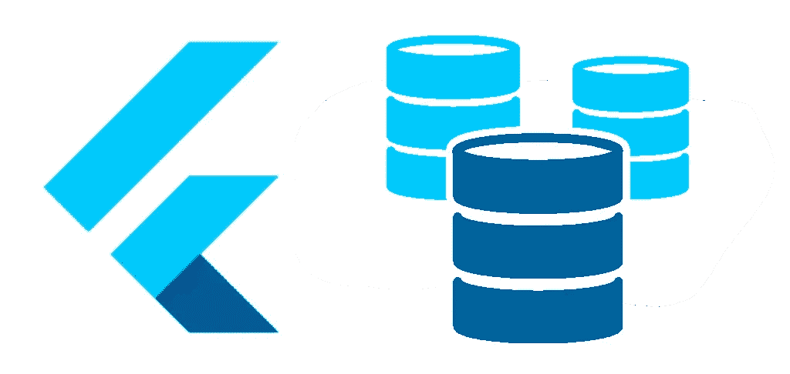

# 颤振中的本地数据库

> 原文：<https://medium.com/nerd-for-tech/local-database-in-flutter-93f1d15abc9a?source=collection_archive---------1----------------------->

如今所有的移动应用都围绕着数据。根据使用情况，有些存储在云中，有些存储在本地。为了提供对应用程序的离线访问，有必要将数据存储在本地数据库中。



在本文中，我们将使用 Flutter 作为我们的框架，并了解数据的本地存储。它是 Google 最流行的跨平台移动应用程序开发框架之一。它支持各种各样的包和插件，这使得开发过程更容易和更快。今天，我们将了解两个支持本地存储的产品包。

要存储像数字/字符串/布尔值这样的小数据，可以使用共享首选项。为了存储更大的数据，我们可以创建表，并使用 sqflite 包下的 sql 查询来查询它们。我们将首先浏览共享首选项包。因此，要使用它，我们需要将它添加到我们的 **pubspec.yaml** 文件中:

```
shared_preferences: ^2.0.6
```

现在快跑

```
Flutter pub get 
```

更新项目，我们的共享首选项就可以使用了。要在我们的 dart 文件中使用它，我们需要首先导入它:

```
import ‘package:shared_preferences/shared_preferences.dart’;
```

我们可以对变量进行两个基本的读写操作。在此之前，我们创建一个 sharedPreferences 实例:

```
final prefs = await SharedPreferences.getInstance();
```

现在，在我们读取变量之前，我们需要检查它是否存在于本地存储中。为此，我们使用 containsKey 方法，该方法返回一个布尔值，

```
bool doesExist = prefs.containsKey(‘VariableName');
```

为了读取一个变量，我们使用 get 方法。要读 int，就是 getInt。对于 string 是 getString，对于 bool 是 getBool:

```
myVariable = prefs.getString(‘variableName’);
```

要写一个变量，我们使用 set 方法。对于 int，它是 setInt，类似地，对于 string，它是 setString，对于 bool，它是 setBool:

```
prefs.setString(‘variableName’, ‘newValue’);
```

这不是简单、容易和方便吗！！！共享偏好设置主要用于存储当前用户的用户名，以便于访问。基于您的应用程序需求，它可以有多种实现方式。

现在我们来看看 sqflite 包，它允许我们创建表并使用 sql 查询来查询它们。让我们把它添加到 **pubspec.yaml** :

```
sqflite: ^2.0.0+3
```

现在导入 sqflite 包:

```
import ‘package:sqflite/sqflite.dart’;
```

Sqflite 支持许多查询，如创建、插入、查询、更新、删除。我们将一个一个来看。但在此之前，我们将初始化数据库并创建它的实例。当我们打开数据库时，我们需要指定它的路径，这是使用路径包的 join 方法来完成的。onCreate 参数用于传递第一次初始化数据库时将执行的函数，即表不存在，我们必须创建它们。通常，创建和插入查询在 onCreate 参数中传递:

```
database = await openDatabase( join(await getDatabasesPath(), 'databaseName.db'),

      onCreate: (db, version){ }, version: 1,);
```

为了初始化我们的数据库，我们将编写“创建表格”函数，它将为我们创建表格的结构。为了创建这个表，我们使用数据库实例 db 的 execute 方法。您将需要 SQL 的基本知识来编写自己的查询。在这里，我们创建的表将 name 作为一个参数传递，参数是 name、age 和 address:`

```
void createTable(var TableName) async { final db = await database; await db.execute(‘create table ‘ + TableName + ‘ (name varchar, age int, address varchar);’);}
```

接下来是在我们的表中插入值，这是使用 insert 方法完成的。我们以映射的形式指定所有列的值:

```
void insertValues(var TableName, var name, var age, var address) async { final db = await database; db.insert(TableName, { ‘name’: name, ‘age’: age, ‘address’: address, });}
```

现在让我们看看查询数据库的方法，我们可以使用“Select * from TableName”查询获得表中所有行的数据，结果可以存储在变量中，并使用 for 循环进行迭代。或者我们也可以直接将结果存储在地图中。在下面的函数中，我只是打印数据。您可以根据自己的需求，以地图/列表的形式存储和返回:

```
void getTableData(var TableName) async { final db = await database; var res = await db.rawQuery(‘Select * from ‘ + TableName); for (var i = 0; i < res.length; i++) { print(res[i]['name'] + res[i]['age'] + res[i]['address']); }}
```

我们还可以在 sql 语句中使用“where”来执行条件查询。为了更新表中的任何值，我们使用 update 方法并指定列名，使用 where 下传递的参数搜索所需的行。在下面的查询中，我们将更新姓名作为参数传递给函数的人的年龄:

```
void updateValues(var TableName, var NewAge, var name) async { final db = await database; db.update(TableName, {'age': NewAge}, where: "name = ? ", whereArgs: [name]);}
```

原来如此！！！现在，我们可以处理数据并将其存储在本地数据库中，从而轻松地提供对应用程序的离线访问。我希望这是有益的。点击这里查看我以前写的关于有趣编程的文章。敬请关注更多此类文章:)