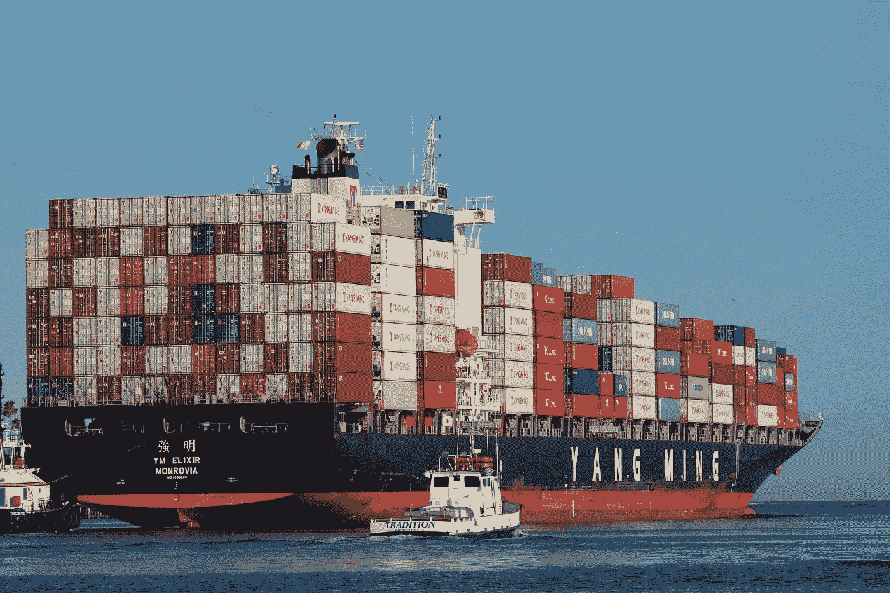

# 看码头，没有发行

> 原文：<https://medium.com/nerd-for-tech/look-docker-no-distro-5dc87d4deb00?source=collection_archive---------2----------------------->

*这是四篇系列文章中的第二篇，尽量减少&保护 Docker 图像。查看该系列的其他文章:
1。* [*变大。dockerignore，更小的 Docker 图片*](/nerd-for-tech/bigger-dockerignore-smaller-docker-images-49fa22e51c7) *2。* [*看 Docker，No Distro*](/nerd-for-tech/look-docker-no-distro-5dc87d4deb00)

使用 Docker 时，(图像)大小很重要。较小的映像大小允许我们在保持较小磁盘大小的同时，加速和编排几十到几百个容器。较小的图像大小也减少了容器的攻击面，保护了应用程序和数据。通过减小磁盘大小和攻击面，我们节省了资金。因此，通过缩小 Docker 图像尺寸，我们降低了成本。



这是四篇系列文章中的第二篇。让我们设定一些期望。对于这篇文章，我们假设你已经熟悉了`.dockerignore`。尽管我们将使用`.dockerignore`，但我们不会花太多时间关注它。如果你想深入了解`.dockerignore`，可以看看我之前的文章。相反，我们将专注于减少无发行版映像的基本映像大小，删除不必要的依赖项，以及多阶段构建。在下一篇文章中，我们将深入探讨如何保护 Docker 图像和 Docker 文件。就目前而言，简单地缩小图像大小(进而缩小攻击面)将使我们朝着提高安全性的方向前进。

# 🦹小发行版拯救世界

通过指定标签版本`golang:1.16`或通过拉最新版本`golang`来拉 Docker 图像将产生与`golang:1.16-buster`相同的结果。如你所见，这三个都共享了`b09f7387a719`的图像 ID。Buster 是 Debian 最新稳定版本 10.9 的代号。除非你特别需要这个图像，在大多数情况下它是不必要的。一个更好的选择，Alpine，是一个较小的 Linux 发行版，用作基本映像。

Alpine Golang 图像的重量为`302MB`，而 Debian 图像的重量是它的 2.85 倍。我们已经可以使用相同的磁盘空间运行和编排 2.85 倍多的容器。

使用 [Snyk](https://synk.io) ，我们可以扫描 Docker 图像寻找漏洞。`golang:1.16-debian`有 [164 个已知漏洞，其中 14 个为高严重性](https://snyk.io/test/docker/golang%3A1.16-buster)。相比之下，`golang:1.16-alpine` Docker 镜像有 [0 个已知漏洞](https://snyk.io/test/docker/golang%3A1.16-alpine)。然而，这仅仅是开始。

问题是我们看问题的角度不对。如果我们的目标是减少图像大小，为什么我们要寻找越来越小的发行版？我们发现的任何发行版都必然会有我们不需要的包。这些软件包占用了磁盘空间，当然也有它们自己的漏洞。相反，我们应该从头开始建立形象。就像一个老爷车爱好者一样，他确切地知道他的车里有什么，我们将建立我们的 Docker 图像，确切地知道里面有什么。


# 🔧该项目

我们将构建的展示小型 Docker 图像的应用程序将是一个简单的 API，只有一条路线。对`/`路由的`GET`请求将对进行 API 调用，以获取用户的 IP 地址、ISP 和位置数据，包括用户的纬度和经度，精确到百万分之一。所有这些数据都将被返回。

如果您想下载代码并亲自试用，您需要从以下网址注册一个免费的 API 密匙:

```
[https://geo.ipify.org](https://geo.ipify.org/)/
```

每种语言的存储库链接如下:

*   🐀[戈朗](https://github.com/starlightromero/distroless-go-ip)
*   🚮 [JavaScript](https://github.com/starlightromero/distroless-node-ip)
*   🐍 [Python](https://github.com/starlightromero/distroless-python-ip)

# 🏎️从零开始

Scratch 是 Docker 容器最精简的版本。除了您添加到其中的可执行二进制文件之外，Scratch 中不包含任何内容。它没有外壳，没有多余的东西。

## 戈朗

由于 Golang 是一种编译语言，我们可以在多阶段构建中使用一个临时基础映像。我们还将以各种其他方式构建 Golang 版本的应用程序:

*   巴斯特单级制造
*   巴斯特多阶段建造
*   阿尔卑斯单阶段建造
*   阿尔卑斯多阶段建筑
*   分布式多阶段构建

## 单级与多级

你可能见过这样的 docker 文件…

```
FROM ...
WORKDIR ...
COPY ...
CMD ...
```

然而，多阶段构建允许我们通过有选择地将工件从一个基础图像复制到另一个基础图像来优化和减小图像的大小。当我们分析上面链接的不同回购的 docker 文件时，您可以在下面看到一些多阶段构建的示例。

下面链接的文章深入探讨了多阶段构建。我的构建从未如此极端，但我可以看到它的用例。

[](/capital-one-tech/multi-stage-builds-and-dockerfile-b5866d9e2f84) [## 使用多阶段构建来简化和标准化构建过程

### 使用本机 Dockerfile 工具向左移动信息并加快交付速度

medium.com](/capital-one-tech/multi-stage-builds-and-dockerfile-b5866d9e2f84) 

从上面链接的文章中摘录的一小段内容提供了一个很好的解释:

> 多阶段构建允许您将需要单独 docker 文件的构建、测试和运行时环境分开。它们允许您最小化您部署的最终 Docker 容器的实际大小，因为各种层不再存储在最终容器中。

## 刮痕的缺点

使用临时图像有一个明显的缺点；它们只适用于编译语言，在编译语言中，代码可以被编译成二进制，然后被执行。对于包括 JavaScript 和 Python 在内的许多语言来说，它们是被解释的而不是被编译的 T2，一个临时映像是不起作用的。暂存映像的容器将不能执行代码，因为它不是机器可读的代码，因此需要解释器。然而，如前所述，临时映像没有解释器，它是一个空容器。

## 刮刮乐的替代品

对于不是用编译语言编写的程序来说，缩小图像大小是有希望的。[distroles images](https://github.com/GoogleContainerTools/distroless)大约在 2017 年问世。一个无发行版的映像并不像 scratch 那样是一个单独的映像来解决问题。相反，发行版映像是一类最小映像，只包含您的应用程序和应用程序的运行时依赖项。

静态无发行版图像`gcr.io/distroless/static`是所有无发行版图像中最简单的。它包含一个最小的基于 Linux、glibc 的系统，该系统具有:

*   📝ca 证书
*   🔒root 用户的/etc/passwd 条目
*   🗑️ A /tmp 目录
*   ⌚·茨 data

同样，*静态*图像是最简单的无分布图像。在静态映像的基础上增加了更多的包，这就是基本映像。(迷惑对吗？！)

## 已编译的暂存

对于编译语言，比如 Golang，发行版容器仍然有好处。比较临时 docker 文件和分布式 docker 文件。

对于临时基础映像，我们必须手动添加 CA 证书。其次，我们以 root 身份运行二进制文件。甚至没有一个 shell 可以让`docker exec`进入，然而 Docker 安全的第一条规则是，**永远不要以 root 用户身份运行你的应用程序。**

有了发行版基础映像，我们不必手动添加 CA 证书，也不必担心以 root 用户身份运行应用程序。证书附带静态发行版映像。至于权限，我们只需要选择带有`nonroot`标签的图片。

# 🔩建立新的社区

基本的分布式映像`gcr.io/distroless/base`，包含静态映像的所有内容，外加:

*   🇨·格利布
*   🌐libssl
*   🔑openssl

基本映像最适合用于需要 libc/cgo 的 Go 应用程序，以及静态映像无法支持的所有其他静态编译的应用程序。

# 🚮Java Script 语言

老实说，我自己很少用基础图像。静态图像通常满足我对编译应用程序的需求。但是，基础图像仍然非常重要。节点 distroless 映像`gcr.io/distroless/nodejs:14`包含基本映像加上节点版本 14 及其依赖项的所有内容。

让我们比较一下我们用来得到上面看到的结果的一些 docker 文件。

## 庞然大物

基于 buster 的映像 docker 文件是一个简单的多阶段构建。我们只复制和安装生产依赖项。然后我们复制代码。我们将所有内容转移到一个新的基础映像中，然后启动应用程序。

运行`snyk container test geo-buster`给出输出:

```
Tested 414 dependencies for known issues, found 334 issues.
```

这是一个很大的漏洞！

## 阿尔卑斯山的

阿尔卑斯山基地图像 Dockerfile 的构建与上面的巴斯特图像相似。

使用 Snyk 测试映像的漏洞会产生以下输出:

```
✓ Tested 16 dependencies for known issues, no vulnerable paths found.
```

## Distroless

distro less(geo-distro less-min)docker 文件是事情开始变得有趣的地方。我们使用阿尔卑斯山作为我们的第一个基础图像。我们更新了包，添加了 curl 并安装了节点修剪。然后，我们复制并安装所有的依赖项。接下来我们复制代码。我们使用 npm 和 webpack 来构建我们代码的缩小和丑化版本，然后使用`npm prune --production`，删除所有的开发依赖。接下来，`node-prune`开始帮助我们进一步缩小尺寸。然后，我们将构建和节点模块复制到一个发行版映像，并运行应用程序。

什么是节点修剪？

> 节点修剪是一个小工具，修剪不必要的文件。/node_modules，如 markdown、typescript 源文件等。

[](/trendyol-tech/how-we-reduce-node-docker-image-size-in-3-steps-ff2762b51d5a) [## 我们如何通过 3 个步骤减小节点 Docker 映像的大小

### 编写应用程序很简单。有许多文档、教程和示例可用于几乎所有的…

medium.com](/trendyol-tech/how-we-reduce-node-docker-image-size-in-3-steps-ff2762b51d5a) 

测试漏洞时，我们会发现以下输出:

```
Tested 9 dependencies for known issues, found 25 issues.
```

# 🏔️，但是阿尔卑斯山呢？

在上一节中，我们看到 distroless 版本有 25 个漏洞，而 Alpine 版本没有。这不就是说用阿尔卑斯更好吗？让我们来看看权衡。

发行版映像中的漏洞来自:

```
23 - glibc/libc6
 2 - openssl/libssl
 1 - gcc-8/libgcc1
```

这些不是来自我们应用程序的漏洞，而是来自发行版基础映像本身的漏洞。虽然这些漏洞并不理想，但是在 Alpine 映像上使用 distroless 映像还是有一些好处的。Alpine 附带了一个包管理器`apk`和一个 shell`ash`。有了发行版映像，任何不良行为者都将无法`docker exec`进入容器和/或安装新的软件包。有得必有失，然而人(这也包括你！)不能进入容器确实是一个很大的优势。

# 🐍计算机编程语言

与 Node distroless 映像类似，Python distroless 映像`gcr.io/distroless/python3:nonroot`是在基本映像的基础上构建的，但是使用了 Python 3 及其依赖项。

## 庞然大物

巴斯特文件很简单。我们复制了`requirements.txt`，并和升级 pip 一起安装。接下来我们复制代码。然后，我们将所有内容复制到一个新的 buster 基础映像，并运行应用程序。

假人老兄的弱点最多。运行 Snyk 时，输出为:

```
Tested 431 dependencies for known issues, found 349 issues.
```

## 阿尔卑斯山的

Alpine Dockerfile 文件与 Buster Dockerfile 文件相似，只是基础映像不同。

运行`snyk container test geo-alpine`返回:

```
✓ Tested 37 dependencies for known issues, no vulnerable paths found.
```

## Distroless

distroless Dockerfile 文件的行为与上面两个略有不同。我们使用`apt`来安装 binutils，使用`pip`根据需求来安装 pyinstaller。接下来，我们复制代码并在`app.py`上运行 pyinstaller。我们将新创建的`dist`文件夹复制到一个新的发行版映像并运行应用程序。

Pyinstaller 是一个方便的工具。

> PyInstaller 将 Python 应用程序冻结(打包)成独立的可执行文件…
> 
> PyInstaller 相对于类似工具的主要优势在于，PyInstaller 可以与 Python 3.5–3.9 一起工作，由于透明压缩，它可以构建更小的可执行文件，它完全是多平台的，并且使用操作系统支持来加载动态库，从而确保完全兼容。

[](https://www.pyinstaller.org/) [## py installer quick start-py installer 捆绑 Python 应用程序

### 帮助保持 PyInstaller 的活力:维护 PyInstaller 是一项巨大的工作。PyInstaller 开发只能…

www.pyinstaller.org](https://www.pyinstaller.org/) 

```
Tested 25 dependencies for known issues, found 38 issues.
```

# 📦集装箱化

distroless 是真正的最终救世主吗？它很好，但也有一些缺点。与 Alpine 映像相比，distroless 映像有几个漏洞，并且映像大小稍大。当谈到没有包管理器或 shell 时，Distroless 占了上风。在选择最适合项目需求的基础映像之前，需要理解和分析每个应用程序及其需求。

现在你已经了解了发行版，它的优点和缺点，你现在已经有了你需要的信息来创建你自己的安全和最小的 Docker 镜像。

# 📚额外资源

[](https://hackernoon.com/distroless-containers-hype-or-true-value-2rfl3wat) [## 分布式容器:炒作还是真正的价值？|黑客正午

### 这篇文章描述了容器世界的最新趋势之一——它被称为 distroless 容器。容器…

hackernoon.com](https://hackernoon.com/distroless-containers-hype-or-true-value-2rfl3wat) [](https://www.bmc.com/blogs/docker-cmd-vs-entrypoint/) [## Docker CMD 与 ENTRYPOINT:有什么区别&如何选择

### 在云原生设置中，Docker 容器是确保应用程序跨…有效运行的基本元素

www.bmc.com](https://www.bmc.com/blogs/docker-cmd-vs-entrypoint/) [](https://dwdraju.medium.com/distroless-is-for-security-if-not-for-size-6eac789f695f) [## 如果不是为了尺寸，Distroless 是为了安全

### 如果你不熟悉发行版，它的容器图像是由 google 构建的，基本上是 docker 图像减去…

dwdraju.medium.com](https://dwdraju.medium.com/distroless-is-for-security-if-not-for-size-6eac789f695f) [](https://betterprogramming.pub/how-to-harden-your-containers-with-distroless-docker-images-c2abd7c71fdb) [## 如何用 Distroless Docker 镜像来加固你的容器

### 在 Kubernetes 上使用 distroless 图像来保护您的容器

better 编程. pub](https://betterprogramming.pub/how-to-harden-your-containers-with-distroless-docker-images-c2abd7c71fdb) [](https://github.com/grycap/minicon) [## grycap/minicon

### 当你运行容器时(例如在 Docker 中)，你通常运行一个拥有完整操作系统、文档…

github.com](https://github.com/grycap/minicon) [](https://docs.docker.com/develop/develop-images/multistage-build/) [## 使用多阶段构建

### 多阶段构建对于那些努力优化 docker 文件同时保持它们易于阅读和使用的人来说是非常有用的

docs.docker.com](https://docs.docker.com/develop/develop-images/multistage-build/)