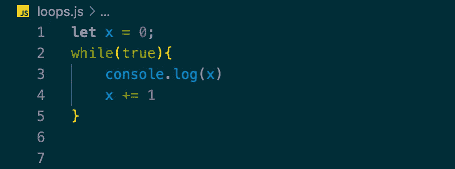
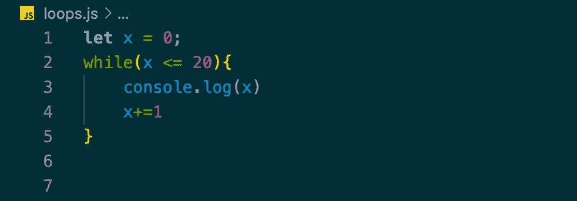
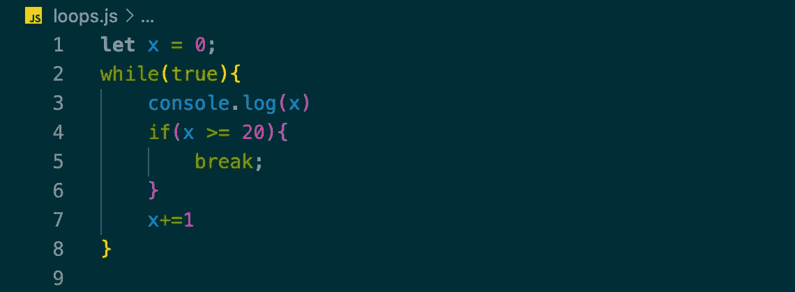
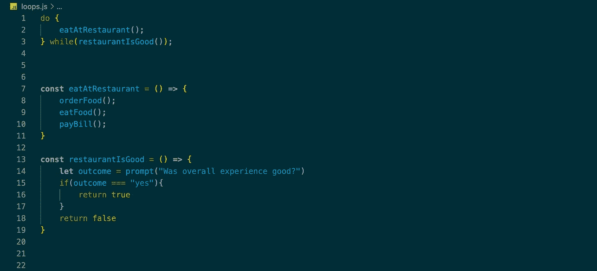

# 循环，循环和更多的循环！第一部分

> 原文：<https://medium.com/nerd-for-tech/loops-loops-and-more-loops-pt-1-621bab6bdba6?source=collection_archive---------6----------------------->

最近我一直在使用 JavaScript，我注意到当我写程序时，我有一系列的循环可以选择。看到我做了什么吗？😉。虽然它们实际上都做同样的事情(重复一段代码)，但是有很多原因可以解释为什么你会选择其中一个，主要是因为它会让你的生活更轻松。

我知道当我几年前开始编程时，我对何时应该使用*用于*循环或 *while* 循环，甚至是 *do while* 循环感到困惑。我认为现在是一个很好的时机来分解每种类型的循环，让任何人都可以与控制流语句做斗争。在这个 2 部分的博客的第 1 部分中，我将讨论 while 和 do-while 循环之间的区别。第 2 部分将介绍三种不同类型的*用于*循环。

# While 循环

While 循环在确定何时使用它以及何时应该寻找另一个循环时非常简单。当我们开始学习如何重复代码块时，While 循环通常是我们学习的第一种控制流语句。当我们开始编程时，我们从一个基本的 *while* 循环开始，因为我们像人类一样每天都使用 *while* 循环。例如:*下雨的时候，我会待在家里。天气热的时候，打开空调。虽然是工作日，但我在工作。*虽然循环需要一个布尔(真/假)语句来工作，但没有它，你的循环就不会执行。

无限 while 循环

在这里，您可以看到一个简单的 *while* 循环。我们有一个布尔语句，它检查条件是否为真，然后我们有一段代码，当条件为真时，它将重复。但是我们有一个很大的错误。你看到了吗？如果我们运行这段代码，我们会导致程序崩溃。为什么？尽管我们有一个满足 true 的条件，但是没有任何方法可以将这个布尔值更改为 false，从而导致它无限次地运行。

大多数情况下，您会将条件作为 while 语句的参数传递，而不是键入 true。如果你有充分的理由使用 true 作为你的条件，你必须确保在你的代码中有一个强制退出。

99%的情况下，您的代码将类似于示例 1

小心注意，例 2

上面的两段代码展示了编写 while 循环的不同方式。我建议，如果你刚刚开始，坚持使用例子 1。两个代码片段将打印出相同的输出，但是在示例 2 中，如果在 if 语句中满足条件，我将强制中断 while 循环。

所以，*而*循环很容易理解。当我们想要重复一段代码时，我们使用它们，这段代码将在条件评估为真时运行，当条件评估为假时退出。

# **一边做……一边**

你们中的一些人可能想知道…如果您想在检查条件之前先运行一条语句，该怎么办？这时 *Do While* 循环就有用了。让我给你另一个真实的例子来说明我们在生活中是如何使用 do while 的。*假设你家附近新开了一家餐馆。你想尝试一下，因为你以前没有去过那里，但你只想继续去那里，如果食物是好的。*这正是 while 循环的工作方式。你说我想至少运行这段代码一次，然后检查是否满足条件。 *Do while* 类似于标准的 *while* 循环，除了 *do while* 保证代码块的执行。

尝试新餐馆:Do while 循环片段

从上面的代码片段可以看出，程序运行时会立即执行 *do* 段。正在运行的代码块是一个名为***eatatestaurant()***的函数。这将自动运行一次，然后在完成代码中的所有步骤后，它将检查是否满足条件。如果条件评估为真，则 *do* 代码块将再次运行。

while 和 do-while 循环就是这样。我希望这能帮助你明白为什么你会选择一个而不是另一个。在我的下一篇博客(第 2 部分)中，我将解释 for 循环和不同的类型。我期待下周再次见到你！