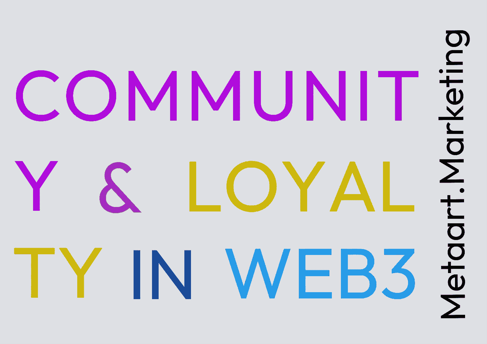
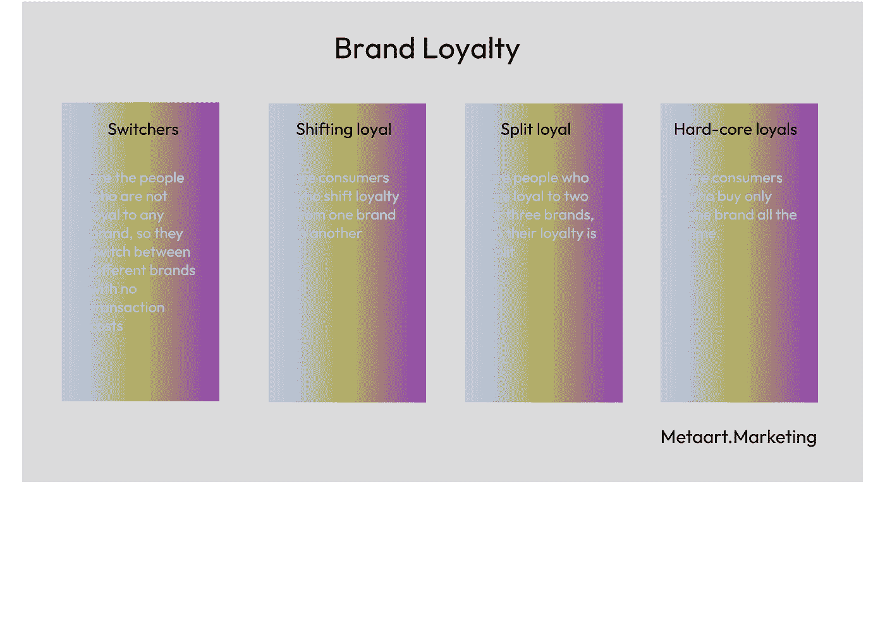

# 网络中的忠诚与社区 3:如何应对(上)——元艺术营销

> 原文：<https://medium.com/nerd-for-tech/loyalty-and-community-in-the-web3-how-to-deal-with-it-part-1-meta-art-marketing-ac585679361f?source=collection_archive---------3----------------------->

## 营销传播的主要目标之一是与消费者建立关系。我们希望陪伴客户，让他们与公司、品牌、甚至一个项目更紧密地联系在一起。营销理论为我们提供了两个相似的定义来描述这种与他们的联系。这些定义是社区和品牌忠诚度。社区的营销定义描述了以品牌为中心的一群人，他们分享品牌的理想并与这些理想联系在一起。大多数研究将品牌忠诚度定义为对品牌的精神投入。正如我们所见，它们的定义非常相似。尽管如此，他们在 NFT 项目的营销战略中的不明确定位会导致问题，所以在这里我试图解释他们是如何相互影响的。

**什么是品牌忠诚度？** 品牌忠诚度是人与产品/品牌之间的一种精神上的坚持。尽管定义的一些细节在不同的研究者中有所不同，我们将集中在最普遍的意义上。因此，在经典营销中，我们定义了四种忠诚状态:

忠诚的客户成为企业在多变的世界中保持可持续发展的重要资产。有许多理由说明它对商业是必要的。忠诚度高的消费者倾向于更频繁地推荐产品，并倾向于口碑营销。对于一个项目、品牌或公司来说，客户的高忠诚度意味着不容易受到危机的影响。此外，拥有品牌忠诚度的人愿意为同样的产品支付更高的价格。此外，对公司来说，处理老客户比获得新客户成本更低。

我们知道它在电子商务的一个更传统的部分是如何工作的。甚至有几种类型的研究与艺术相关。对于 NFT 项目和品牌，它的工作方式类似。对客户来说，一个潜在的路线图是 DAGMAR 模式，在这种模式下，客户应该遵循不同阶段的道路:类别意识、品牌意识、品牌知识、喜欢、偏好和试用。因此，通过引导顾客完成这些营销目标，我们可以获得高比例的忠实用户/顾客/等。

一些指标有助于衡量忠诚度，如购买频率、净推销商分数或定性研究的结果。然而，重复购买并不等同于忠诚。购买频率可以是衡量它的指标之一。

# 什么是 NFT 工业的社区？

NFT 行业由许多参与者组成，包括基础设施公司、创造者、投资者和第三方公司，他们将 NFT 作为另一个营销渠道。与利益相关者沟通的主要场所是他们的社交媒体渠道。在这里，公司也与他们的社区交流。但是什么是社区呢？

在 web3 的意义上，许多人开始谈论社区在行业中的独特地位，与 web1 相提并论。那是互联网在没有大型科技企业的情况下运转的时代。然而，至少在 20 年前，社区就开始成为营销策略的一部分。在 web3 中，它开始扮演更重要的角色，为新的特权和机会进行谈判。例如，现在他们可以参与决策。

社区的中心部分是一个共享的虚拟空间和人们的归属感。因此，人们可以在他们的社交网络上呼叫社区追随者，包括 Instagram、Twitter 或 Discord。这些人可以主动也可以被动地参与品牌客户活动。

# 但是如果我们说社区和品牌忠诚度是相互影响的呢？

不同的研究表明**有用性、信任和忠诚**之间的关系在**关注社区**的意义上是重要的。通过增加社区中潜在参与者的有用性，我们可以增加成员的数量。同样，成员的忠诚度提高了社区的质量和可持续性。

这样，对品牌或项目的忠诚度会影响社区。因此，社区因口碑营销而增长更快；由于其忠诚的核心，它变得更加可持续。
然而，并不是社区中的所有人都是忠诚的成员。考虑到越来越多的普通人加入的 web3 社区，这个比例会下降。

拥有一个发展良好的活跃社区，可以让 web3 品牌和项目成功地应用其他营销目标，并通过沟通阶段引导人们增加忠诚的社区成员或解决其他营销问题。

总而言之，忠诚度与顾客对品牌或项目的心理投入有关。社区是关于品牌活动的实际参与。正如我们所理解的那样，它们彼此之间有着密切的联系，对于营销策略都非常重要。

在第 2 部分中，我将举一些对社区忠诚的例子。

*原载于 2022 年 6 月 1 日*[*http://meta art . marketing*](http://metaart.marketing/loyalty-and-community-in-the-web3-how-to-deal-with-it/)*。*