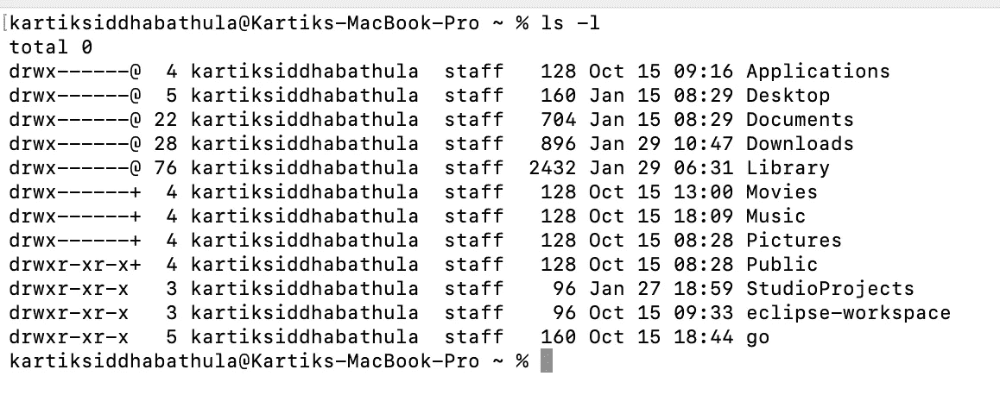

# 引擎盖下的 ls -l foo。

> 原文：<https://medium.com/nerd-for-tech/ls-l-foo-under-the-hood-7f5006d260e7?source=collection_archive---------6----------------------->

ls -l 命令的输出

任何 linux 用户首先执行的操作之一是使用' [**ls**](https://man7.org/linux/man-pages/man1/ls.1.html) **'** 命令列出用户所在目录的内容。这个列出目录内容的简单命令也是系统访谈中最常被问到的问题之一。这个问题的措辞有点像:"*当用户在终端*中键入***ls-l foo *****会发生什么？候选人给出的答案表明了候选人对 linux 内核的理解或知识的深度。很少有文章试图回答这个问题，但我觉得仍然有详细回答的空间，因此我在这篇文章中尝试这样做。我将通过研究发生在引擎盖下的各个步骤来给出解释，在每个步骤提出一系列问题，然后尝试回答这些问题。*

首先，假设用户想要列出当前目录中包含的所有文件，其文件名的前三个字母是' ***foo*** '。用户将使用的命令如下' **ls -l foo*** '。在用户键入命令并按回车键后，如果用户具有对当前目录的读取权限，则在终端上列出或显示当前目录中存在的名称以' ***foo*** '开头的所有文件或目录的列表。问题是，当用户在输入命令后按 enter 键时会发生什么？内核执行什么操作来向用户列出文件。

在 linux 中，有几个命令可以执行不同的功能。每个命令都只是一段代码。每个命令都有执行特定操作的代码。当用户输入一个命令并按回车键时，内核需要定位该命令的相应代码。那么 Kernel 如何定位命令对应的代码呢？代码是如何调用的，结果是如何返回的？如果命令的代码不存在怎么办？

如上所列，每个命令都只是一段代码，内核需要定位命令的相应代码。用户输入为' **ls -l foo*** '。在那个输入中，‘**ls**是命令，‘**-l**是选项，‘**foo ***是自变量。所以需要定位的代码是' **ls** '命令的代码。但是用户输入了一个字符串，内核如何识别其中的命令呢？这是命令执行的第一步，称为“**标记化**”。内核断开字符串以检索命令。输入字符串由内核读取，由空格分隔符分割，并存储在一个名为' **Token** 数组的数组中。第一个元素，即令牌数组中索引为 0 的元素，是需要执行的命令！因此，内核需要查找与存储在令牌数组索引 0 处的元素相对应的代码。如果有打字错误和/或命令不存在怎么办？同样，在 linux 中，用户输入的内容可以分为别名、内部和外部命令。

那么这些不同的命令是什么，为什么会有区别呢？我们稍微跑题一下，看看它们是什么。别名命令是用户可能想要的一种快捷方式，用来执行经常使用的命令。在我们的日常生活经验中，这类似于我们手机上的快速拨号。我们给一个特定的号码分配一个数字，例如，通常数字 1 被分配给语音邮件，用户分配 2 给父母/配偶(优先权由你决定😊).然后，用户只需持有分配的号码，呼叫就会被发送到相应的受让人。不需要搜索，然后调用，导致易用性和节省时间。同样，用户可以在别名文件中为命令指定快捷方式(取决于用户使用的 shell)。接下来是内部命令，它们是直接内置到 shell 中的命令。Shell 也只是一段代码。有些命令是作为 shell 中的函数实现的。这些函数的执行非常快，因为它只是外壳中的一个函数调用。这些功能是外壳的一部分，被称为“内部命令”。不属于 shell 的所有其他命令都是单独安装的，称为“外部命令”。外部命令的执行较慢，因为内核需要定位命令的代码，然后调用和执行该代码需要一个复杂的过程。如果外部命令速度较慢并且过程复杂，那么问题就来了，为什么不像内部命令一样把它们放在 shell 中呢？另一个问题出现了，什么命令是内部命令的候选，什么是外部命令的候选？换句话说，系统开发人员如何决定哪个命令将作为函数调用成为外壳的一部分，使其成为内部命令，以及什么将作为单独的二进制文件被安装？我们将在文章的后半部分回答这个问题，那时我们将回答外部命令被调用的方式。

一旦内核识别出命令的类型，它就会进行适当的调用。如果标记数组索引“0”处的输入是 alias，它将展开该命令，并根据该命令是内部命令还是外部命令，执行相应的操作。如果该命令不是别名，内核将在内部命令列表中搜索该命令。如果输入的命令是内部命令，它将调用该函数，并直接从 shell 代码执行该函数。如果该命令不是内部命令，则该命令必须是外部命令。现在，内核需要定位命令的可执行二进制文件，并使用适当的系统调用对其进行调用(我们稍后将查看系统调用)。 **ls** 是一个外部命令，所以内核需要定位到“ **ls** 的可执行二进制文件。系统中有多个目录，二进制文件可以放在这些目录中；那么内核应该在哪里寻找二进制文件呢？内核首先开始查看当前目录，如果没有找到，它将展开环境变量 ***PATH*** 并在环境变量中列出的所有目录中查找二进制文件。如果内核没有在 path 变量中列出的所有目录中找到二进制文件，它将返回命令未找到的错误。

当内核找到该命令的二进制文件时，它需要执行该命令。可执行二进制文件通常存储在/usr/bin 目录中。执行一个二进制的系统调用是' [**execv**](https://man7.org/linux/man-pages/man3/exec.3.html) '。因此内核可以使用 exec 系统调用来执行外部命令，在本例中为' **ls** '。但是，有一个条件。这与 exec 系统调用的工作方式有关。exec 系统调用的情况是，它在内存中用被调用函数替换调用函数。在这种情况下，shell 调用的是 ***ls*** 命令。所以，内核用内存中的 ***ls*** 二进制替换了 shell。在这种情况下，会有一个输出，但是由于内存中不再有 shell，终端会关闭。您可以通过在终端中键入' ***exec ls'*** 来尝试一下。你会注意到终端关闭了。那么如何处理这种情况呢？这就是' [***叉***](https://man7.org/linux/man-pages/man2/fork.2.html) '系统调用出现的画面。Fork 将创建调用流程的子流程。在这种情况下，它将是壳。因此将创建 shell 的子进程。另外，fork 创建了一个新进程，而 exec 没有创建新进程。即 **fork** 在进程表中创建新进程，而 **exec** 替换进程表中已有的进程。一旦使用 fork 系统调用创建了新的进程，即创建了新的 shell，则调用 exec 系统调用来执行 ***ls*** 二进制。现在，exec 系统调用将在子 shell 中执行 ls 二进制文件。如前所述，exec 系统调用将在内存中用 ***ls*** 二进制文件替换子 shell。现在，我们有了一个父 shell 进程，一个子进程，它是一个 shell，但是被 ls 二进制文件所取代。子进程中的 exec 系统调用将执行命令并关闭子 shell，但是我们需要在父 shell 中打印结果。因此，我们需要捕捉结果并打印结果。这就是另一个系统调用' [***等等***](https://man7.org/linux/man-pages/man2/waitpid.2.html) '派上用场的地方。等待系统调用将从子进程获取信息，结果打印在父进程中，父进程恰好是用户输入命令的终端(shell)。

现在我们知道外部命令使用三个系统调用来执行，即'*'、 ***execv*** '和' ***wait*** '。我们可以看到，这是一个复杂的过程，需要时间，因为内核首先需要定位命令的相应二进制文件，并调用三个系统调用。与此相比，内部命令更快，因为它直接调用外壳中的函数。那为什么不能把所有的命令都内置到 shell 中呢？原因是将所有命令作为函数放入外壳中，会使外壳变得更大，添加任何新命令都需要重新构建外壳，即重新安装内核。现在有了外部命令，我们不需要接触外壳或重新安装内核。我们只需要获取命令并将它们的二进制文件放在内核可以访问的位置。但是，哪些命令是内部的，哪些是外部的呢？如前所述，' ***ls*** '是一个外部命令，在本文的第一句中，我已经提到它通常是用户执行的第一个命令。这也可能是最常用的命令。那为什么要让它成为外部命令呢？因此，现在我们可以推断，调用的频率不会使一个成为内部命令的候选构建。那么，作为一个功能，是什么使命令成为 shell 的一部分呢？答案就在于我们想对当前的流程属性做什么。例如命令' [***cd***](https://man7.org/linux/man-pages/man1/cd.1p.html) '即改变目录是一个内部命令。使用该命令可以改变一个人所在的目录，即用户可以改变他们当前的工作目录。可以使用'[***【pwd】***](https://man7.org/linux/man-pages/man1/pwd.1.html)'命令列出当前工作目录。当前工作目录是用户进程的一个属性。当用户运行' ***cd*** '命令时，用户进程的属性发生变化。Fork 系统调用无法返回父进程属性的更改。这种无法通过 fork 系统调用来更改父进程属性的情况，为内部命令提供了一个候选构建。因此，每当需要更改用户进程的属性时，都可以使用 shell 中内置的函数来处理，使它们成为内部命令。所有其他命令都可以放入二进制文件中，并归类为外部命令，执行过程如上所述。*

*既然我们知道'***【ls '***命令是使用三个系统调用执行的，它是一个外部命令，那么下一个问题来了，内核是如何得到这个列表的呢？现在让我们来看一看。如开始所述，'***' ls '***是列出目录内容的命令，选项' ***l*** '给出了一个很长的列表，即除了文件名之外，还列出了文件的权限、创建日期等。这些信息存储在哪里，内核如何获取这些信息？这就是'[***inode***](https://man7.org/linux/man-pages/man7/inode.7.html)'出现的地方。在目录层，内核维护着文件名和它们对应的 ***索引节点*** 号的映射。因为在我们的例子中，用户输入是' ***foo**** '，其中符号' ******* '是表示“0”或更多字符的正则表达式。所以 ***ls*** 命令需要列出当前工作目录中存在的所有以 foo 开头的文件。所以 ***ls*** 命令在执行过程中会访问当前工作目录的文件名到 ***inode*** 的映射，并获取所有文件名以 foo 开头的文件的 ***inode*** 编号。如果假设当前目录中有 10 个以 ***foo*** 开头的文件，那么 ***ls*** 命令将从映射中获得 10 个 ***inode*** 编号的列表。由于用户给出了选项' ***l*** '即打印一个长列表，那么 ***ls*** 命令将查看 ***inode*** 表，其中存储了文件的元数据(文件名和数据除外)。该命令将转到 ***inode*** 表，并查找它从当前工作目录的映射表中获得的所有 ***inode*** 编号的元数据(如之前假定的 10 个 ***inode*** 编号)。一旦获取了元数据， ***ls*** 命令现在可以返回输出。*

*现在，在执行 ***ls*** 命令的过程中，有一个检查也是由内核执行的。勾选的是 [***权限***](https://wiki.archlinux.org/index.php/File_permissions_and_attributes) 的用户。用户是否有列出目录内容的权限？目录上的 ***读*** 权限赋予用户列出目录内容的权限。内核检查用户对当前工作目录的权限。如果用户拥有该目录的读取权限，那么它将列出该目录中的文件，否则不会列出。*

*我希望你喜欢这篇文章，并让你知道当我们键入命令 ***ls*** 时会发生什么。如果回答一个面试问题，我希望这能给你足够的材料在规定的时间内谈论和讨论。如果需要，甚至可以进一步讨论一个 ***inode*** 条目的结构。他们可以讨论 ***inode*** 表，也可以讨论现有的各种权限级别以及每个权限允许用户做什么。如果阅读这篇文章是为了获得一般知识，那么祝你学习愉快，如果是为了准备面试，那么祝你好运😊。如果有任何问题或反馈，请随时发表评论，我们将很乐意回应。谢谢你。*

*如需进一步阅读:*

*维杰·穆希的“C”之旅*

*[Stevens 和 Stephen 著《Unix 环境下的高级编程》](http://www.apuebook.com/)*

*[Michael Kerrisk 的 Linux 编程接口](https://man7.org/tlpi/)*