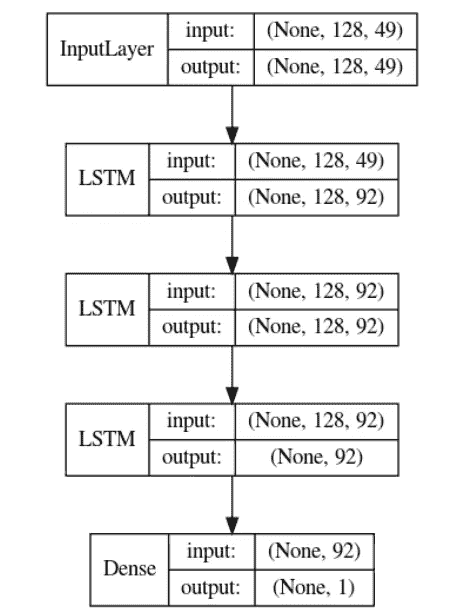

# 基于 LSTM 的恶意软件检测(Python 和 Tensorflow)

> 原文：<https://medium.com/nerd-for-tech/lstm-based-malware-detection-python-tensorflow-9d047cfe8766?source=collection_archive---------2----------------------->

在我们以前的一篇帖子中，我们展示了如何通过将可执行文件转换为灰度图像，使用卷积神经网络来创建恶意软件检测器。在这篇文章中，我们将看到如何探索一个可执行文件的汇编代码来分析它的恶意内容。

# 从中间开始…

我们可以用它的指令序列来表示一个可执行程序，N 个指令的每个序列被认为是用汇编语言编写的 N 个单词的文本。因此，我们将处理语言为汇编的文本分类问题。后者在其字典(词汇表)中包含 1600 多条指令。每个指令可以用一个向量来表示。我们可以通过使用一个热点矢量表示来实现。简单地说，一个热向量是这样的向量，其中除了一个被设置为 1 之外，每个条目都被设置为 0。它也是一个来自 n 维空间的标准基的向量。

在 1600 指令上使用规范表示有很多缺点。首先，用大小为 1600 的稀疏向量表示每个指令会降低神经网络的性能。第二，使用规范向量应该只适用于基底，这意味着单词应该足以生成语言**中的任何表达式(含义),而基底**的组件之间没有相关性，这在汇编语言中肯定是不满足的，因为一些指令之间存在相关性。为了克服这个问题，我们将把指令重新分组，每个组包含一组相同用途的指令:算术指令、数据传输指令……这样我们将增加一个组内指令的相关性，减少不同组之间的相关性，从而减少空间维度。

在我所做的工作中，我将汇编语言的不同指令映射到 49 个系列中，为此我使用了英特尔在其文档中给出的分类。以下是指令的组合:

我没有发疯，把所有指令分类，所以这不是汇编语言的全部字典

我知道这不是一件令人愉快的事情，但幸运的是，我做到了，所以没有人必须这样做。

# 然后是 LSTM

因为我们是在合理维度的空间中处理序列分析的问题，所以使用 LSTM 模型是头脑中一个直观的想法。

LSTM 模型在序列分析方面非常强大，但使用起来也很棘手。为了确保我们为网络选择了正确的参数，我改变了网络的多个参数，并预测了所有值的平均性能。

出于本研究的目的，使用大小为 128、序列长度为 128 的 3 层指令(映射到系列中)是最佳架构。

三层 LSTM 模型

# 直接实施

为了实现我们的想法，我们首先需要反汇编一个可执行文件。幸运的是，我已经在我以前的一篇文章中解释了如何用 python 创建一个反汇编器([https://isleem . medium . com/create-your-own-disassembler-in-python-pefile-capstone-754 f 863 B2 E1 c](https://isleem.medium.com/create-your-own-disassembler-in-python-pefile-capstone-754f863b2e1c))。

但是，如果您没有时间看它，请不要担心，我有一个完整的 python 脚本来从 exe 文件中获取指令序列，尽管我鼓励您理解它是如何工作的，以便您可以维护它。您可以在我的 GitHub 中找到完整的 python 脚本，位置如下:

 [## islem-esi/DeepMalwareDetector

### 分析 Windows PE 文件以检测恶意软件的深度学习框架。- islem-esi/DeepMalwareDetector

github.com](https://github.com/islem-esi/DeepMalwareDetector/blob/master/Features%20Extractor/OPcodes%20Sequences%20Extractor.ipynb) 

如果你打开那个脚本，真正重要的是最后一个块，它是执行提取的循环，你必须在那里改变 exe 文件文件夹的路径。还要删除 3 或行，因为它们不重要，可能会引发错误。

一旦分解完成，我们需要为我们的神经网络编码数据并创建模型，就像这样:

现在，你想看演示，没问题！参考我之前的帖子:[https://medium . com/analytics-vid hya/deep-learning-based-malware-detection-demo-d545c 5653200](/analytics-vidhya/deep-learning-based-malware-detection-demo-d545c5653200)

在上一篇文章中，您可以找到 kaggle 笔记本的链接，其中包含所有导出的模型，因此您可以下载并重用它们。您还可以找到演示的完整代码，您可以将它链接到您选择的漂亮的仪表板。我已经选择使用 Anvil.works，试一试，简单易行。

这就是 LSTMs 的全部内容。我将很快与你分享用于汇编指令序列训练的数据集。

## 更新:

你可以在 https://github.com/islem-esi/DeepMalwareDetector 的 [GitHub repo](https://github.com/islem-esi/DeepMalwareDetector) : [上找到完整的实现、模型和更多信息](https://github.com/islem-esi/DeepMalwareDetector)