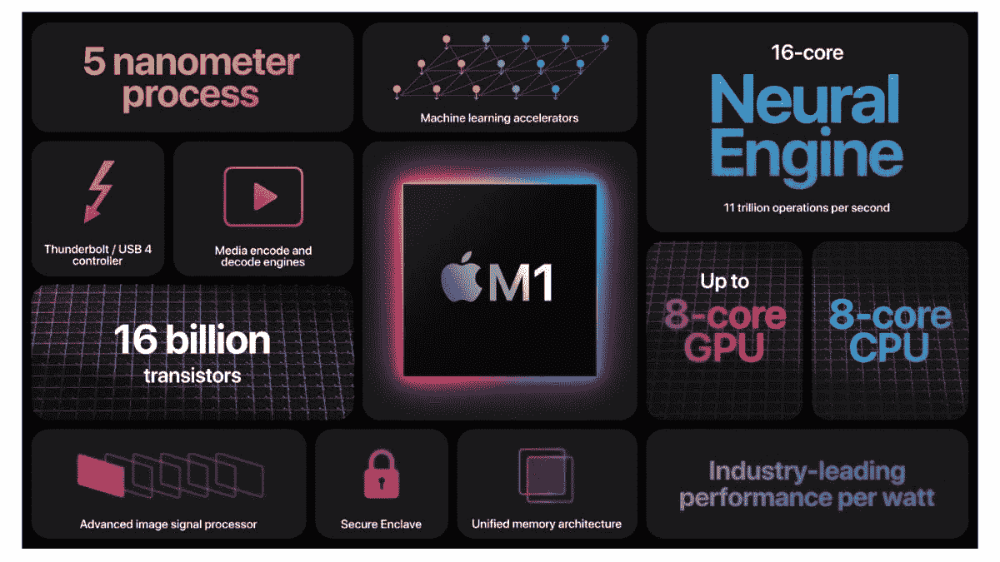

# M1:苹果统一和控制的咒语。

> 原文：<https://medium.com/nerd-for-tech/m1-apples-unification-and-control-mantra-a38263398d5c?source=collection_archive---------11----------------------->

苹果公司最近进军处理器领域，sip(系统级封装)和 SOC(片上系统)取得了惊人的成功。M1 在性能和电池寿命方面提供的明显优势掩盖了对停滞不前的设计、第三方维修、用户可升级性和消费者自由的担忧。

将它带到 iPad 上清楚地展示了苹果公司逐步淘汰 Mac 的意图，并使 iPad 成为消费者的 goto 设备。过去几年，苹果采取了许多措施来解放它最初在 iPad 平台上设置的不必要的限制。然而，假设苹果将寻求合并 MAC 和 iPads 是一个非常误导的假设。

虽然在过去，苹果给了 ipad 处理印章，使其成为少数专业人士真正有效和高效的工作工具，但它将 ipad 视为一种辅助设备，而不是主要设备。很明显，iPad 是作为高度紧凑但效率低下的上网本市场的替代品推出的。最初的重点是用作阅读设备、更大的触摸屏互联网门户、移动娱乐中心和移动游戏。

来源:苹果。

然而，随着各行各业明显转向更便携、基于触摸的界面，iPads 开始看起来比传统的翻盖式笔记本电脑更有利可图。最初，苹果甚至拒绝考虑手写笔的想法。然后，大约十年后，政策来了个 180 度大转弯，他们卖了自己的手写笔。

更多的例子可以从硬件和软件的功能以及营销决策和产品定位中找到，以展示苹果推动用户采用 iPads 而不是 MAC。甚至从 x86 到苹果基于 ARM 的 ISA 的处理器架构过渡也间接地推动了开发者为 iPad 开发应用。

苹果拒绝在其 Mac 平台上采用触摸屏，而显然所有竞争对手都已经采用了触摸屏，并在一定程度上实现了触摸屏。macOS 不再是一个主要的点击式界面，也不再是一个为触摸而优化的界面。sidecar 项目将 iPad 转换成第二个“基于触摸”的显示器，该项目表明在显示器上操作手写笔是可行的。和 in 一样，macOS 可以很容易地针对基于触摸的输入进行优化。

现实中，一切都归结为控制。苹果对其基于 iOS 的设备上分发的软件保持着非常严格的控制。这为苹果创造了巨大的价值和收入，同时提供了只有苹果生态系统才有的独特封闭系统功能。Mac 绝不是一个开放系统的例子。然而，绕过苹果的 Mac 商店并在许多方面自由重新配置设备的能力解除了苹果对 macOS 的大部分控制，就像它对 iOS 和 iPadOS 平台的控制一样。

通过 M1 和 macOS 11，苹果不仅部分建立了未来控制 Mac 的框架，还在其所有平台中引入了一个通用架构，这表明了一个通用的应用程序框架。为 MAC 电脑创建应用程序？轻松移植到 iPad。消费者想要一个带有专业级计算机软件的触摸设备？这是 iPad Pro 2021，拥有最强大、超便携的消费笔记本电脑的内部部件和一套全面的跨设备专业应用程序。

有传言称，苹果将把 Final Cut Pro X、Logic Pro X 和 Xcode 的套装带到 iPads 上。Adobe 一直在努力为 ipad 开发应用程序，现在 MAC 电脑运行的 ISA 与 ipad 相同，在 MAC 电脑上编写的应用程序必然会向 ipad 发展。微软也是。可以肯定的是，其他知名软件公司也在这么做。然而，对于 iPad AppStore，开发者需要感兴趣并愿意将 30%的收入留在苹果的金库里，这可能会阻止潜在的消费者。从过去的经验来看，很明显大多数都是这样。

*苹果的残局从创立之初就一直是这样。控制，而不是选择，是对消费者选择进行有利可图的垄断的唯一途径。*