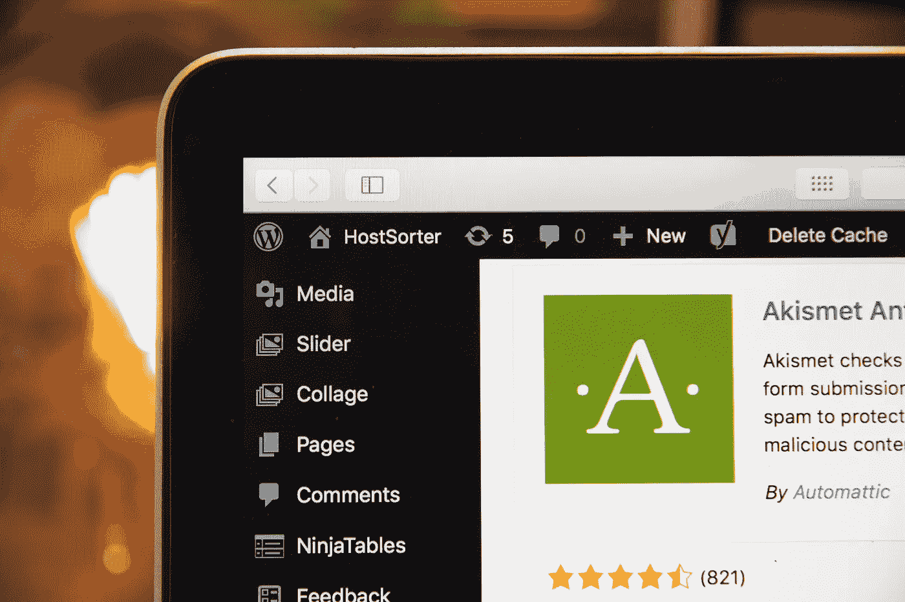

# 旅行中的机器学习和人工智能——第二部分

> 原文：<https://medium.com/nerd-for-tech/machine-learning-and-artificial-intelligence-in-travel-part2-52955bb53574?source=collection_archive---------2----------------------->

## **人脸识别**

另一项在旅行中流行的人工智能技术是面部识别。

面部识别软件可以通过捕捉、分析和比较面部模式来识别或验证一个人的身份。它使用人工神经网络来处理生物数据，并生成过滤器，将图像中的面部细节转换为数字特征。然后，系统将这些特征与数据库进行比较，以确定相似性。

例如，全球许多机场已经开始使用面部识别技术，使游客能够更快、更高效地通过值机和审查文件。捷蓝航空使用面部识别技术实现无纸化登机体验。该航空公司与美国海关和边境保护局(CBP)合作，在包括 JFK 肯尼迪国际机场在内的一些美国机场安装了完全集成的生物识别自助登机门。

## **个性化**

个性化可能是人工智能在旅游和酒店业中最有价值的应用，可以产生推荐。47%的消费者表示，基于过去购买的人工智能促销将改善他们的体验。如果酒店提供这种服务，26%的消费者会更频繁地光顾。

像亚马逊或网飞的标准推荐一样，许多在线旅行社、航空公司和酒店应用机器学习算法来分析数据，建立复杂的推荐引擎，并自动提供量身定制的推荐。

## **情绪分析**

近年来，社交媒体和旅游评论平台变得非常有影响力。一份报告显示，86%的人在浏览了其他用户的在线帖子后，对某个特定的旅游目的地感兴趣。大约 60%的在线用户会在脸书或 Instagram 上寻找灵感。

由于顾客倾向于写下他们的旅行经历，品牌可以利用这些有价值的信息来改善他们的服务并提供更好的优惠。截至 2020 年，仅猫途鹰就有 8.84 亿条用户意见和评论。手工处理如此大量的数据是不可能的。在这里，可以使用机器学习技术(情感分析)快速有效地分析品牌相关评论。许多旅游相关公司已经使用情感分析来跟踪社交媒体对其产品和服务的反应。

## 定制数据集

随着 AI 商业化进程的加快和 AI 技术在各行各业的应用，人们对特殊场景下的数据质量的期望越来越高。高质量的标签数据将是人工智能公司的核心竞争力之一。

如果说之前的算法模型使用的一般数据集是粗粮，那么算法模型目前需要的是定制的营养餐。如果公司想要进一步提高某些模型的商业化，他们必须逐步从通用数据集向前发展，以创建独特的数据集。

# NLP 服务

我们在电子商务、零售、搜索引擎、社交媒体等领域提供不同类型的自然语言处理。我们的服务包括语音分类、情感分析、文本识别和文本分类(聊天机器人相关性)。

ByteBridge 与全球 30 多个不同语言社区合作，现在提供[数据收集和文本注释服务](https://tinyurl.com/w6c2tyk8)，涵盖语言有**英语、中文、西班牙语、韩语、孟加拉语、越南语、印度尼西亚语、土耳其语、阿拉伯语、俄语等**。

# 结束

将您的数据标注任务外包给[字节桥](https://tinyurl.com/w6c2tyk8)，您可以更便宜、更快速地获得高质量的 ML 训练数据集！

*   无需信用卡的免费试用:您可以快速获得样品结果，检查输出，并直接向我们的项目经理反馈。
*   100%人工验证
*   透明和标准定价:[有明确的定价](https://www.bytebridge.io/#/?module=price)(包含人工成本)

为什么不试一试呢？

https://www.robot-china.com/news/202110/12/67650.html