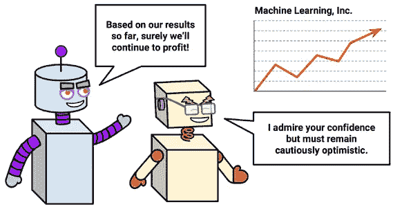
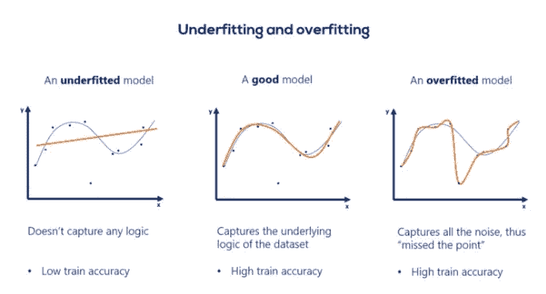
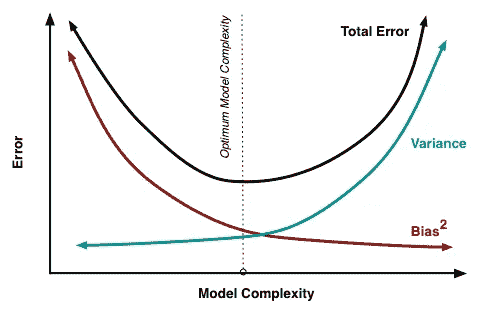
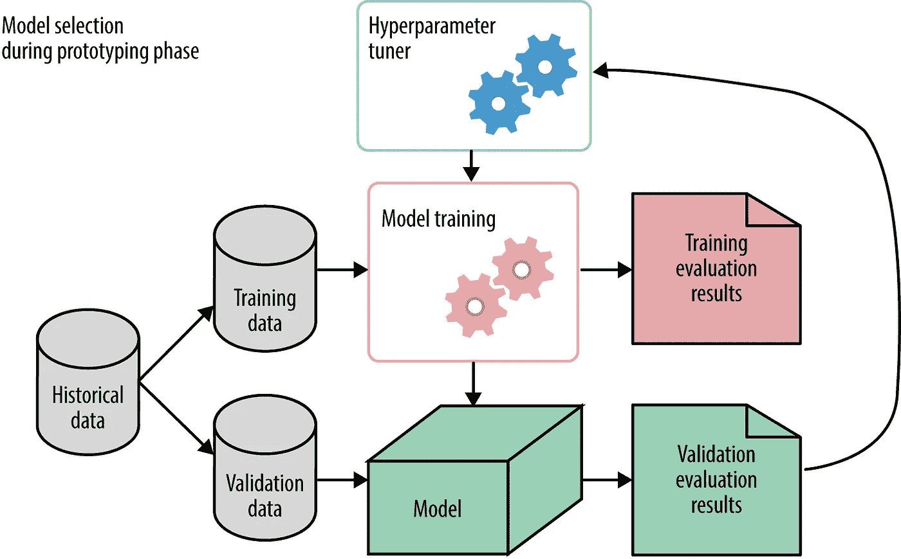
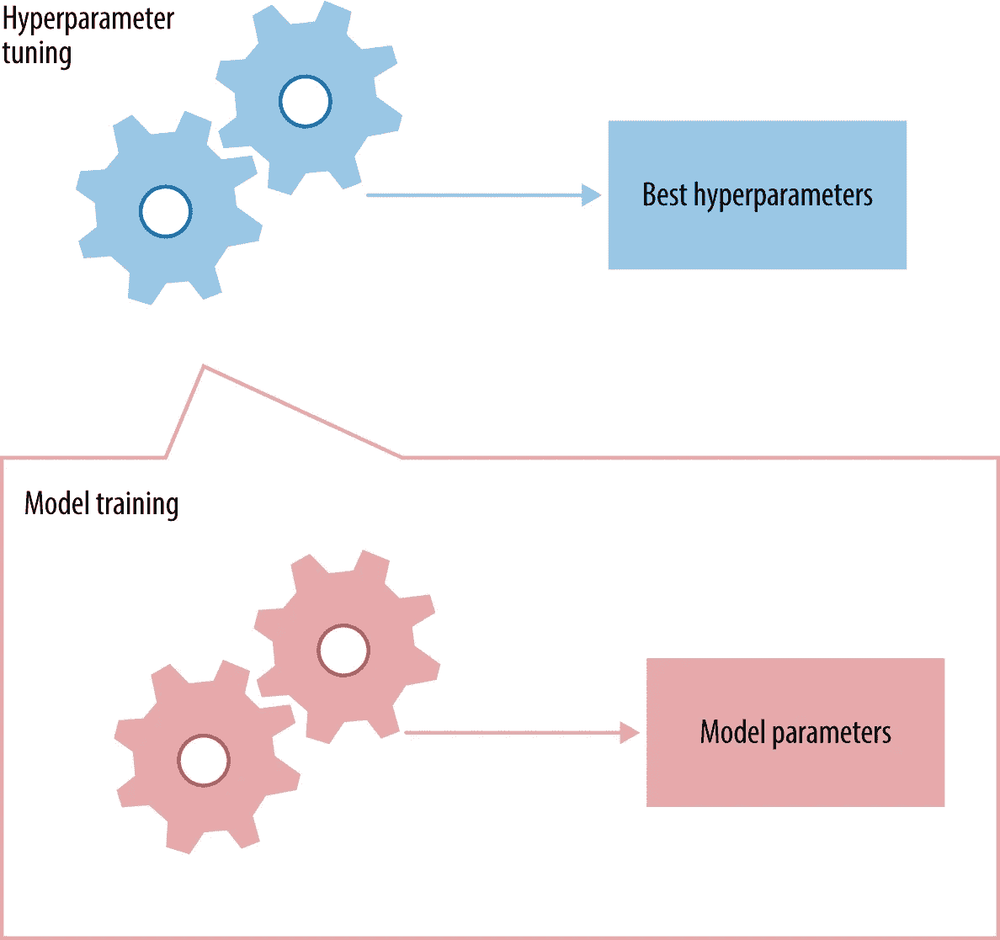

# 机器学习——偏差-方差权衡#4

> 原文：<https://medium.com/nerd-for-tech/machine-learning-bias-variance-tradeoff-4-cbbd2522f9ed?source=collection_archive---------9----------------------->

大家好！[在我之前的文章](/nerd-for-tech/machine-learning-model-evaluation-metrics-3-d9ea3404a4da)中，我研究了我们用来评估机器学习模型成功的方法。在本文中，我们将检查偏差和方差的关系。

# 偏差-方差权衡

在创建模型时，我们的目标是更准确地评估模型的预测成功率。我们试图通过平衡方差和偏差来实现这一点。当我们达到这种平衡时，我们就符合一个良好的模型。

我们在上一篇文章中谈到了**过度拟合**。什么是**过拟合**？我们用数据集的训练数据来拟合我们的模型，我们将数据集分为训练和测试。如果我们过度优化我们已经建立的模型，模型会很好地学习我们的训练数据，甚至记住它。后来，当我们要求数据对它从未见过的新数据进行预测时，模型预测的成功度正在下降。这种情况对我们来说也是不可接受的。为了摆脱这一点，有必要检查模型误差参数。

在评估模型的成功性时，我们有两种类型的错误。

*   训练误差:是我们从用于建立模型的数据集获得的误差。
*   测试误差:它是我们用来测试拟合模型的数据集出现的误差。

训练和测试误差之间存在偏差。

我们将使用下面的图片，我们经常遇到，看看我们已经拟合的模型是否是一个很好的拟合。

在检查图像之前，让我们先看看有助于我们理解图像的概念。我们总是试图使合身的模型更加灵活。那么**灵活性**是什么意思呢？它是对数据功能结构的正确解释。我们也可以将灵活性表达为方差/可变性。

那么如果方差很大，意味着什么呢？这意味着以高度代表性的方式灵活地表示数据集内的结构。

当我们检查图中的欠拟合和过拟合模型时；对数据结构来说，最灵活的是过度拟合模型，因为它使自己与数据的模式相匹配。这种情况说明它是一个方差很大的函数。这个函数很好地代表了数据集。它已经完美地学习了数据集中的结构。

另一个概念，**偏差**，表示实际值和预测值之间的差异。因此，欠拟合模型是有偏差的。这是为什么呢？因为它不能代表所有的数据点。换句话说，我们可以说该模型在预测实际值方面不够成功。我们可以说，欠拟合的模型无法捕捉数据的潜在模式。这些模型具有高偏差和低方差。因为虽然它能很好地代表一些观察结果，但有些却不能。

正确的模型是低偏差和低方差的模型。我们并不总是希望拥有高度的灵活性，并且能够很好地估计数据集中的结构。因为，一般来说，随着预测函数的灵活性增加(过拟合)，也就是说，随着在数据集中表示结构的能力增加，其偏差减小。然而，函数的概化能力下降。

我们称之为良好拟合模型的低偏差和低方差是如何选择的？

它是根据测试误差选择的。换句话说，如果平均测试误差很高，我们更喜欢更灵活的模型。当模型变得灵活时，方差会增加，偏差也会减少。如果这并没有在某一点停止，这一次再来一次，随着灵活度的增加，方差会增加，会有一个记忆的过程。

简而言之，这种情况被称为偏差-方差权衡。

# 训练与测试误差

如果我们检查图表，X 轴代表模型的复杂性，Y 轴代表估计误差。在训练我们拟合的模型时，我们的误差开始下降。由于我们正在优化模型，模型误差下降是正常的，但在这一点上，模型复杂性增加了。

测试集中误差的减少也表明我们做出了成功的预测。然而，在错误增加的点上，这表明他很好地学习了训练集，但是不能再解释测试集了。随着模型复杂性的增加和训练集中误差的减少(表明我们的成功增加)，我们看到在一个点之后，我们的测试集误差没有像在训练集中那样减少。总之，我们必须在训练集误差下降的点上做出新的决策，而测试集误差开始增加。在这一点上，我们试图在**学习曲线**的帮助下决定我们应该站在哪里。简而言之，我们试图找到最佳点。

# 模型调整

我们将评估我们的模型，我们用各种机器学习算法建立的模型，借助模型成功评估标准(如 MSE、RMSE、准确率)，我们在上一篇文章中提到过。在评估这些成功时，我们知道我们的错误评估方法(如交叉验证)。在拟合模型时，我们现在知道了另一个将影响模型性能的关键问题，如偏差-方差权衡(过度拟合或欠拟合)。最后，我们将尝试优化模型的预测性能。

**模型参数:**这些参数包含在模型中，其值在训练阶段学习。例如，回归模型的公式中包含贝塔系数。

**模型超参数:**这些是我们无法从数据中获得的参数，由用户确定，并用数据优化。换句话说，这些值必须在培训过程之外指定。这些是在获得具有最佳性能的模型的过程中需要调整的参数。比如我们在梯度提升方法中使用的学习率，最近邻中的 K 值等。

我们的目标总是试图预测更少的错误。例如，当我们试图预测房价时，我们的目标是将 600K 的价值估计为 605K。将会有内部模型参数和外部模型超参数属于我们将用于此目的的几十种机器学习算法。

下一篇文章中，我们将讨论数据处理的步骤。