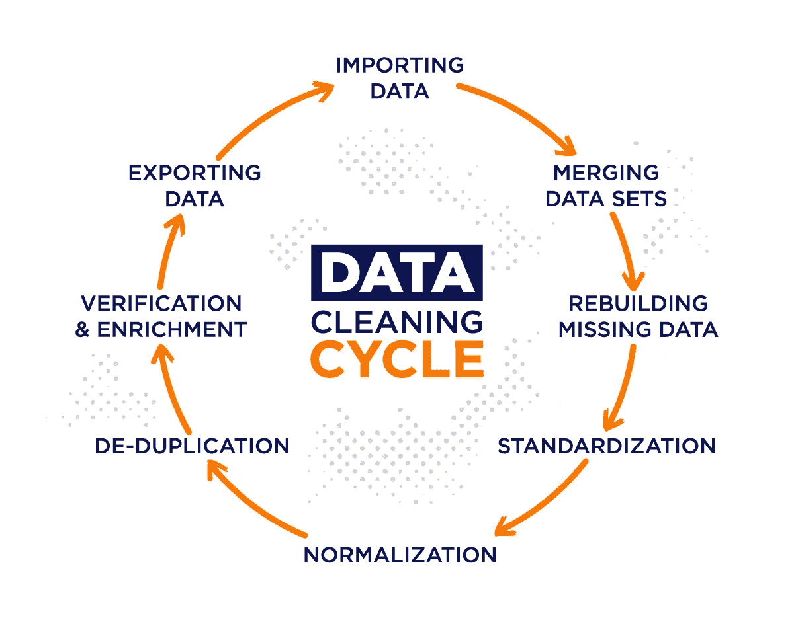
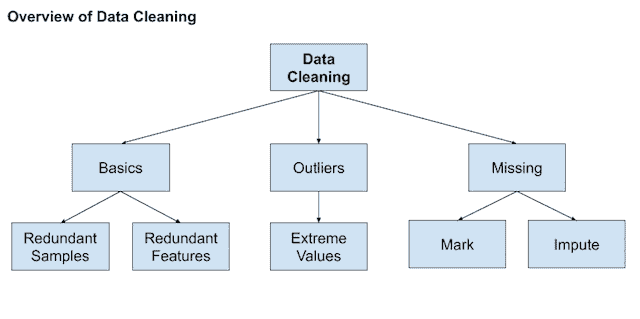
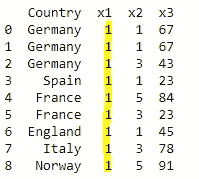
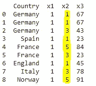
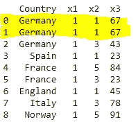
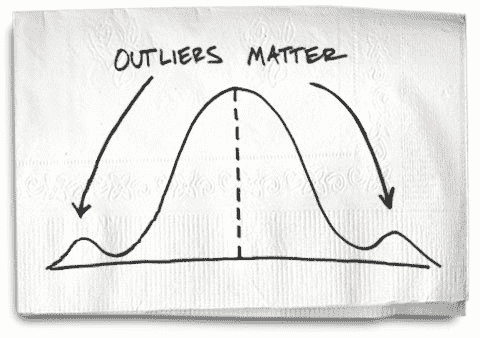
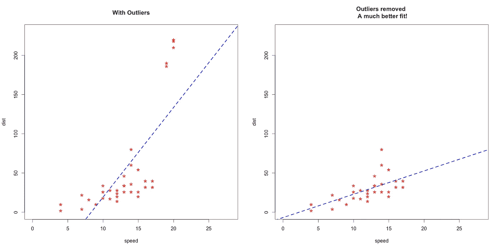
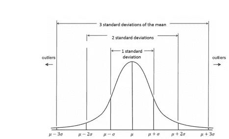
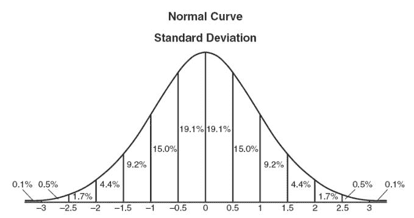
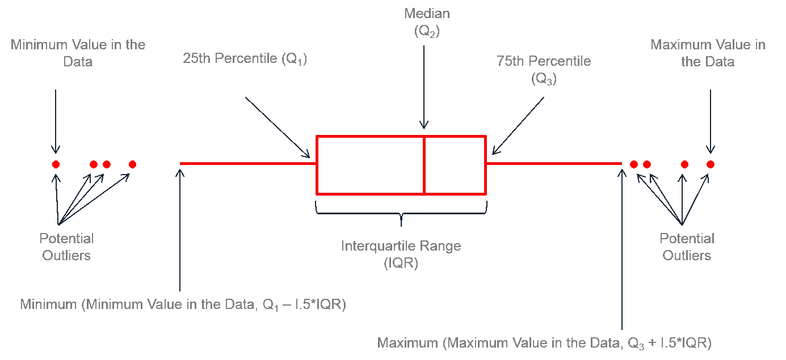

# 机器学习—数据预处理#5

> 原文：<https://medium.com/nerd-for-tech/machine-learning-data-preprocessing-5-ed0b222a43e6?source=collection_archive---------13----------------------->

大家好！[在我之前的文章](/nerd-for-tech/machine-learning-bias-variance-tradeoff-4-cbbd2522f9ed)中，我们考察了机器学习模型的偏差和方差关系。在本文中，我们将研究数据预处理。

# 数据预处理

这是机器学习模型中最关键的步骤之一。数据清理、转换和建模步骤是我们工作的一大部分。从多个来源收集的数据以无组织的形式存在。这种情况会影响模型的预测性能。因此，在训练、评估和使用机器学习模型之前，必须修改原始数据。

在本文中，我们将回顾以下内容。

*   数据清理过程的重要性
*   零散数据
*   异常值分析

从重要性来说，我们绝大多数人回答的问题几乎都是数据或者模型作为数据。

虽然算法在操作上很好理解，但大多数算法没有令人满意的理论来解释它们为什么工作或如何将算法映射到问题。因此，预测建模项目是实验性的，而不是理论性的，需要对数据进行系统的算法测试。

考虑到如今机器学习算法都是自动化的，项目与项目之间唯一不变的就是建模时使用的数据。所以我们的答案将是数据。

> 数据质量是数据管理中最重要的问题之一，因为脏数据通常会导致不准确的数据分析结果和不正确的业务决策。

所以在项目中，我们会把大部分时间花在数据上。收集数据、验证数据、清理数据、可视化数据、转换数据等等。

让我们简单地检查一下这些方法的细节。

# 数据清理/清除

数据清理是任何机器学习项目中至关重要的一步。这个过程包括修复杂乱数据中的系统问题或错误。在这些数据中，存在具有不正确值的情况，例如数据键入错误、数据损坏和数据重复等等。例如，数据包括运动员的跳远信息。因为一个人不可能跳 50 米，所以数据包含不正确的信息。如果我们考虑另一个例子，数据集中一个男性变量的怀孕状态是 yes 的事实表明数据是不正确的。

我们可以使用许多不同的统计分析和数据可视化技术来识别数据清理过程。这些是如此的基础，以至于即使是最有经验的机器学习实践者也经常忽略它们。然而，这一点非常重要，如果忽视了这一点，就会导致模型性能的下降。

一旦发现杂乱、嘈杂或错误的观察结果，就应该加以解决。

删除行或列时可能会发生这种情况。或者，您可以用新的观察值替换它。举个例子，如下。

*   使用统计学定义正常数据并识别异常值
*   识别具有相同值或没有差异的列并删除它们
*   识别重复的数据行并删除它们。
*   将空值标记为缺失。
*   使用统计数据或学习模型输入缺失值。

数据清理是通常在其他数据准备操作之前首先执行的操作。

## 杂乱的数据集

数据集可以包含许多类型的错误。不包含太多信息的列和具有重复行的数据位于顶部。

*具有单个观察值或值*的列可能不适用于建模。这些列或估计量的方差(表示它们偏离平均值的程度)将为零。

当一个估计量包含单个值时，我们称之为**零方差**估计量，因为它没有显示估计量的真实方差。具有单一值的变量或列可能应该从数据集中删除

除了包含单个观察值的数据外，*有些列可能只有很少的唯一值。*例如，假设我们有一个只包含值 1、3 和 5 的变量。这种情况对于顺序变量或分类变量是有意义的。但是在这种情况下，数据集只包含数字变量。这个变量将有非零方差，但有一个非常小的接近于零的数字。从模型中移除这些变量不是一个解决方案，因为它们可能会对模型性能有所贡献，尽管贡献很小。此时，可以根据效果来决定做什么。

*具有相同数据的行*在建模过程中也可能是无用的。在这种情况下，重复行中的数据在每列中都是相同的。删除重复数据将是确保正确使用数据的关键一步。这些行可能会对模型性能产生误导。

## 异常值分析

不符合数据总体趋势或与其他观察值有很大不同的观察值称为异常值。这是我们在数据处理步骤中会遇到的严重问题之一。我们必须非常小心，不要匆忙减去或更改值，尤其是当数据很小时。

异常值可能有多种原因，例如:

*   测量或输入误差
*   数据损坏
*   真实异常值观察

那么是什么导致了异常值呢？它误导了与概化相关的规则集或函数。它们会导致偏差，即模型预测中的错误。

上图显示了一个带有异常值观察和异常值删除的模型。因此，模型曲线在异常值观察被去除后明显改变。

以下方法可用于确定某个值是否为异常值。

**相关工作**

由于每个数据集的独特特征，通常没有确定的方法来识别异常值。此时，我们可以使用行业知识来决定观察值是否是异常值。例如，我们不应该用 17 位数的信用卡号(通常是 16 位数)来模拟记录。因为当我们构建模型时，我们的目标是创建无偏的模型，这些模型是可概括的，并且能够表示数据集中的结构。如果建立的模型有泛化问题；已经非常罕见并且一般不适合的结构应该从建模过程中排除。

**标准差法**

它用于检测高于平均值的分布之外的值。通过计算同一个变量的标准偏差，将其加到该变量的平均值上。阈值是通过将第一、第二或第三标准偏差值与平均值相加而得到的。高于或低于该阈值的值被定义为异常值。例如，让我们考虑房价，计算房屋的平均值，并将标准偏差值加到平均值上。

> 阈值=平均值+ 1 *标准偏差
> 
> 阈值=平均值+ 2 *标准偏差
> 
> 阈值=平均值+ 3 *标准偏差

**Z 值法**

它的工作原理类似于标准差法。变量适应标准正态分布，即标准化。然后，根据分布右侧和左侧的±2.5 值设置阈值。高于或低于该值的值被标记为异常值。

**四分位极差法**

这是最常用的方法之一。变量值从最小到最大排序。使用与它们的四分位数(百分位数)，即 Q1(第 25 个百分位数)和 Q3(第 75 个百分位数)相对应的值来计算阈值，并且根据该阈值来确定异常值。

> *IQR= 1.5 * (Q3 — Q1)*
> 
> *下限= Q1 — IQR*
> 
> *上限阈值= Q3 + IQR*

综上所述，当我们有了一个数据集，而不是对这个数据集的变量不进行任何运算就进行建模，我们可以看到数据集中变量的状态不一致，观察不完整等。我们需要审视当时的情况。其中最重要的是异常值观察。这是为什么呢？如果不考虑，甚至可以改变模型中线条的方向。通常，我们会尝试使用方法 1 和 4 来解决这个问题。

***根据模型变量的异常值观测检测方法；***

如果我们要在单个变量的*上做，用**箱线图**来确定它是合适的。对于确定的异常值，我们将使用以下三种方法；*

*   Delete 方法(从数据中提取值。)
*   平均法(值等于变量的平均值)
*   抑制方法(值等于下限值或上限值。)

如果我们要对*多个变量*进行分析，则应用**局部异常因子(LOF)** 方法。在这种方法中，我们可以通过基于其位置的强度对观察值进行评分来识别可能是异常值的值。将一个点的局部密度与其邻居进行比较。如果它明显低于其邻居的密度，我们解释说，该点是在一个频率低于其邻居的区域。换句话说，如果一个值的周长不密集，我们推断这个值可能是一个离群值。上述方法可用于此处确定的系数。

在本文中，我们重点讨论了建模前数据预处理过程的*重要性、清理杂乱数据时我们可以做的事情*，以及异常值检测和需要做的事情。在下一篇文章中，我们将继续讨论缺失数据和数据转换。