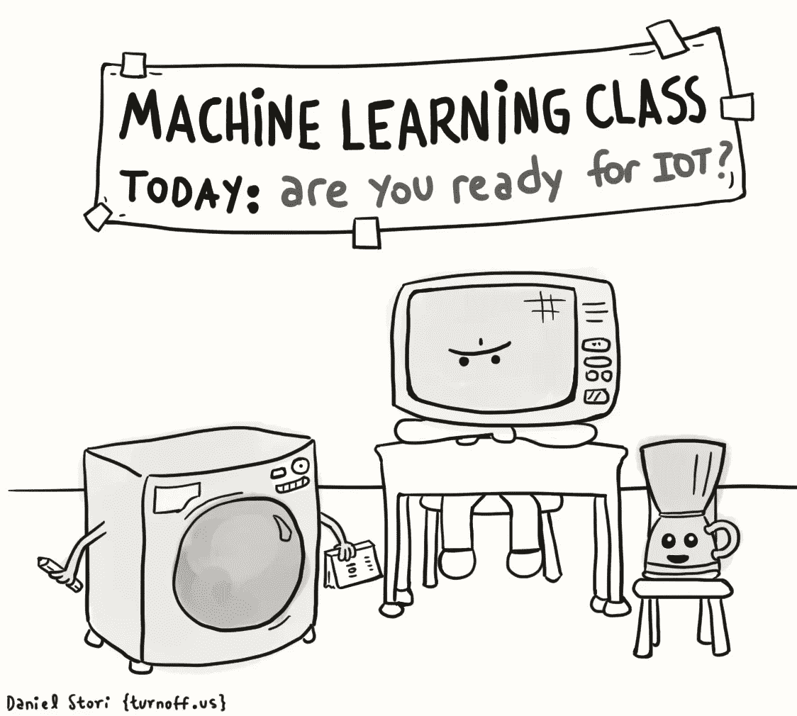
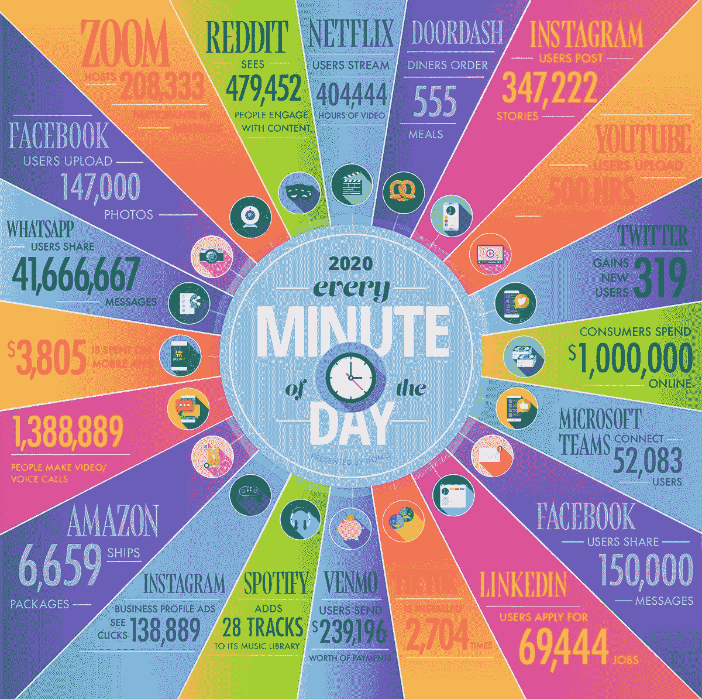
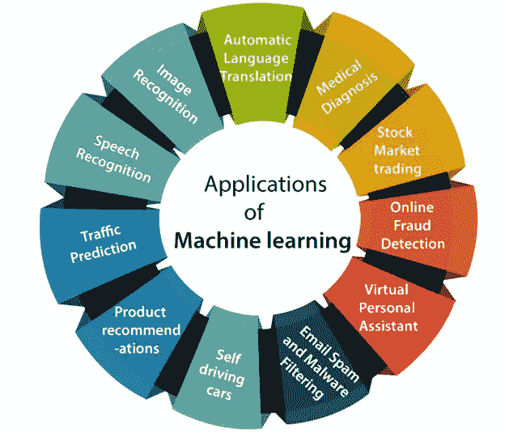
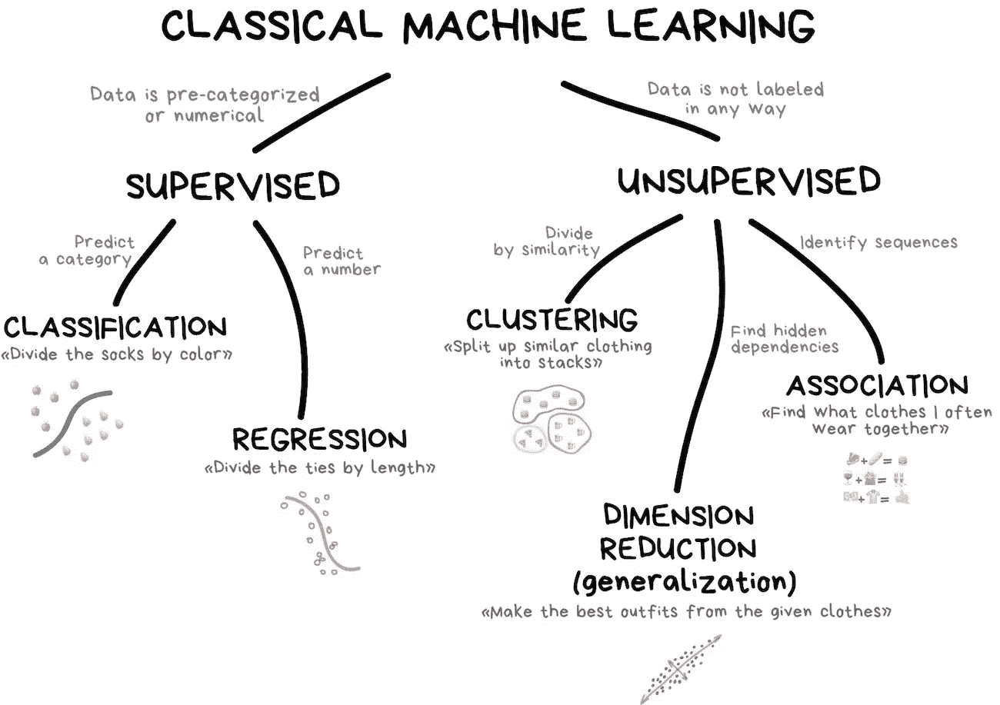

# 机器学习—概述#1

> 原文：<https://medium.com/nerd-for-tech/machine-learning-overview-1-b7530458a87a?source=collection_archive---------17----------------------->

你好。我为任何对数据感兴趣，热衷于学习，有或没有相关知识的人发布这一系列文章。

我们已经经历了很长一段时间的新冠肺炎时期。我希望你读这篇文章感觉很好。

机器学习系列介绍包括关于数据、机器学习使用领域和常用概念的信息。

今天，为什么大家都熟悉的数据是至关重要的？我们可以用数据回答三个本质问题。

> 发生了什么事？—描述性分析
> 
> 会发生什么？—预测分析
> 
> 我们如何让它发生？—规定性分析

数据不是什么新鲜事。数据的处理可以追溯到公元前 20000 年——公元前 18000 年。根据这些研究，显示建议的 Ishango 骨头上每个刻痕的数量是数据处理的证据。对这块骨头进行测量、处理并收集数据。

> 据估计，有凹口的骨头可能被用来监测商业活动，测量社区的食物水平，进行简单的计算(Morris，2016)。

伊桑戈骨头

人类几乎一开始思考就开始收集数据。在过去的 10 到 15 年间，数据开始成为大数据。

我相信你们都见过类似下图的图片。

> 1 分钟内互联网上发生了什么？
> 
> - Whatsapp 用户分享 4200 万条消息，Instagram 用户分享 35 万条帖子。我确信，在最近人人都在使用的网飞上，用户观看了 40 万小时的视频。

数据增长参数如下

*   *卷*
*   *速度*
*   *变异*

以前我们说数据，想到的只有数字，现在声音和图像也想到了。

例如，在一些呼叫中心系统中，分析客户的声音并计算紧张指数。使用该指数，可以衡量客户对演讲是否满意。

或者我们的图像是由各个地方的摄像机拍摄的。比如在中国，人脸识别应用于公民。他们根据分数被分类。

或者有文本数据，例如，我们大多数人都有并且免费知道的 Gmail 帐户。然而，我们都分享我们的数据来换取这项免费服务。每当我们进行任何通信时，我们的数据都会被扫描，并在几天甚至几小时内以广告的形式出现。

这些数据越来越多，应该在数学上和统计上都有意义。我们是否可以通过拿起纸笔，深入检查数据来做到这一点？当然了。但是，您可以想象，根据数据的大小，这项工作可能需要几个小时、几天甚至几个月的时间。此时，在几秒钟内为我们完成所有这些工作的机器开始发挥作用。

那么他们是如何做到这一点的呢？

我们可以非常简单地处理这种情况。

我们可以把机器学习想象成人类的生活。正如我们从出生那一刻起就什么都不知道，尽管我们什么都不知道，但我们可以随着时间的推移学习新的信息，并通过这些东西获得进一步的信息，这就是机器学习所做的。使用数学和统计方法，它通过从现有的知识中进行推断来获得和估计新的信息——我们称之为数据。

随着时间的推移，我将介绍它是如何做到这一点的，它使用什么算法。让我们看看机器学习在现实生活中的应用。

*   聊天机器人和个人助理(自然语言处理等。)
*   脸书在给脸书(使用背面图片的深度学习应用)添加照片时的标签建议
*   网飞、亚马逊和电子商务建议
*   垃圾邮件拦截(算法根据分类决定)
*   句子完成和微笑完成
*   欺诈预防研究(欺诈预防)
*   贷款申请评估(决策支持系统)

我们来举一个机器学习的真实例子，它现在几乎在我们生活的方方面面。营销界去年在这个领域投资了 1200 亿美元。所有留下痕迹的东西都被分析了，从人脸识别到音频文件。

在人们感到自由的社交媒体中，即使是最小的痕迹也通过使用这些算法进行了分析

**让我们来看看机器学习中常用的概念……**

***因变量:*** 这是我们在机器学习问题中旨在预测的主要变量。

比如说；评估客户是否有能力支付贷款

***自变量:*** 这些是我们假设构成因变量的变量，而不是因变量。

**学习类型**

***监督学习:*** 如果因变量和组成因变量的自变量在一起，这叫这种情况。

> 比如说；“假设您提供了一个包括过去 100 年城市人口的分类，并想知道某个特定城市四年后的人口是多少。结果使用数据集中可用的标签:人口、城市和年份。

***无监督学习:*** 是因变量不在学习中的学习类型。它仅由观察单元组成。目的是根据相似的特征将观察单元集合在一起。

> 比如说；“假设您想要提供客户数据，并创建喜欢类似产品的客户群。您提供的数据没有标记，生成的标记是基于数据点中发现的相似性创建的。”

**问题类型**

***回归:*** 如果因变量是数值型/连续型变量，这就是一个回归问题。它表达了线性关系。这是一个函数表达式。

***分类:*** 如果因变量是分类变量，这就是一个分类问题。无法计算平均值、标准偏差。

下一篇关于建模方法的文章再见…

 [## 在线学习成为数据科学家

### Nanodegree 计划通过行业专家设计的项目获得真实世界的数据科学经验。建立您的…

www.udacity.com](https://www.udacity.com/course/data-scientist-nanodegree--nd025)  [## Ishango bone -维基百科

### Ishango 骨头是一种骨头工具，可能是一种数学物体，可以追溯到旧石器时代晚期。这是一片黑暗…

en.wikipedia.org](https://en.wikipedia.org/wiki/Ishango_bone)  [## 公司如何了解你的秘密(2012 年出版)

### 2002 年，安德鲁·波尔刚刚开始在塔吉特百货公司担任统计人员，当时市场部的两位同事…

www.nytimes.com](https://www.nytimes.com/2012/02/19/magazine/shopping-habits.html)  [## 奥兹古尔·奥兹吕克

### 与朋友、家人和全世界分享您的视频

www.youtube.com](https://www.youtube.com/channel/UCBxkBvIQIE7SMCfvujlcRig/videos)  [## (50 Saat) Python A-Z:验证机器学习的可行性

### Python，机器学习，i̇statistik，SQL，Büyük Veri，i̇şleme.9 Eğ itim 1 Arada！

www.udemy.com](https://www.udemy.com/course/python-egitimi/)