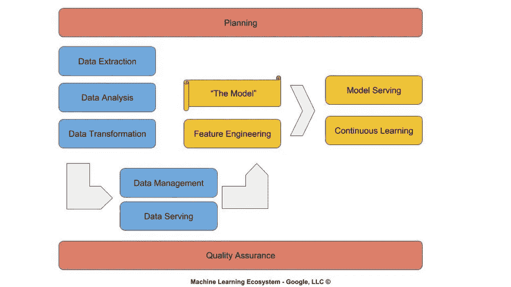

# 机器学习软件开发生命周期(ML SDLC)

> 原文：<https://medium.com/nerd-for-tech/machine-learning-software-development-lifecycle-ml-sdlc-9bc86eff1e26?source=collection_archive---------2----------------------->

## ML SDLC 与传统 SDLC 的区别

图片:[去飞溅](https://unsplash.com/photos/pjAH2Ax4uWk)

机器/深度学习(ML/DL)是技术领域的热门趋势之一。ML/DL 已经在研究界存在了几十年，但随着近年来强大的 GPU/TPU 处理器的出现，它已经被实现为工作软件。

同时，软件开发经历了许多挑战，以达到具有最先进的技术框架和开发方法的当前状态。变革进程仍在进行中。绝对的，变化是不变的:)

术语“软件开发”已经成为 Web、移动和后端模块开发的同义词。虽然 ML/DL 程序也是一种软件，但它的开发生命周期并不遵循传统的软件开发生命周期(SDLC)过程。

虽然生命周期过程是不同的，但传统软件为 ML/DL 算法训练提供数据集。这就是谷歌、脸书、亚马逊、LinkedIn 和当前趋势中更多人工智能驱动的公司如何首先开发传统软件来收集用户活动作为输入，准备作为数据集，并能够产生许多令人震惊的 ML/DL 解决方案。由于用户模式不断变化，这一过程仍在继续。无论如何，这是一个不能在这篇文章中涉及的大话题。

回到 ML SDLC 点…

本文将简要介绍 ML SDLC 与传统 SDLC 的区别。这里，传统的 SDLC 指的是 Web、移动和后端模块开发。

让我们通过一个“社交网络”领域的例子来了解一下它们的区别。

# 确定领域中的问题并要求检查:

图片: [Unsplash](https://unsplash.com/photos/SqsbTuo5jP0)

为了确定问题，我们需要对我们打算发现问题的领域进行详细的调查和研究。如果从用户的角度来看，发现的问题确实值得解决，我们也应该进行需求检查。“设计思维”课程将在这项活动中发挥重要作用。

*例如*

*我们希望在“* ***社交网络*** *”领域开发一些解决方案。*

在新冠肺炎疫情封锁期间，许多人被困在家里，只有在必要时才会出门。他们可以选择在网飞、Prime 和其他流媒体平台上观看他们最喜欢的网络系列和电影来消除无聊，但他们缺乏与朋友和亲戚的社交联系。在这种情况下，真正的社交接触是不可取的。

*让我们开发一个虚拟连接人们的解决方案。*

*   我们的领域专家是我们的朋友和亲戚。与他们交谈，了解他们的痛点。
*   *准备要问他们的问题，如:*

*>他们喜欢参与什么样的活动来富有成效地度过他们的时间？*

*>他们愿意花时间参加个人或协作活动吗？*

*   *记录他们的回答。*
*   *列出问题，并在目标受众中就哪些问题可以解决进行投票，因为我们无法一次开发出解决所有问题的解决方案。*
*   *根据回答，确定要解决的最重要问题的优先级。*
*   *假设以下问题已被选为首选。*

***人们没有专门的移动应用程序来与他们的兴趣小组讨论他们喜欢的电影、网络系列和书籍。*** *(是的，我听到你说可以在 Clubhouse 和:D 的许多其他渠道这样的平台上进行。这只是一个例子)。*

***问题陈述:***

*开发一个移动解决方案，将人们联系起来，讨论他们最喜爱的电影、网络系列和书籍。*

# 技术可行性

图片: [Unsplash](https://unsplash.com/photos/wpOa2i3MUrY)

一旦你确定了用户感兴趣的需要解决的问题，我们需要确定技术发展是否可行。这就是在两个轨道中询问可行性问题的不同之处。

**传统 SDLC:**

1.  我们有必要的技术框架来实现可用的软件吗？
2.  我们是否有一个拥有开发解决方案专业知识的团队？

**ML SDLC:**

1.  我们有与领域相关的数据吗？
2.  数据在法律上允许用于 ML 开发吗？
3.  ML/DL 对于这个问题会不会大材小用？能用常规方式解决吗？
4.  如果是用 ML/DL 解决的，那是什么类型的 ML/DL 问题？(回归、分类、无监督学习和其他)
5.  如果问题需要高级 DL 解决方案，我们是否有预算在内部部署 GPU/TPU 基础设施，或者从 AWS、GCP 或 Azure 等云解决方案中租赁？
6.  我们是否有一个拥有开发解决方案专业知识的团队？

在我们假设的场景中:

***常规 SDLC:***

*假设你正在从头开始开发这个应用，*

1.  *需要像 Flutter、react-native 和其他先进的技术框架，以一个代码库开发 iOS 和 Android 平台的移动应用程序。*
2.  如果你已经在从事前端开发，那么学习这些框架应该很容易，或者你可以找任何有专业知识的朋友。你打算如何组建一个团队取决于你自己。

**ML SDLC:**

*   *如果您是第一次开发这款应用程序，并希望在应用程序中引入基于 ML/DL 的推荐引擎，根据兴趣小组的兴趣进行推荐，那么没有用户兴趣的“数据”就不可能拥有这一功能。*
*   *您需要确认收集数据是否会有任何法律问题。*
*   *一旦手机 app 投入使用，那么你就有了一个收集和准备数据开发智能推荐引擎的媒介。*

*一旦你有了足够数量的数据集，你将有以下几点需要考虑:*

*   *寻找你网络中的数据科学家伙伴来开发这项功能。*
*   *由于作为“监督学习”的推荐系统将仅限于少数感兴趣的领域，因此给用户的推荐可能与上下文不匹配。将这个问题视为“无监督的”可能会导致提供“上下文相关的推荐”的范围。无论如何，关于这个话题的讨论是一个巨大的领域。*
*   *一旦你决定了一个 ML/DL 问题的类型，研究并评估如何执行 ML/DL 任务。AWS、Azure 和 GCP 等云提供商提供了最先进的 ML/DL 平台来开展这些活动。评估哪个提供商符合您的要求。*

# 实施前的组织:

图片: [Unsplash](https://unsplash.com/photos/0H1e3435D8A)

现在，是时候从用户那里收集解决方案中需要的详细需求了。遵循敏捷方法实践，需求可以以“用户故事”的格式组成，并且可以组织在产品 Backlog 中。这种活动在两条轨道上都有发生，但不同之处在于你如何根据**验收标准**和**完成定义**来设定故事的目标。

在传统的软件开发中，您可以选择准备 UI 线框，并与软件开发团队(包括前端、后端、开发运维团队)分享应用在 Web 和移动版本中的外观。对结果的期望是结构良好的，团队需要满足这些要求。

但是在 ML 开发中，ML 开发团队(数据工程师、数据科学家)被交给一个原始数据集，通常涉众可能不知道从中可以得出什么样的推论。领域专家和 ML 开发团队应该共同合作，制定具有商业价值的明确目标。

*在我们的例子中，*

*在传统软件开发中，可以在产品储备中为我们的移动应用解决方案创建用户故事。可以设计 UI 线框，以便向您的软件开发团队传达明确的期望。*

*在 ML 开发的路线中，结果是清楚地知道如何处理用户兴趣的数据集。结果可以进一步微调，以显示匹配用户兴趣的前 3 个兴趣组。*

# 实施:

图片: [Unsplash](https://unsplash.com/photos/bs2Ba7t69mM)

在传统的软件开发中，遵循快速软件开发方法，一次又一次地向涉众和最终用户交付迭代原型，以便他们可以清楚地看到从原型到 MVP 再到“上线”产品的开发状态，并准备好一步一步地使用软件。

CI/CD 管道等良好的开发运维实践可确保解决方案的自动化交付，并且几乎不会错过交付期限，而不是专门花时间手动执行应用部署。

在 ML 开发中，

*   数据工程师开发数据管道，以执行数据清理、特征工程和其他步骤，将格式化数据集移交给数据科学家。
*   数据科学家会投入时间来训练和评估各种具有特定评估指标的 ML/DL 算法。ML/DL 活动需要更多的时间来达到一个明确的点。
*   由于这种复杂性，ML 开发团队不能像软件开发团队一样产生迭代原型。
*   ML 团队可以通过展示算法的评估指标来解释状态，以显示哪一个是顶级的。向非技术观众解释 ML/DL 结果是一项具有挑战性的任务，这就是为什么研究界正在朝着“可解释的 AI”努力。
*   数据工程师和数据科学家将合作构建自动化数据管道，涵盖从数据准备到生产中的 ML/DL 模型部署。

图片: [GCP](https://cloud.google.com/blog/products/ai-machine-learning/making-the-machine-the-machine-learning-lifecycle)

*在我们的例子中，*

*软件团队已决定使用“Flutter”开发移动应用程序，实施工作正在进行中。*

*ML 团队对 ML/DL 最先进的推荐算法进行了详细的研究，如矩阵分解、神经协同过滤以及趋势中的许多其他算法。他们采用与推荐引擎相关的评估标准来评估性能。*

# **反馈和持续改进**

图像:[不飞溅](https://unsplash.com/photos/1Lf5Adh9SCg)

反馈时间到了。

在常规软件的轨道上，它首先以 Alpha 和 Beta 版本发布，以了解最终用户的初步反馈。基于反馈，团队可以循环回顾产品积压并计划进一步的变更。在更多的预发布版本、改进和进一步验证之后，它最终将面向整个公共使用的“一般可用性”(GA)状态。新的需求将在软件的进一步版本中发布。

在 ML/DL 解决方案的跟踪中，一旦 ML/DL 模型基于用于评估 ML/DL 性能的某些评估度量(例如，达到最小 80%的准确度度量)获得了适当的数字，它将被集成为常规软件的一部分。传统软件在应用程序中向最终用户显示 ML/DL 模型的“智能”结果。最终用户可以反馈结果是否符合他们的兴趣。然后，该反馈将被发送到后台的 ML/DL 模型，用于进一步的“在线训练”，以改进 ML/DL 模型的性能，从而为最终用户产生更相关的结果。

ML/DL 解决方案中有一个独特的问题，“偏差”。性别偏见、年龄偏见、人的偏见以及更多的偏见需要被解决，以从 ML/DL 解决方案中产生公平的结果。这些偏差不是来自生成的 ML/DL 模型，而是来自源数据集，这意味着它来自人类。人类也隐含地在智能机器中植入了偏见思维。人工智能研究团体正在拼命解决这个关键问题。所需的偏置降低算法需要集成到 ML/DL 数据流水线中。

从长远来看，传统的软件改进可能会达到一个饱和点，但是 ML/DL 模型的改进将会进行，因为最终用户的活动可能会随时间而变化。

*在我们的例子中，*

*终端用户会对移动应用给出反馈，比如“应用中的用户界面对他们进行兴趣小组讨论有多有效？”*

*假设应用程序中集成了智能推荐，最终用户将根据他们在应用程序中的兴趣和活动，对显示的推荐结果给出 1-5 分(1-最低，5-最高)的反馈。该反馈将在后台使用，以便用新数据重新训练推荐引擎。*

DL 模型已经在路上生成非 ML 相关的软件代码来自动化传统的软件实现(例如[https://copilot.github.com/](https://copilot.github.com/))。ML/DL 在没有人工干预的情况下执行某些 SDLC 任务并不太远。

让我们一起观察、学习和享受最新的技术发展吧！！！