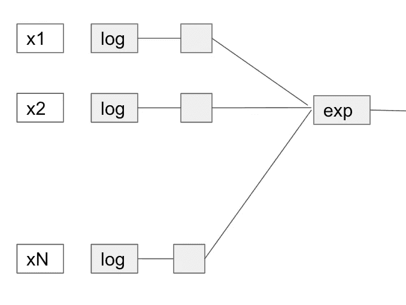

# 机器学习 Zuihitsu-II

> 原文：<https://medium.com/nerd-for-tech/machine-learning-zuihitsu-ii-6bc21c997089?source=collection_archive---------3----------------------->

***最古老的自我关注和倍增领域***

巴黎@Datategy 数据科学家和机器学习工程师埃伦·云吕博士

大家好。今天我想和你分享我在两个不同但高度相关的技巧上的经验，我从我的 ML 职业生涯开始就一直在大量使用这两个技巧。我将向您展示这些极其简单的技术，它们可能被证明是至关重要的，对某些类型的任务和数据集具有改变游戏规则的作用。这两个简单的算术概念在文章的两个副标题下被解释为“最古老的自我关注”和“乘法域”。我不是通过广泛的文献调查或从我周围更明智的 ML 大师的建议中得出这些想法的，因为这些是非常简单的技术，人们可能不会费心将其放在教科书中，甚至不会决定告诉另一位数据科学家。多年来，我接触了数百个不同的数据集，逐渐建立了这些思维模式。虽然它们可能看起来很明显，但我确信会有一些数据科学/机器学习新手，他们可以获得一些洞察力。所以，如果你有兴趣，我们来潜水吧！：

**最古老的自我关注**

如果你深入思考，当前的机器学习科学几乎完全是 2D **表格数据**处理。在 RNN (LSTM/GRU 或香草)，我们提取隐藏层(有时只有最后一层)；这是一天结束时的特征向量，并将其提供给密集的神经层用于分类或回归任务。在 CNN 中，我们通过核进行卷积以产生特征向量(其中该卷积核的权重也通过端到端反向传播来学习)，并执行我们的任务。即使在不使用 RNNs 的常规时态任务中，我们也首先通过滞后将时态数据“制表”。以各种不同的形式把同一个故事聚集在一起等等。当然，尽管有某些算法不适合这个 2D 表格框架，我们仍然可以有把握地说，现代 ML 的历史就是表格数据处理的历史。

我为什么要讲这些？好吧，具有讽刺意味的是，我观察到数据科学/机器学习/人工智能研究中的一个趋势，即对表格数据的兴趣开始消退。它不再仅仅是性感了。新的前沿出版物专注于许多特定的任务，如 NLP 或时间序列分析(我们对结果还不满意，并寻求迫在眉睫的改进)。在我看来，这种兴趣的丧失有两个危险:1 .许多 ML 任务本质上是表格化的，或者如果我们想的话，可以列表化。所以，2D 表格数据是这门科学的核心。这在某种程度上像是更高层次的线性代数。这一领域的任何改进都有可能在其他更高层次的人工智能和人工智能任务中发挥更大的作用。2 表格数据仍然是市场上最常见的数据形式。我觉得，在 catboost 和 xgboost 之后，我们已经切换到一种模式，吹嘘“2D 表格数据:任务完成！下一个！”。但是，我们都知道事实并非如此。

不管怎样，ML 的历史发展过程通常是从表格到更高层次的任务。但是，在我看来，反过来也是可能的，并将产生重大的改进。我们还可以应用一些专门为 NLP 开发的技巧和技术，例如，提升表格数据处理算法。

例如，我已经看到谷歌的 TabNet 试图实现这一点，但我还不能有一些时间来进一步研究它。[1]他们把自我注意的概念带到了 2D 表格数据分类中。除了本文中解释的技术，让我们保持简单。表格数据最可能的“自我关注”形式是什么？

嗯，它只是输入向量(一个数据点的特征向量与其转置的点积)的“协方差矩阵”的(数据点实例)。嗯，在“注意”这个概念出现之前，我记得那几天，我在检查整个数据集的相关矩阵进行检验；我对自己说“如果我只是将每个数据点的展平协方差矩阵(实例)作为辅助数据提供给回归器或分类器会怎么样?”？我甚至记得对自己说，“这不会带来很多好处，而且是多余的”。然而，随着我们最近都熟悉了自我关注的概念，现在这变得更有意义了。我只是想运用最基本的自我关注方式。在这种特殊情况下，这肯定是多余的。当你想一想，如果你的模型是一个有能力的模型，并且你用你的整个数据集很好地训练它，它应该固有地捕捉这种效果。因此，给你的模型添加辅助协变特征是不必要的。(嗯，协方差矩阵只不过是特征的点积。一个神经网络，它能够通过通用逼近定理来逼近荒谬复杂的非线性函数，它本身也应该包含这个小细节，对吗？)但是，在某些特定情况下，对于庞大且有偏差的数据集，这种冗余效应会消失，您会发现，实际上，这种额外的协变信息可以显著提高性能。我个人通过这种技术在某些类型的任务中获得了优势。而且，我确实建议您在遇到顽固的数据集时尝试一下。特别是，如果您通过平行层提供实际特征和共变特征，这不过是对表格数据的点积自关注的实现，显然，由于缺乏顺序，我们不寻求位置编码。我们也没有被强制提供测量单个数据点的特征的相关程度的整个自点积(让我们称之为协方差实例),但是我们可以只使用某些特征标量或向量，例如行列式、特征值等。

**乘法域**

古老的通用逼近定理告诉我们，即使不包含非线性激活函数，宽和/或深的多层感知器(MLP)也能够逼近地球上的任何非线性函数。你不需要钻研复杂的方程和不等式来理解这个观点。像这样分块思考。任何非线性函数无非是 4 种通用算术运算符:加、减、乘、除；对吗？减法是加法的一种形式，除法是乘法的一种形式。感知器只不过是加权求和。所以，它已经实现了最基本的求和。因此，MLP 只需要近似乘法来近似地球上的任何函数。嗯，这已经很容易了。乘以 N 无非是 N 次相加。因此，瞧！(对于没有激活的纯线性 MLP 网络)。但是请注意，就输入特性而言，我们试图实现的是合并它们的置换乘法，这要困难得多。我们不能简单地假设用非线性激活或树算法装饰的深度 MLP 将提取出这些效果！

当然，他们会的；但代价是更复杂，这反过来导致更少的过度概括和人类的可解释性。在某些情况下，良好的旧线性回归，特别是弹性惩罚是绰绰有余的，如果你饲料额外的辅助功能，如多项式的功能等(这是一种形式的置换乘法的功能)，我提到过，乘法关系的功能是极其突出的性质。因此，作为一个谦卑的建议，永远不要低估检查要素之间的乘法关系的潜力。我自己把这个叫做，把数据带入“*乘法域*”。

正如你所看到的，这种特征的置换乘法几乎等同于协方差矩阵的实例，即古老的注意，数据点的特征向量与其自身的转置的点积。因此，这两个概念可以互换，也可以从两个不同的角度进行解释。

解决这个问题的另一种方法是构建一个线性系统，其中输入特征的对数作为辅助，观察输出的指数。来自我们高中的代数:

输入输入要素的对数后(作为辅助或仅使用它们)，我们可以使用线性代数或基于线性代数的更复杂的工具，如 MLPs。有时使用特征的对数是专家数据科学家的一个众所周知的策略。我个人有 PyTorch 和 Keras 的编码层，时不时会查阅。我称之为“倍增层”。当然，我有时会根据任务和数据集决定将图层的偏差强制为零或其他度量。并且还要做适当的“零”或极小数/负数处理。根据数据集和任务的形式，有时，我使用 log(1+absolute(x))并反映符号作为辅助输出。然后，我可以级联这些层，有时与“正常”的密集层。还要注意，不仅仅是为了将数据带到一个乘法域，对数和指数本身在本质上是非常固有的。因此，在数据集之间找到自然对数关系的可能性很大。生活给了你 2.71… via 欧拉是有原因的:)。

但是注意，通过反向传播我们可能会有一些问题！指数的微分仍然是指数，自然对数的微分是 1/x。因此，人们必须掌握用经验来训练这种类型的网络，避免爆炸/消失梯度(或无效学习),或者根本不应该考虑并坚持使用常规技术。

立正！这种类型的图层(尤其是当你想要层叠几个图层的时候)很容易出现故障(消失/爆炸渐变)或者在大多数表格任务中表现不佳。然而，对于某些小众数据集和项目，它们可能会对你有很大帮助。