# 机器学习 Zuihitsu-VII

> 原文：<https://medium.com/nerd-for-tech/machine-learning-zuihitsu-vii-cb92fbf39a86?source=collection_archive---------1----------------------->

# **变型自动编码器的实用前景**

巴黎@Datategy 数据科学家和机器学习工程师埃伦·云吕博士

变分自动编码器(VAEs)可以被认为是深度学习文献中相对被低估的架构之一。自从开创性论文[Kingma 等人，2013 年]引入以来，各种扩展都是在这个普通模型的基础上开发的，以提高其性能并使用例多样化。然而，通过快速搜索 github，可以推断出 VAEs 的实际实现在某种程度上是多余的，如果没有限制的话。

在本文中，我想分享我使用 VAEs 的个人经验，VAEs 为我提供了一个竞争优势，它们在无监督和有监督的任务中都具有强大而精确的高维嵌入能力。不幸的是，正如刚才所说的，我发现对于一个初学者来说，找到一个准确实用的即插即用解决方案是非常困难的。

我们可以将 vae 的相对不受欢迎归因于其不幸的时机，这被当时新兴的生成敌对网络(GANs)所掩盖[Goodfellow 等人，2014]。(现在，有了生成扩散模型[Sohl-Dickstein 等人，2015])。这也源于这样一个事实，即 VAEs 的生成能力从第一天起就比其高效的表示学习潜力更受重视。因此，维斯错过了被炙手可热的人工智能大师崇拜的机会，获得了“过去十年深度学习中最有趣的想法”等荣誉，就像甘斯一样。这是一个特别公正的评估，在当时，香草甘确实比香草 VAE 在深层生殖技能上提供了显著的提升。

然而，不幸的是，在这次日食期间，我们可能稍微低于 VAEs 的嵌入潜力，特别是将该架构作为数据科学家的“主食模型”蓬勃发展。这可能看起来有点夸张，但在我的职业生涯中，我有机会尝试过许多不同的表示学习用例，很难不将 VAEs 标记为该任务的“行动模型”。例如，完全贝叶斯网络(深度信念网络)[Hinton，2009]很难训练产生合理的结果，因为它们需要复杂的训练机制和复杂性。伪贝叶斯网络实际上无法学习精确的概率流形，其中通过激活推理中的漏失引入了错误的变化。更不用说，旧学校的线性分解方法，不能捕捉非线性或相对较新的算法，如 t-SNE 和 UMAP，不能投影真正的全局相似性和语义协变。因此，根据我的严格经验，一个香草 VAE(或其扩展，如 CVAE，RTVAE 等。)找到了最佳位置。和任何非变分深度学习架构一样，常规自动编码器总是学习过拟合和窄流形。我敢肯定，除了纯粹的生成功能之外，稍微研究过这些模型的数据科学家也会欣赏它的效率。

除此之外，VAEs 值得关注，即使只是因为它们结合了简单而强大的创新思想，如重新参数化技巧、对数方差等、分布正则化等。因此，在本文档中，在连续的要点中，我想快速地重申一下普通变型自动编码器的基础知识；解决几个可用的开源实现中的某些问题，并通过示例提到构建和训练 VAEs 时的利基和微妙操作。正如您可能已经猜到的，重点将是它们对表格数据的潜在压缩，而不是生成上下文。有趣的是，我注意到社区中的其他数据科学家也做出了类似的观察，例如[https://towards data science . com/variation-auto encoder-demystified-with-py torch-implementation-3a 06 bee 395 ed](https://towardsdatascience.com/variational-autoencoder-demystified-with-pytorch-implementation-3a06bee395ed)

**1。香草 VAE**

正如我刚才提到的，一个香草 VAE 建筑基于几个非常简单，但美丽和表演的想法。一个机器学习工程师，很难在检查完之后不爱上它。在这里，我假设读者对确定性深度自动编码和潜在数据嵌入理论有基本的了解。与常规的确定性自动编码器不同，普通 VAE 有一个瓶颈层，所有的概率魔术都发生在这里。除了这一层之外，所有其他组件都像常规 AE 一样具有确定性。直截了当地说，将高维输入映射到这个变化层的确定性子网络被称为“编码器”，而从概率潜在空间重构数据的确定性子网络被称为“解码器”。

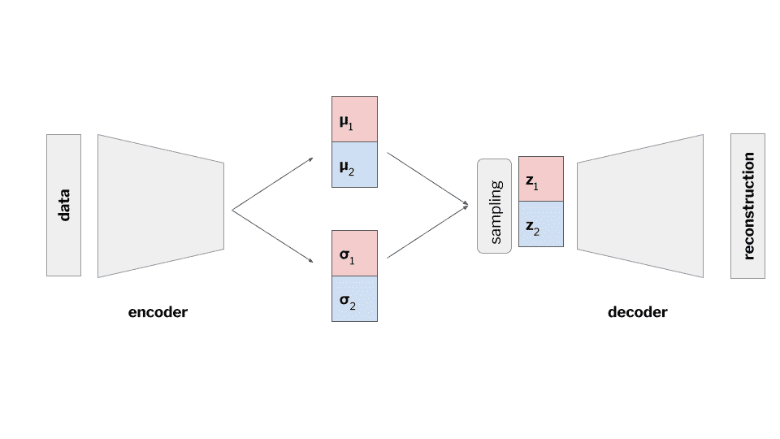

二维潜在空间的香草 VAE 的简化建筑。

图中显示了一个简化的香草 VAE 架构，其中仅使用了 2 个潜在维度。让我们通过这个具体的例子来概括 VAE 的理论。就像常规 AEs 一样，确定性编码器将数据压缩到更低的维度。在这一点上，在变化的潜在层中(在这个特殊的例子中是二维的)，我们稍微转换了一下上下文和目标。现在，我们想知道的是两个变量的概率分布，理想情况下是高斯分布(稍后我们会讲到一点。)

由于高斯分布可以完全由其两个动量(均值和方差)来定义，所以中心思想是学习“均值”和“方差”参数(均值和方差神经元)。因此，数据的潜在表示被建模为多项式高斯分布。VAE 建筑的某些有趣属性就是从这一点开始的。由于问题的棘手性和复杂性，请遵循蒙特卡罗方法。因此，在每一次迭代中，我们从这个已知的分布中抽取数据点，这是 VAE 概率性质的根源。

然而，这里有一个陷阱。整个目标是以端到端的方式训练这个网络的所有参数。这种内部采样策略完全打破了梯度下降的概念，我们需要以某种方式将其转换为可微分的东西。香草 VAE 纸在这一点上提供了一个简单而优雅的策略，它被称为“重新参数化技巧”。其思想是生成单位正态随机变量的向量。我们将采样向量定义为与学习的均值向量的概率偏差，学习的方差幅度乘以这个随机向量。通过这个简单的技巧，我们能够引入潜在向量的定义，该潜在向量对于反向传播算法是可微的，因为随机分量是线性分离的。

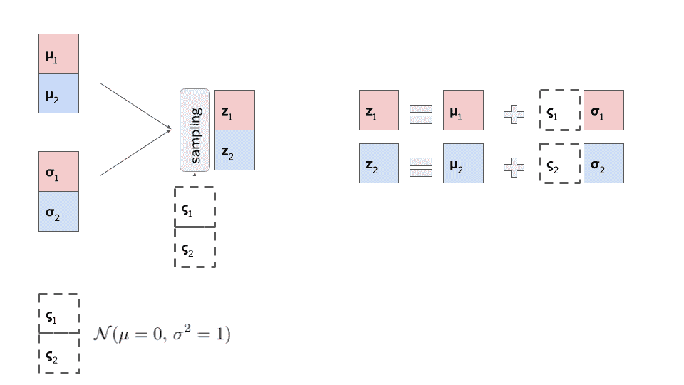

重新参数化技巧是一个简单而强大的想法，允许目标变得可微，以符合反向传播。使用方差的对数来取悦梯度是香草 VAE 提案中的另一个不费力的聪明想法。

在这一步还有另一个优雅的接触。由于方差是一个严格的正现象，我们在深层神经环境中学习这样一个参数会有困难；因为以零为中心的值更符合学习过程。因此，我们宁愿学习方差的对数，而不是直接学习偏差，它可以在采样步骤中简单地求逆。

VAE 原始论文的另一个有趣的方法是在损失项中提出一个“正则化项”。中心思想是将潜在空间分布(VAE 的均值-μ值)强制为单位正态分布。从理论上讲，这将把数据投射到一个更加“平滑”、概率性、可概括的流形上，这反过来也将产生更好的生成属性。为了做到这一点，我们将正则化损失添加到总体损失定义中，这只是瞬时潜在空间分布和多项式单位高斯分布之间的 Kullbeck-Leibler (KL)散度度量，它反映了相似性。

理论上，潜在样本的真实高斯分布可能是实现理想 VAE 条件所必需的，具有其特定的预先假设。然而，在实践中，我们从不寻求这种真正的多正规性。在现实世界中，这种想法只是“强制”网络具有平滑的表示。

原始论文提出使用 ELBO(证据下限),其是目标上的下限，但是在理论上提供了在输入数据分布上具有某些先验假设的情况下对数据的适当重建的真正优化。

维斯的爱尔博损失。[https://jaan . io/what-is-variable-auto encoder-vae-tutorial/]

如前所述，VAE 的总体目标总是被认为是重建损失和潜在空间正则化损失(KD 损失)的线性和。即使从理论角度来看，这种损失函数定义不是零和游戏，在实际世界中，迫使潜在空间平滑总是会降低重建能力(如果不仅仅是看到的数据)。因此，在文献中通常将总损失函数的这两个分量视为竞争者。

实际上，现在驯服维斯的真正挑战开始了。看起来，开源的 VAE 实现充斥着 MNIST 的例子，那是在金玛发表论文“to go dataset”进行生成性演示的时候。如您所知，原始 MNIST 数据集可以被视为二进制图像，因为数字是在黑色背景上以白色书写的(尽管实际上是连续的灰度)。因此，这个例子的 VAE 实现使用二进制交叉熵用于重建误差。不幸的是，我们观察到大多数开源实现 PyTorch 或 Tensorflow 总是遵循相同的例子，具有相同的损失定义。我记得看到这个 BCE 损失项(以及重建时的 sigmoid 激活)用于彩色图像示例，甚至是表格数据。在我看来，关于 VAEs 的 keras 教程在某种程度上主导了开源实现，这是非常危险的。

对于某些表格数据示例，我见过许多使用 MSE 损失的实现，理论上，如您所知，这相当于最大似然估计，前提是假设数据为高斯分布。MSE 的使用是完全正确的，至少在实践中是如此，但是人们需要理解重建误差和潜在空间正则化 KL 发散项的非常不同的量级的适当平衡。

对于表格数据，最新和最有趣的论文之一应该是[Akrami，2022]。本文特意将重点放在表格数据上，假设连续变量为高斯分布，分类特征为伯努利分布，适当关注重建的 ELBO 损失。此外，它们提供了一种β发散机制来处理训练数据中异常值的存在，进一步增强了潜在空间的概化能力。

**2。平衡重建误差和正则化**

即使没有做文献调查，只是自己用 VAEs 做实验；你会理解，实际上，在这个问题上最重要的挑战是重构误差的正确定义，以及仔细平衡包含正则化项的总损失函数，这迫使潜在空间分布朝向单位多项式高斯分布。但正如你所看到的，这是一个“苹果和橘子”的问题。重建误差可以在 1000s 的范围内，而 KL 损失保持在 1 以下；这反过来又决定了重建的总体目标。因此，不幸的是，就像深度学习理论中的大多数事情一样，对于这种差异没有正确和准确的答案，我们需要去实证。

如果你查阅文献，你会发现在这个问题上有一些非常有趣的论文。首先想到的是给重建项添加一个简单的线性系数，降低优势。这些通常被称为β-VAEs [Higgins，2016]，β是因子。然而，人们尤其可以看到，对于有效的平衡机制，在理论上还没有达成共识。

一篇很有意思的论文是[Asperti，2020]，它仔细研究了这个问题，我觉得特别有意思。他们的观点基于平衡先前论文的术语推导的理论基础[戴，2019]。该先前的论文提出将重建误差定义为 MSE 的函数，同时学习用于正则化平衡的端到端上下文中的真实伽马参数。

[戴，2019][阿斯佩蒂，2020]

[Asperti，2020]观察到学习伽马可能是不必要的，但是可以通过对建议的总体损失定义进行必要的重复来确定性地推断。

文献中关于损失平衡的其他有趣建议包括[Chen，2018]提出重建误差的对数，以及[Zhao，2017]使用互信息(我将在下一节的一个示例中使用此信息损失)。

**3。一些练习**

理论说够了，让我们动手吧。由于文章的介绍性质，我将使用一个非常简单的数据集和 VAE 架构。让我们使用流行的葡萄酒数据集，它有 13 个特征，都是数字。我们将使用非常简单的香草 VAE 建筑。您可以在附件中找到重新生成该实验的代码。我在编码器和解码器中使用了对称的 2 层 VAE，编码层分别由 8 个和 4 个神经元组成，具有 relu 激活和批量归一化层。我们有二维表示层，(因此，可学习 2 个均值和方差分量)。

这个实验中的想法是显示适当的重建误差选择的重要性，并将其与 KL 发散损失平衡。首先，我们将使用一个简单的 MSE 损失，直接与正则化损失相加，无需重新加权。在每个实验中，我们将有一个显示动态 gif 的 GIF，改变每个时期，显示 4 个图形，数据点在 2 维潜在空间的分布，重建损失，KL 发散损失和总损失。

请注意，葡萄酒数据集本质上是用于分类的，其中每个葡萄酒样本是 3 个类别中的一个。我没有将这个目标类用于自动编码特性，而是用于对潜在散点图上的数据点进行着色。

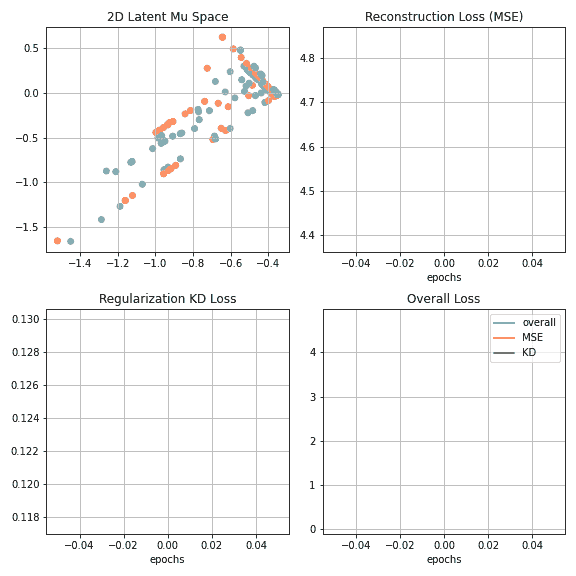

不使用重建误差系数的潜在空间和损失的演变。尽管由于大小的差异，总损失完全由重建损失所支配，但是 KL 损失仍然以可接受的方式发展。

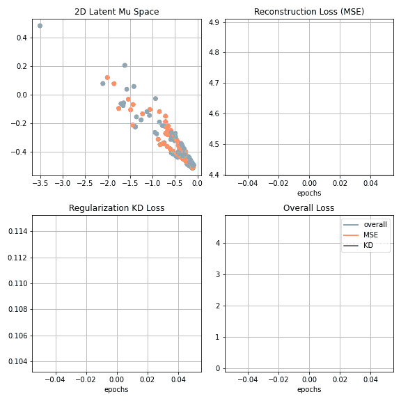

用 0.1 因子分解(β)重建损失的相同实验。你可以看到，现在整体损失的重心在 KL 正则化上。

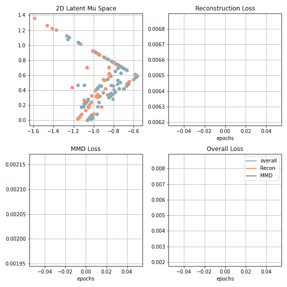

使用[赵，2017]中提出的基于互信息的总体损失。

**4。结论**

4.1 VAE 思想本质上是优秀的，有非常简单和聪明的技巧，如重新参数化技巧，或加强先验的潜在分布以增加流形的光滑度。

4.2 通过适当的设计和训练策略，vae 看起来像是低维数据嵌入的“go 方法”。然而，它们的生成能力成为头条新闻，被更复杂、更新的架构所掩盖，阻碍了它的多方面学习能力。

4.3 在 VAEs 上没有足够的资源。新来的数据科学家很容易陷入错误和/或不充分的教程和开源实现的陷阱。这些资源中有相当多的冗余，复制 MNIST 实验。

4.4 VAEs 的致命弱点是潜在空间正则化的重建误差和 KL 发散损失的适当平衡。没有正确的理解，没有足够的资源，数据科学家很容易发现自己交付了一个难以置信的实现。

4.5 尽管 vae 基于某些坚实的理论基础 1，并具有强大的数据先验假设，但在所有深度学习环境中，真正的交易是在经验、实践理解和操作中。为此，数据科学家/机器学习工程师应该熟悉 VAE 理论的复杂性。

4.6 根据我的经验，VAE 设计中忽略的一个最重要的方面是激活的正确选择。为了在互联网上找到类似的普通例子，我选择了 relu。例如，葡萄酒数据集在某种程度上已经是简单的相关性和小规模的。因此，有了 relu 激活，甚至有了潜在空间正则化的增强，我们最终得到了纠缠流形，正如我们在实验中看到的那样。一般来说，我观察到，对于适当的表格低维嵌入任务，最好不要使用激活，至少在瓶颈周围的一层之前和之后。并且为了补偿重建性能的相对损失，可以增加层数。

**5。参考文献**

[金玛等人，2013 年]金玛、迪德里克·p 和马克斯·韦林。"自动编码变分贝叶斯." *arXiv 预印本 arXiv:1312.6114* (2013)。

【Goodfellow 等人，2014】good fellow，Ian 等人《生成性对抗性网络》*神经信息处理系统进展* 27 (2014)。

【Sohl-Dickstein 等人，2015】Sohl-dick stein，Jascha 等人《利用非平衡热力学的深度无监督学习》。*机器学习国际会议*。PMLR，2015 年。

杰弗里·辛顿，《深度信念网络》Scholarpedia 4.5 (2009): 5947。

【Higgins，2016】Higgins，Irina，等，“beta-vae:用约束变分框架学习基本视觉概念。”(2016).

[Akrami，2022] Akrami，Haleh 等人，“使用β散度的鲁棒变分自动编码器”*知识系统* 238 (2022): 107886。

阿斯佩蒂，安德里亚和马特奥·特伦廷。"在变分自动编码器中平衡重建误差和 Kullback-Leibler 发散." *IEEE 访问*8(2020):199440–199448。

[戴，2019]戴，宾，大卫·维普夫。"诊断和增强 VAE 模型." *arXiv 预印本 arXiv:1903.05789* (2019)。

[陈，2018]陈，鹏飞，陈，。"对数双曲余弦损失改善变分自动编码器."(2018).

[赵，2017]赵，盛佳，宋家明，Stefano Ermon。"信息最大化变分自动编码器." *arXiv 预印本 arXiv:1706.02262* (2017)。

**6。附件**

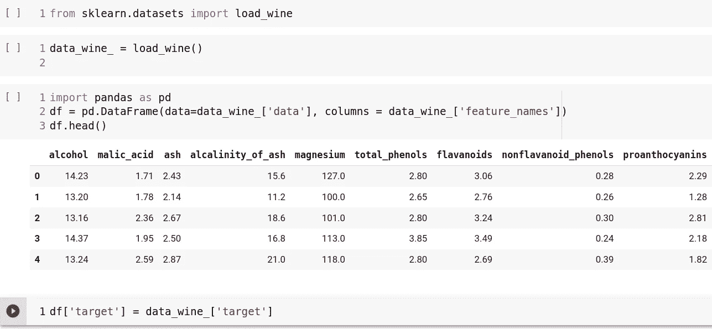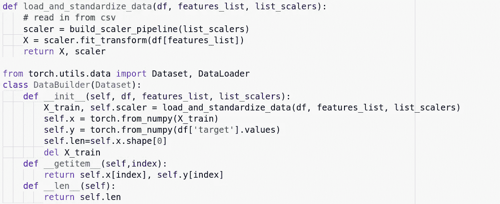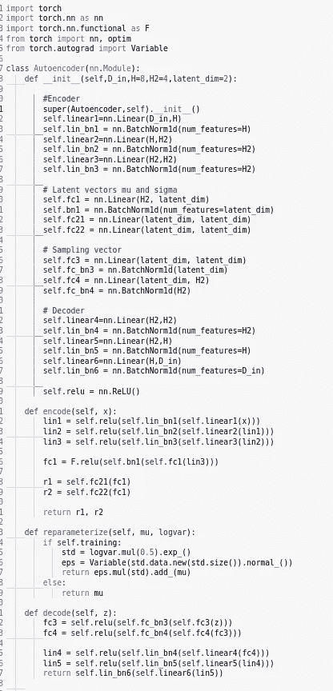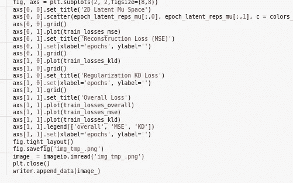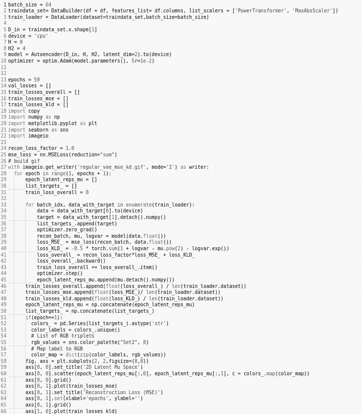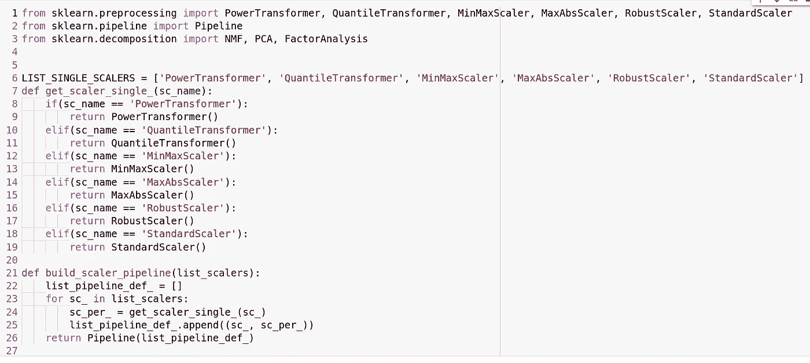