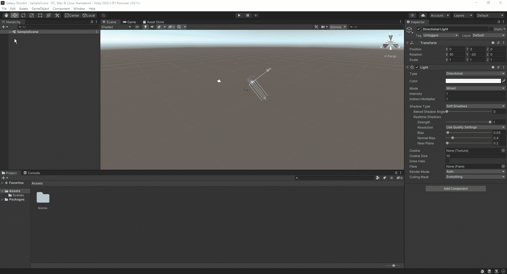
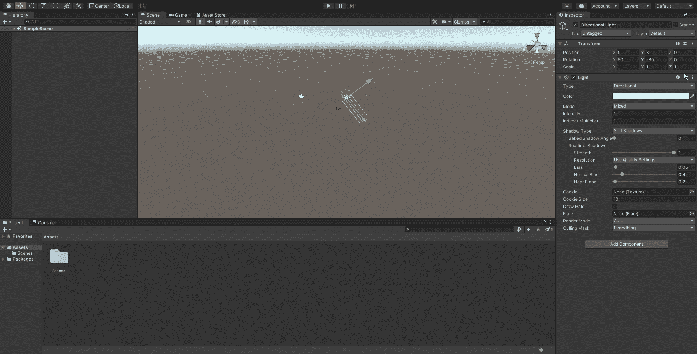
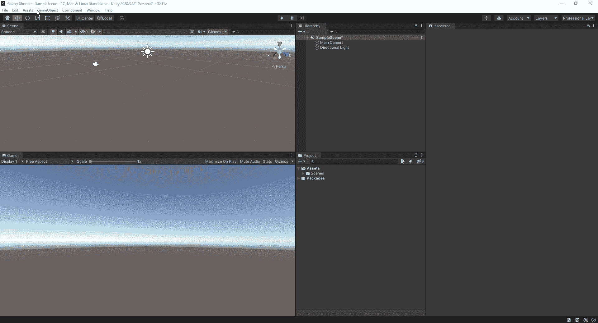
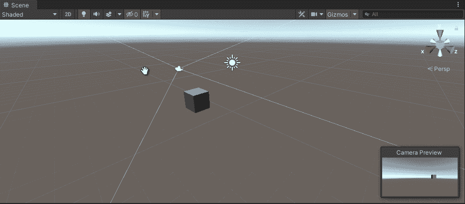
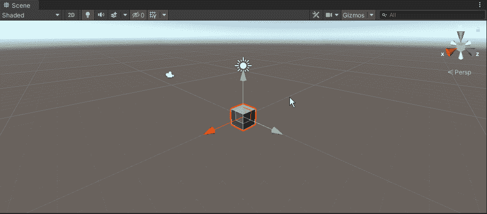
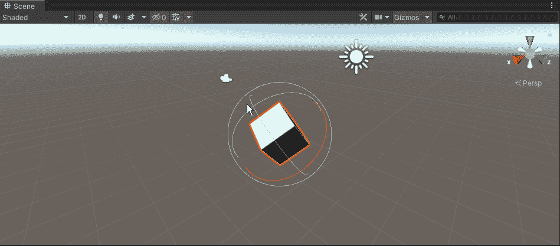
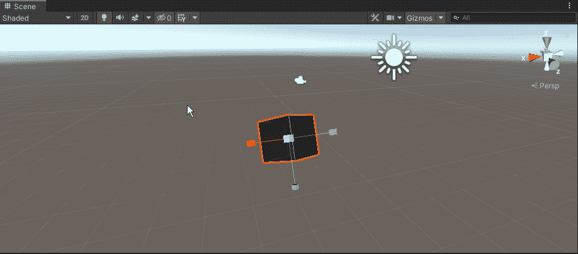
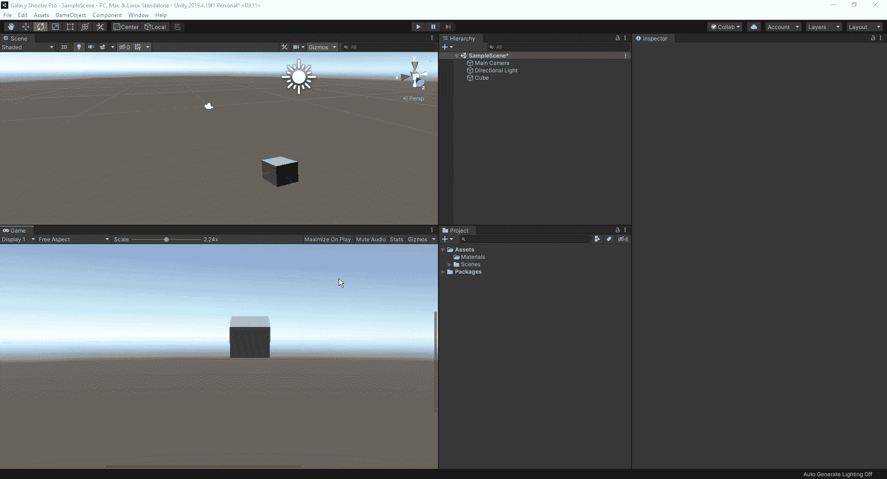

# 制作对象和更改布局

> 原文：<https://medium.com/nerd-for-tech/making-objects-and-changing-layouts-5b2b8410658c?source=collection_archive---------23----------------------->

***布局***

Unity 的一大优点是它的定制能力。如果你不喜欢各种标签的布局，你可以很容易地把它移动到你想要的任何地方。这使用户能够将他们的编辑器更改为最适合他们的。

摆弄布局

正如我们从上面可以看到的，这只是一个简单的点击，拖放过程来移动标签到任何你想要的地方。如果你总是喜欢玩默认，并作出意外的改变，你可以很容易地进入右上角的布局菜单，并选择默认。至于什么是更好的选择，下面的布局是一个更干净，更有组织的方式让你的编辑器。

打开 Unity 布局菜单

正如你所看到的，它在检查器的右边给了你一个更大的区域，在这里你可以对你的各种设置做很多改变。它会把游戏视角的摄像机拿出来，放在你的场景视角下。这可以让你看到你在场景中所做的任何事情的实时变化，只要它在摄像机的视野之内。

***创建/修改对象***

在 Unity 中创建简单的对象是一个快速简单的 3 步过程。所有要做的就是进入游戏对象，选择你想要的对象类别(在这个例子中是 3D 对象)，然后选择你想要的形状类型(在这个例子中是立方体)。

不同的工具

我们要讨论的第一个工具是手。选中时，它允许您移动场景。

第二个工具是翻译工具。它允许你移动物体。只需点击您想要移动对象的箭头，并向该方向拖动即可。每个箭头对应于轴上的不同方向。红色箭头代表 X 轴，绿色箭头代表 Y 轴，蓝色箭头代表 Z 轴。

第三个工具是旋转工具。它允许你沿着特定的轴旋转物体。

第四个工具是拉伸工具。这一个允许你沿着每一个单独的轴改变物体的大小，或者沿着正方形在中间的所有轴成比例地改变。

最后一个工具允许您一次选择所有内容，而不是一次只选择一个。
现在，如果你试图对你的对象进行小的调整，并且不想使用最终的工具，那么不得不在每个工具之间切换似乎有点乏味。对我们来说幸运的是，Unity 使得在所有不同的工具之间切换变得简单。他们将每个工具映射到一个键上，更好的是，用 QWERTY 按顺序映射。

最后，我们将看看如何为我们的对象创建一个基本的材质并应用它们。

创建和应用基础材料。

正如我们从上面所看到的，创建一个基本材质并将其应用到一个对象上是一个简单的任务。首先，我们右键单击项目选项卡，并转到创建→材料。在那里，我们将材质重命名为 cube_mat。为了更好地实践，最好在命名所有材料时使用 _mat。如果我们正在开发一个大型游戏，你可能会看到在一个场景中有数百个，如果不是数千个不同类型的资产。如果我们想要搜索一个特定的条目，或者一类条目，那么 _mat 就派上了用场。