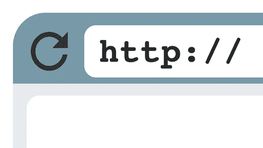
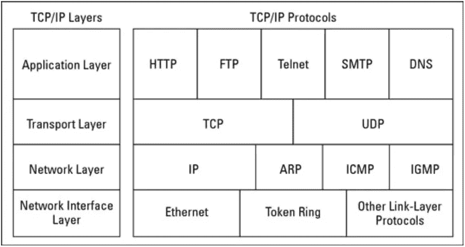

# 理解 HTTP — I

> 原文：<https://medium.com/nerd-for-tech/making-sense-of-http-i-b6844dc05f66?source=collection_archive---------2----------------------->

假设你在谷歌上搜索某样东西。坐下来想想这里发生了什么。你在找什么东西。

好吧！从哪里？也许在你的办公室或家里。

但是我们需要一个物理设备来搜索吗？可能是笔记本电脑或手机。

在谷歌搜索之前，你需要在你的设备上加载谷歌。但是你不知道谷歌机器/设备在哪里。但是你需要和它联系起来。

据我们所知，如果我们在家里或办公室有互联网连接，我们可以在你的设备上加载一个谷歌页面。

这里发生的是两个设备(你的和谷歌的)之间的连接。这里的利益相关者是两个物理设备和连接的设备。这种连接设备的想法被称为**联网。**

等等！为什么我们这里需要**互联网**？很简单，如果谷歌的设备位于离办公室/家更近的地方，我们可以通过一些线缆直接连接到设备。不幸的是，谷歌设备并没有离我更近。从谷歌的角度来看，他们不能在每个人的邻居中安装他们的设备，因为他们会收到来自世界各地的请求。这就是互联网发挥作用的地方。

互联网使你能够与世界上遥远地方的设备连接。此互联网由**互联网服务提供商(ISP)提供。**

这个互联网通过很多网络(连接)。这就是为什么互联网被称为“网络的网络”。

到目前为止，我们还不知道 HTTP 为什么会进化。为此，我们需要了解整个系统。

任何交流都依赖于共同的语言，因此发送者和接收者相互受益。在这个网络世界里，它被称为**协议。**

> *一个* ***协议*** *是定义计算机内部或计算机之间如何交换数据的规则系统。设备间的通信要求设备对交换的数据格式达成一致。定义一种格式的规则集被称为* ***协议*** *。*资料来源:MDN 网络文档

我们将数据从计算机发送到接收设备。该数据可大可小。如果数据很大，则数据被分成称为“**数据包**”的片段这使我们能够提高数据传输速率。

作为接收方/发送方，我关心的是整个数据，而不是数据包。这种 ***打包*** 的方法是为了通信的效率。为了确保所有打包的数据都转换成完整的数据(原始数据)，TCP 需要一些规则或协议来组装所有的数据包— **TCP(传输控制协议)。**

这还没有结束，我们发送的所有数据都被分成包，我们必须确保所有的包在 TCP 组装所有的包之前到达预定的目的地。因此，为了确保地址的正确传递，我们有另一个叫做 **IP(互联网协议)的协议。**

这两个 **TCP** 和 **IP** 是当今现代通信的基础。随着时间的推移，许多发展，安全问题，最终，许多协议。在当今世界，它被统称为 **TCP/IP suite，**以两个最重要的协议命名。这个 TCP/IP 可以被认为是具有与之相关联的协议的层。

TCP/IP 模型

上层在逻辑上更接近用户，而下层更接近数据的物理传输。

HTTP — **超文本传输协议就位于这一上层。我希望你能把 HTTP 附在这张大图上。后面我们会详细看到 HTTP。**

HTTP 大多与 **Web 相关。**web 只是互联网的一个应用，即 TCP/IP 套件。从技术上讲，Web 位于 TCP/IP 套件的应用层，HTTP 是这一层的协议之一。

BBC 对此做了很好的解释，

*“万维网，或简称为 web，是当你在一个设备前上网时看到的网页。*

但是互联网是一个联网计算机的网络，网络在其上运行，电子邮件和文件也在其上传输。

把互联网想象成连接城镇和城市的道路。万维网包含你在路上看到的东西，比如房子和商店。

*载体是四处移动的数据——一些在网站之间移动，另一些将通过互联网传输你的电子邮件或文件，与网络分开*”。

*原载于 2022 年 8 月 12 日 https://www.pansofarjun.com**的* [*。*](https://www.pansofarjun.com/post/http-a-layman-s-guide-i)