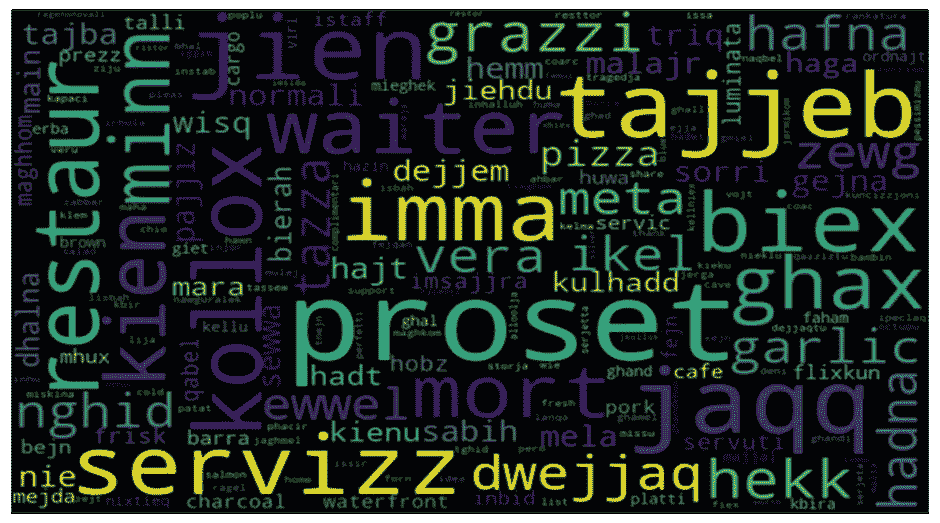
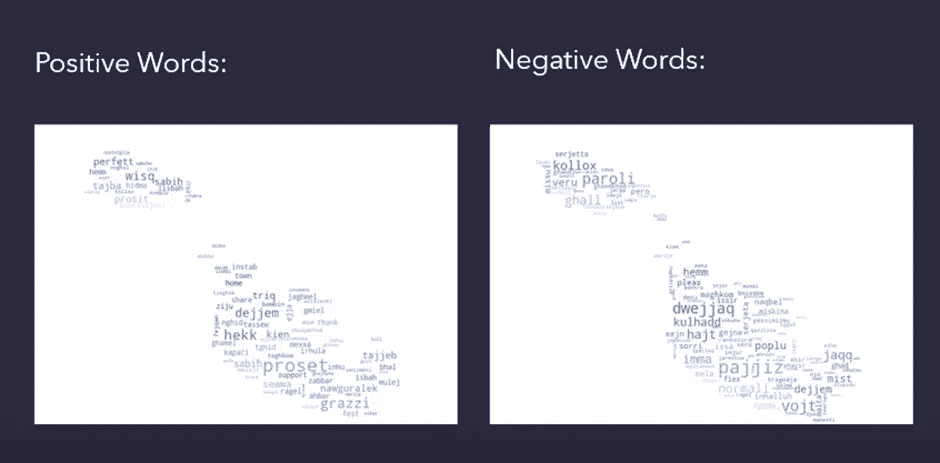

# 马耳他情感分析

> 原文：<https://medium.com/nerd-for-tech/maltese-sentiment-analysis-f9658d187f7b?source=collection_archive---------6----------------------->

低资源语言的自然语言处理

2021 年，我探索了用马耳他语创建情感分析的想法。在本文中，我将描述这种系统遇到的挑战和优点。

什么是情感分析？

情感分析是由机器自动检测文本是正面还是负面的过程。然而，对情绪进行分类的标签并不仅限于积极或消极，因为已经有了各种类别，例如:主观的、客观的、讽刺的、中性的、混合的等等。情感分析通常用英语完成，因为寻找其他语言的数据集可能相当困难和乏味。

为什么重要？

情感分析提供了一种强有力的方法来捕捉客户对公司产品的情感，这样他们就可以根据人们的需求来定制他们的业务。此外，由于评论数以千计，因此节省了时间，并且一个总体总结可能非常有用，而不是手动检查和阅读每个评论。各行各业都在日常运营中使用情感分析，例如:医疗保健、金融、酒店等。

挑战？

当创建情感分析时，过滤是非常重要的，因为一些单词不包含情感，它们不应该在训练期间被包括在内。需要删除的一些单词有:地点、国家名称、代词、数字等。某些标点符号可以删除，但在某些情况下保留它们是有意义的，例如使用感叹号可以传达强烈的情感。某些故意的拼写错误也可能传达出强烈的情感，比如“我爱它”。

收集合适的数据集可能很棘手，因为一些方法使用众包，即一组参与者一起工作来提供数据。众包可能具有挑战性，因为人们在日常生活中很忙，寻找志愿者进行合作可能非常困难。然而，新闻文章或评论可以是收集数据的一个很好的来源，因为它们每天都被上传，所以可以提供持续的数据流。此外，由于不同的人评论他们的文本可能包含拼写错误，标点符号和缩写的组合，这对于测试来说是很好的。

一旦数据被正确处理，必须选择一个特征集，特征集相应地“排列”单词，因此单词“最佳”在一个特征集中可能是高排列，但在另一个特征集中可能是低排列。所使用特征集的一些例子是 TF-IDF 或 Doc2vec。最后，必须选择合适的算法来给出情感，如随机森林或 SVM。

当专门为马耳他语创建一个时，遇到了其他几个挑战，例如:识别马耳他习语，各地之间的辩证差异，以及找到一个大数据集来训练人工智能。我计划在将来通过查看以前为其他低资源语言所做的工作来探索这些挑战的可能解决方案。

总之，马耳他情感分析是一个新的研究领域，对于许多激动人心的项目来说仍然是开放的。对于任何对创建情感分析感兴趣的人来说，monkeylearn 等服务提供了一个无需任何编码知识就能创建情感分析的平台。