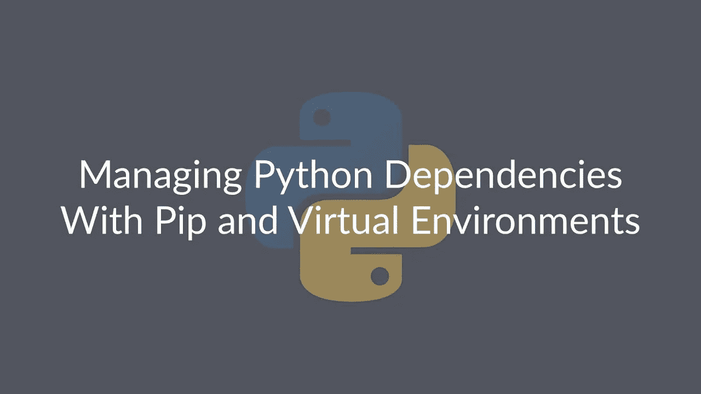

# 使用虚拟环境管理 Python 依赖关系

> 原文：<https://medium.com/nerd-for-tech/managing-python-dependencies-using-virtual-environments-a89f7c54a570?source=collection_archive---------14----------------------->



当我们开始构建一个超越简单脚本的 Python 项目时，我们倾向于开始使用第三方依赖。当处理一个更大的项目时，我们需要考虑以一种有效的方式管理这些依赖关系。当安装依赖项时，我们总是希望在虚拟环境中。它有助于保持物品整洁。这也有助于避免搞乱我们的 Python 环境。

# 为什么我们需要 Python 虚拟环境？

我们可以使用 Pip 将包安装到我们的 Python 项目中。在一个 Python 项目中安装多个包是很常见的。这可能会导致一些关于已安装的软件包版本及其依赖关系的问题。

当我们在项目中使用`pip install <package name>`时，我们在全局 Python 名称空间中安装包及其依赖项。这将为我们配置 python 的特定 Python 版本安装软件包。我们可以通过使用

```
$ python3.7 -c "import sys; print('\n'.join(sys.path))"

/usr/lib/python27.zip
/usr/lib/python2.7
/usr/lib/python2.7/lib-dynload
/usr/lib/python2.7/site-packages
```

而如果用`pip3 install <package name>`安装同一个包，它会和 Python 3 版本一起安装在一个单独的目录下。我们可以通过使用以下命令来解决这个问题:

```
python2.7 -m pip install <package name>
```

这仍然没有解决我们在系统范围内安装软件包的问题。这会导致以下问题:

*   拥有相同包的不同版本的不同项目将会相互冲突
*   项目的依赖项可能与系统级的依赖项冲突，这可能会彻底破坏系统
*   多用户项目是不可能的
*   针对不同的 python 和库版本测试代码是一项具有挑战性的任务

为了避免这些问题，Python 开发人员使用虚拟环境。这些虚拟环境利用隔离的上下文(目录)来安装软件包和依赖项。

# 创建虚拟环境

我们需要一个工具来利用 Python 虚拟环境。用来制造这些的工具被称为 [venv](https://docs.python.org/3/library/venv.html) 。它内置于 Python 3.3+的标准 Python 库中。

如果我们使用 python 2，我们将不得不手动安装它。这是我们希望在全球范围内安装的少数几个软件包之一。

```
python2 -m pip install virtualenv
```

注意:我们将在这篇文章中更多地讨论 venv 和 Python 3，因为它和 virtualenv 有一些不同。命令稍有不同，工具的工作方式也有所不同。

我们将首先创建一个新的目录，我们希望在其中处理我们的项目。

```
$ mkdir my-python-project && cd my-python-project
```

然后我们将创建一个新的虚拟环境:

```
$ python3 -m venv virtualenv

# creates a virtual environment called virtualenv, the name can be anything we want
```

这将在我们刚刚创建的目录中创建一个名为 virtualenv 的目录。该目录将包含一个 bin 文件夹、一个 lib 文件夹、一个 include 文件夹和一个环境配置文件。所有这些文件确保所有 Python 代码都在当前环境的上下文中执行。这有助于实现与全球环境的隔离，并避免我们前面讨论的问题。

为了开始使用这个环境，我们需要激活它。这样做还会将我们的命令提示符更改为当前上下文。

```
$ source env/bin/activate
(virtualenv) $
```

该提示还指示虚拟环境是活动的，并且 python 代码在该环境下执行。

在我们的环境内部，系统范围的软件包是不可访问的，并且安装在环境内部的任何软件包在外部都是不可用的。

虚拟环境中默认只安装了`pip`和`setuptools`。

激活环境后，path 变量被修改以实现虚拟环境的概念。

当我们完成并希望切换到全局环境时，我们可以使用 deactivate 命令退出。

```
(virtualenv) $ deactivate 
$
```

# 跨环境管理依赖关系

既然我们已经设置了虚拟环境，我们就不希望继续共享可以使用 pip 安装的包。我们希望排除我们的虚拟环境文件夹，并能够在不同的系统上重现我们的工作。我们可以通过利用项目根目录中的需求文件来做到这一点。

假设我们在虚拟环境中安装了 Flask。之后，如果我们运行`pip freeze`，它将列出我们已经安装的软件包及其版本号。

```
(virtualenv) $ pip freeze
Flask==1.1.2
```

我们可以把这个写到 requirements.txt 文件中上传到 git，或者以任何其他形式与他人分享。

```
(virtualenv) $ pip freeze > requirements.txt
```

这个命令也可以用来更新文件。

然后，每当有人想在他们的电脑上运行我们的项目，他们需要做的就是:

```
$ cd copied-project/
$ python3 -m venv virtualenv/
$ python3 -m pip install -r requirements.txt
```

一切都会像在我们的系统上一样正常工作。现在，我们可以管理 python 虚拟环境，从而根据需要管理依赖项和包。如果你对此有任何问题，请在下面留言。

*原载于 2021 年 2 月 23 日 https://www.wisdomgeek.com**的* [*。*](https://www.wisdomgeek.com/development/web-development/python/managing-python-dependencies-using-virtual-environments/)