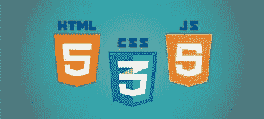
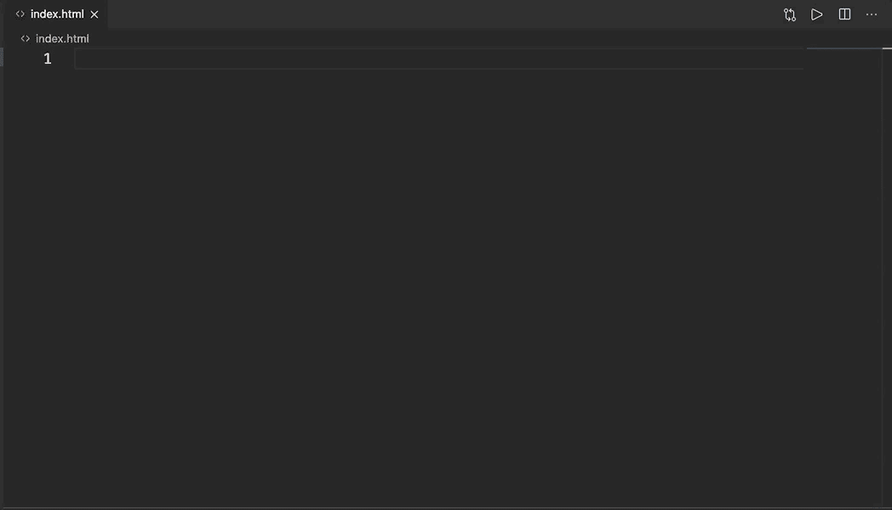
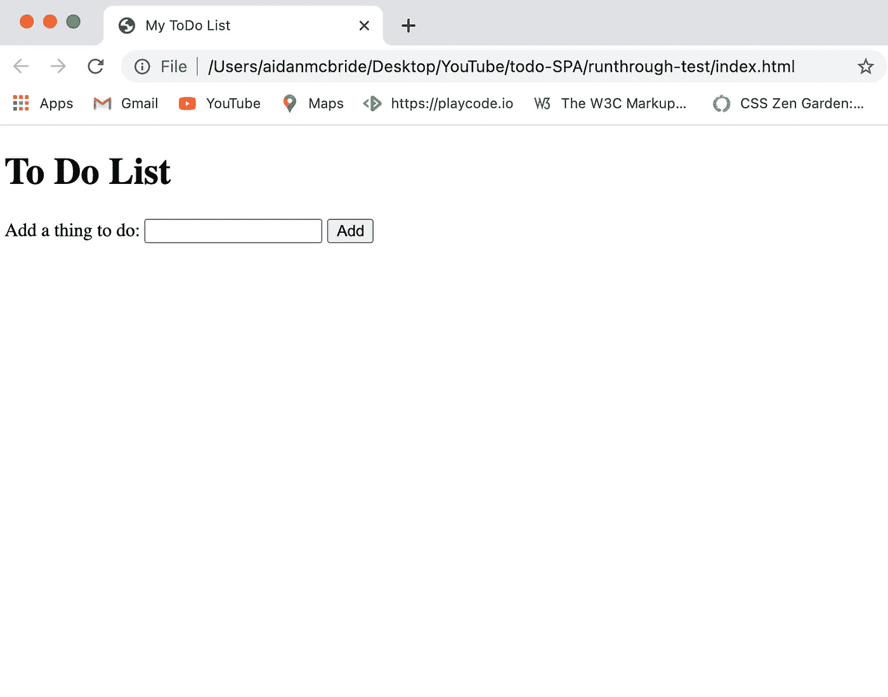
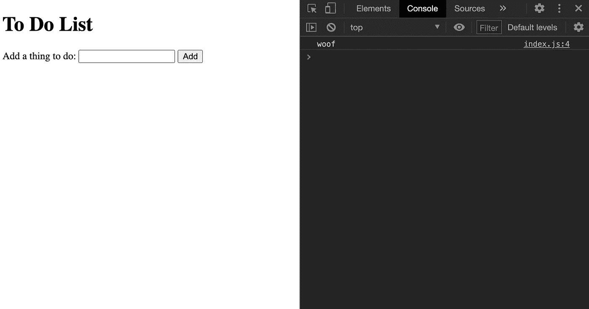
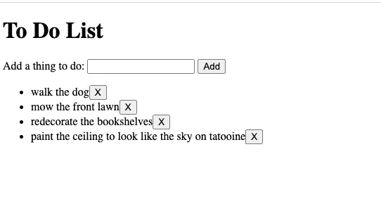

# 用 HTML、JavaScript 和 CSS 操作 DOM:第 1 部分

> 原文：<https://medium.com/nerd-for-tech/manipulating-the-dom-with-html-javascript-and-css-part-1-25b34ae2f932?source=collection_archive---------1----------------------->



*注意:这篇博客有一段视频，可以在我的 YouTube 频道上找到:。如果你更多的是一个视听学习者，或者如果你只是想看到代码写出来的样子，* [*在这里查看*](https://www.youtube.com/watch?v=o0QE1fQ03Cs) *。谢谢！*

前端 web 开发的主要目的是能够设计、控制和操作我们在设备屏幕上看到的内容。换句话说，能够操作文档对象模型，或 DOM。DOM 指的是 HTML 和 XML 文档的编程接口，将文档表示为节点和对象，以便编程语言可以连接到页面。

也许更简单地说，网页是一个文档，所以当我们提到文档对象模型时，我们只是指一个允许我们用 CSS、JavaScript 或任何您选择的脚本语言来操作这个文档的接口。我们将使用 JavaScript 与内置方法(如 *querySelector、getElementById、*和 *createElement)交互并操作 DOM。*但是在我们开始操作 DOM 之前，让我们用 HTML 建立一个基本的网页，这样我们就有东西可以使用了。今天，我们将构建一个单页面应用程序，仅使用 JavaScript、HTML 和 CSS 创建一个可编辑的待办事项列表。

# 超文本标记语言

任何网页的基础都是 HTML 或超文本标记语言。这将构建我们网页的结构，包括它的元素、到脚本语言和样式的链接等等。理解 HTML 文档中涉及的不同元素对于 web 开发的基础很重要，所以创建我们的 HTML 页面并分解它的内容。

Visual Studio 内置了一些功能，可以快速轻松地生成 boiler plate HTML 文档。创建一个名为*index.html*的新文件，在文件的第一行输入一个“！”。你会注意到 VS 显示了一个下拉菜单，如果我们点击 enter，它会选择第一个选项并自动为我们填充 HTML 文件。



## HTML 的骨骼

我想简单地讨论一下 HTML 文档中的一些标签，它们的意思和用途。如果你已经熟悉 HTML 的基础知识，可以跳过这一部分。如果你不是，我推荐你阅读这篇文章来巩固你的知识基础。我们将以默认模板 HTML 为例:

正如我们所猜测的，第一行表明这里的文档类型是 HTML，因此是 DOCTYPE。然后我们就有了我们实际的 标签。它们包含了整个 HTML 文档。接下来是 head 标签，我们将在其中保存任何元数据，或者关于 HTML 的数据，它不会显示。注意 meta 标签。第一个设置要使用的字符集。下一步是缩放视口，使其与显示它的设备一致，然后是标题，如果需要，我们可以稍后更改标题。

我们将创建一些，对 HTML 做一些调整，并添加一些标签来实现我们想要的目标，这当然是做一个 ToDo 应用程序。我们将添加脚本、标签、输入、按钮、div 和无序列表标签，如下所示:

确保将类添加到标签中，以便我们稍后可以在 CSS 中选择它们

## 关于加载 JavaScript 的说明

script 标签用于引用 JavaScript。JavaScript 可以直接写在 Script 标签中，但是这里我们链接的是一个外部脚本文件。这里的“async”关键字允许 JavaScript 异步加载，或者换句话说，当 HTML 正在加载时。这意味着 HTML 页面本身将在 JavaScript 完成执行之前显示。在这个 SPA 中，我们当然希望这样，这样无论脚本加载与否，我们都可以显示页面的轮廓(在这样一个小应用程序中，几乎肯定不会有什么不同，但添加 async 是一个很好的做法)。点击了解更多关于异步关键字[的信息。](https://flaviocopes.com/javascript-async-defer/)

请注意，待办事项的无序列表目前是空的，这是因为我们将使用 DOM 操作来添加我们的待办事项！如果我们想看看我们的应用程序到目前为止是什么样子，我们可以到终端键入:

```
open index.html
```

你的 HTML 页面将显示在你的默认浏览器中，但是为了这个教程，你应该使用谷歌浏览器。到目前为止，这是我们的应用程序的样子



浏览器顶部的选项卡显示了 HTML 的 head 标记中 title 标记的文本

# Java Script 语言

接下来，我们将创建操作 DOM 并赋予应用程序功能的逻辑。创建一个名为 *index.js* 的文件。在这个文件中，我们将从编写一些代码开始，这些代码将允许我们与 HTML 进行交互。我们可以使用一个名为 *querySelector* 的内置方法来引用 HTML 元素，并在 JavaScript 文件中为它们赋值。我们在*文档*对象上调用这个函数，并传递一个由“.”决定的类或 id select 的参数或“#”。示例:

如果我们回到显示 HTML 的浏览器，右键单击页面并选择“inspect”。您将看到弹出的侧面板，其中选择了 Elements 选项卡。这是 Chrome 的开发者工具，这是一个非常有用的工具，你可能会在你的开发生涯中用到它。现在，我们将关注控制台，所以将选项卡从元素切换到控制台。单击“添加”按钮，注意控制台中的消息。



开发人员控制台可以在单独的窗口中，也可以在如上所示的同一窗口中

这证实了我们在 HTML 中定义的按钮直接链接到 JavaScript 变量按钮。恭喜，我们已经连接到 DOM 了！这是一个很好的开始，但是现在我们将实际使用这个事件侦听器做一些事情，并创建一个 todo 项列表。首先，我们可以通过创建一个字符串数组来创建一个 todo 项目列表。然后，我们将使用内置的 JavaScript 在该数组上迭代或“映射”。map() 方法来显示我们之前的无序列表中的每一个标签。实际上， *index.js* 文件应该是这样的:

因为我们的 HTML 在加载时读取 index.js 文件，所以 thingsToDo.map 将自动运行

刷新您的浏览器页面将显示我们创建的列表。

## 处理输入

现在，为了启用我们的输入，我们将设置一个等于所选输入标签的变量，就像其他元素一样。我们还将使用与我们的 *thingsToDo.map()* 函数非常相似的逻辑，创建一个新元素，设置 innerText，并追加到列表元素。

在 JavaScript 中有很多方法可以获得输入值，但是这种方法对我们的应用程序来说很好

上面的逻辑允许我们从输入框中取出值，并将其添加到待办事项列表中！请注意，由于我们只是将这些项目添加到 DOM 元素“list”和中，而不是添加到我们的“thingsToDo”数组中，所以当我们刷新页面时，新的 ToDo 项目将会消失。因为每次刷新页面时都会加载 JavaScript，所以“thingsToDo”数组总是会将自己重置为硬编码列表。在以后的博客中，我将讨论持久化数据，但这超出了本博客和应用程序的范围。

## 删除

我们还可以在应用程序中包含一个主要功能，即在待办事项完成后删除它。这将是最棘手的行动，我们将在这个项目中执行，所以我会涵盖它的深度和尽可能清楚。

在我们写任何代码之前，让我们从逻辑上考虑一下如何完成这个。我们需要一种方法来选择并删除单个项目，最简单的方法是给每个待办事项添加一个“删除”按钮。与我们创建“列表项目”元素的方式相同，我们可以创建一个“按钮”元素，并将其添加到 thingsToDo 列表的每个索引页面中。通过将我们创建的新的“button”元素附加到“list item”元素，我们将有一个对应于每个待办事项的按钮！

给按钮添加功能是棘手的部分。我们将向 delete 按钮添加一个 eventListener 来侦听“click”事件，当它被单击时，它会在新的 ToDo 项上调用内置的 JavaScript remove()方法。remove 方法只是从 DOM 中删除对象，允许我们删除不想要的待办事项。总之，我们的代码将如下所示:

请注意将按钮添加到 newToDo，然后将 newToDo 添加到 list 元素的顺序

但是功能上有些不太对劲？如果你添加一个新的待办事项，你会注意到没有删除按钮，因此无法删除它。我们可以通过重复在 thingsToDo.map()函数中使用的相同逻辑来解决这个问题，但这不会很枯燥。编程的一个关键概念是确保你干，或者不重复自己。此外，面向对象编程的一个关键概念是抽象，例如为一些重复自身的逻辑创建一个函数。要了解更多关于 OOP 的信息，请查看我以前的一篇关于面向对象编程基础的博客。

因此，为了实现这个干代码，我们将尽可能多地采用需要重复的逻辑，并为其创建一个单独的函数。从逻辑上考虑我们的代码，我们可以看出，在添加待办事项和创建初始列表时，我们执行了很多相同的逻辑。这包括创建一个元素，设置它的文本，以及添加一个具有功能的删除按钮。如果我们把所有的逻辑抽象成它自己的功能会怎么样？我们知道对于每一种情况，创建基于硬编码数组的初始列表，并添加一个新的待办事项，我们处理相同的数据，它只是一个字符串。通过编写一个接受新字符串的函数，我们可以在加载应用程序和添加新的待办事项时实现该函数，并且只需编写一次逻辑！

第 12 行保持不变，在单击按钮时从输入元素中获取文本值



到目前为止的成品

现在我们有了一个全功能的待办事项列表，我们可以在其中添加和删除项目！虽然它很好用，但不是很漂亮。在我的下一篇博客中，我将讨论添加一些简单的 CSS 来大大增强这个应用程序的用户界面或 UI，并真正赋予它生命。

*YouTube:*

*GitHub 资源库:*

[](https://github.com/AidanMcB/spa-todolist) [## AidanMcB/spa-todolist

### 在 GitHub 上创建一个帐户，为 AidanMcB/spa-todolist 的发展做出贡献。

github.com](https://github.com/AidanMcB/spa-todolist) 

*资源:*

[](https://flaviocopes.com/javascript-async-defer/) [## 通过延迟和异步有效地加载 JavaScript

### 当在 HTML 页面上加载脚本时，你需要小心不要损害页面的加载性能…

flaviocopes.com](https://flaviocopes.com/javascript-async-defer/) [](https://developer.mozilla.org/en-US/) [## MDN Web 文档

### MDN Web Docs 站点提供了关于开放 Web 技术的信息，包括 HTML、CSS 和用于这两个网站的 APIs

developer.mozilla.org](https://developer.mozilla.org/en-US/) [](https://code.visualstudio.com/docs/languages/html) [## 用 Visual Studio 代码进行 HTML 编程

### 充分利用 Visual Studio 代码进行 HTML 开发

code.visualstudio.com](https://code.visualstudio.com/docs/languages/html) [](https://www.w3schools.com/) [## W3Schools 在线网络教程

### 正文{背景色:浅蓝色；} h1 {颜色:白色；文本对齐:居中；} p { font-family:verdana；字体大小…

www.w3schools.com](https://www.w3schools.com/)