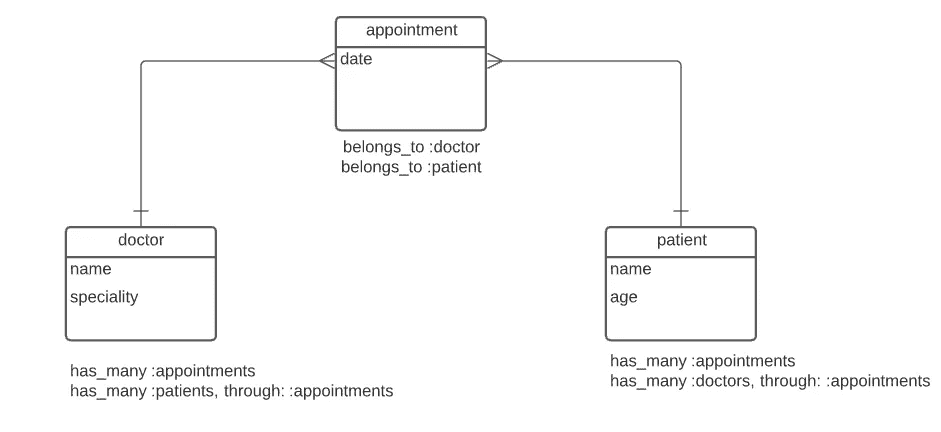
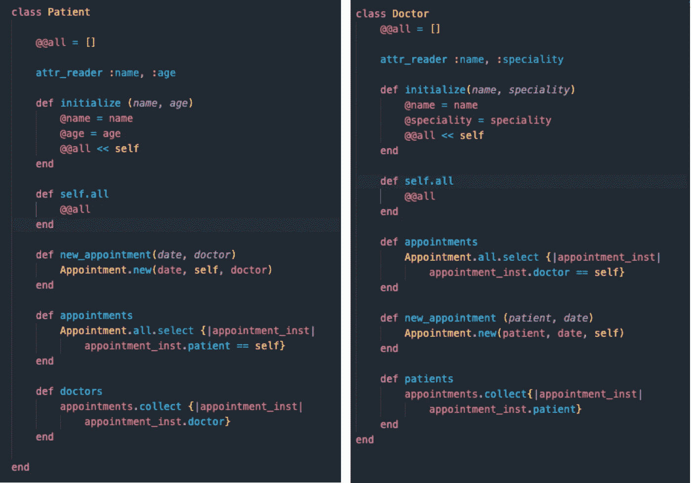
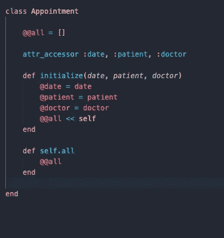

# 多对多关系— Ruby

> 原文：<https://medium.com/nerd-for-tech/many-to-many-relationship-ruby-ae017c5d664e?source=collection_archive---------20----------------------->

当我们检查他们的关系时，我们注意到一个医生可以看很多病人，一个病人也可以被很多医生看。在这种关系中，与属于关系不同，很难将一个对象的引用放入到另一个对象中，因为一个对象不仅仅属于另一个对象。在这种场景中，要在实体之间创建关系，我们必须创建另一个实体，它可以保存两个对象的单个实例。我们称之为连接实体。对于我们的例子，让我们创建一个约会加入实体。

实体图是对 has-many-through 关系的高级解释，它包含活动记录宏(我将在下一篇文章中讨论)。

如图所示，一个约会实例肯定属于一个医生，也属于一个病人。使用这个联合表，我们可以在医生和病人之间建立一种间接的关系。这将使我们能够从每一个中获得有用的信息。例如，如果一位医生想知道他的病人名单，我们可以通过预约表直接找到该信息。与患者一样，他们可以通过连接表检索他们的医生列表。

让我们使用 ruby 代码来查看它们。

病人和医生类是在初始化时用它们的属性进行实例化的。由于加入类预约，见下文，我们能够创建新的行为/方法，如 new_appointment，使两个类都能够进行新的预约，两个类都能够查看他们的预约列表，医生能够查看他的患者列表，反之亦然。

Join 类 Appointment 为每个约会实例捕获了病人和医生实例。它们被推送到一个数组类变量。这使我们能够在需要每个实体的信息时对其进行迭代。

上一篇文章和本文展示了对“属于/拥有-多”和“拥有-多-通过”关系的非常低级但基本的解释。如果我们能够正确映射任何现实世界对象之间的关系，我们就可以捕获非常动态的数据，这将使我们能够解决现实世界的问题。