# 漫威 vs DC:使用 Python 进行比较性别分析

> 原文：<https://medium.com/nerd-for-tech/marvel-vs-dc-comparative-gender-analysis-using-python-207767595d17?source=collection_archive---------3----------------------->

使用 Python 执行探索性数据分析技术，比较漫威和 DC 的角色，重点关注他们的性别。

> “你知道什么比魔法更酷吗？数学”——彼得·帕克(蜘蛛侠)


在 [Unsplash](https://unsplash.com/s/photos/comic?utm_source=unsplash&utm_medium=referral&utm_content=creditCopyText) 上由 [Waldemar Brandt](https://unsplash.com/@waldemarbrandt67w?utm_source=unsplash&utm_medium=referral&utm_content=creditCopyText) 拍照

如果你碰巧是一个漫画极客，很肯定你可能和其他极客讨论过《漫威与 DC》。虽然这种竞争被认为会持续到永远，但让我们从机器学习的角度来看这一点，以获得一些关于这些漫画在性别和其他因素方面如何演变的见解。

探索性数据分析(简称 EDA)是您在遇到数据集时首先要做的事情之一。维基百科对 EDA 的定义如下:

> 探索性数据分析是一种分析数据集以总结其主要特征的方法，通常使用统计图和其他数据可视化方法

EDA 被认为是一种调查工具，用于深入研究数据并寻找隐藏的见解。广泛建议执行多种 EDA 方法来探索数据，以了解它要讲述的故事。

# **简介**

这篇分析的灵感来自于文章[漫画仍然是由男人创作的，为男人而作，关于男人。](https://fivethirtyeight.com/features/women-in-comic-books/)使用的数据集可以在[这里](https://github.com/fivethirtyeight/data/tree/master/comic-characters)下载。

数据是从两个公开的粉丝网站上复制的，漫威和 DC 的数据集包含以下特征。

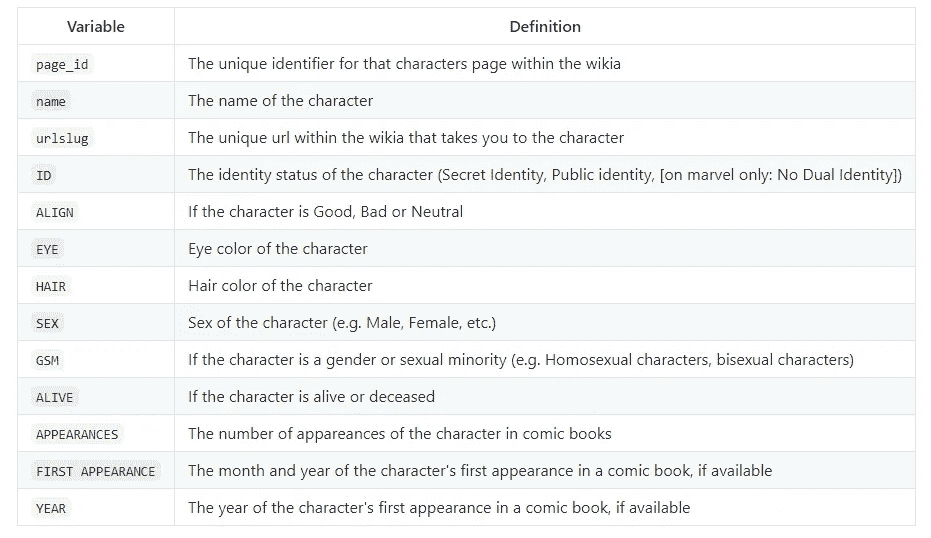

数据集的特征描述

首先，让我们导入探索性数据分析所需的所有库。

```
#Importing the required libraries
import numpy as np 
import pandas as pd 
import matplotlib.pyplot as plt
import seaborn as sns
%matplotlib inlineimport plotly.graph_objs as go
import plotly.express as px
import plotly
plotly.offline.init_notebook_mode(connected=True)
```

我们使用以下代码将所需的两个数据集加载到我们的 python 环境中，并将它们存储在两个变量中，即“marvel”和“dc”:

```
#Loading the dataset
marvel = pd.read_csv("marvel-wikia-data.csv")
dc = pd.read_csv("dc-wikia-data.csv")
```

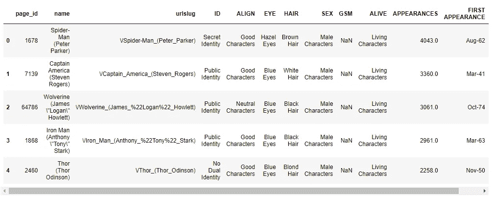

首先，使用“marvel.head()”的 marvel 数据集的五个条目

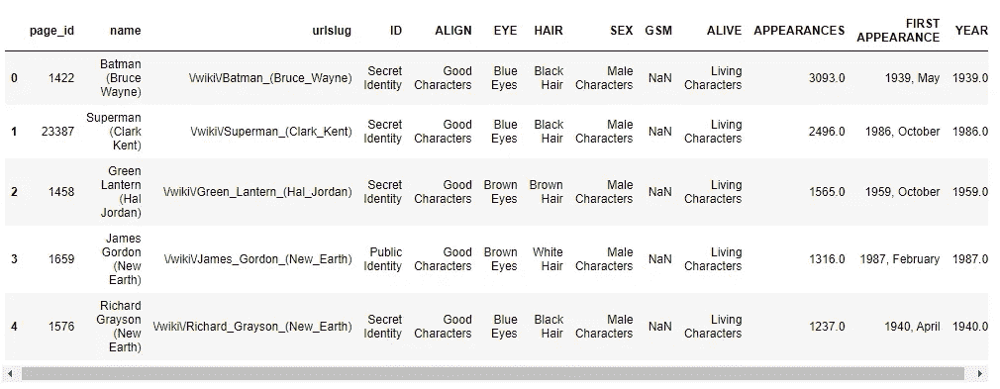

首先，使用“dc.head()”的 DC 数据集的五个条目

执行一些基本的分析，我们得到以下结果，

```
print(marvel.shape)
print(dc.shape)
```

上面的代码会给我们(16376，13)；(6896，13)作为输出。漫威宇宙的人物数量是 DC 宇宙的两倍。

要获得关于这两个数据集的基本信息:

```
marvel.info()
dc.info()
```

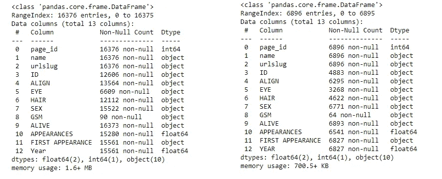

分别关于漫威和 DC 数据集的基本信息

从输出中，我们可以看到两个数据集都包含大量的空值，如“ID”、“ALIGN”、“EYE”、“HAIR”、“SEX”、“GSM”等。此外，我们看到有 2 个 float 数据类型的特性，1 个 integer 数据类型的特性和 10 个 object 数据类型的特性。

# 数据预处理

在我们继续处理数据集之前，执行数据预处理步骤是非常重要的。它是将原始数据转换成可理解的清晰格式的过程，因为真实世界的数据可能是不完整的、不一致的，并且可能包含几个错误。

## 删除不必要的变量

对数据集头部的初步观察告诉我们，特征‘YEAR’给出了所提到的字符的第一个出现年份(本质上，与‘FIRST APPEARANCE’的信息相同)。因此，建议**从两个数据集**中删除“年份”特征。

此外，使用函数。isnull()。sum()'来确定每个特征中缺失值的数量，我们看到“GSM”在“漫威”和“DC”中都有很大比例的缺失条目

```
marvel.isnull().sum()
dc.isnull().sum()
```

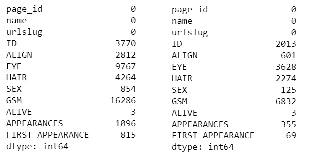

分别在“漫威”和“DC”的每个特征中缺少的条目数

因此，我们将**从我们的分析中完全删除特征‘GSM’**。

功能**‘页面 id’和‘URL slug’对我们的分析**没有任何帮助。我们也将从数据集中删除上述特征。

现在，要从数据集中删除多个要素，我们将创建一个包含所有不必要要素的列表，然后从数据中删除这些要素。

```
cols = ['page_id','urlslug', 'GSM', 'Year']
marvel = marvel.drop(cols,axis=1)
cols = ['page_id','urlslug', 'GSM', 'YEAR']
dc = dc.drop(cols,axis=1)
```

打印两个数据集的前五个条目:

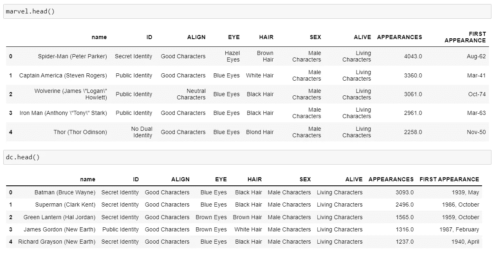

## 统一特征的格式

我们将首先研究数据集中相似的要素是如何以不同的格式记录的，并尝试将它们统一起来。

数据的标题表明“首次出现”在两个数据集中以不同的格式记录。

由于记录方式的不一致，我们将在两个数据中将所述特征分为“月”和“年”。但在此之前，我们将删除“首次出现”值为空的条目

```
marvel = marvel.dropna(subset=['FIRST APPEARANCE'])
dc = dc.dropna(subset=['FIRST APPEARANCE'])marvel[['MONTH','YEAR']] = marvel['FIRST APPEARANCE'].str.split('-', expand=True)
dc[['YEAR','MONTH']] = dc['FIRST APPEARANCE'].str.split(', ', expand=True)
```

然而，我们仍然可以看到月份和年份以不同的格式输入。在漫威数据集中，月份采用“八月”、“三月”、“十月”格式，年份采用“62”、“41”、“74”格式。我们希望它们是“八月”、“三月”、“十月”…..和“1962 年”、“1941 年”、“1974 年”…格式。

简单的谷歌搜索表明，漫威漫画在 20 世纪 21 年代之前并不存在。因此，我们将为漫威数据集所有大于“21”的条目添加前缀“19”，否则我们将为条目添加前缀“20”。我们将使用' marvel.head()'来帮助我们看到刚才所做的更改。

```
marvel['YEAR'] = marvel.YEAR.apply(lambda x: '19' + x if int(x) > 21  else '20' + x)
marvel.head()
```


现在，更改漫威数据集的月份格式

```
marvel["MONTH"] = marvel["MONTH"].replace({"Jan":"January", "Feb":"February", "Mar": "March", "Apr": "April", "Jun": "June", 
"Jul": "July", "Aug": "August", "Sep": "September", "Oct": "October", "Nov": "November", "Dec": "December"})
```

现在，我们将放弃前面提到的“第一次显现”功能，将显示两个数据集的条目。

```
marvel = marvel.drop('FIRST APPEARANCE',axis=1)
dc = dc.drop('FIRST APPEARANCE',axis=1)
```

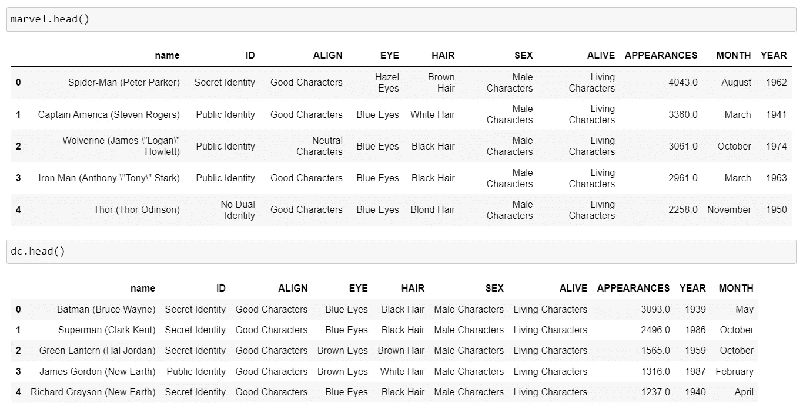

预处理后清理数据集

# 探索性数据分析

EDA 或探索性数据分析使用各种技术(主要是可视化)帮助我们得出数据集中的基本推论、模式和异常。使用数据讲故事的艺术可以很容易地利用这一点变得有效。

## 随着时间的推移引入新角色

首先，我们将看看随着时间的推移，这两部漫画中的角色是如何被引入的。但在此之前，让我们看看漫威和 DC 的第一次角色出现是什么时候。

```
year_m_first = marvel.sort_values('YEAR').iloc[0]
print("The first character of MARVEL appeared in the year ", year_m_first['YEAR'])year_d_first = dc.sort_values('YEAR').iloc[0]
print("The first character of DC appeared in the year ", year_d_first['YEAR'])
```

输出显示漫威的第一个角色出现在 1939 年，DC 的第一个角色出现在 1935 年。

现在，为了理解这些字符是如何随着时间的推移而引入的，我们将首先从数据集中查看“年”的分布。

```
fig,(ax1) = plt.subplots(figsize=(15,8))
sns.distplot(marvel['YEAR'], label='Marvel', color='red')
sns.distplot(dc['YEAR'], label='DC',color='blue')
plt.title('Distribution of Appearance of heroes in comic in years')
plt.show()
```

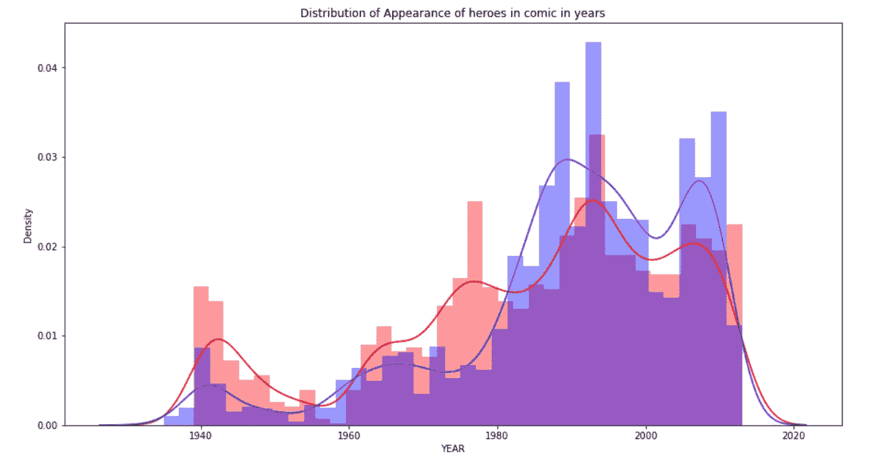

在这里，红线表示的漫威的分布表明，漫威的角色介绍与 DC 有显著不同。从最初的分析中，我们可以看到漫威的人物数量几乎是 DC 的两倍。

为了更好地理解，我们将从两个数据集绘制一个“年”条形图。

```
plt.figure(figsize=(15,8))
m_bar = marvel.groupby('YEAR')
m_bar['YEAR'].value_counts(sort=False).plot(kind='bar',color='red',title='Marvel First Appearances by Year');plt.figure(figsize=(15,8))
d_bar = dc.groupby('YEAR')
d_bar['YEAR'].value_counts(sort=False).plot(kind='bar',color='blue',title='DC First Appearances by Year');
```

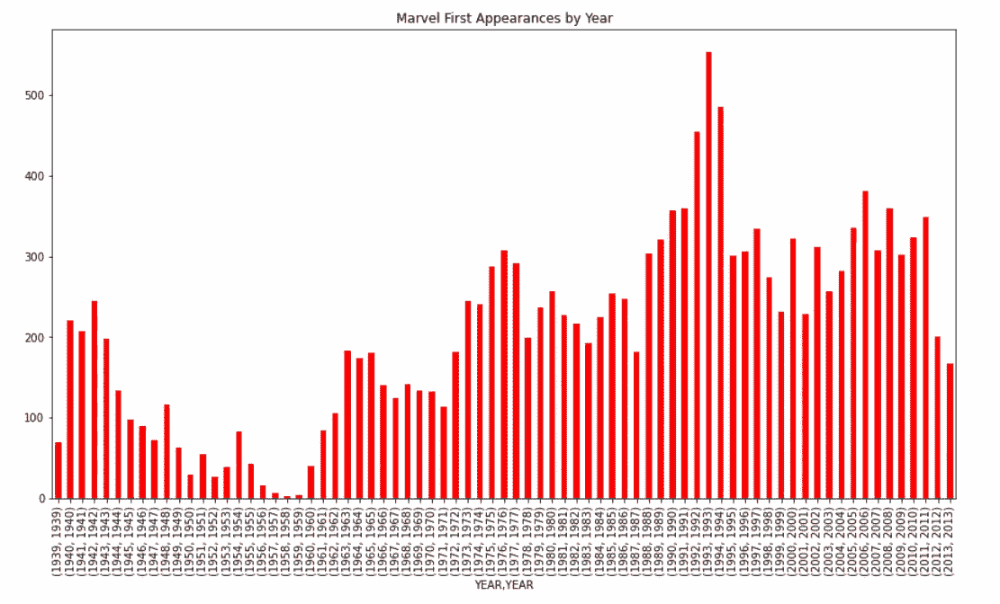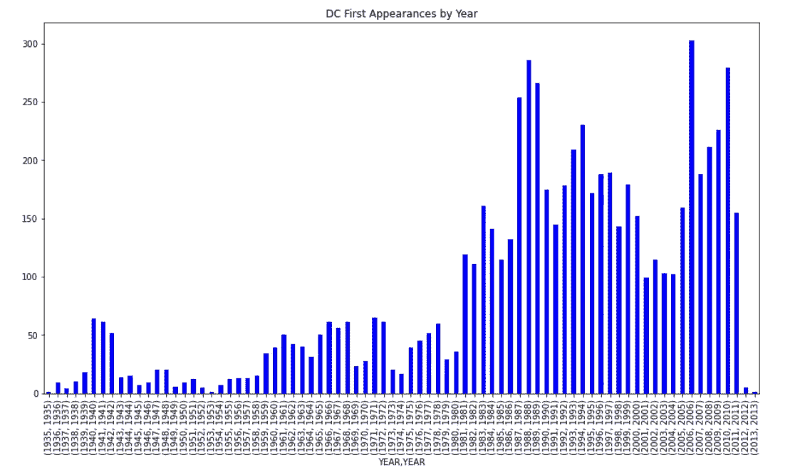

角色引入的高峰期是 1993 年的漫威和 2006 年的 DC。除了 20 世纪 50 年代末到 60 年代初，这些年来漫威几乎一直在引进角色。与此同时，DC 在 20 世纪 80 年代开始升级游戏。该数据集还表明，DC 在 2011 年后停止引入新汉字。

此外，我们将通过观察各自的分布来了解这些角色是如何随着时间的推移而引入性别的。

最初，我们会根据角色所属的性别对他们进行分类

```
marvel_female_characters = marvel[marvel.SEX == 'Female Characters']
dc_female_characters = dc[dc.SEX == 'Female Characters']marvel_male_characters = marvel[marvel.SEX == 'Male Characters']
dc_male_characters = dc[dc.SEX == 'Male Characters']marvel_gf_characters = marvel[marvel.SEX == 'Genderfluid Characters']
dc_gf_characters = dc[dc.SEX == 'Genderless Characters']marvel_ag_characters = marvel[marvel.SEX == 'Agender Characters']
dc_tg_characters = dc[dc.SEX == 'Transgender Characters']
```

现在，我们将绘制它的每个分布。

```
f, axes = plt.subplots(2,2, figsize=(20, 20), sharex=True)sns.distplot(marvel_female_characters['YEAR'].dropna(),label='Marvel',color='red',ax=axes[0,0]).set_title('Ratio of Female characters created over the years')
sns.distplot(dc_female_characters['YEAR'].dropna(),label='DC',color='blue',ax=axes[0,0])sns.distplot(marvel_male_characters['YEAR'].dropna(),label='Marvel',color='red',ax=axes[0,1]).set_title('Ratio of Male characters created over the years')
sns.distplot(dc_male_characters['YEAR'].dropna(),label='DC',color='blue',ax=axes[0,1])sns.distplot(marvel_ag_characters['YEAR'].dropna(),label='Marvel',color='red',ax=axes[1,0]).set_title('Ratio of Agender/Genderless characters created over the years')
sns.distplot(dc_gf_characters['YEAR'].dropna(),label='DC',color='blue',ax=axes[1,0])sns.distplot(marvel_gf_characters['YEAR'].dropna(),label='Marvel',color='red',ax=axes[1,1]).set_title('Ratio of Genderfluid/Transgender characters created over the years')
sns.distplot(dc_tg_characters['YEAR'].dropna(),label='DC',color='blue',ax=axes[1,1])
```

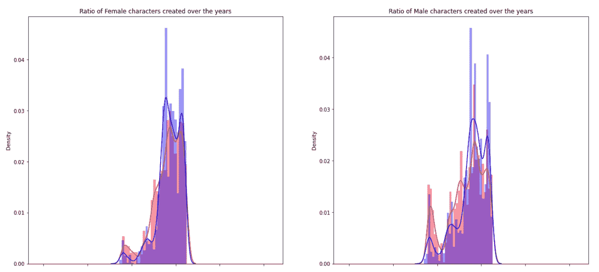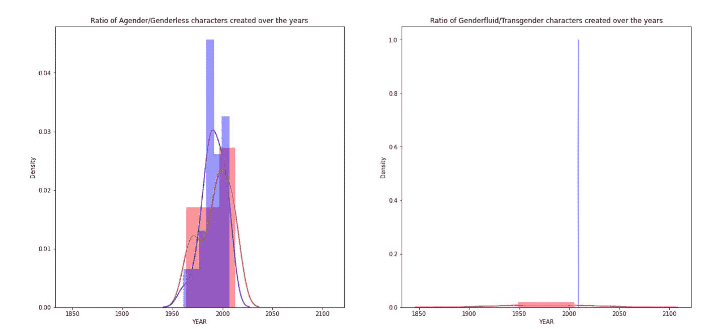

关于性别的两个数据集的特征分布

我们现在将看看在这些漫画中引入性别少数的年份。

```
marvel_female_characters[‘YEAR’].min()
dc_female_characters['YEAR'].min()marvel_gf_characters[‘YEAR’].min()
dc_gf_characters[‘YEAR’].min()marvel_ag_characters[‘YEAR’].min()
dc_tg_characters[‘YEAR’].min()
```

上述代码的输出结果是‘1936’、‘1939’、‘1949’、‘1961’、‘1964’、‘2009’。

因此，我们可以得出结论，漫威和 DC 都是在制作漫画的第一年或第二年推出他们的第一个女性角色，DC 漫画公司成立于 1934 年，漫威成立于 1939 年。

另一个值得注意的事实是，漫威在 1949 年引入了第一个性别流体角色，这几乎是第一个角色引入后的十年。然而，DC 花了整整 74 年才在 2009 年引入第一个跨性别角色！

## 性别少数群体的比例

不可否认的事实是，从各方面来看，漫画一直是男性主导的行业。从作家到画家，再到书中的人物，绝大多数都是男性。漫威和 DC 都注意到了其他性别代表人数严重不足的问题，并努力缩小这一差距。现在，我们将使用各种 EDA 工具来帮助我们了解这两个漫画巨头在性别方面的产品有多么多样化。

首先，为了知道两个数据集中每个性别的比例，我们将使用 Plotly 库绘制一个饼状图。

```
sex_m = marvel.SEX.value_counts()
sex_dc = dc.SEX.value_counts()m_sex = sex_m.sort_values(ascending=False)
data = [go.Pie(labels = m_sex.index,
               values = m_sex.values,
               title = 'Gender diversity in Marvel',
               hoverinfo = 'label+value')]
plotly.offline.iplot(data)dc_sex = sex_dc.sort_values(ascending=False)
data = [go.Pie(labels = dc_sex.index,
               values = dc_sex.values,
               title = 'Gender diversity in DC',
               hoverinfo = 'label+value')]
plotly.offline.iplot(data)
```

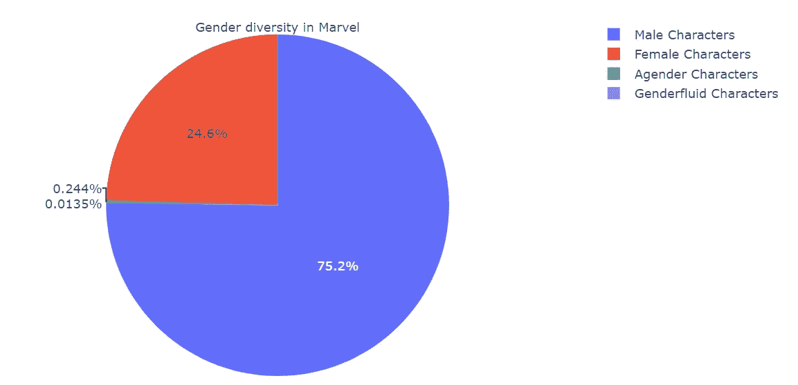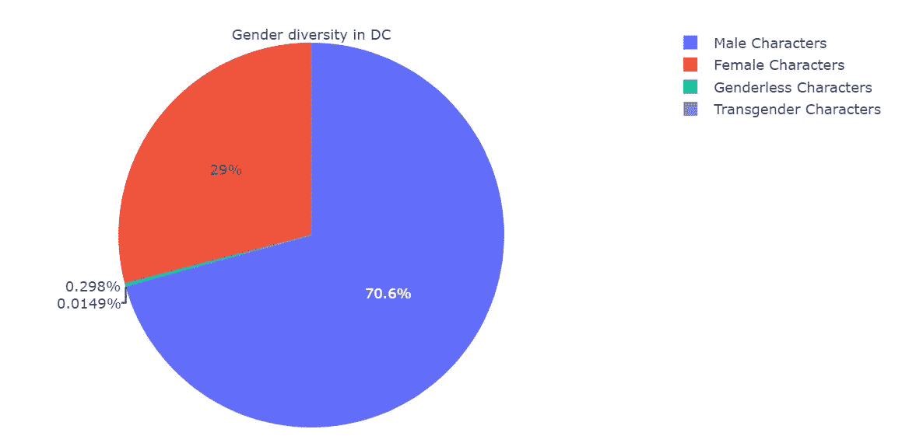

从饼状图中，我们可以说，DC 在代表性方面比漫威做得更好，因为它的角色中有 30%是女性，而在漫威，这一比例几乎只有 25%。关于酷儿角色，这两种情况下的比例几乎可以忽略不计。

我们现在将看到哪些角色是酷儿，特别是性别流动者和变性者。


所以我们可以得出结论，在漫威的 16376 个字符中，只有洛基和沙文是性别流体，在 DC 的 6876 个字符中，只有日星是跨性别者。

## 性别和排列的双变量分析

现在，我们将执行一些双变量分析，也就是说，我们将分析两个不同的变量，以找出它们之间的模式。

一个角色的定位通常是指他们对一切事物的道德和伦理观。在这里，我们有 4 种独特的排列——好的、坏的、中立的和改造的罪犯。一个分组的条形图的'性'与休息，以他们的对齐如下:

```
f,(ax1,ax2) = plt.subplots(1, 2, figsize=(10, 6), sharex=True)for tick in ax1.get_xticklabels():
        tick.set_rotation(45)
for tick in ax2.get_xticklabels():
        tick.set_rotation(45)sns.countplot(x="ALIGN",hue="SEX",data=marvel,ax=ax1).set_title('Marvel Sex vs Align')
sns.countplot(x="ALIGN", hue="SEX",data=dc,ax=ax2).set_title('DC Sex vs Align')
```

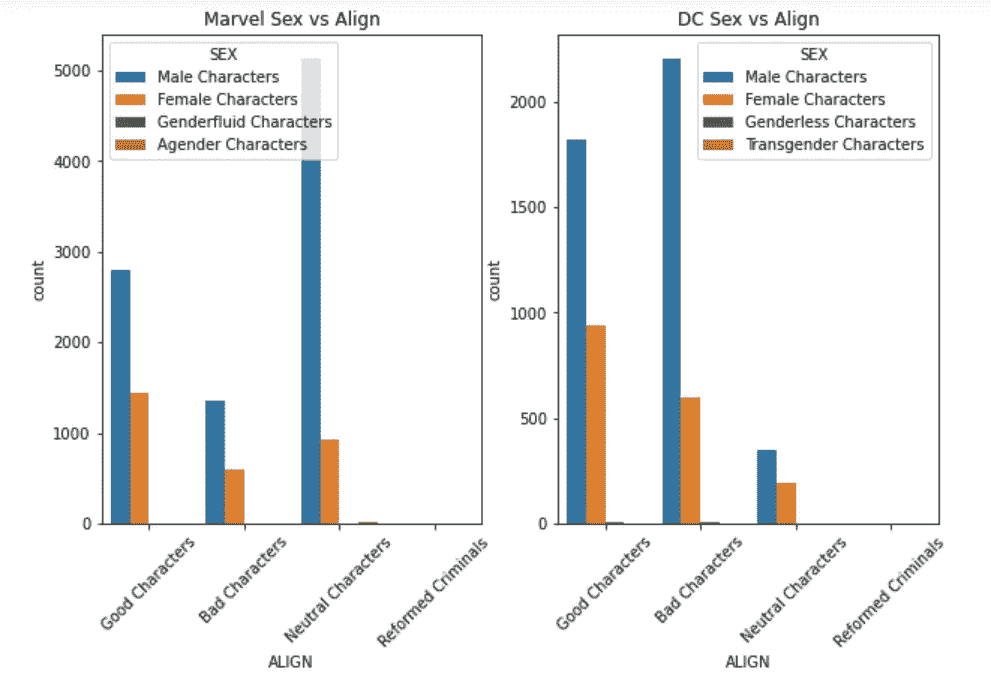

性别与休息各自的性格对齐

在这里我们可以看到，虽然四个排列中的每一个都是由男性角色主导的，但漫威的中性角色和 DC 的坏角色往往是由男性角色压倒性地主导的。

## 性别和身份的双变量分析

现在，我们将绘制一个关于角色身份的“性”的分组条形图。一个角色的身份是这个角色如何为大众所知的。它可以是秘密的、公开的、未知的等等。

```
f,(ax1,ax2) = plt.subplots(1, 2, figsize=(10, 6), sharex=True)for tick in ax1.get_xticklabels():
        tick.set_rotation(45)
for tick in ax2.get_xticklabels():
        tick.set_rotation(45)sns.countplot(x="ID",hue="SEX",palette="plasma",data=marvel,ax=ax1).set_title('Marvel Sex vs Identity')
sns.countplot(x="ID",hue="SEX",palette="plasma",data=dc,ax=ax2).set_title('DC Sex vs Identity')
```

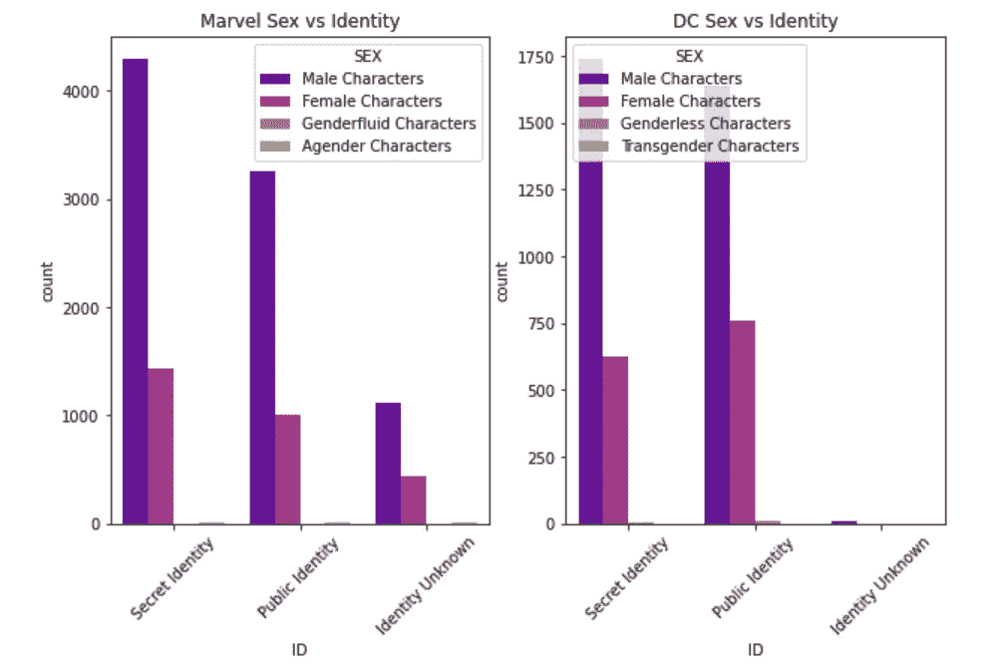

性别与休息对他们各自的性格认同

再一次，所有的身份都是男性主导的。但值得注意的是，在 DC，只有很少的角色不为人知。

## 性别和死亡/存活状态的双变量分析

此外，角色可以是活着的，也可以是死去的。现在，我们将绘制一个分组条形图，看看性别与人物的生前或死后状态之间的关系

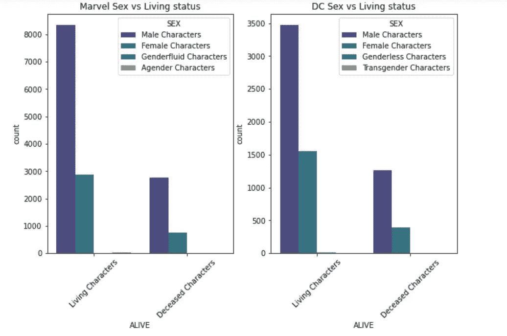

性别与其各自的生存/死亡状态

在这两部漫画中，活着的角色所占的比例要大得多。

## 关于头发和眼睛颜色等身体特征的分析

现在，我们将使用柱状图来查看两个数据集中女性和男性角色最常出现的 5 种眼睛和头发颜色。

从眼睛颜色开始:

```
f,ax = plt.subplots(2, 2, figsize=(15, 17), sharex=True)plt.subplot(2, 2, 1)
marvel_female_characters['EYE'].value_counts(normalize=True).head(5).plot(kind='bar',title="Marvel Female character Eyes",
                                                                          color='red')
plt.subplot(2, 2, 2)
dc_female_characters['EYE'].value_counts(normalize=True).head(5).plot(kind='bar',title="DC Female Eyes",color='blue')plt.subplot(2, 2, 3)
marvel_male_characters['EYE'].value_counts(normalize=True).head(5).plot(kind='bar',title="Marvel Male Eyes",color='red')plt.subplot(2, 2, 4)
dc_male_characters['EYE'].value_counts(normalize=True).head(5).plot(kind='bar',title="DC Male Eyes",color='blue')fig.tight_layout()
plt.show()
```

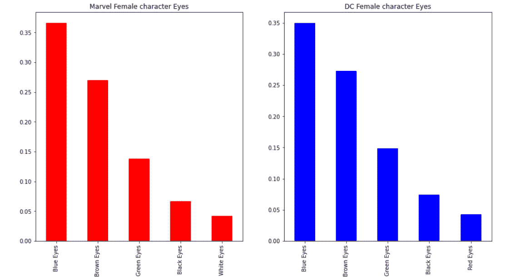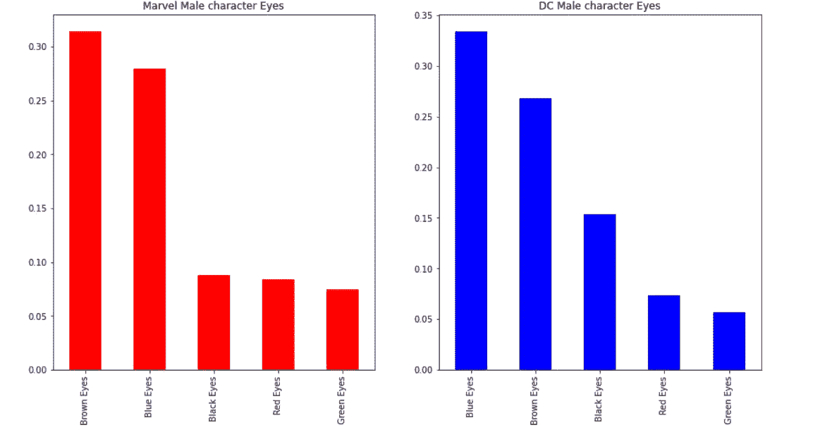

所以很明显，最常见的眼睛颜色分别是蓝色和棕色。两部漫画中的女性角色都倾向于将蓝色作为最常见的眼睛颜色，而漫威男性角色则是棕色，而 dc 男性角色则是蓝色。

类似地，看看最常见的 5 种发色，

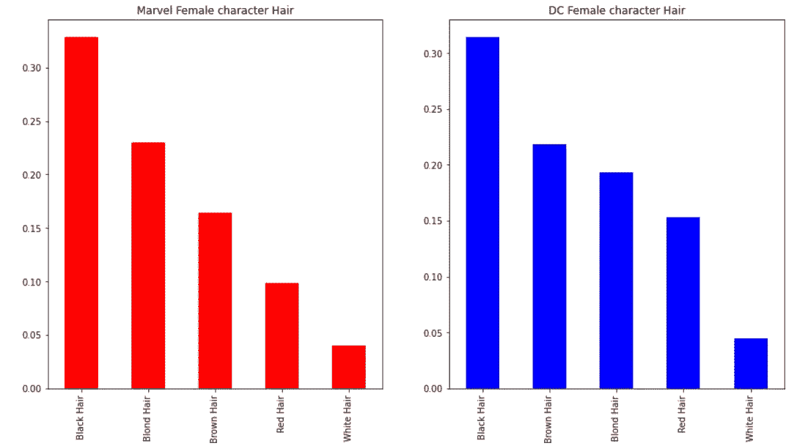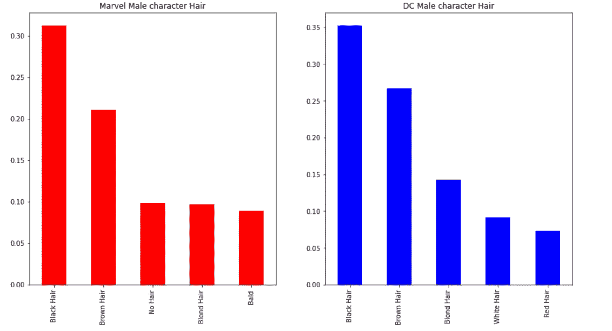

在所有类别中，最常见的发色是黑色。我们还可以注意到，在漫威男性中，既有秃顶的，也有没有头发的。

## 顶级人物

现在我们将分别地，然后一起看每个宇宙中最顶端出现的角色。

我们首先将前 10 个最常出现的字符定义为两个不同的变量

```
top_10_appearances_m = marvel.sort_values('APPEARANCES', ascending=False).head(10)
top_10_appearances_dc = dc.sort_values('APPEARANCES', ascending=False).head(10)
```

现在我们将使用 plotly 库绘制一个饼状图。

```
top_10_appearances_m = top_10_appearances_m.sort_values('APPEARANCES', ascending=False)
data = [go.Pie(labels = top_10_appearances_m['name'],
               values = top_10_appearances_m['APPEARANCES'],
               hoverinfo = 'label+value')]
plotly.offline.iplot(data)top_10_appearances_dc = top_10_appearances_dc.sort_values('Appearances', ascending=False)
data = [go.Pie(labels = top_10_appearances_dc['Name'],
               values = top_10_appearances_dc['Appearances'],
               hoverinfo = 'label+value')]
plotly.offline.iplot(data)
```

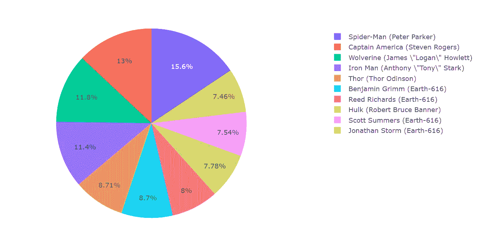

漫威漫画中出现次数最多的 10 个角色

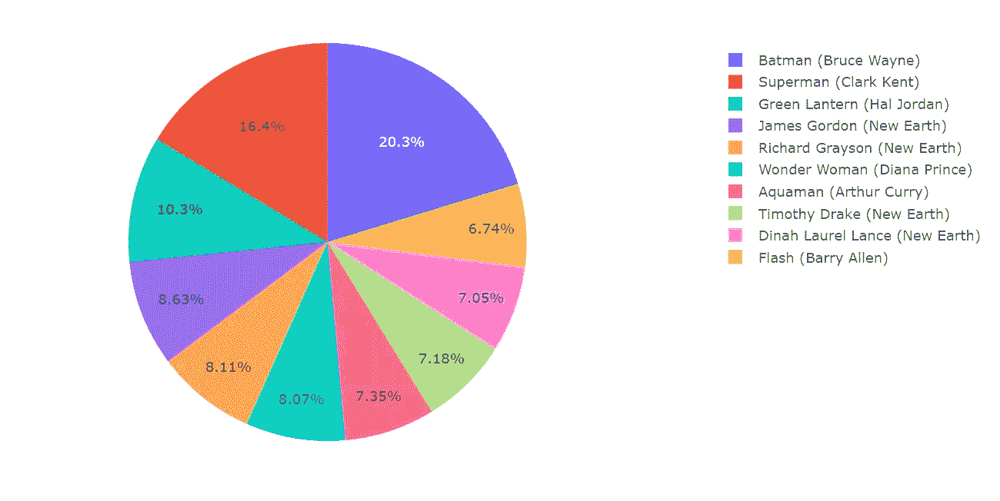

DC 漫画中出现次数最多的 10 个角色

在漫威出现次数最多的 10 个角色中，10 个都是男性角色。而在《DC》中，有两个女性角色，神奇女侠(戴安娜·普林斯)和黛娜·劳雷尔·兰斯(新地球)进入了外貌排名前十的角色。

现在，我们将连接两者，并检查性别的组合表示。

```
dc_marvel = pd.concat([dc, marvel])
top_10_appearances_dc_marvel = dc_marvel.sort_values('APPEARANCES', ascending=False).head(10)top_10_appearances_dc_marvel = top_10_appearances_dc_marvel.sort_values('APPEARANCES', ascending=False)
data = [go.Pie(labels = top_10_appearances_dc_marvel['name'],
               values = top_10_appearances_dc_marvel['APPEARANCES'],
               hoverinfo = 'label+value')]
plotly.offline.iplot(data)
```

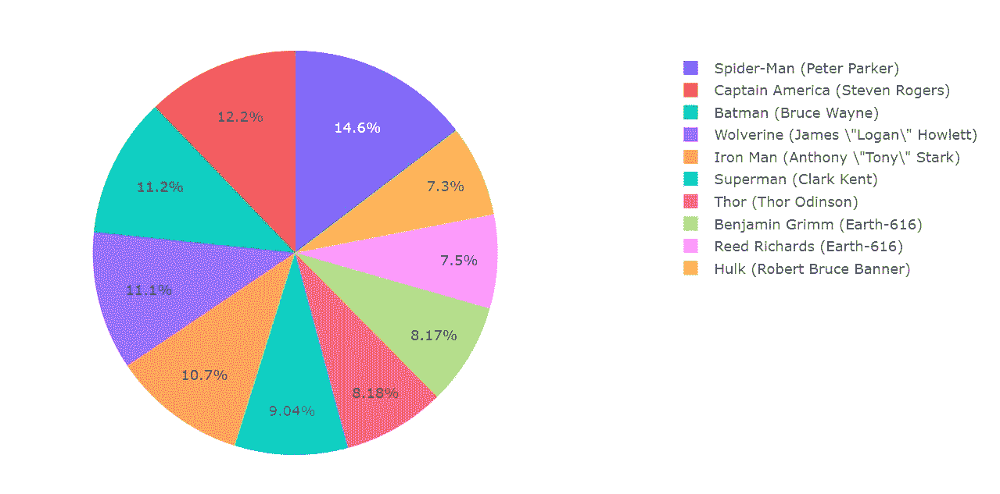

不考虑宇宙的 10 个最常出现的角色

毫不奇怪，所有这些角色都是男性，蜘蛛侠(彼得·帕克)是出现次数最多的角色。

# 结论

概括地说，我们可以看到，这两部漫画在人物方面都或多或少地由男性主导。虽然这些漫画试图遏制这种女性和酷儿角色的巨大差异，但他们还有很长的路要走。

*以上的全部代码，以及数据集，都可以在我的* [*Github 资源库中访问。*](https://github.com/Nehla1999/Marvel-Vs-DC---EDA-)