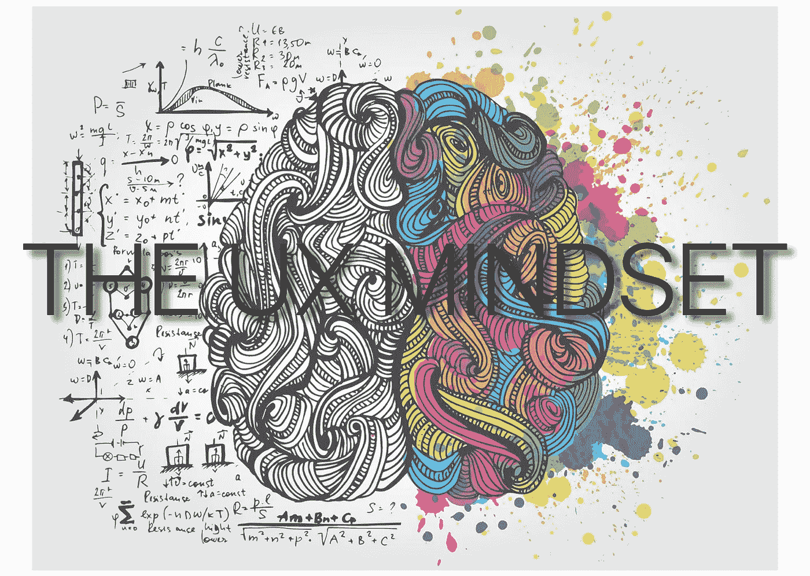

# 掌握你的心态，帮助你成为一个更好的 UXer

> 原文：<https://medium.com/nerd-for-tech/master-your-mindset-to-help-you-become-a-better-uxer-9214414b1d75?source=collection_archive---------34----------------------->

为了成就大事，设计师需要学习很多东西。用户界面或用户体验设计项目从来都不是简单明了的；在设计过程的各个方面，它充满了模糊性和挑战。这些问题只有设计师有一定的软技能来支撑他的技术知识才能解决。作为一名 UX 设计师，[有许多技巧可以掌握你的心态](https://bit.ly/3v7bq8S)。 [Wondershare Mockitt](https://bit.ly/3ewCXuz) 列出了以下 12 种 UX 心态，它们将对你有极大的帮助。好消息是，这些技能大部分可以通过大量的锻炼和自我激励来培养和磨练。

## 思想开放

接受批评，拥抱变化，从失败中学习。作为一名 UX 设计师，你必须放下自我，为人们设计。这意味着不是你所有的想法都是好的。不是你认为什么是最好的，或者你最喜欢哪个想法。这是关于用户和他们的需求，创造伟大的，有用的产品需要很多想法，需要改变，探索和改变方向，探索什么可行，什么不可行。如果你太容易执着于你的想法，你会忘记你的工作。

## 有效沟通

沟通不畅是团队内部冲突的罪魁祸首。有效的沟通不仅仅是分享信息。而是理解信息背后的情感和意图。除了能够清楚地传达信息之外，你还需要倾听，这样你才能完全理解对方在说什么，并让对方感到自己被倾听和理解。这是应该经常考虑的事情，它将帮助你成为一个有效的沟通者。

## 研究和评估

在研究过程中，用户体验设计师对用户有了更好的了解，并试图理解问题和行为。通过上下文用户访谈、人物角色和移情图等方法，最佳产品体验的基础就奠定在这里。没有对目标群体的研究和了解，通常很难想出好主意。这种类型的研究通常被称为用户或设计研究，相应方法的知识对于用户体验设计师来说非常重要。

在评估过程中，用户体验设计师利用他的技术专长来评估现有的产品或服务。通常，这是通过所谓的启发式审查来完成的，即根据某些用户体验标准进行系统的书面评估。对现有产品和功能的评估在用户体验设计师的日常生活中并没有发挥最大的作用，但对于创建一个良好的优化起点来说却是非常重要的。

## 了解你的受众

用户研究是设计过程的第一步。毫无疑问，在设计产品的用户体验时，最重要的考虑因素之一就是受众。如果你的计划是创造一个你的用户会喜欢的产品，你需要知道你的目标受众到底想要什么和需要什么。这意味着用户研究和用户故事创作应该是 UX 设计过程中不可或缺的一部分。

在你开始设计之前，以用户为中心是至关重要的！通过这种方式，你可以为使用你产品的人创造附加价值，关注好处和可用性，而不是功能。用户体验设计师应该能够确定何时停止添加新功能，而是保持用户喜欢和欣赏的体验不变。

## 好奇心&学习的欲望

在许多不同的职业中，学习的欲望是一种重要的性格特征。你不可能成为一个曾经学习过医学，但后来又停止阅读的医生。如果你对新的科学发现不感兴趣，你就不会成为一名好科学家。UX 设计也是如此。一个自学者，一个任性的人，会成为他们成功的动力。UI 和 UX 不是依赖花哨的学位或认证的行业——成功取决于职业道德和一致性。

我并不是说，要成为一名优秀的 UX 设计师，你必须了解它的一切。你不需要知道关于排版、色彩结构、可用性和 UX、商业、编码、研究、写作、心理学等等的一切。当专科很好，但你至少需要知道很多学科的基础知识才能当好。所以好奇心和求知欲可以让你成为一名优秀的 UX 设计师。如果你不想学习或寻求用户问题的解决方案并理解其本质，那么你将无法在 UX 行业有效地工作。

> 阿尔伯特·爱因斯坦:“我没有特殊的天赋。我只是强烈好奇。”

## 培养你的创造信心

不要害怕说出你的想法，因为害怕你的想法会被拒绝。实践和自我教育是唯一能让你成为更好的 UX 设计师的东西。但重要的是要有效地去做，给自己设定正确的目标。优先考虑你的目标。你可以做出无限的可能性和选择。人们很容易迷失在这个充满可能性的海洋中。你必须清楚地定义你想要达到的目标，并制定一个行动计划。为自己设定具有挑战性的目标。为自己设定目标将有助于你在有时间限制的项目中更有效地工作。

## 神入

换位思考是设计思维过程的第一阶段，也就是设身处地为用户着想，这也是设计团队和客户可以利用的。作为一名设计师，你必须能够与其他人产生共鸣——无论是被动的还是主动的。这就是让你成为一名伟大设计师的原因，因为你可以将这些见解/发现融入到你的工作中，创造出对使用它们的人来说相关且有价值的伟大体验。

了解你的设计需要服务的受众的一个很好的方法是通过用户访谈、调查和可用性测试与他们交流，这将允许你收集开始设计所需的反馈。当你练习交流的艺术时，你必须学会成为一个积极的倾听者，这是一种进行倾听的能力，在这种能力中，你把注意力集中在对方身上，而不去想那些在你脑海中出现和出现的事情。

## 移情批判性思维

批判性思维是一种平衡处理和消费信息的能力。我们一直处于信息流中。很容易迷失其中，失去焦点，或者成为操控的受害者。这项技能有助于核实信息，寻找事实之间的关系，理性思考，做出正确的决定，并阐述强有力的论点。平面设计师和 UX 设计师同样擅长创造性思维。对于 UX 的设计师来说，在保持原创感的同时创造符合惯例的视觉效果需要严肃的创造性和批判性思维。同样，UX 设计师必须设计出解决用户问题的产品，有时传统的解决方案并不总是最好或最合适的。

## 整体思维

用户体验设计师还设法将非常复杂的功能引入简单易用的界面。此外，他还在产品中建立了重复出现的模式——所谓的设计模式——这使得用户更容易找到自己的路。要做到这一点，他必须始终对产品有一个整体的概述，然后提炼和设计相关的细节。

## 合作

想法和新概念方法越来越少是单独创造的，而是在团队中或与客户一起开发的。不同的视角让你比独自坐在电脑前更容易形成想法。用户体验设计师经常与团队一起组织这些想法和草图会议，以便在早期阶段包括其他人的想法并加速他自己的工作。

## 演示技巧

在 UX 设计中有很多展示，你可以展示你的发现的结果，你可以向你的股东或客户展示你的项目。因此，对你来说，至少掌握一些演示技巧是很重要的，这将使你能够建立一个有效的演示，并知道如何为自己的工作辩护，以及如何以一种有效的方式进行演示。因此，在日常的 UX 设计工作中，在开始任何演示之前，想一想如何提高你的演示技巧。

## 不要害怕犯错误

每个人都会犯错。这是唯一的学习方法。你只有在犯错的时候才会真正学到东西。如果你害怕犯错，想把每件事都做得完美，学习就会功亏一篑。记住上面的规则，但最重要的是，尝试在软件开发中继续使用新的 UX 设计技术和方法，以找到最适合您和您的客户的结果。

# 结论

请记住，在设计界面时，用户友好性和外观一样重要。当你成为一名设计师，记住硬技能是重要的，但软技能是让你变得伟大的东西。它不需要你读更多的书或者做更多的事。你只需要在日常工作中采用这种做法。多亏了这一点，你很快就会看到你不仅作为一名设计师，而且作为一个人都得到了成长。

感谢您花时间阅读这篇文章。[了解更多关于 Mockitt 的信息](https://bit.ly/3ewCXuz)

我们为 UX 初学者创建了一个[终极指南](https://bit.ly/2OLPPlW)，它收集了来自多个 UXers 的知识、经验和建议。

订阅我们的 [YouTube](https://www.youtube.com/channel/UCESxamaRS8nOGpWYvP1VSqA) [脸书](https://www.facebook.com/mockitt) [Instagram](https://www.instagram.com/wondershare.mockitt/)

*原载于*[*https://mockitt.wondershare.com*](https://mockitt.wondershare.com/ui-ux-design/master-your-mindset.html)*。*