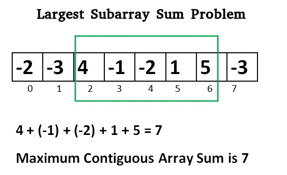

# 最大子阵列

> 原文：<https://medium.com/nerd-for-tech/maximum-subarray-28f9e06f0392?source=collection_archive---------10----------------------->

**(卡丹算法)**



给定一个整数数组`nums`，找到具有最大和的连续子数组(至少包含一个数),并返回其和*。*

一个**子数组**是一个数组的**连续**部分。

**例 1:**

```
**Input:** nums = [-2,1,-3,4,-1,2,1,-5,4]
**Output:** 6
**Explanation:** [4,-1,2,1] has the largest sum = 6.
```

**例 2:**

```
**Input:** nums = [1]
**Output:** 1
```

**例 3:**

```
**Input:** nums = [5,4,-1,7,8]
**Output:** 23
```

**约束:**

*   `1 <= nums.length <= 10^5`
*   `-10^4 <= nums[i] <= 10^4`

```
Code is given below :**class Solution {
public:
    int maxSubArray(vector<int>& nums) {
        int sum =0;
        int ans = INT_MIN;

        for(int i=0;i<nums.size();i++){
           sum+=nums[i];
            ans = max(ans,sum);
            if(sum<0)
                sum=0; 
        }
        return ans;
    }
};**I will dry run this code using the above example ,
nums = [-2,1,-3,4,-1,2,1,-5,4]sum = 0, ans = INT_MIN
sum = sum + nums[0] = 0 + (-2) = -2
ans = max(INT_MIN, -2) = -2
sum<0, so sum = 0sum = sum + nums[1] = 0 + 1 = 1, ans = max(-2,0) = 0sum = sum + nums[2] = 0 + (-3) = -3
ans = max(0, -3) = 0
sum < 0 , sum = 0sum =  sum + nums[3] = 0 + 4 = 4
ans = max(0, 4) = 4sum = sum + nums[4] = 4 - 1 = 3
ans = max(4,3) = 4sum = sum + nums[5] = 3 + 2 = 5
ans = max(4, 5) = 5sum = sum + nums[6] = 5 + 1 = 6
ans = max(5,6) = 6sum = sum + nums[7] = 6 - 5 = 1
ans = max(6,1) = 6sum = sum + nums[8] = 1 + 4 = 5
ans = max(6,5) = 6**So the largest subarray sum is 6 ,[4,-1,2,1]*****Time Complexity - O(n) 
Space Complexity - O(1)***
```

我在下面分享一些资源:

1.  [https://leetcode.com/problems/maximum-subarray/](https://leetcode.com/problems/maximum-subarray/)
2.  【https://www.youtube.com/watch?v=w_KEocd__20】T21&list = plguwdvibif 0 RPG 3 ictpu 74 ywbq 1 cabk 2&index = 5

希望这有所帮助！继续编码！💻🚩

既然你喜欢看我的博客，为什么不请我喝杯咖啡，支持我的工作呢！！[https://www.buymeacoffee.com/sukanyabharati](https://www.buymeacoffee.com/sukanyabharati)☕