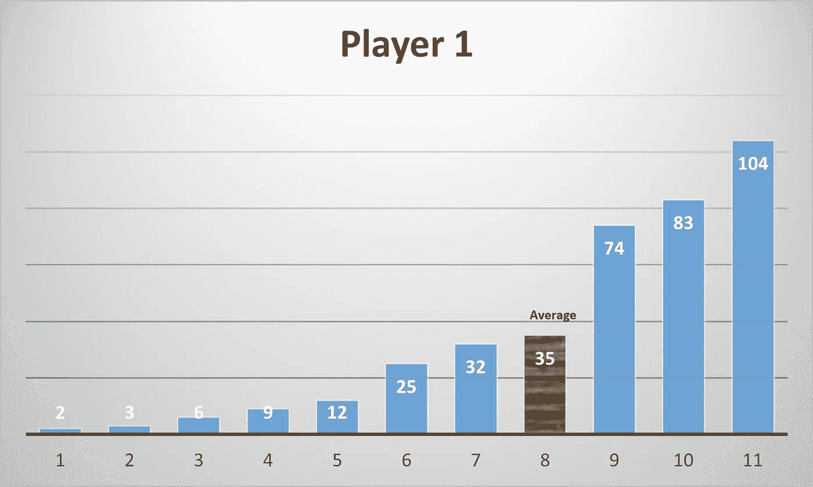
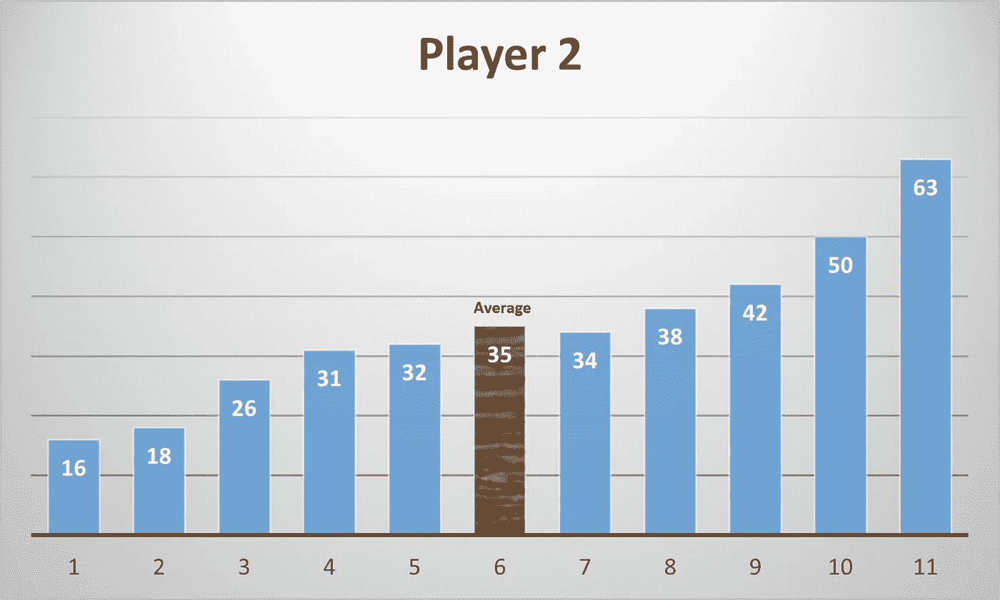
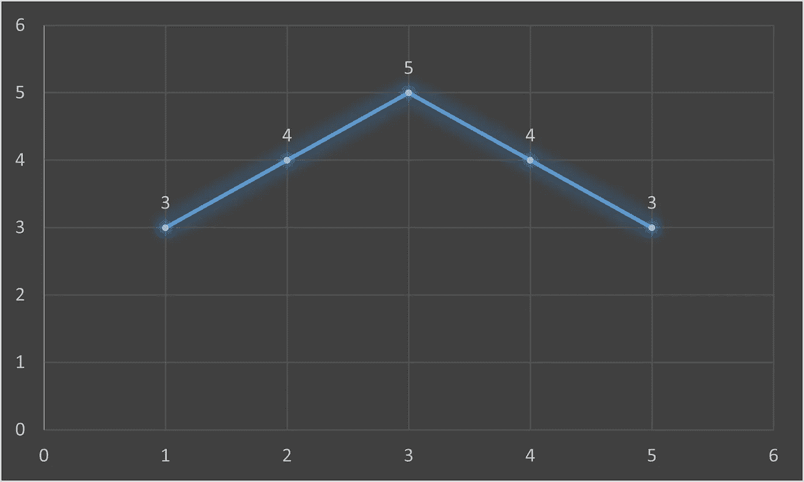
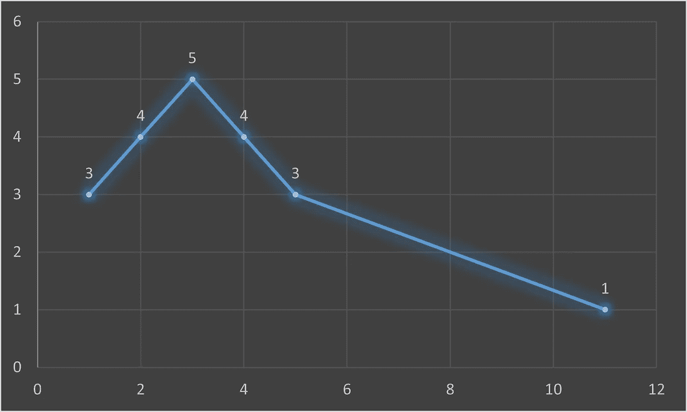
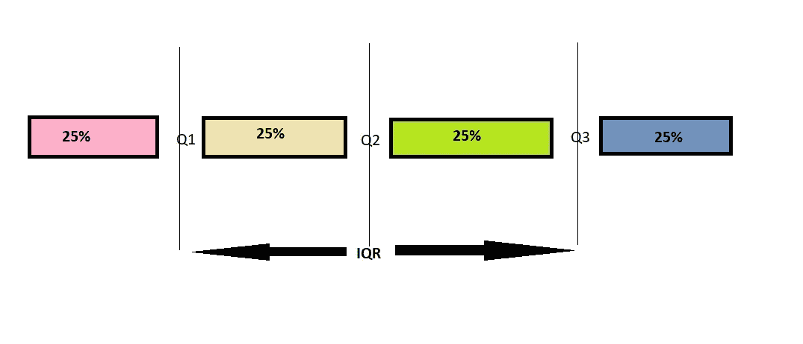

# 可变性和扩散的测量

> 原文：<https://medium.com/nerd-for-tech/measures-of-variability-and-spread-3a2c11cb647d?source=collection_archive---------2----------------------->

在 [Unsplash](https://unsplash.com?utm_source=medium&utm_medium=referral) 上由 [HempCrew](https://unsplash.com/@hempcrew?utm_source=medium&utm_medium=referral) 拍摄的照片

*   **为什么我们需要可变性的度量？**

集中趋势的三个主要度量或统计的三个 M:平均值、中值和众数描述了一个值，该值试图通过识别数据集中的中心位置或典型值来描述给定的数据集。这些度量往往表明分布中的大部分值位于何处。人们可以想象数据集中间值周围的一簇点。但有时这些度量不足以描述或从数据集中获得真实信息。例如，两名击球手在最近 10 场比赛中的得分如下-

玩家 1 : 2，104，25，12，74，6，9，83，32，3

玩家 2 : 42，32，16，50，38，18，63，26，31，34

球队教练必须根据最近 10 场比赛的表现，只选择一名击球手参加最后一场比赛。

作者图片

作者图片

但是教练被弄糊涂了，因为两位击球手的平均得分是一样的，都是 35 分。由于这是最后一场比赛，他不得不选择更有机会得分或更可靠的击球手。在这里，中心趋势或平均值不能提供完整的信息。因此，我们需要了解平均值周围的可变性，以了解全貌。

**范围:**

就计算和理解而言，范围是可变性的最简单的度量。它是特定数据集中最大值和最小值之间的差值。例如，上述示例中玩家 1 和玩家 2 的范围如下:

玩家 1:104–2 = 102

玩家 2:63–16 = 47

参与人 1 的射程比参与人 2 高，因此参与人 1 比参与人 2 有更多的可变性。

虽然范围很容易计算，但它很容易受到异常值的影响，因为它是使用数据集的两个最极端的值计算的。如果我们的数据集有异常值，那么用范围来描述值是如何分散的将会产生误导。我们来看一个简单的数据集。

作者图片

在这个数据集中，数字均匀地分布在最极端的值之间，即上限和下限。这里没有异常值。数据集的范围是 4。但是，如果我们在数据集中添加一个离群值，那么情况将完全不同。

作者图片

在两个数据集中，最低值是相同的，而第二个数据集中的最高值由于离群值的增加而上升到 11。这产生了第二个数据集的新范围，即(11–1)=**10**。数据集的范围增加了 6，仅仅是因为仅引入了一个数字，即异常值。

因此，该范围将包括异常值，因为根据其定义，它必须包括极值。为了排除异常值，可以包括同一数据集的一个小范围或迷你范围，而不是整个范围的数据集。四分之一来救我们了。

**四分位数:**

顾名思义，四分位数将整个数据集分成 4 个相等的部分。这就像寻找中间值，在中间值的情况下，不是寻找将数据集分成两半的数字，而是四分位数将寻找将数据集分成四分之一的数字或值。

作者图片

在上图中，四分位数通过将数据集分成 4 部分来显示。每个部分包含 25%的数据集。第一或下四分位数 **Q1** 包括前 25%的数据，而最后或上四分位数 **Q3** 包括后 25%的数据。中间四分位数 **Q2** 不过是中位数，因为它将数据集分成两半。

位于上四分位数(Q3)和下四分位数(Q1)之间的范围称为四分位数间距( **IQR** )。

**IQR = Q3-Q1**

IQR 仅包括数据集的中央 50%。由于异常值是位于数据集极端的数字或值，四分位范围将自动丢弃异常值，因为它只包含数据集中心周围的值。因此，我们可以使用 **IQR** 有效地比较两个数据集，这将从数据集中剔除异常值。

我们可以使用盒须图或盒状图来显示范围和四分位数。该图显示了数据集的范围、四分位数范围和中位数。使用该图可以很容易地比较两个数据集。我们将再次比较两位击球手的得分。

作者图片

从上图可以看出-

1.  参与人 2 的范围相对较小，他的中位数也高于参与人 1。
2.  参与人 1 的射程和四分位间距远高于参与人 2。有时他的得分比 2 号选手高很多，但有时又低很多。
3.  参与人 2 更稳定，通常得分比参与人 1 高。

极差和四分位差的一个缺点是，它们只能说明数据集的高值和低值之间的差异。他们不会告诉我们这些值多长时间位于中心附近。我们只是不想计算数据集的分布，我们还想测量数据集的可变性。这就是我们的方差和标准差。

**差异:**

可变性的度量告诉我们每个值偏离平均值的程度。可变性越低，值越集中在平均值附近。我们可以通过查看每个值与数据集的平均值相差多少来衡量可变性。这可以通过使用每个值与平均值的平均距离来完成。例如，以参与人 1 的分数为例。

作者图片

怎么可能呢？？实际上，每个值与平均值的正负距离相互抵消，平均距离变为零。为了消除这种影响，我们可以将距离平方，然后取平均值。

玩家 1 的方差(图片由作者提供)

太棒了。！这次我们得到一个有意义的数字。这种测量价差的方法被称为**方差**。这是描述数据集分布的最重要和最广泛使用的方法之一。

同样，我们可以计算参与人 2 的方差。

玩家 2 的方差(图片由作者提供)

所以参与人 1 的方差比参与人 2 高很多。在参与人 1 的情况下，这些值比平均值分布得更广。

但是在计算方差时，方差的单位变成了原始数据集单位的平方。同样，较高的方差值表明数据集内的可变性较高。但是没有具体的直观解释具体的数值。为了解决这个问题，我们有了**标准差**。

**标准差:**

标准差就是方差的平方根。

玩家 1 的标准差= √1285.4 = 35.85

玩家 1 的标准差= √182.4 = 13.5

标准差告诉我们典型值离数据集的平均值有多远。比方差更直观。标准差的值越小，越接近平均值的值的聚类越多。标准差可以取的最小值和最大值分别是 0 和无穷大。

所以教练会选择 2 号球员，因为他更可靠。

希望你们喜欢我的文章。今天到此为止。祝您愉快:)