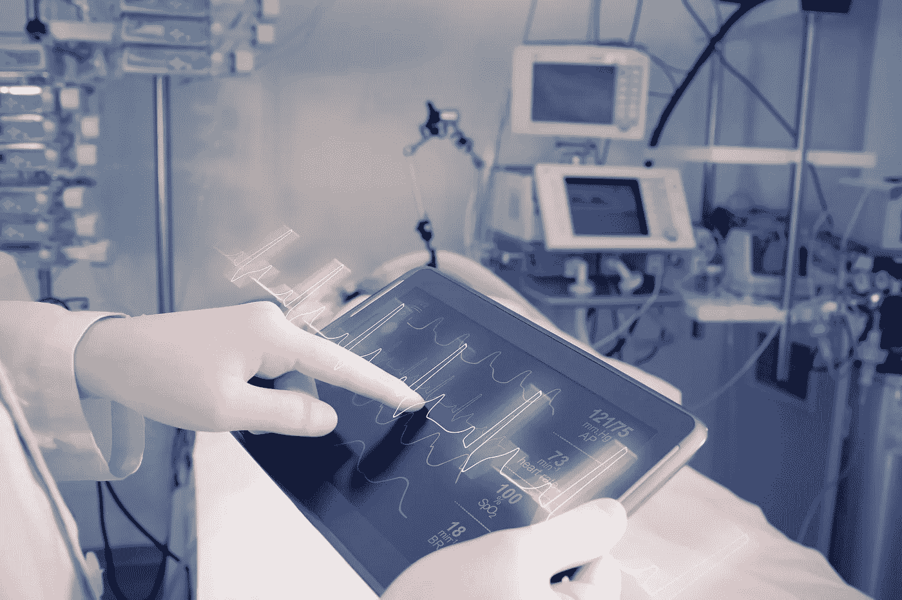

# 医疗器械安全性:仍在改善，但进展缓慢

> 原文：<https://medium.com/nerd-for-tech/medical-device-security-still-improving-but-slowly-9d9a2c2c7879?source=collection_archive---------1----------------------->

这已经成为一年一度的事情了。每年都有故事或报告提醒我们联网医疗设备提供的近乎神奇的好处。除颤器、起搏器、胰岛素泵等等，可以附着或嵌入我们的身体，并进行远程监控，让我们过上相对正常的生活，而不是被管子和电线束缚。

每年都有故事或报告提醒我们，这些好处伴随着风险——这些设备的安全和隐私保护都可能岌岌可危。

这两件事再次提醒人们:大多数专家认为这些设备的好处远远大于风险。

这种观点甚至来自一些生活依赖于这些设备的专家。杰·拉德克利夫，1 型糖尿病患者，[赛默飞世尔公司的产品安全测试和研究主管，在黑帽会议上向它做了著名的证词](http://threatpost.com/connected-medical-devices-simultaneously-increase-risk-and-safety/107663)。

虽然设备中的漏洞确实可能导致恶意黑客攻击和对用户的灾难性损害，但他表示，对于像他这样的普通人来说，“攻击者从我身后悄悄靠近，用棒球棒对我的头部进行致命一击”的可能性要大得多

在 T4 黑进了他自己的强生胰岛素输液泵后，雷德克里夫对美国消费者新闻与商业频道说了同样的话。

同样值得记住的是，生活中很少有事情是无风险的，从开车到运动到爬山。

**管理风险**

只是在这些和其他活动中，社会创造了安全措施，使风险可控。但是，当谈到更好地管理连接到互联网的医疗设备的风险时，漫长的旅程还在继续。

在今年的文档中，有医疗安全公司 Cynerio 的报告[“2022 年物联网设备安全状况”。该报告的统计重点包括](https://uploads-ssl.webflow.com/5d2ad783e06f4c19469d363a/61e70fd9286e1d6d68a86ba8_A%20Cynerio%20Report%20-%20The%20State%20of%20IoMT%20Device%20Security%202022.pdf)

*   医疗保健现在是网络犯罪分子的首要目标，受到的攻击数量是其他行业的两倍多。这在一定程度上是因为新冠肺炎已经向该行业强调，关注安全的时间和资金越来越少。这也是因为医疗保健是对身份欺诈有用的个人信息宝库。医疗保健机构是勒索软件攻击的诱人目标，因为他们和他们的患者无法承受运营被关闭任何时间。
*   超过一半的联网医疗设备存在已知漏洞
*   2021 年有超过 500 起医疗违规事件。
*   从 2020 年到 2021 年，勒索软件攻击增加了 123%。
*   勒索软件去年让医院损失了 210 亿美元。
*   被勒索软件攻击的医院平均每次事件损失 800 万美元，需要 287 天才能完全恢复。
*   静脉(IV)泵“占医院典型医疗保健[物联网]足迹的 38%，其中 73%的 IV 泵存在漏洞，如果被对手利用，将危及患者安全、数据保密性或服务可用性。”
*   虽然不寻常的攻击方法会成为头条新闻，但黑客通常可以从网上发布的手册中轻松获得默认密码和设置等“老掉牙”的方法，从而实现最成功的攻击。

所有这些都让事情听起来没有好转。在某些方面，他们不是。安全研究员和顾问 Shawn Merdinger，[几周前在 Medium 上写道](/@shawnmer/3-years-later-and-millions-of-u-s-e5d828b964e8)三年前，大量关于数百万患者 x 光和 CT 扫描图像存储在易受攻击的服务器上的头条新闻引发了美国卫生与人类服务部和美国参议员 Mark Warner (D-VA)对该问题的尖锐质疑，但这种情况仍在发生。

根据 Merdinger 的说法，“任何人只要有一点点技术技能，就可以访问你的医学图像(并)修改和操纵它们，从而故意误导你的医生。”

他写道，他发现了 36 个图像存档和通信系统，即 PACS，这些系统可以显示超过 290 万张患者图像。

但这并不意味着一切都没有改善。梅丁格和其他专家也表示，已经取得了进展。“我要说，(安全)意识已经获得了关注，”他说。“美国食品和药物管理局已经采取了领导地位，指导是坚实的，”他在接受采访时说。

**FDA 领导层**

这种领先地位可以追溯到至少四年前，即 2018 年 7 月，当时 FDA 宣布采用 [ANSI(美国国家标准协会)UL 2900–2–1](https://www.ul.com/news/us-fda-recognizes-ul-2900-2-1-use-premarket-reviews)作为设备制造商和患者的“共识标准”。

该标准改变了设备的“上市前认证”流程，并要求进行“结构化渗透测试、产品源代码评估和[软件材料清单分析](https://www.synopsys.com/blogs/software-security/software-bill-of-materials-bom/?cmp=pr-sig&utm_medium=referral)”

这些是安全专家十多年来一直推荐的软件测试和分析。

Merdinger 补充说，一些供应商在内部发现的自我报告漏洞方面做得更好。他引用了 Becton，Dickinson and Company (BD)向联邦网络安全和基础设施安全局(federal cyber Security and infra structure Security Agency)通报其 [Pyxis](https://www.cisa.gov/uscert/ics/advisories/icsma-22-151-01) 自动药物治疗系统和 [Synapsys](https://www.cisa.gov/uscert/ics/advisories/icsma-22-151-02) 微生物信息学软件平台中的漏洞。

“这种自愿报告与过去相比是一个显著的变化，显示了一些供应商如 BD 正在建立的过程中的成熟，”他说。

尽管如此，实现更好的医疗设备安全性的旅程可能会很缓慢，因为改进比大多数其他行业更困难，包括能源、食品、水、交通和其他公用事业等其他类型的关键基础设施。原因是很明确的。

*   大多数仍在使用的医疗设备在设计时并没有打算连接到互联网。因此，运行这些设备的软件的安全性根本不是一个问题，更不用说是事后的想法了。
*   设备可以安全运行很长时间——在某些情况下超过十年。因此，要将安全性更好的新一代设备推向市场，可能需要这么长时间，甚至更长时间。
*   它们可能很难修补，尤其是如果它们应该全天候运行的话。大多数都缺乏内置工具来升级软件，即使漏洞已经公开，补丁也已发布。
*   部署设备的医疗专业人员认为严格的安全协议很麻烦。供应商们对此的反应是把易用性，而不是安全性放在首位。

Synopsys 网络安全研究中心(CyRC)全球研究负责人乔纳森·努森(Jonathan Knudsen)表示，虽然许多设备需要更新和补丁并不奇怪，但技术现在可以解决这个问题——只需要承诺和投资。他说:“除非将安全性融入到医疗服务提供商管理软件资产的架构中，否则维护和一致的修补是不可能的。”。

**不再有次要的安全性**

“提供商需要停止让软件安全成为提供医疗保健的首要任务的次要任务，事实上，提供医疗保健和软件安全密不可分。他说:“只有在主动、安全的环境中构建、交付、配置和维护软件系统(包括嵌入式设备)，才能实现可靠、一致、安全的医疗保健。”。

Merdinger 说，正如 Cynerio 报告所指出的，更好的安全归结于做好基础工作。他说看到这种意识是令人鼓舞的。

“人们开始认识到真正的风险——也就是说，这不是一些幽灵般的黑客试图通过对输液泵的深奥攻击来杀死病人，而是由于勒索软件的攻击，更广泛的患者群体整体上被拒绝接受医疗护理，”他说。