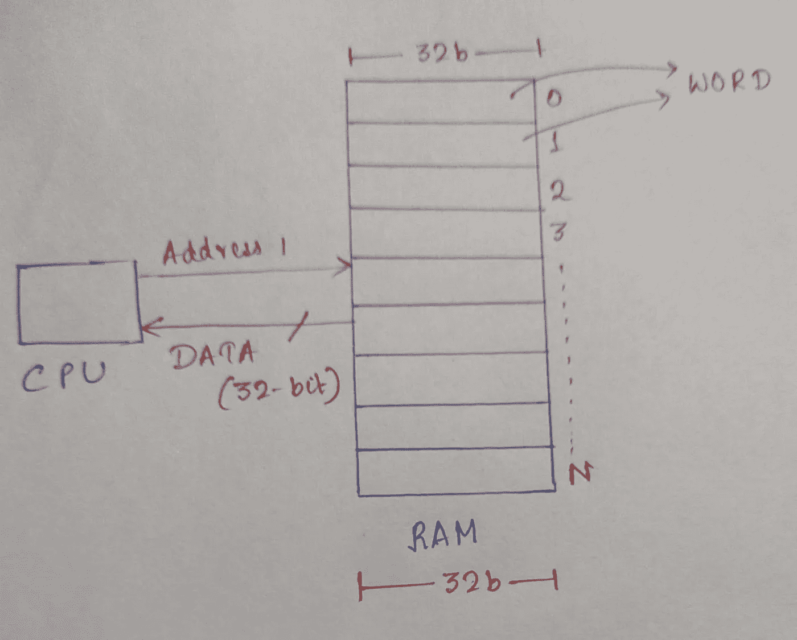

# 操作系统中的内存管理第 1 部分|内存、内存寻址、链接和加载的抽象视图| CS-101

> 原文：<https://medium.com/nerd-for-tech/memory-management-in-os-part-1-abstract-view-of-memory-memory-addressing-linking-and-loading-2ec5d3120cd7?source=collection_archive---------0----------------------->


加布里埃尔·海因策在 [Unsplash](https://unsplash.com?utm_source=medium&utm_medium=referral) 上的照片

你好。CS-101 将是一个新的博客系列，我将尝试涵盖计算机科学的核心概念，从操作系统和数据库到计算理论和计算机网络，可能还有更多。所以让我们开始吧-

操作系统中的内存管理指的是 RAM 和 CPU 的工作，以及所有进程如何分配和释放。一般来说，有两种内存管理实践:

a)连续内存管理-

b)非连续内存管理-

但是在学习如何使用这两种内存管理技术之前，我们必须弄清楚一些关于内存工作的基本概念

在这篇博客中，我们将试着去理解内存在逻辑上是怎样的，寻址是怎样工作的，以及最后链接和加载是怎样完成的

## 1.记忆的抽象观

我们每个人都可能遇到过被称为 32 位 CPU 或 64 位 CPU 的东西。不仅是 CPU，我们可能还听说过 32 位或 64 位软件。因此，如果我们有一个 32 位的 CPU，这意味着 CPU 可以一次从主内存中请求和获取 32 位的数据。64 位 CPU 也是类似的情况



CPU 将地址发送到 RAM，RAM 发送该地址位置的数据

在 32 位 CPU 的情况下，CPU 将地址发送到 RAM，RAM 将发送该地址上的 32 位数据。现在，根据 CPU 的架构，它是否可以从 RAM 中获取 32 位或 64 位数据，这些 32 位或 64 位数据称为字。为了简化这一点，可以将一个字看作是 CPU 可以一次访问的比特大小。对于 32 位 RAM: 1 字=32 位，对于 64 位 RAM: 1 字=64 位

## 2.存储器编址

让我们试着通过各种例子来理解寻址的概念。

**eg 1:**

设 N =内存中的字数=16

为了寻址所有这 16 个字，我们需要 4 位。这是因为地址是二进制和 2⁴=16.所以 4-bis 可以帮助我们代表这 16 个单词

***例 2:***

让 N=256

要寻址所有 256 个字，我们需要 8 位，因为 2⁸=256

***例 3:***

假设总内存大小=4GB，1 个字= 1 个字节

因为 1 个字= 1 个字节，所以处理器是 8 位处理器(1 个字节= 8 位)

所以，内存中的字数是 4GW(因为 1 个字=1 个字节，这里 W 表示字)

4GW=4 x 2 ⁰单词= 2 个单词

因此，要寻址 2 个字，我们需要 32 位。

## 3.加载和链接

当一个程序被编译成机器语言后，操作系统执行一种叫做加载和链接的操作。让我们先了解一下装载

## **加载**

对于一段代码，其中可能存在多个模块。通过模块，我们的意思是许多功能可以存在。例如:在一个代码中，我们可以有一个 main()、func1()、func2()和更多的函数，每个函数都是一个模块

有两种装载方式:

**a)静态加载**

在静态加载的情况下，我们在运行之前将所有代码模块加载到内存中，但是静态加载有很多缺点

*   在这种情况下，内存利用是非常低效的，可能会发生这样的情况，我们在 if 条件下调用一个模块，而这个条件很少被满足，所以这是一个糟糕的内存利用
*   如果我们在运行前加载每个模块，程序的规模将变得巨大
*   我们也想执行多重处理，但是如果进程的规模增加，多重处理的程度就会降低

所以我们使用动态加载

**b)动态加载**

这里我们只加载那些当前需要的模块，其他不需要的内存部分被释放。因此，虽然执行速度会降低，但内存利用是高效的。

现在让我们关注链接-

## 连接

假设我们有这样一段代码

```
main(){             f(){
  ------              ------    
  ------              ------
  ------           }
  f();
  ------
  ------
 }
```

在 main()翻译成机器码时调用 f()的部分。，等效的指令是 BSA(分支和保存返回地址)。

BSA 指令使我们能够调用函数。BSA 需要它必须开始执行的地址。所以链接就是在调用函数中绑定调用函数的地址。我们必须用被调用函数的地址填充 BSA 的地址参数，BSA 还存储被调用函数完全执行后必须返回的地址。

还有两种链接技术:

**a)静态链接**

在静态链接中，我们同时编译被调用函数和调用函数，我们不是创建两种独立的机器语言，而是创建一种机器语言。这里 BSA 的地址参数是在运行时之前填充的。

另一种策略是分别编译被调用函数和调用函数，在两者都加载到内存中后，链接器将把被调用函数的地址放在 BSA 中。

静态链接需要静态加载，因为我们需要不同函数的所有地址。尽管静态链接非常快，但它的内存利用率很低。

**b)动态链接**

动态加载是当今最常用的方法

在执行调用函数的过程中，当遇到 BSA 指令时，加载程序被调用。加载器加载被调用函数的模块。然后，链接器将该地址放入 BSA。

虽然这种方法比静态链接慢，但效率很高。