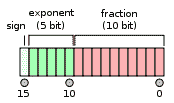

# 高效深度学习的内存优化技术

> 原文：<https://medium.com/nerd-for-tech/memory-optimization-techniques-for-efficient-deep-learning-ddabb372f56e?source=collection_archive---------0----------------------->

如果你花了相当多的时间训练深度神经网络，那么你很可能在某个时候遇到令人沮丧的记忆限制。训练大型神经网络(尤其是在资源有限的情况下)需要特殊的技术来成功地在您的模型上运行训练。在本文中，我们将介绍其中的一些技术，以及它们如何提高您的内存使用。以下是适用于内存密集型设置的成熟方法:

**梯度累积步骤**

GPU 系统在追赶不断增长的深度学习网络规模方面遇到了挑战。较大的小批量大小会直接影响 GPU 内存，因此需要一种方法来适应如此大的大小。梯度累积步骤是一种将批量分割成更小的局部批量的方法。计算每个本地批次中每个样品的梯度，一旦一个批次完成，计算下一个较小批次中的梯度，直到所有本地批次完成。然后，在针对给定的小批量更新模型之前，累积所有梯度。[梯度累积的核心思想是使用相同的模型参数执行多次反向传递*，然后一次对它们进行多批更新。这与传统方式不同，在传统方式中，每*批数量的样本更新*一次模型参数。*](https://ai.stackexchange.com/questions/21972/what-is-the-relationship-between-gradient-accumulation-and-batch-size)分裂、梯度计算、累积和模型更新对每个小批量重复，直到训练数据集结束。

**GPU 数据并行**

数据并行是处理大批量数据的另一种方式。与梯度累积不同，在梯度累积中，分割的本地批处理中的梯度计算是顺序运行的，数据并行在并行 GPU 中执行每个较小的批处理，然后合并结果以更新模型。在梯度累积和 GPU 数据并行中，在合并较小的批次梯度之前，会对每个较小的(本地)批次进行一些归一化处理。这导致产生的累积梯度与梯度都在单个 GPU 上运行时略有不同。数据并行与**模型并行**不同，后者并行执行模型，但每个部分使用相同的训练数据集。模型并行性的一个很好的例子是在单独的 GPU 上运行每一层，其中每一层都学习一些新的东西，并且在所有层完成之后，模型可以相应地更新。数据并行比模型并行相对更容易实现。

**梯度检查点**

梯度检查点是深度学习中处理内存问题的另一种方式。在普通网络中，在正向传递期间，在每层的每个节点中计算的所有激活都存储在存储器中。这与在反向传播过程中计算梯度所需的其他参数一起，加重了模型的记忆容量。一种创新的方法是最小化存储激活的节点数量，从而减少内存问题。这将意味着为不存储其值的节点重新计算激活，因此增加了计算时间。因此，在这种情况下，需要权衡内存和计算时间。在梯度检查点中，一些节点被留下来存储计算的激活，称为*检查点*。任意两个检查点之间是没有存储值的节点。在反向传播期间，在考虑损失调整之前，为其余节点重新计算梯度。两个检查点之间的激活的重新计算被临时存储用于反向传播，并在调整被应用于通道后立即被删除。这允许模型最佳地使用它的存储器，尽管稍微增加了计算时间。

参见【https://github.com/cybertronai/gradient-checkpointing】的[T3 的](https://github.com/cybertronai/gradient-checkpointing)

**混合精度**

数据通常存储在 32 位浮点(FP32)中，其中包含符号、指数(幅度)和分数(精度)。为了减少深度学习模型的内存和训练时间，数据大多被压缩为 16 位浮点(FP16)，同时仍然保持性能，因此可以训练更大的模型。请参见下图，了解 FP32(标准精度)和 FP16(半精度)之间的差异。

*FP32 表示法*

*FP16 表示法*

FP32 有更大的范围来表示更大的数量级，并且有足够的精度来区分不同的数字。事实证明，大多数深度学习模型不需要那么高的精度，也很少需要那么大的量级。大多数计算可以在 FP16 中处理，为了适应范围之外的值，可以乘以一个比例因子。FP16 中的缩放有助于适应太小并因此转换为 0 的值，或者太大并转换为 NaN 或无效的值-这被称为 ***损失缩放*** 。另一种方法是 b-float16，它使用 16 位表示，但其结构中保持 8 位幅度，就像 FP32 一样，同时进一步将其精度降至 7 位。这将意味着它可能无法正确区分数字之间的精度，但这不会造成太大的问题，因为在考虑精度之前，梯度大多表示为幅度和方向。在 FP16 训练中，反向传播和正向传递的计算都以 16 位完成，以执行更快的操作，同时梯度的副本以 32 位维护，以避免丢失可能太小而无法在 16 位中识别的梯度。

**结论**

我希望这篇文章能给你一些帮助你在模型训练中减少内存消耗的想法。如果你想到其他方法，请在评论区和我分享。你也可以把你的问题留在这里，我会抽时间回复你。谢谢