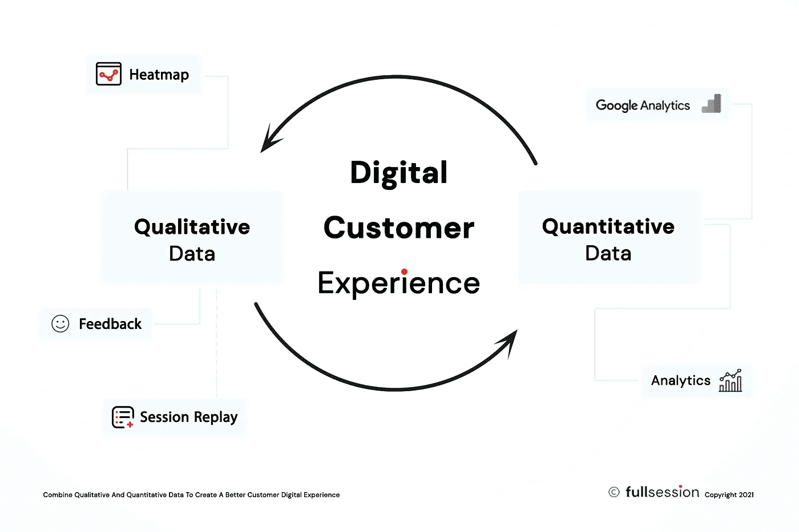

# 合并定性和定量数据，提供良好的客户体验

> 原文：<https://medium.com/nerd-for-tech/merge-qualitative-quantitative-data-to-give-good-customer-experience-31c243213ef9?source=collection_archive---------26----------------------->

## 结合定性和定量数据研究的正确方法可以帮助你通过用户数据来优化你的网站设计。

**数字客户体验中的定性与定量数据**

多年来——事实上可能太久了——网站 UX/用户界面专家一直指向量化数据，试图解释用户如何与网页交互，以及如何优化这些页面以消除混乱，减少用户可能面临的障碍，并优化 CTA 按钮以实现最高的转化率。

这些定量数据包括容易收集的点，如页面时间、滚动深度、跳出率、转换率和点击率。这些因素中的每一个都可以整齐地放入一个电子表格中，并相对于彼此、相对于网站上的其他页面以及相对于竞争对手进行分析。

问题是，知道这些数据并不能告诉你如何真正改变页面。如果“现在联系我们”不起作用，是“联系我们”还是“现在联系”更好？如果“关于我们”部分没有获得更多的浏览者，它在页面设计中应该被放在更高还是更低的位置？传统上，找出答案的方法是移动按钮或部分，等待，收集数据，然后比较前后的结果。有意思，但是哇，你是要长期参与的，不是吗？你需要的是完整的故事。

# 定性与定量数据 UX:有什么区别？

定量用户研究数据是产生数字结果的研究:点击、分钟/秒等。定性数据是不容易放入计算中的数据。

你如何收集和利用它们将取决于你的研究目标。不要低估任何一种类型的研究，因为两者都可以提供有价值的见解，可以指导您的设计过程，并创造有用的成果。

定量数据的例子

*   多少点击？
*   在页面上花了多少时间？
*   跳出率
*   滚动深度

# 定量用户研究的好处

定量的用户研究数据很好收集和分析，因为它相对容易获得和调查
。因为数据是客观的，人为的偏见不太可能影响数据的收集和解读。定量数据也很容易以饼图和条形图的形式呈现。因此，客户更愿意看到硬统计数据，因为它很容易与关键绩效指标联系起来，作为证明未来项目投资和时间合理性的一种手段。

# 定性 UX 研究:它是什么？

定性 UX 研究是收集非数字数据，可能包括意见、行为、感觉或动机。收集这些可以让 UX 的设计师们深入了解人类行为及其模式。

收集定性用户研究有简单和困难的方法。艰难的方式
包括测试会议、用户调查、访谈和观察。简单的方法包括使用像 [FullSession 的](https://www.fullsession.io/) [热图](https://www.fullsession.io/blog/interactive-heatmap/)这样的工具，它跟踪鼠标移动来说明页面上的移动，悬停在按钮上，悬停时间，悬停时间到点击时间，等等——这是了解您的客户如何以数字方式参与页面的关键。

# 定性数据:它的好处是什么？

定性数据的收集和分析可以让你对用户如何与你的页面交互，哪里有挂起，哪里可能会出现 CTA 按钮放错等问题产生难以置信的洞察力。

有些人把它比作一种“大声思考”的数据收集方法，这种方法让设计者洞察到使用一个页面的人的想法，这个页面是如何使用的，以及他们对它有什么样的反应。这是你的全故事网络分析的关键。

[用于定性和定量数据的交互式热图](https://www.fullsession.io/blog/interactive-heatmap/)

类似于 [FullSession](https://www.fullsession.io/) 提供的交互式用户体验热图可用于平滑用户体验，并增强您对客户与网页的数字互动的理解。[会话记录](https://www.fullsession.io/blog/session-recordings-improves-digital-customer-experience/)可以跟踪点击、轻拍、鼠标移动和悬停，以可视化用户的挫折点，并帮助您改善网站的[数字体验](https://www.fullsession.io/blog/what-is-digital-customer-experience/)。

热图数据可以不同方式显示，包括:

*   点击地图:突出显示用户在移动设备上点击鼠标或点击的位置
*   滚动地图:突出显示用户在页面上滚动的位置
*   移动地图:突出显示用户鼠标移动而不点击

# 使用热图的五种方式

用户热图报告很像一个 UX/UI 分析师在你的用户背后窥视。以下是您如何使用热图中的发现:

*   针对移动和桌面优化您的网站:按设备隔离用户数据，然后比较移动和桌面热图，以查看某个细分市场是否缺少重要的 CTA，或者是否存在行为差异
*   点击率问题:一些用户点击突出显示的文本或图像等元素，因为他们希望其中包含链接。在热图上，这可以用来显示常见的点击模式并找出不正确的链接，然后通过添加链接或修改不重要的元素使其不太容易点击来解决问题。
*   衡量用户滚动的距离:没有人滚动到底部？把不重要的链接放在那里，把重要的元素放在顶部。
*   找到有效的 CTA 按钮:热图将显示哪些产生了最多的流量，哪些被忽略或没有找到。
*   找到最有效的设计:当需要重新设计网页的时候，热图的数据会很有用。

# 底线:定性和定量数据

正如你所看到的，定量和定性的数据研究都可以产生重要的见解，虽然两者都有助于收集关于你的网站如何被使用的广泛观点，这两者应该被配对并共同分析。

进行定性和定量的数据研究有助于你形成关于如何使用你的页面的理论，然后提供数据来支持这些理论。使用一种类型可以提供信息，但可能会产生未回答的问题和模糊甚至错误的数据。当串联使用时，“在哪里”、“多久”和“多少”问题可以帮助你回答“为什么”的问题。

准备好学习更多关于定性数据的知识并了解如何使用它来优化你的网站了吗？试试[全时段](https://www.fullsession.io/)