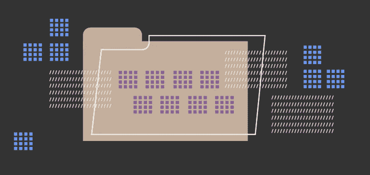

# 元数据:它是什么，它如何促进你的业务？

> 原文：<https://medium.com/nerd-for-tech/metadata-what-is-it-and-how-does-it-boost-your-business-d3bb98ad751f?source=collection_archive---------27----------------------->

整个互联网充斥着元数据的概念，然而大多数用户都不知道什么是元数据，也不知道它是如何工作的。本质上，单词 *meta* 翻译成之后的*。*

元数据的具体解释不能根据使用的上下文来确定含义。然而，按照大多数信息术语表，前缀 meta 代表底层定义或描述。

换句话说，元数据指的是用来解释其他数据的可获得的数据。

元数据可以描述为包含特定信息的数据，例如类型、文本描述、长度和其他关键特征。

这篇文章讨论了为你的企业实现元数据的用途、目的和策略。

# 元数据的重要性

元数据可以手动创建，也可以使用自动化流程创建。手动过程被认为是更准确的工具，因为它能够更好地交叉检查信息，并以适当、必要和相关的方式输入信息。另一方面，使用自动化过程创建元数据是基本的，并显示预先计算的信息。在使用它时，它也会产生一些额外的限制。

资源发现是最常见的元数据用途之一。元数据的许多目的包括定义资源、通过一系列标准识别主题、收集相似的资源同时区分不相似的资源。

元数据在组织电子资源方面非常有效，并且很容易被人和机器识别。简单地说，元数据有助于在线搜索可行的资源。

然而，也许元数据最重要的用途是保护其资源并确保其未来的可访问性。这是由于数字信息本身的脆弱性及其易被篡改或破坏的特性。

出于保存和归档的目的，元数据元素跟踪对象的血统，从而描述其行为和物理特征，以便在未来的技术中复制。

# 元数据的类型

元数据可以分为三种主要类型:

*   **结构化:**表示信息如何对齐，例如文件类型和大小。
*   **描述性:**用于识别、发现，包括标题、作者、关键词、摘要等信息。
*   **管理:**通过显示资源创建中的可用历史来实现资源管理改进。

# 元数据的好处

投入时间和金钱来开发元数据将在三个主要方面带来好处:

*   **延长数据寿命**:典型数据集的寿命可能非常短，这都是由于相关元数据不可用、无用或不存在。当维护和开发完整的元数据时，它会抵消典型数据的退化和熵。
*   **促进数据共享和重用**:元数据是确保复杂或高度详细的数据易于被数据的创建者处理、分析和解释的关键元素。
*   **维护长期数据集的历史记录**:这弥补了在记录数据、方法和人员时容易出现的不一致。

# 用于可见性和在线业务的元数据

包含网页描述和摘要的元数据通常显示在搜索引擎结果页面上。因此，元数据创建者需要确保显示的细节是准确的，因为这些可以决定用户是否会访问网站！

Meta 标签(用于显示结构化元数据的 HTML 标签)也会被搜索引擎评估，以确定网页的相关性。现代广告和商业可以通过元数据和元标签来协调，这有助于获得流量、可见性，甚至是新的业务。早些时候，这些过程更容易；然而，今天，这种日益增加的复杂性来自于 SEO(搜索引擎优化)的需求。

在 20 世纪 90 年代，网站所有者使用**元数据关键字填充**来破解代码，欺骗搜索引擎使某个网站看起来比其他网站更值得信赖和相关。今天，谷歌经常修改和改变它的算法，使得它几乎不可能“欺骗”搜索引擎，同时获得不公平的排名！

# 网站之外的元数据

通常，元数据可以用于文档、数据或其他相关信息。例如，它可以用于主题关键字、访问权限、安全分类以及数字标识和保存等。

你也可以通过识别、快速召回、管理和组织(这是一个非常有益的方面)将它用于营销和瞄准潜在客户。)，并跟踪和监控内容使用情况。这方面最好的例子是亚马逊。

当在亚马逊上购买产品时，网站通过吸引人的标语(如“购买该产品的人也购买了……”)来推荐与客户相关的类似产品，从而进一步引发用户的兴趣和粘性。

# 元数据扫描

搜索引擎通过描述、标题和关键字扫描您的元数据。描述仍然对点击率和提供更多页面内容信息的标题和关键词有决定性的影响。所有这些都说明了页面的有效性和准确性。搜索引擎根据描述、标题和关键字的兼容性来确定最终的网页分数。

# 结论

元数据帮助搜索引擎了解用户可以从特定页面中找到或期望得到什么。因此，维护和优化元数据以在搜索结果中脱颖而出并提高整体点击率至关重要。元数据已经并将在不久的将来继续保持相关性。当正确理解时，元数据可以作为构建页面 SEO 的巨大优势。

元数据并不代表可选的营销工具，而是现代企业成功运营的必要技术。

# 免费注册并开始发送数据

测试我们的事件流、ELT 和反向 ETL 管道。使用我们的 HTTP 源在不到 5 分钟的时间内发送数据，或者在您的网站或应用程序中安装我们 12 个 SDK 中的一个。 [**入门**](https://app.rudderlabs.com/signup?type=freetrial) 。

**本博客最初发表于**[**https://rudder stack . com/blog/metadata-what-is-it-and-how-it-boost-your-business**](https://rudderstack.com/blog/metadata-what-is-it-and-how-does-it-boost-your-business)