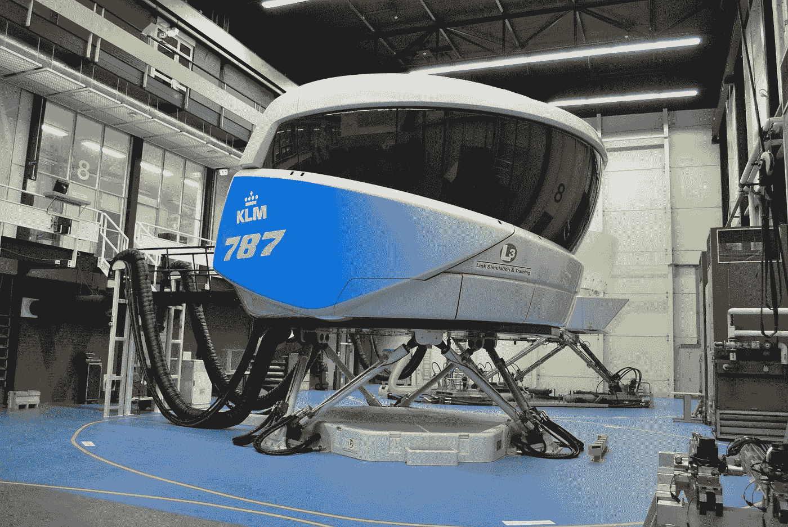

# 元宇宙——撕掉贴纸

> 原文：<https://medium.com/nerd-for-tech/metaverse-peeling-back-the-stickers-8ad3e72cb957?source=collection_archive---------3----------------------->

“贴上新标签，价格翻倍”可能是 it 行业的基本原则。当一个新的流行语冲击时代精神时，会发生两件事

1.  分析师和顾问将今天已经完成的事情称为该领域的“未来”
2.  IT 公司根据新的领域重塑他们的品牌

现在在元宇宙，我们再次看到这种情况，但这远不是元宇宙现象，it 行业始终只是在旧的想法和概念上添加一个新的标签，有时忽略积极的教训，有时忽略消极的教训，但总是希望让一些东西看起来新而闪亮。

撕下标签，你成功的机会会大得多。

# 元宇宙重新打包

现在一个很好的例子就是元宇宙，有很多“见解”在谈论元宇宙将如何“革新工业培训”。

 [## 另一个维度的培训:元宇宙将如何影响 L&D

### 到目前为止，2022 年已经迎来了对学习和发展项目和技术的广泛投资…

trainingindustry.com](https://trainingindustry.com/articles/learning-technologies/training-in-another-dimension-how-the-metaverse-will-impact-ld/) 

我是说这不会发生吗？绝对不是，我说的是**这已经发生很久了**。例如在核工业中使用虚拟现实进行培训可以追溯到上千年。

> [在列宁格勒核电厂(LNPP)的培训中使用虚拟现实始于 1999 年，当时引进了能源技术研究所(IFE)开发的虚拟现实技术，用于培训和介绍与换料机安全操作和维护相关的程序](https://inis.iaea.org/search/search.aspx?orig_q=RN:43065064)

因此，当“专家”说这是“元宇宙”的一个很好的使用案例时，他们没有错，它确实是一个很好的使用案例，整个商业航空业都将“元宇宙”作为其培训的一部分。

[飞行员元宇宙](https://www.pilotcareernews.com/klm-selects-l3-for-boeing-787-full-flight-simulator/)

这就是为什么我说[元宇宙将建立在游戏](https://blog.metamirror.io/metaverse-will-be-built-on-gaming-not-blockchain-9fdf1308e192)之上的部分原因，游戏产业已经是一个巨大的元宇宙市场，VR 游戏在 90 年代就存在了。在 90 年代中期，我曾尝试过 VRML 和 VR 技术，看看它是否能在指挥和控制环境中工作(答案:不能，因为 2D 比沉浸式 3D 让人更快更准确)。

现实是，虚拟现实已经广泛应用于许多工业领域，我们也已经有了很长一段时间的虚拟现实游戏。知道这些都不是新东西，可以学到很多好东西。

# 霓虹柔美和 MQSI——“它还活着！”

当我还在做 SOA 的时候，这是一个会议上常见的笑话。一个供应商，通常是一个老的 EAI 供应商，但并不总是，刚刚在他们的产品上贴了一个 SOA 标签，现在声称它非常适合这种新方法。为了给你一个例子，我将选择一个我非常了解的产品。[霓虹软件被赛贝斯收购，后被 IBM 收购，品牌为 MQSI](https://en.wikipedia.org/wiki/IBM_App_Connect_Enterprise) 。MQSI 是运行在 MQSeries 之上的星型消息代理。现在我喜欢上了 MQSeries，它易于安装，防弹，易于使用。然而，MQSI 并不容易使用或设置，事实上，在我的第一个 MQSI 项目中，我们发现了不可思议的事情:它丢失了信息。一个快速的 e-fix 之后，事情就解决了。然而，这里的重点是，我知道这项技术，我已经严重破坏了它。

向前滚动到 SOA 成为事物，MQSI 有一段时间被重新命名为“WebSphere Advanced ESB ”,它根本不是一个总线架构，它根本没有改变，但是人们正在购买 ESB。然后它变成了一个集成总线，现在它被称为 IBM App Connect Enterprise。同样的产品，20 多年来有了很大的发展，但是根据当时人们购买的东西有很多不同的名字。

# 那些不揭贴纸的人注定会重复失败，避免成功

揭开标签并了解技术的真正来源非常重要的原因是，如果你不这样做，你很可能会错过大量积极和消极的学习。

 [## 微服务就是 SOA，对于知道 SOA 是什么的人来说。

### 好的，这在 Twitter 上引起了一些争论，现在已经有了电子邮件，但是本着开放的精神，我想…

service-architecture.blogspot.com](https://service-architecture.blogspot.com/2014/03/microservices-is-soa-for-those-who-know.html) 

当整个“微服务”的事情开始时，我的一个问题是它忽略了一堆知识，最重要的是服务设计中的层次和控制范围的重要性，以及确保服务架构与业务领域架构相匹配。向前滚动六年，你猜怎么着，人们开始“重新发现”这一点。

 [## 引入面向领域的微服务架构

### 最近，围绕面向服务的架构和微服务的缺点展开了大量讨论…

eng.uber.com](https://eng.uber.com/microservice-architecture/) 

有时这些教训并不积极，是你需要避免的事情。例如，在数据领域，整个“大单一模式”的废话已经失败了几十年，但仍一次又一次地抬头。为了避免犯这些错误，我们不需要仅仅改变技术，我们需要理解为什么它永远不会工作。还有人声称它会起作用吗？是的，而且他们经常在以前行不通的想法上重塑品牌和添加新的标签。撕下贴纸，找出真正改变的地方。

整个 Web3 行业似乎只是将“加密”或“NFT”贴在现有用例上，而没有真正理解这些用例中的任何一个。“就像房地产，但有 NFTs”，“非政府支持的资金”等等，Web3 到处跑，在它能找到的所有东西上贴上 Web3 的标签，只是说“Web3 更好”，而没有解释旧系统有什么错，或者新系统会有什么更好。

# 一切都是进化而不是革命

你撕掉标签是因为没有真正原创的东西。即使像量子计算这样超级闪亮的东西，从理论上来说，即使没有付诸实施，也已经有几十年的历史了。理论上，一场新的革命可能会在一夜之间从实验室走向企业，彻底改变这一切，但实际上这从未发生过。

就像工业培训一样，可能是另一个行业率先使用了虚拟现实。这可能是因为理论很老，但实践直到现在都很有限，因为人工智能和深度学习因云计算而起飞。但不管它是什么，它是建立在某些东西上的。如果一个产品得到一个新的徽章，它仍然是老产品，如果一个分析师发明了一个新的术语，它是建立在以前的东西上。

[丘奇-图灵论题](https://en.wikipedia.org/wiki/Church%E2%80%93Turing_thesis#Statement_in_Church's_and_Turing's_words)说每个问题都可以简化为一个先前解决的问题，或者根据定义是不可解决的，正如艾萨克·牛顿雄辩地指出的:

> 如果说我看得更远，那是因为我站在巨人的肩膀上

像牛顿一样，剥去贴纸，了解过去，因为这样你就可以从别人的成功和失败中学习，而不是从一个营销部门。